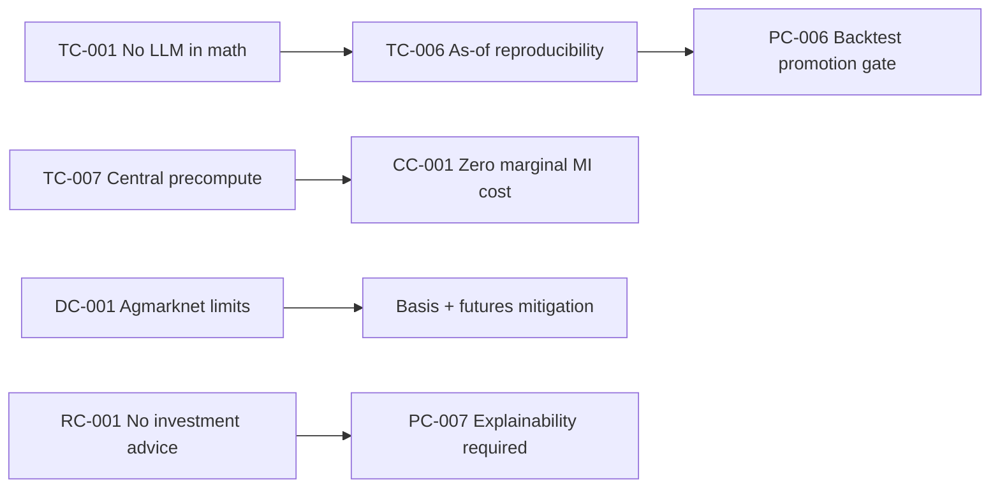

# Constraints

**Source of truth:** `KrishiNetra_Founder_Thesis_Product_Spec_v5.docx` (v5.0)

---

## Product Constraints

| ID | Constraint | Source | Notes |
|----|------------|--------|-------|
| PC-001 | Phase 1 product scope is cotton intelligence plus decision engine for cotton farmers and traders. | §5, §20 Phase 1 | Long-term vision is broader; Phase 1 is narrow. |
| PC-002 | Market Intelligence outputs must include: current prices, outlook, forecasts, confidence, bullish/bearish factors, supply/demand analysis. | §7 | Fixed MI feature set. |
| PC-003 | Decision Mode inputs are limited to: commodity, quantity, storage access, liquidity need, financing profile, risk profile. | §8 | No additional inputs defined in v5. |
| PC-004 | Decision Mode outputs are limited to: Sell, Hold, Partial Sell, Partial Hold—always as net value after carry with reasoning. | §8 | No other recommendation verbs defined. |
| PC-005 | Farmers must remain free in monetization model (no farmer charges in stated model). | §2, §19 | Product/pricing constraint. |
| PC-006 | Recommendations are promoted only if KrishiNetra consistently adds net value vs sell-immediately and hold-to-curve in backtest. | §17 | Promotion gate, not optional nice-to-have. |
| PC-007 | Every recommendation must explain: Why? What could go wrong? Which assumptions matter? | §14 | Trust/explainability product constraint. |
| PC-008 | Market Intelligence Mode requires no user registration. | §7 | Access model constraint. |
| PC-009 | Evaluation of recommendations uses net value, not gross price movement. | §4, §8, §17 | Frames all product claims. |
| PC-010 | Objective is economically useful recommendations, not maximum forecast accuracy. | §13 | De-prioritizes accuracy-only optimization. |
| PC-011 | Partial-sell defaults are part of liquidity mitigation (behavioral/product default constraint). | §21 | Implies UX must support partial actions. |

---

## Technical Constraints

| ID | Constraint | Source | Notes |
|----|------------|--------|-------|
| TC-001 | **LLMs cannot participate in forecasting or recommendation calculations.** Forecast and sell/hold math are deterministic; agents orchestrate and explain only. | §2 Decision 6, §9 | Load-bearing v5 boundary. |
| TC-002 | No LLM sits in the prediction or decision path. | §9 | Reinforces TC-001. |
| TC-003 | Domain agents (Market, Weather, Policy, Demand, Futures, Global) must be deterministic services emitting structured signals only—never free text to Decision layer. | §9 | Signal contract. |
| TC-004 | Structured signal fields required: value, direction, magnitude, confidence, as-of timestamp. | §9 | Auditability constraint. |
| TC-005 | Only Explainability Agent turns structured signals into human-readable reasoning; Conversation Agent handles NL Q&A over explanation. | §9 | Two LLM roles only. |
| TC-006 | Forecast and sell/hold outputs must be pure functions of data-as-of-date for backtest reproducibility. | §9, §17 | Historical reconstruction required. |
| TC-007 | Market Intelligence (domain agents + forecast) runs once per data refresh; shared across users. | §9, §7 | Central precompute constraint. |
| TC-008 | Per-user Decision mode runs only net-of-carry math plus one explanation pass after shared precompute. | §9 | Per-session compute bound. |
| TC-009 | Architecture must remain commodity-configurable via Commodity Registry. | §11, §16 | Extension constraint for Phase 7. |
| TC-010 | Cotton is the reference implementation for Commodity Registry and intelligence model. | §11, §12 | First commodity defines pattern. |
| TC-011 | Deterministic core (forecast + decision math) must be isolated from LLM explanation layer for reproducibility. | §16 v5 note | Aligns with agent table. |
| TC-012 | Eight-agent design must not become non-reproducible or cost-prohibitive—mitigated by deterministic core, signal contracts, central precompute. | §21 | Complexity constraint. |

---

## Regulatory Constraints

| ID | Constraint | Source | Notes |
|----|------------|--------|-------|
| RC-001 | Sell/hold guidance must not drift into registrable investment advice. | §21 | Requires legal review. |
| RC-002 | Financing-related steps touch NBFC/RBI regulatory scope. | §21 | Applies when financing phases activate (Phase 5+). |
| RC-003 | Regulatory treatment is unresolved in spec—legal review is mandatory before treating guidance as non-advice. | §21 | Constraint is "must not drift" + "needs legal review." |

---

## Data Constraints

| ID | Constraint | Source | Notes |
|----|------------|--------|-------|
| DC-001 | Public data quality (Agmarknet lag and gaps) caps accuracy. | §21 | Hard limit on public-only intelligence. |
| DC-002 | Data sources are categorized: public, commercial, proprietary—with distinct roles. | §10 | No single-source assumption. |
| DC-003 | Proprietary data (decision sessions, outcomes, intent, inventory registration, warehouse occupancy) begins in Phase 1 for sessions/outcomes; inventory/warehouse later per roadmap. | §10, §18, §20 | Phased entity availability. |
| DC-004 | Commodity Registry must define per commodity: price sources, arrival sources, demand drivers, policy drivers, weather variables, quality dimensions, storage characteristics, forecast horizons. | §11 | Configuration schema constraint. |
| DC-005 | Cotton intelligence model uses defined signal set: arrivals, futures curve, MSP, CCI procurement, mill demand, exports, weather, acreage, global inventories. | §12 | Phase 1 signal universe. |
| DC-006 | Forecast outputs are 30/60/90-day outlooks with confidence bands. | §12, §9 | Horizon constraint. |
| DC-007 | MSP/CCI floor rule must be applied in Decision layer when spot near MSP floor and CCI actively procuring—not only inside forecast model. | §8 | Named rule constraint. |

---

## Cost Constraints

| ID | Constraint | Source | Notes |
|----|------------|--------|-------|
| CC-001 | Market Intelligence shared precompute must cost nothing per additional user (marginal MI cost → zero per user). | §7, §9 | Drives central precompute architecture requirement. |
| CC-002 | Free farmer tier + eight-agent design requires central precompute and limited per-user Decision compute (net-of-carry + one explanation pass). | §9, §19 | Economic constraint on Phase 1 design. |
| CC-003 | Commercial data (futures feeds, industry reports) implies ongoing cost—must fit trader/enterprise monetization later; not priced in Phase 1 farmer-free model. | §10, §19 | **PROPOSED ASSUMPTION:** cost recovery deferred. |

---

## Cross-Category Constraint Relationships

---

## Ambiguities & Contradictions

| Item | Detail |
|------|--------|
| §16 layer stack | Lists ingestion through dashboards; treat as **founder-described layering intent**, not a mandate to build all layers in Phase 1. Phase 1 constraint remains PC-001. |
| Update frequency | §22 working answer (daily cadence, stability-gated) is a **provisional operational constraint** pending field testing. |
| Trust display | Unresolved whether single confidence vs richer breakdown—no constraint finalized (see `OPEN_QUESTIONS.md`). |
