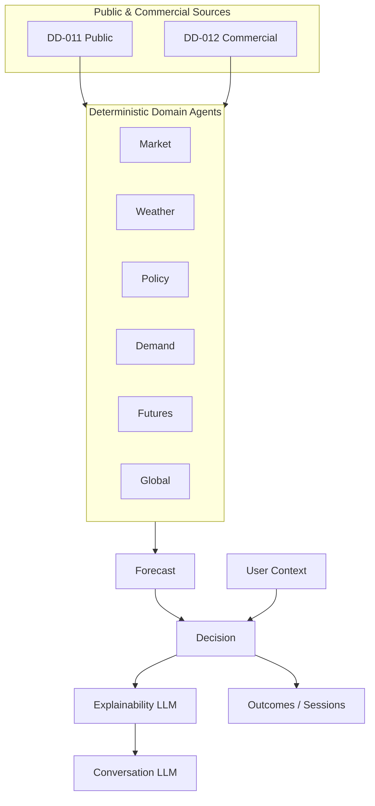

# Data Domains

**Source of truth:** `KrishiNetra_Founder_Thesis_Product_Spec_v5.docx` (v5.0)

Domains are extracted from agent signal domains (§9), data strategy (§10), commodity registry (§11), cotton model (§12), core/future entities (§15), and proprietary flywheel (§18).

---

## Agent Signal Domains (Deterministic)

Each domain agent emits: **value, direction, magnitude, confidence, as-of timestamp** (structured signal contract).

### DD-001 — Market

| Attribute | Detail |
|-----------|--------|
| **Domain name** | Market |
| **Description** | Domestic/regional cotton market conditions: prices, arrivals, regional strength. |
| **Example sources** | Agmarknet, eNAM (§10 public); commodity registry price/arrival sources (§11) |
| **Usage** | Structured signal consumed by Forecast and Decision layers; part of Market Intelligence precompute |
| **Phase introduced** | Phase 1 |

---

### DD-002 — Weather

| Attribute | Detail |
|-----------|--------|
| **Domain name** | Weather |
| **Description** | Rainfall, drought, and production-risk signals affecting supply. |
| **Example sources** | IMD (§10) |
| **Usage** | Production-risk signal for forecast outlook |
| **Phase introduced** | Phase 1 |

---

### DD-003 — Policy

| Attribute | Detail |
|-----------|--------|
| **Domain name** | Policy |
| **Description** | Government policy signals: MSP, CCI procurement, export restrictions. |
| **Example sources** | Agriculture Ministry (§10); MSP/CCI in cotton model (§12) |
| **Usage** | Forecast input; MSP/CCI floor rule in Decision layer (§8) |
| **Phase introduced** | Phase 1 |

---

### DD-004 — Demand

| Attribute | Detail |
|-----------|--------|
| **Domain name** | Demand |
| **Description** | Domestic and export demand: mills, consumption, exports. |
| **Example sources** | USDA, ICAC, industry reports (§10); mill demand, exports (§12) |
| **Usage** | Supply/demand analysis in Market Intelligence; forecast input |
| **Phase introduced** | Phase 1 |

---

### DD-005 — Futures

| Attribute | Detail |
|-----------|--------|
| **Domain name** | Futures |
| **Description** | Futures market structure: curve, basis, open interest. |
| **Example sources** | Commercial futures feeds (§10) |
| **Usage** | Benchmark (hold-to-curve §13/§17); basis modeling for Agmarknet gaps (§21); forecast and decision |
| **Phase introduced** | Phase 1 |

---

### DD-006 — Global

| Attribute | Detail |
|-----------|--------|
| **Domain name** | Global |
| **Description** | International demand and inventory conditions. |
| **Example sources** | USDA, ICAC (§10); global inventories in cotton model (§12) |
| **Usage** | Global supply/demand context for outlook |
| **Phase introduced** | Phase 1 |

---

## Analytical Output Domains

### DD-007 — Forecast

| Attribute | Detail |
|-----------|--------|
| **Domain name** | Forecast |
| **Description** | Deterministic model output: 30/60/90-day outlook with probability bands. |
| **Example sources** | Derived from DD-001–DD-006 structured signals |
| **Usage** | Market Intelligence; net hold value formula input (§8); backtest reconstruction |
| **Phase introduced** | Phase 1 |

---

### DD-008 — Decision / Recommendation

| Attribute | Detail |
|-----------|--------|
| **Domain name** | Decision (Recommendation) |
| **Description** | Deterministic sell/hold/partial recommendation net of carry plus named rules (e.g., MSP/CCI floor). |
| **Example sources** | Forecast domain, user context, carry/financing/quality/risk inputs (§8) |
| **Usage** | Decision Mode primary output; backtest strategy (3) in §17 |
| **Phase introduced** | Phase 1 |

---

### DD-009 — Explainability (LLM)

| Attribute | Detail |
|-----------|--------|
| **Domain name** | Explainability |
| **Description** | Human-readable reasoning from structured signals and recommendation (not a numeric signal domain). |
| **Example sources** | Structured outputs from DD-001–DD-008 |
| **Usage** | "Why?", "What could go wrong?", assumptions (§14); one explanation pass per Decision session (§9) |
| **Phase introduced** | Phase 1 |

---

### DD-010 — Conversation (LLM)

| Attribute | Detail |
|-----------|--------|
| **Domain name** | Conversation |
| **Description** | Natural-language Q&A over the explanation layer. |
| **Example sources** | Explainability outputs |
| **Usage** | User clarification; must not alter deterministic recommendation |
| **Phase introduced** | Phase 1 |

---

## Data Source Categories (§10)

### DD-011 — Public Market & Policy Data

| Attribute | Detail |
|-----------|--------|
| **Domain name** | Public data |
| **Description** | Government and open market statistics. |
| **Example sources** | Agmarknet, eNAM, IMD, Agriculture Ministry, USDA, ICAC |
| **Usage** | Ingestion for domain agents; subject to lag/gap constraints (§21) |
| **Phase introduced** | Phase 1 |

---

### DD-012 — Commercial Market Data

| Attribute | Detail |
|-----------|--------|
| **Domain name** | Commercial data |
| **Description** | Paid/subscription market intelligence. |
| **Example sources** | Futures feeds, industry reports |
| **Usage** | Futures domain, demand refinement, basis modeling |
| **Phase introduced** | Phase 1 |

---

### DD-013 — Proprietary Operational & Outcome Data

| Attribute | Detail |
|-----------|--------|
| **Domain name** | Proprietary data |
| **Description** | User-generated and system-captured data unavailable publicly. |
| **Example sources** | Decision sessions, outcomes, farmer intent, trader intent, inventory registration, warehouse occupancy |
| **Usage** | Calibration flywheel (§18); personalization (Phase 2+); future marketplace/financing |
| **Phase introduced** | Phase 1 (sessions/outcomes); inventory/warehouse in later phases per §10/§20 |

---

## Commodity Configuration Domain

### DD-014 — Commodity Registry

| Attribute | Detail |
|-----------|--------|
| **Domain name** | Commodity Registry |
| **Description** | Per-commodity configuration of sources and drivers. |
| **Configuration dimensions** | Price sources, arrival sources, demand drivers, policy drivers, weather variables, quality dimensions, storage characteristics, forecast horizons |
| **Example** | Cotton as reference implementation (§11, §12) |
| **Usage** | Commodity-configurable architecture (§16); Phase 7 expansion |
| **Phase introduced** | Phase 1 (cotton); Phase 7 (additional commodities) |

---

## Core Entity Domains (§15)

| Entity | Description | Phase |
|--------|-------------|-------|
| Commodity | Registry entry and intelligence scope | Phase 1 |
| Region | Geographic/market segmentation | Phase 1 (implied by regional strength) |
| Price | Spot and related price observations | Phase 1 |
| Arrival | Physical flow/arrival data | Phase 1 |
| Forecast | 30/60/90 outlook with bands | Phase 1 |
| Recommendation | Sell/Hold/Partial outputs | Phase 1 |
| User Context | Storage, liquidity, financing, risk inputs | Phase 1 |
| Decision Session | Context + recommendation instance | Phase 1 |
| Outcome | Realized result of session | Phase 1 (flywheel) |

### Future Entity Domains (§15)

| Entity | Phase (roadmap alignment) |
|--------|---------------------------|
| Inventory | Phase 2 (inventory registration) |
| Warehouse | Phase 4 |
| Financing | Phase 5 |
| Marketplace Transaction | Phase 6 |

---

## Cotton-Specific Signal Inventory (§12)

Consolidated under cotton intelligence for Phase 1:

| Signal | Parent domain |
|--------|---------------|
| Arrivals | Market |
| Futures curve | Futures |
| MSP | Policy |
| CCI procurement | Policy |
| Mill demand | Demand |
| Exports | Demand |
| Weather | Weather |
| Acreage | Market/Production (listed in §12; agent mapping: Market/Weather) |
| Global inventories | Global |

**Ambiguity:** Acreage is listed in §12 but not explicitly assigned to a single §9 agent—flag for founder clarification if agent ownership matters.

---

## Domain Dependency Diagram

---

## Phase Introduction Summary

| Phase | New / expanded domains |
|-------|------------------------|
| 1 | DD-001–DD-012, core entities, cotton registry |
| 2 | Inventory entity, personalization on User Context |
| 3 | Behavioral learning, intent capture (farmer/trader intent) |
| 4 | Warehouse entity, warehouse occupancy data |
| 5 | Financing entity |
| 6 | Marketplace Transaction |
| 7 | Additional commodities via Commodity Registry |
