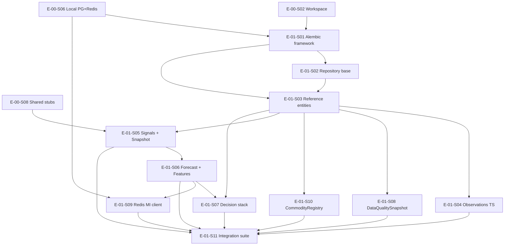

# E-01 Data Foundation — Execution Plan

**Track:** B (KDO parallel execution)  
**Epic:** E-01 — Data Foundation  
**Branch (target):** `feature/e01-data-foundation`  
**Date:** 2026-06-03  
**Scope:** Planning only — no code generation in this deliverable

**Authoritative sources (read-only):** [E-01-Data-Foundation.md](../stories/E-01-Data-Foundation.md), [TDS-006](../tds/TDS-006-Data-Model.md), [ADR-002](../adrs/ADR-002-schema-migrations-alembic.md), [ADR-003](../adrs/ADR-003-commodity-registry-versioning.md)

**Explicitly out of scope:** `InventoryPosition` (Phase 2, E-12, TDS-009 §13); cotton seed data (E-02); business services beyond persistence layer.

---

## 1. Executive Summary

E-01 delivers the PostgreSQL canonical schema (TDS-006), Alembic migration pipeline (ADR-002), repository immutability patterns, Redis MI key contract (TDS-006 §4, TDS-009 §8), and an integration regression suite. Implementation proceeds **S01 → S02 → S03**, then **reference-adjacent DDL (S10, S08)** before **time-series and versioned stacks (S04 → S05 → S06 → S07)**, **Redis client (S09)** after forecast payload shape exists, and **S11** as the epic gate.

**E-02 unblock criteria (from E-01 epic DoD):** E-01-S03 and E-01-S10 complete with empty/queryable tables — no schema change required for cotton seed.

---

## 2. Prerequisite Gates (E-00)

| Story | Blocks E-01 | Rationale |
|-------|-------------|-----------|
| E-00-S02 | E-01-S01 | SQLAlchemy, Alembic, pytest in workspace |
| E-00-S06 | E-01-S01, E-01-S09 | Local PostgreSQL + Redis (ADR-004) |
| E-00-S08 | E-01-S05 | `shared.domain.AgentType` for `structured_signal.agent_type` |

All other E-01 stories assume E-00 M0 complete (CI Postgres service container per E-01-S01 AC-5, E-01-S11 AC-4).

---

## 3. Story Dependency Graph

**Critical path:** E-00 → S01 → S02 → S03 → S05 → S06 → S07 → S11.

**Parallelizable after S03 (same developer caution on migration conflicts):** S04, S08, S10 (independent FK roots from `commodity`).

---

## 4. Alembic Migration Order

Per **ADR-002** (migrations under `backend/app/persistence/migrations/`) and **TDS-006 §3–§10, §9** (entities and partitioning). One forward revision per story DDL tranche; **no business tables in S01** (E-01-S01 DoD).

| Rev # | Migration slug (suggested) | Story | Tables / objects | TDS-006 / ADR trace |
|-------|---------------------------|-------|------------------|---------------------|
| 0 | `0001_alembic_bootstrap` | E-01-S01 | Extensions only if needed (`uuid-ossp` or gen_random_uuid); empty schema or `alembic_version` only | ADR-002 §2–3; REQ-090 |
| 1 | `0002_reference_entities` | E-01-S03 | `commodity`, `commodity_profile`, `region`, `market` | TDS-006 §3.1–3.5; REQ-090, REQ-073; FD-022 |
| 2 | `0003_commodity_registry` | E-01-S10 | `commodity_registry` + partial UNIQUE `is_active` | TDS-006 §3.3 + ADR-003 fields; REQ-073, REQ-074; FD-022, FD-008 |
| 3 | `0004_data_quality_snapshot` | E-01-S08 | `data_quality_snapshot` | TDS-006 §3.17; REQ-084; TDS-011 §10 |
| 4 | `0005_observations_partitioned` | E-01-S04 | `price_observation`, `arrival_observation` + monthly RANGE on `as_of_date` | TDS-006 §3.6–3.7, §4, §9; REQ-031, REQ-070; NFR-AUD-002 |
| 5 | `0006_signals_partitioned` | E-01-S05 | `structured_signal`, `signal_snapshot` + monthly RANGE on `as_of_date` | TDS-006 §3.8–3.9, §9; REQ-060, REQ-061; FD-013; NFR-TRC-003 |
| 6 | `0007_forecast_and_features` | E-01-S06 | `forecast`, `forecast_version` (partitioned), `feature_set`, `feature_vector` | TDS-006 §3.10–3.11, §10; REQ-056, REQ-076; FD-006, FD-014; NFR-REP-001 |
| 7 | `0008_decision_stack` | E-01-S07 | `user_context`, `decision_session`, `recommendation`, `recommendation_version`, `outcome` | TDS-006 §3.12–3.16; REQ-040, REQ-041, REQ-090, REQ-110; FD-015, FD-016, FD-023 |
| — | *(no migration)* | E-01-S09 | Redis client only — PostgreSQL remains source of truth | TDS-006 §4; REQ-037; FD-012; NFR-SCL-001 |

**Partitioning rules (ADR-002 §5, TDS-006 §9):**

| Table | Partition key | Granularity | Story |
|-------|---------------|-------------|-------|
| `price_observation` | `as_of_date` | RANGE monthly + DEFAULT | E-01-S04 |
| `arrival_observation` | `as_of_date` | RANGE monthly + DEFAULT | E-01-S04 |
| `structured_signal` | `as_of_date` | RANGE monthly | E-01-S05 |
| `forecast_version` | `as_of_date` | RANGE monthly | E-01-S06 |
| `decision_session` | `created_at` | RANGE quarterly (TDS-006 §9) | E-01-S07 |
| `commodity_registry` | — | None (low volume) | E-01-S10 |

**Column conventions (E-01-S01 technical notes, TDS-013 §5.2):** UUID PKs where TDS-006 specifies UUID; `as_of_date` as `DATE`; observation prices as `Numeric` (not float).

**Rollback policy:** ADR-002 §3 — reversions supported for dev; each story AC requires reversible migrations (E-01-S03 AC-5).

**Operational note:** New calendar months require explicit partition child migrations (ADR-002 consequence) — document in ops runbook during S04/S06 DoD, not automated prune (7-year hot retention documented in S04; prune is future ops).

---

## 5. Implementation Sequence (S01–S11)

| Order | Story | Rationale |
|-------|-------|-----------|
| 1 | **E-01-S01** | Establishes Alembic + session factory; gates all DDL. CI migration job pattern (AC-5). |
| 2 | **E-01-S02** | Repository immutability contracts before versioned tables (ForecastVersion, RecommendationVersion). Stub used in S03. |
| 3 | **E-01-S03** | Root FK graph: commodity → profile/region → market. Unblocks observations, registry, quality. |
| 4 | **E-01-S10** | Registry schema per ADR-003 before signals/forecasts reference `registry_id`; E-02 seed depends on this table shape. |
| 5 | **E-01-S08** | Quality snapshot independent of observations; optional FK from `signal_snapshot` added in S05 migration or ALTER in same rev as signals. |
| 6 | **E-01-S04** | Highest-volume TS tables; requires `market_id` FK. Partition strategy validated before signal/forecast partitions. |
| 7 | **E-01-S05** | Requires E-00-S08 `AgentType`; UNIQUE constraints and `snapshot_hash` prep REQ-103. |
| 8 | **E-01-S06** | `forecast_version` immutability + `feature_set`/`feature_vector` (TDS-006 §10); FK to `snapshot_id`. |
| 9 | **E-01-S07** | Full decision flywheel FK chain to `forecast_version_id`, `snapshot_id`, `registry_id`. |
| 10 | **E-01-S09** | Redis MI projection after forecast/MI payload shape defined (S06 conceptual dep); no schema. |
| 11 | **E-01-S11** | Epic regression gate: full FK fixture, `as_of_date` cutoff, coverage ≥80% on `backend/app/persistence/`. |

**S02 placement:** Immediately after S01; no separate migration.

**S08 vs S05 ordering:** S08 before S05 so `data_quality_snapshot_id` FK on `signal_snapshot` can be enforced in `0006_signals_partitioned` without a follow-up ALTER (E-01-S08 AC-3).

---

## 6. Per-Story Implementation Checklist (traceability)

| Story | Primary deliverables | Traceability |
|-------|---------------------|--------------|
| S01 | `backend/app/persistence/migrations/`, models base, session factory, README upgrade/downgrade | REQ-090, TDS-006, ADR-002 |
| S02 | `backend/app/persistence/repositories/`, UoW helper, immutability guards | FD-014, NFR-REP-001, TDS-006 §6–§8 |
| S03 | Rev `0002`; indexes per §3.1–3.5; JSON profile fields (TDS-009 §12) | REQ-090, REQ-073, FD-022 |
| S04 | Rev `0005`; enums `validation_status`; `supersedes_id` | REQ-031, REQ-070, NFR-AUD-002, TDS-005 prep |
| S05 | Rev `0006`; `get_snapshot()` repository | REQ-060, REQ-061, FD-013, NFR-TRC-003 |
| S06 | Rev `0007`; JSONB horizons + `forecast_confidence`; insert-only repo | REQ-056, REQ-076, FD-006, FD-014 |
| S07 | Rev `0008`; `recommendation_confidence` ≠ forecast confidence (TDS-009 §7) | REQ-040, REQ-041, REQ-110, FD-015, FD-016, FD-023 |
| S08 | Rev `0004`; retention doc 2 years | REQ-084, NFR-TRS-001, TDS-011 |
| S09 | `mi:{commodity_id}:{as_of_date}` client; TTL 48h; graceful degrade | REQ-037, FD-012, NFR-SCL-001 |
| S10 | Rev `0003`; ADR-003 versioning rules in repo docs | REQ-073, REQ-074, FD-022, FD-008, ADR-003 |
| S11 | Fixture `cotton_test`; replay hash doc; CI integration job | REQ-090, REQ-103, NFR-TRC-001, TDS-006 §5 |

---

## 7. Testing Strategy

### 7.1 Test pyramid by layer

| Layer | Scope | When |
|-------|-------|------|
| Unit | Repository immutability, enum validation, hash stability, bounds checks | Per story PR |
| Integration | Testcontainers or compose Postgres; optional fakeredis/compose Redis | S01, S04–S11 |
| CI | Migration apply on ephemeral Postgres (S01 AC-5, S11 AC-4); integration job on PR | Epic gate |

### 7.2 Per-story test matrix (from story test requirements)

| Story | Required tests | Type |
|-------|----------------|------|
| S01 | `test_alembic_upgrade_head` | Integration |
| S02 | `test_repository_insert_only_forecast_version` | Unit (stub model acceptable pre-S06) |
| S03 | `test_commodity_profile_fk`, `test_region_market_hierarchy` | Integration |
| S04 | `test_price_observation_append_only`; `test_partition_pruning_explain` (optional) | Integration |
| S05 | `test_signal_unique_per_agent_day`, `test_snapshot_hash_stable` | Unit + integration |
| S06 | `test_forecast_version_immutable`, `test_forecast_confidence_bounds` | Unit + integration |
| S07 | `test_decision_session_fk_chain`, `test_one_outcome_per_session`, `test_action_type_enum` | Integration |
| S08 | `test_quality_score_bounds` | Unit |
| S09 | `test_redis_mi_roundtrip`, `test_redis_key_format` | Integration (fakeredis or compose) |
| S10 | `test_single_active_registry`, `test_required_agents_json_schema` | Unit |
| S11 | `test_full_fk_graph_fixture`, `test_as_of_date_cutoff`; coverage ≥80% `persistence/` | Integration + CI |

### 7.3 S11 fixture contract (TDS-006 §5 replay prep)

Fixture must create: test `commodity` (`cotton_test`), registry row, region, market, observations, **6 signals**, snapshot, `forecast_version` (E-01-S11 AC-1).

**Replay hash inputs (AC-3):** `registry_id` + `snapshot_hash` + `formula_version` (aligns TDS-006 §5 replay table step 5).

**Historical read (AC-2):** Observations where `observed_at <= end_of_as_of_date` — no future leakage (TDS-006 §5 step 2).

### 7.4 CI gates (no new requirements)

- PR: `alembic upgrade head` on empty DB → full schema (Epic DoD).
- PR: integration job with Postgres service container.
- PR: persistence line coverage ≥80% after S11.

---

## 8. Risk Assessment

| ID | Risk | Severity | Blocking? | Mitigation | Trace |
|----|------|----------|-----------|------------|-------|
| R-B-01 | E-00 incomplete (PG/Redis/workspace) | High | **Yes** | Do not start S01 until E-00-S02, S06 done | E-01-S01 deps |
| R-B-02 | E-00-S08 `AgentType` missing | Medium | **Yes** for S05 | Complete S08 before S05 | E-01-S05 deps |
| R-B-03 | Partition child drift (new months) | Medium | No (ops) | Document manual partition migration playbook in S04/S06 DoD | ADR-002; TDS-006 §9 |
| R-B-04 | Concurrent Alembic revisions (parallel dev) | Medium | No | Serialize migration PRs; single `head` | ADR-002 |
| R-B-05 | `minimum_agents` vs `required_agents`/`optional_agents` | Low | No | Implement ADR-003 split in S10; deprecate sole `minimum_agents` gate | ADR-003; E-01-S10 |
| R-B-06 | OQ-004 `stability_token` schema undefined | Low | No | Column nullable or JSON placeholder; no workflow in E-01 | E-01 OQ-004 |
| R-B-07 | OQ-007 Outcome `validation_status` workflow | Low | No | Enum only in S07; validation logic deferred | E-01 OQ-007; TDS-006 §3.16 |
| R-B-08 | No seed data in E-01 | Low | No | Integration uses `cotton_test`; E-02 uses `cotton` | E-01-S03, S11 notes |
| R-B-09 | Redis unavailable at runtime | Low | No | S09 graceful degrade — miss, no crash | E-01-S09 AC-5 |
| R-B-10 | MI payload partial until E-05 | Low | No | S09 documents shape; full population later | E-01-S09 notes; TDS-009 §8 |
| R-B-11 | Retention/prune not implemented | Low | No | Document 7y observations, 3y signals, 2y quality — hot storage only | TDS-006 §3.6, §3.8, §3.17 |
| R-B-12 | Git branch `feature/e01-data-foundation` | Low | No | Create when repo initialized | Track B process |

**Data assumptions (TDS-006 §11, E-01 stories):**

| Assumption | Impact if wrong |
|------------|-----------------|
| DM2-001 Profile vs Registry split | Wrong table updates break E-02 seed |
| DM2-004 Monthly partitioning sufficient Phase 1 | May need finer partitions later — non-blocking |
| Phase 1 personas `farmer`/`trader` only | Extra enum values need migration |
| `recommendation_confidence` separate from `forecast_confidence` | Conflation breaks TDS-009 §7 — enforce in S07 |

---

## 9. Feature Map → Stories (no new features)

| Feature ID | Stories | TDS |
|------------|---------|-----|
| F-01-01 Core entities | S01–S03 | TDS-006 §3.1–3.5 |
| F-01-02 Observation TS | S04 | TDS-006 §3.6–3.7, §4, §9 |
| F-01-03 SignalSnapshot | S05 | TDS-006 §3.8–3.9 |
| F-01-04 ForecastVersion | S06 | TDS-006 §3.10–3.11, §10 |
| F-01-05 DecisionSession stack | S07 | TDS-006 §3.12–3.16 |
| F-01-06 DataQualitySnapshot | S08 | TDS-006 §3.17 |
| F-01-07 Redis MI projection | S09 | TDS-006 §4 |
| Feature store tables | S06 | TDS-006 §10 |
| CommodityRegistry schema | S10 | TDS-006 §3.3 + ADR-003 |
| Integration | S11 | TDS-006 §5 |

---

## 10. Epic Definition of Done (verification)

| Gate | Verification | Source |
|------|--------------|--------|
| M1 data layer | All S01–S11 stories Done | E-01 epic DoD |
| Migrations | `alembic upgrade head` on empty DB → rev `0008` + bootstrap | E-01 epic DoD; ADR-002 |
| Immutability | ForecastVersion / RecommendationVersion UPDATE blocked | S02, S06, S07 tests |
| Redis | MI key contract + round-trip | S09 |
| E-02 unblocked | S03 + S10 empty tables | E-01 epic deps |

---

## 11. References

| Document | Use in E-01 |
|----------|-------------|
| TDS-006 | Entity specs, partitioning §9, replay §5, Redis §4 |
| TDS-005 | Event prep for observations (S04 notes) |
| TDS-009 | Profile JSON §12; MI §8; confidence §7; registry §11.1 (seed E-02) |
| ADR-002 | Alembic location, immutability, partitioning |
| ADR-003 | Registry versioning, required/optional agents |

---

*End of E-01 execution plan — Track B deliverable.*
