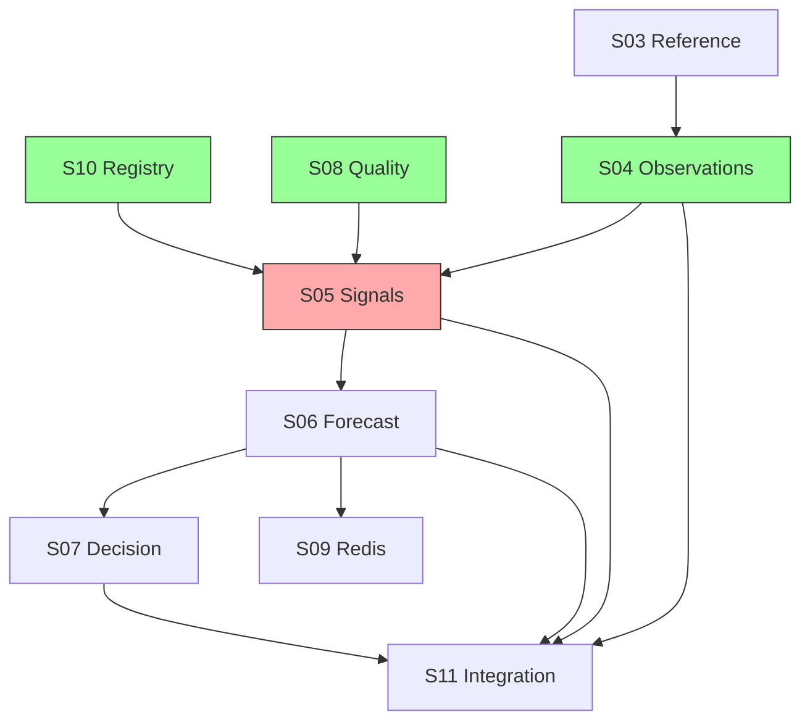

# E-01 Program Status — Data Foundation (KDO Phase 3)

**Epic:** E-01 | **Branch (target):** `feature/e01-data-foundation`  
**Last updated:** 2026-06-04  
**Stop rule:** Phase 3 complete at S04 + tracks B–F docs; **S05–S07, S09, S11 not started**

**KDO workstream map:** A=S04 impl, B=historical bootstrap, C=E-02 seed prep, D=DS-001, E=scale review, F=governance, G=this dashboard.

---

## Epic Completion

| Metric | Value |
|--------|-------|
| **Stories done** | 6 / 11 (S01, S02, S03, S04, S08, S10) |
| **Completion %** | **~55%** (6 of 11 stories) |
| **Migration head** | `0005_observations_partitioned` |
| **E-02 unblock** | **Ready** — S03 + S10 + S04 observation schema |

---

## Phase 3 Story

| Story | Title | Status | Report |
|-------|-------|--------|--------|
| E-01-S04 | Partitioned observations | **Done** | [E01_S04_COMPLETION_REPORT.md](../reviews/E01_S04_COMPLETION_REPORT.md) |

---

## Workstreams (Phase 3 docs)

| Track | Deliverable | Status |
|-------|-------------|--------|
| B | [HISTORICAL_DATA_BOOTSTRAP_PLAN.md](../research/HISTORICAL_DATA_BOOTSTRAP_PLAN.md) | Done |
| C | [E02_SEED_PREPARATION_PLAN.md](./E02_SEED_PREPARATION_PLAN.md) | Done |
| D | [DS001_FUTURES_VENDOR_DECISION.md](../research/DS001_FUTURES_VENDOR_DECISION.md) updated | FOUNDER DECISION REQUIRED |
| E | [DATA_SCALE_FORECAST.md](../reviews/DATA_SCALE_FORECAST.md) | Done |
| F | [E01_PHASE3_GOVERNANCE_CHECK.md](../reviews/E01_PHASE3_GOVERNANCE_CHECK.md) | GREEN (program) |

---

## Not started

| Stories | Scope |
|---------|-------|
| **E-01-S05 – S07** | Signals, forecast, decision DDL |
| **E-01-S09** | Redis MI client |
| **E-01-S11** | Integration gate (≥80% coverage) |

---

## Dependency Graph

---

## Critical Path

**E-00 → S01 → S02 → S03 → S10 → S08 → S04 → S05 → S06 → S07 → S11**

S04 complete. **Next code story: S05** (`0006_signals_partitioned`).

---

## Risks and Blockers

| ID | Item | Severity | Status |
|----|------|----------|--------|
| R-01 | DS-001 founder decision | Medium | **Open** |
| R-02 | Integration tests need `DATABASE_URL` | Low | **Open** |
| R-03 | Partition ops monthly rollout | Medium | **Mitigated** (runbook) |
| R-04 | S05 depends on E-00-S08 AgentType | Low | **Green** |

---

## Validation (2026-06-04, Phase 3)

| Check | Status |
|-------|--------|
| `uv run ruff check .` | See [E01_PHASE3_EXECUTIVE_SUMMARY.md](../reviews/E01_PHASE3_EXECUTIVE_SUMMARY.md) |
| `uv run mypy` | See executive summary |
| `uv run pytest tests/ -v` | See executive summary |
| `alembic upgrade head` | See executive summary |
| Migration chain | `0001 → 0002 → 0003 → 0004 → 0005` linear |

Phase 3 narrative: [E01_PHASE3_EXECUTIVE_SUMMARY.md](../reviews/E01_PHASE3_EXECUTIVE_SUMMARY.md).

---

*End of E-01 program status — Phase 3.*
