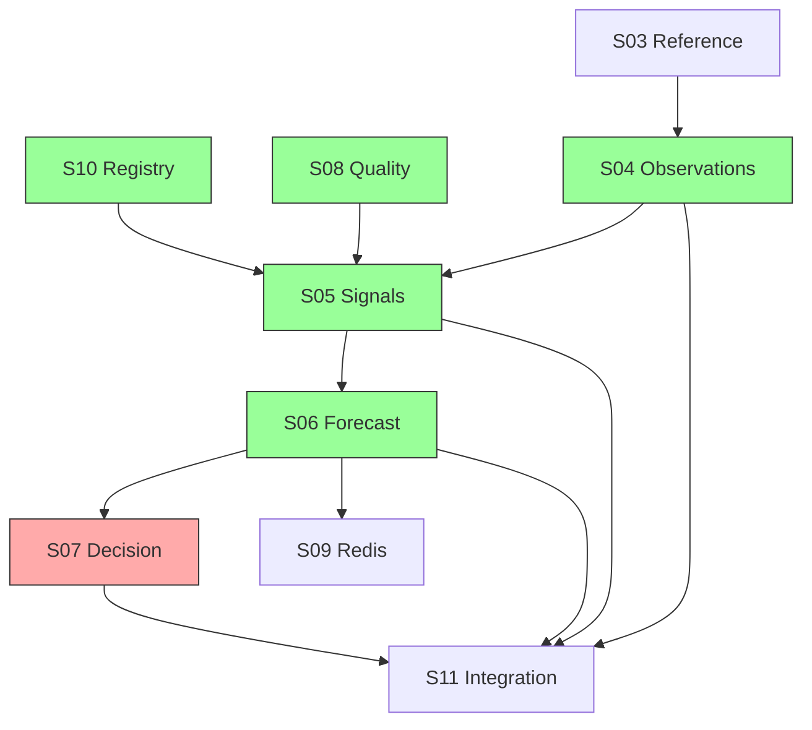

# E-01 Program Status — Data Foundation (KDO Phase 4)

**Epic:** E-01 | **Branch (target):** `feature/e01-data-foundation`  
**Last updated:** 2026-06-04  
**Stop rule:** S01–S06 complete; **S07, S09, S11 not started** (no S07/S09/S11 implementation in this gate)

**KDO workstream map:** A=S05–S06 impl, B=Agmarknet spike, C=weather framework, D=lifecycle model, E=procurement signals, F=source decisions, G=governance, H=this dashboard.

---

## Epic Completion

| Metric | Value |
|--------|-------|
| **Stories done** | 8 / 11 (S01, S02, S03, S04, S05, S06, S08, S10) |
| **Completion %** | **~73%** (8 of 11 stories) |
| **Migration head** | `0007_forecast_and_features` |
| **E-02 unblock** | **Ready** — reference + registry + observations + signals + forecast foundation |

---

## Phase 4 Story

| Story | Title | Status | Report |
|-------|-------|--------|--------|
| E-01-S05 | StructuredSignal + SignalSnapshot | **Done** | [E01_S05_COMPLETION_REPORT.md](../reviews/E01_S05_COMPLETION_REPORT.md) |
| E-01-S06 | Forecast + feature store foundation | **Done** | [E01_S06_COMPLETION_REPORT.md](../reviews/E01_S06_COMPLETION_REPORT.md) |

---

## Workstreams (Phase 4 docs)

| Track | Deliverable | Status |
|-------|-------------|--------|
| B | [AGMARKNET_INGESTION_SPIKE.md](../research/AGMARKNET_INGESTION_SPIKE.md) | Done |
| C | [WEATHER_SIGNAL_FRAMEWORK.md](../research/WEATHER_SIGNAL_FRAMEWORK.md) | Done |
| D | [COMMODITY_LIFECYCLE_MODEL.md](../research/COMMODITY_LIFECYCLE_MODEL.md) | Done |
| E | [PROCUREMENT_SIGNAL_MODEL.md](../research/PROCUREMENT_SIGNAL_MODEL.md) | Done |
| F | [PHASE1_SOURCE_DECISIONS.md](../research/PHASE1_SOURCE_DECISIONS.md) | Done |
| G | [E01_PHASE4_GOVERNANCE_CHECK.md](../reviews/E01_PHASE4_GOVERNANCE_CHECK.md) | GREEN (program) |

---

## Not started

| Stories | Scope |
|---------|-------|
| **E-01-S07** | Decision DDL |
| **E-01-S09** | Redis MI client |
| **E-01-S11** | Integration gate (≥80% coverage) |

---

## Dependency Graph

---

## Critical Path

**E-00 → S01 → S02 → S03 → S10 → S08 → S04 → S05 → S06 → S07 → S11**

S06 complete. **Next code story: S07** (decision schema — out of scope for PI3 merge gate).

---

## Risks and Blockers

| ID | Item | Severity | Status |
|----|------|----------|--------|
| R-01 | DS-001 founder decision | Medium | **Open** |
| R-02 | Integration tests need `DATABASE_URL` | Low | **Open** |
| R-03 | Partition ops monthly rollout | Medium | **Mitigated** (runbook) |
| R-04 | Agmarknet 10y backfill effort | Medium | **Documented** (Track B) |
| R-05 | IMD whitelist for weather | Medium | **Open** (E-03) |

---

## Validation (2026-06-04, merge gate)

| Check | Status |
|-------|--------|
| `uv run ruff check .` | Run at merge gate |
| `uv run mypy` | Run at merge gate |
| `uv run pytest tests/ -q` | Pass (DB tests skipped without `DATABASE_URL`) |
| `alembic upgrade head` | Head `0007_forecast_and_features` |
| Migration chain | `0001 → … → 0007` linear |

Phase 4 narrative: [E01_PHASE4_EXECUTIVE_SUMMARY.md](../reviews/E01_PHASE4_EXECUTIVE_SUMMARY.md).  
PI2 narrative: [PI2_EXECUTIVE_SUMMARY.md](../reviews/PI2_EXECUTIVE_SUMMARY.md).

---

*End of E-01 program status — S01–S06 complete.*
