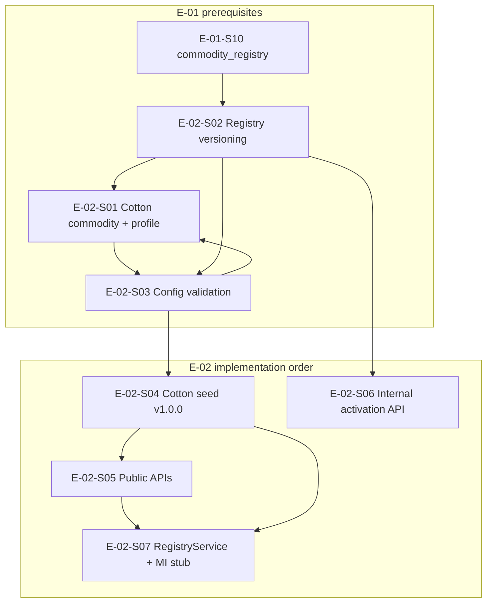

# E-02 Execution Plan — Commodity Registry (PI1 Track B, docs only)

| Field | Value |
|-------|-------|
| **Date** | 2026-06-03 |
| **Epic** | E-02 — Commodity Registry |
| **PI1 rule** | **No E-02 code** in this increment — plan only |
| **Prerequisites** | E-00 complete; E-01-S01–S03 complete; **E-01-S10 required** before S02–S04 |

---

## 1. Goal

Deliver cotton `Commodity` + `CommodityProfile`, versioned `CommodityRegistry` v1.0.0 (active), public read APIs, and internal activation API — unblocking E-03 source mappings and E-04 agent orchestration.

---

## 2. Story dependency graph

**Critical path:** `E-01-S10` → `E-02-S01` → `E-02-S02` → `E-02-S03` → `E-02-S04` → `E-02-S05` → `E-02-S07`.

**Parallelizable after S04:** S05 (public API) and S06 (internal API) with shared service layer.

---

## 3. Recommended execution order

| Phase | Stories | Deliverable | Blocks |
|-------|---------|-------------|--------|
| **0** | E-01-S10 | Migration `0003_commodity_registry`, partial UNIQUE active | All E-02 registry work |
| **1** | E-02-S01 | `backend/app/services/registry/` + seed script stub + `CommodityRepository` extensions | S02–S04 |
| **2** | E-02-S02 | `create_registry_version`, `activate_registry_version`, `get_active_registry` | S03, S04, S06 |
| **3** | E-02-S03 | Validator: agents disjoint, weights sum 1.0, MSP 3%, partial 50% | S04, S06 |
| **4** | E-02-S04 | Active cotton v1.0.0 seed (TDS-009 §11.1) | S05, S07, E-03 |
| **5** | E-02-S05 | `GET /v1/commodities`, `GET /v1/commodities/cotton/registry/active` | S07 |
| **6** | E-02-S06 | Internal POST activate (API key) | Ops |
| **7** | E-02-S07 | `RegistryService.get_active_config`, 5-min cache, MI stub test | E-04 |

---

## 4. Prerequisites checklist

| Prerequisite | Status (2026-06-03) | Owner |
|--------------|---------------------|-------|
| E-01-S03 tables | **Done** | — |
| E-01-S10 `commodity_registry` | **Not started** | E-01 team first |
| E-01-S02 repository pattern | **Done** | — |
| `SeedRunner.apply` implementation | **Stub** | E-02-S01/S04 |
| ADR-003 versioning rules | Accepted | Implement in S02 |
| DS-001 futures vendor | Doc complete; **founder sign-off pending** | Founder (parallel) |

---

## 5. Risks

| ID | Risk | Severity | Mitigation |
|----|------|----------|------------|
| E2-R1 | Starting E-02 without S10 | **Critical** | Gate PRs on `0003` migration |
| E2-R2 | Cotton weights still PROPOSED in TDS-009 | Medium | Use story defaults; founder sign-off on S04 fixture |
| E2-R3 | Duplicate registry read logic in API vs service | Medium | S07 single entry point |
| E2-R4 | Public API leaks internal source credentials | High | TDS-010 §10.2 public subset only |
| E2-R5 | Idempotent seed failure on re-run | Medium | Upsert by `commodity_id` / `registry_id` |
| E2-R6 | Six roles on profile vs two phase-1 active | Low | Tests per E-02-S01 AC |

---

## 6. Test strategy

| Layer | Tests | Stories |
|-------|-------|---------|
| **Unit** | Validator weights, agent disjoint, activation swap | S03, S02 |
| **Integration** | Cotton seed + `get_active_registry('cotton')` | S04 |
| **API contract** | httpx vs TDS-010 examples; anonymous 200 | S05 |
| **Security** | 401 without `X-API-Key` on internal routes | S06 |
| **Service** | `RegistryService` cache invalidation on activate | S07 |
| **Regression** | No collision with `cotton_test` (E-01-S11 future fixture) | S04 |

**CI:** Extend Postgres job with seed step after `alembic upgrade head` once S04 lands.

---

## 7. Files expected (implementation phase)

| Path | Story |
|------|-------|
| `backend/app/services/registry/` | S01–S07 |
| `backend/app/api/v1/registry.py` (implement handlers) | S05–S06 |
| `scripts/seed_cotton_baseline.py` or `seeds/fixtures/cotton.json` | S01, S04 |
| `tests/integration/test_cotton_registry.py` | S04+ |
| `tests/unit/test_registry_validation.py` | S03 |

---

## 8. E-03 handoff

After **E-02-S04**, active registry exposes `price_sources`, `arrival_sources`, `weather_variables`, `policy_drivers` as strings for ingest mapping ([E03_DATA_INGESTION_READINESS.md](../research/E03_DATA_INGESTION_READINESS.md)).

---

## 9. PI1 exit criteria for E-02

| Criterion | PI1 (this doc) | Post-PI1 |
|-----------|----------------|----------|
| Execution plan approved | **Done** | — |
| Dependency on S10 explicit | **Done** | Implement S10 |
| Code | **Forbidden** | Next increment |
