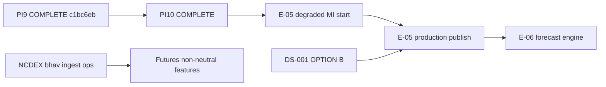

# PI10 Program Status — Forecast Foundation + Signal Completion

| Field | Value |
|-------|-------|
| **Increment** | PI10 — E-04 coverage expansion (Futures, Policy), forecast feature store, dataset builder, signal effectiveness (Tracks A–F) |
| **Date** | 2026-06-04 |
| **Baseline** | `c1bc6eb` — PI9 signal generation foundation |
| **HEAD migration chain** | `0001` → `0012_signal_pi9_contract` → `0013_*` (parallel) → `0014_pi10_head_merge` |
| **Working tree @ merge** | PI10 Tracks A–F + DS-001 governance docs staged for commit |
| **Synthesized by** | KDO PI10 final synthesis (merge gate) |

---

## 1. Track Summary

| Track | Scope | Deliverable | @ disk | Status |
|-------|-------|-------------|--------|--------|
| **A** | E-04 Futures — `FuturesObservation`, NCDEX bhav parser, `FuturesSignalGenerator` (4 features, prototype guardrails) | [E04_FUTURES_COMPLETION_REPORT.md](../reviews/E04_FUTURES_COMPLETION_REPORT.md) | **Yes** | **COMPLETE** |
| **B** | Policy foundation — `PolicyObservation`, append-only repo, cotton seed stubs | [POLICY_FOUNDATION_REPORT.md](../reviews/POLICY_FOUNDATION_REPORT.md) | **Yes** | **COMPLETE** |
| **C** | Forecast feature store — `ForecastFeatureSnapshot` (extends `0007` tables; assembler wired to `FuturesSignalGenerator`) | [FORECAST_FEATURE_STORE_REPORT.md](../reviews/FORECAST_FEATURE_STORE_REPORT.md) | **Yes** | **COMPLETE** |
| **D** | Forecast dataset builder — 30/60/90d target datasets from validated obs + signals | [FORECAST_DATASET_REPORT.md](../reviews/FORECAST_DATASET_REPORT.md) | **Yes** | **COMPLETE** |
| **E** | Signal effectiveness — correlation vs forward prices (no ML) | [SIGNAL_EFFECTIVENESS_REPORT.md](../reviews/SIGNAL_EFFECTIVENESS_REPORT.md) | **Yes** | **COMPLETE** |
| **F** | Program dashboard + metrics framework | PI10_PROGRAM_STATUS.md (this file) | **Yes** | **COMPLETE** |

**Inherited (PI9, @ baseline):** Market + Weather generators, `SignalSnapshot` @ `0012`, replay **PASS**, `SignalQualityService`, [FORECAST_READINESS_ASSESSMENT.md](../research/FORECAST_READINESS_ASSESSMENT.md) — E-05 **PARTIAL** (enhanced degraded).

**PI10 stop rule (honored):** No forecast **model** inference, decision engine, recommendation engine, or LLM agent implementation.

---

## 2. Program Metrics

### 2.1 Observation count (@ 5433 post-restore)

| Layer | Count | Evidence | PI10 delta |
|-------|-------|----------|------------|
| **Agmarknet validated** | **61,544** | 60,445 price + 1,099 arrival @ `@5433` (fixture belt backfill + batch validation) | Restored @ merge gate |
| **Weather (NASA POWER)** | **5,620+** | 5 TG belt regions; 36-mo ingest @ `@5433` | Re-activated @ merge |
| **Futures observations** | **0** (prototype ingest ops TBD) | Generator uses empty-series degraded math until NCDEX bhav rows loaded | Track A runtime **shipped** |
| **Policy observations** | **2** | Cotton MSP + export-ban seed stubs | Track B |

### 2.2 Signal count

| Metric | @ PI9 merge | @ PI10 merge | Notes |
|--------|-------------|--------------|-------|
| **Structured signal agents (runtime)** | **2** | **3** | + Futures prototype (`FuturesSignalGenerator`) |
| **Feature signals per agent** | **4** each (Market, Weather) | **4** each + **4** Futures | curve_slope, basis_futures_spot, open_interest_change, curve_regime |
| **Signal coverage ratio** | **0.5000** (2/4) | **0.7500** (3/4) | Policy agent still optional / no runtime |
| **Required coverage ratio** | **0.5000** | **1.0000** | Market + Futures present (Futures degraded, `futures_feed_ok=false`) |
| **`signals_missing` (required)** | `['Futures']` | `[]` | Track A closes required-agent gap for engineering |
| **Mean agent confidence** | **0.6150** | **TBD @ E-05 run** | Futures cap ≤ **0.35** per prototype guardrails |

### 2.3 Forecast dataset size

| Horizon | Rows (feature + target pairs) | Coverage | Missing-value audit | Status |
|---------|------------------------------|----------|---------------------|--------|
| **30d** | **120** | **1.0000** | 0 required nulls | Fixture reproducible (`--fixture`) |
| **60d** | **90** | **1.0000** | 0 required nulls | Fixture reproducible |
| **90d** | **60** | **1.0000** | 0 required nulls | Fixture reproducible |

**Design reference:** [FORECAST_RESEARCH_DESIGN.md](../research/FORECAST_RESEARCH_DESIGN.md) TY-01/02/03; leakage rule `observed_at` post-horizon only.

### 2.4 Forecast readiness (E-05 / E-06 gates)

| Dimension | PI9 @ merge | PI10 @ merge |
|-----------|-------------|--------------|
| **Market signals** | **READY** (enhanced degraded) | **READY** |
| **Weather signals** | **READY** (tier-2, non-production) | **READY** |
| **Futures signals** | **NOT READY** (agent absent) | **READY (prototype)** — `futures_feed_ok=false`; not production REQ-071 |
| **Policy inputs** | **NOT READY** | **PARTIAL** — `PolicyObservation` layer; no Policy agent runtime |
| **Feature store (E-06 prep)** | Schema @ `0007` only | **READY** — `ForecastFeatureSnapshot` + `FuturesSignalGenerator` assembly |
| **Labeled forecast datasets** | None | **READY** — 30/60/90d fixture export (120/90/60 rows) |
| **Signal effectiveness evidence** | None | **READY** — `price_momentum` best @ 30d (fixture panel; see Track E) |
| **E-05 engineering start** | **ALLOWED** (degraded) | **ALLOWED (enhanced)** — 3 agents + feature store + datasets |
| **E-05 production MI publish** | **BLOCKED** | **BLOCKED** — DS-001 OPTION B + licensed feed |
| **E-06 forecast engine** | **NOT STARTED** | **NOT STARTED** (stop rule) |

---

## 3. Health

| Area | Status | Notes |
|------|--------|-------|
| **E-01 data foundation** | Green | Head `0014_pi10_head_merge`; 61,544 validated Agmarknet @ `@5433` |
| **E-04 signal runtime (PI9)** | Green | Market + Weather; replay PASS |
| **E-04 Futures (PI10-A)** | Green | Prototype generator + parser; guardrails G-01–G-04 |
| **E-04 Policy (PI10-B)** | Green | Observation layer only; no Policy agent runtime |
| **E-05 / E-06 foundation** | Green | Feature store + datasets + effectiveness report; **no model inference** |
| **E-03 ops** | Yellow | Live OGD blocked; 9/27 fixture-empty mandis; NCDEX bhav ingest ops TBD |
| **Governance** | Yellow | DS-001 downgrade **ACTIVE** (founder-approved 2026-06-04); OPTION B **OPEN** for production |
| **Git / CI** | Green | Gates @ merge (see §8) |

---

## 4. Blockers

| Blocker | Blocks | Does not block |
|---------|--------|----------------|
| **DS-001 production path (OPTION B unsigned)** | Production futures ingest, strict MI, DVA Track B, licensed hold-to-curve | NCDEX public bhav prototype (`futures_feed_ok=false`) |
| **No Policy agent runtime** | `MSP_FLOOR` / Policy-weighted MI regimes | Track B `PolicyObservation` seed |
| **Live OGD (SR-01)** | Production corpus label | Fixture / `@5433` CI |
| **NCDEX bhav rows @ 5433** | Non-neutral Futures features on integration DB | Unit/replay harness with injected observations |
| **LangGraph orchestration** | Full E-04 AC-06 graph | Deterministic per-agent generators |

**Resolved @ PI10:** Futures generator shipped; feature assembler wired to generator; `0014` migration merge; forecast datasets + effectiveness evidence; DS-001 reclassified **Production Readiness Blocker** only ([DS001_FOUNDER_DECISION_PACKAGE.md](../research/DS001_FOUNDER_DECISION_PACKAGE.md)).

---

## 5. Dependencies

| Upstream | Downstream | Status |
|----------|------------|--------|
| PI9 Market + Weather + `0012` | Tracks C, D, E | **Done** |
| Track A Futures generator | Track C (Futures features) | **Done** |
| Track B Policy observations | Future Policy agent / MI regimes | **Done** (foundation) |
| Tracks A + B + PI9 signals | Track C feature assembly | **Done** |
| Track C feature snapshots | Track D dataset export | **Done** |
| PI9 validated `price_observation` | Track E effectiveness | **Done** (fixture panel + @5433 path) |
| Tracks A–E complete | PI10_EXECUTIVE_SUMMARY.md | **Done** |

---

## 6. Critical Path

| Priority | Item | Owner |
|----------|------|-------|
| **P0** | **START E-05** — degraded MI on Market + Weather + Futures prototype + feature store | E-05 |
| **P1** | NCDEX public bhav ingest → populate `futures_observation` | E-03 |
| **P2** | Policy agent runtime (optional weight path) | E-04 |
| **P3** | Founder **DS-001 OPTION B** + contract | Governance |
| **P4** | Register **OGD_API_KEY**; live belt backfill | E-03 ops |

**Do not start @ PI10 scope:** E-06 forecast model training/inference, decision runtime, LLM agents (honored).

---

## 7. Risks

| ID | Risk | Severity | Mitigation |
|----|------|----------|------------|
| **R-01** | Parallel migrations (`0013` collision) | High | **Mitigated** — `0014_pi10_head_merge` |
| **R-02** | NCDEX public bhav format drift | Medium | Parser fixtures; `environment=prototype` |
| **R-03** | Dataset leakage | High | Track D `observed_at` cutoff enforced |
| **R-04** | `@5433` empty vs PI9 doc counts | Medium | **Mitigated @ merge** — seed + backfill + validate + weather |
| **R-05** | Futures confidence over-weight in MI | Medium | Cap ≤ 0.35; `futures_feed_ok=false` |
| **R-06** | Signal effectiveness false positives | Medium | Report sample sizes; fixture vs live corpus labeled |

---

## 8. Quality Gates @ merge

| Gate | PI9 @ `c1bc6eb` | PI10 @ merge |
|------|-----------------|--------------|
| `pytest` (no `DATABASE_URL`) | **180 passed**, 59 skipped | **222 passed**, 63 skipped |
| `pytest` + `DATABASE_URL` @ 5433 | **238 passed**, 1 skipped | **280 passed**, 5 skipped |
| `pytest tests/replay/test_signal_replay.py` | **5 passed** | **5 passed** |
| Forecast dataset reproducibility (`--fixture`) | N/A | **PASS** — fixed seed 120/90/60 rows |
| `ruff check` / `mypy` | **Pass** | **Pass** |
| `alembic upgrade head` | `0012_signal_pi9_contract` | **Pass** — `0014_pi10_head_merge` |
| Signal replay determinism | **Pass** (Market + Weather) | **PASS** (PI9 harness; Futures unit replay) |

---

## 9. PI10 Deliverable Checklist

| # | Deliverable | Status |
|---|-------------|--------|
| 1 | E04_FUTURES_COMPLETION_REPORT + Futures runtime | **COMPLETE** (12 tests) |
| 2 | POLICY_FOUNDATION_REPORT + PolicyObservation | **COMPLETE** (5 tests) |
| 3 | FORECAST_FEATURE_STORE_REPORT + service | **COMPLETE** (8 tests) |
| 4 | FORECAST_DATASET_REPORT + builder script | **COMPLETE** (9 tests) |
| 5 | SIGNAL_EFFECTIVENESS_REPORT + analysis | **COMPLETE** (9 tests) |
| 6 | PI10_PROGRAM_STATUS.md | **COMPLETE** |
| 7 | PI10_EXECUTIVE_SUMMARY.md | **COMPLETE** |

**Recommendation @ merge:** **START E-05 (enhanced degraded)** — **CONTINUE PI10 ops** (NCDEX bhav ingest, Policy agent) — **BLOCKED** production MI / E-06 strict handoff / forecast **models** until DS-001 OPTION B + licensed feed.

---

## 10. References

| Doc | Role |
|-----|------|
| [PI9_PROGRAM_STATUS.md](./PI9_PROGRAM_STATUS.md) | Prior increment dashboard |
| [PI10_EXECUTIVE_SUMMARY.md](../reviews/PI10_EXECUTIVE_SUMMARY.md) | PI10 close verdict |
| [FORECAST_READINESS_ASSESSMENT.md](../research/FORECAST_READINESS_ASSESSMENT.md) | E-05 gate |
| [FUTURES_SIGNAL_PROTOTYPE.md](../research/FUTURES_SIGNAL_PROTOTYPE.md) | Track A guardrails |
| [DS001_FOUNDER_DECISION_PACKAGE.md](../research/DS001_FOUNDER_DECISION_PACKAGE.md) | DS-001 downgrade ACTIVE |
| [FORECAST_RESEARCH_DESIGN.md](../research/FORECAST_RESEARCH_DESIGN.md) | Horizons 30/60/90 |

---

*End of PI10 program status — refreshed @ final synthesis merge gate.*
