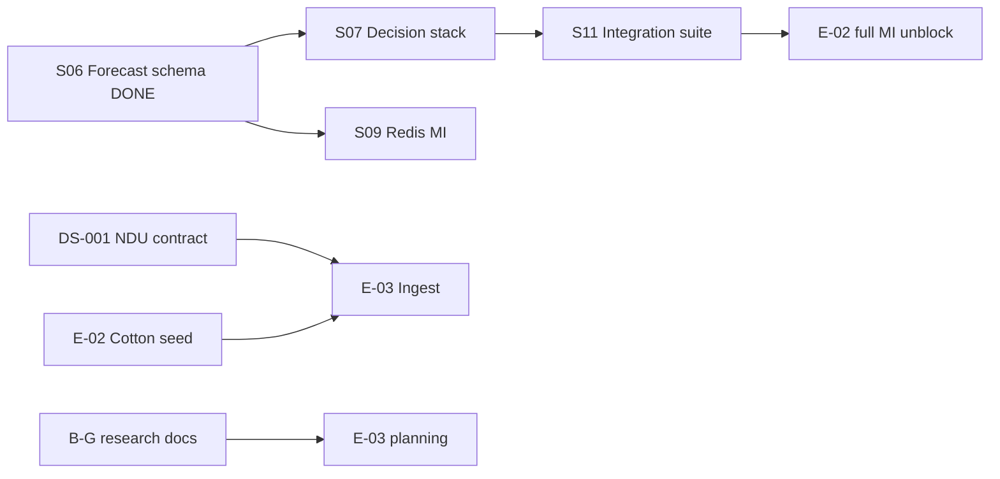

# PI2 Program Status — Data Realization & Forecast Foundation

| Field | Value |
|-------|-------|
| **Increment** | PI2 — Data Realization & Forecast Foundation |
| **Date** | 2026-06-04 |
| **HEAD (committed)** | `364ec5e` — E-01 Phase 2/3 registry, quality, observations |
| **Working tree** | **Dirty** — S05/S06 migrations, forecast/signal code, PI2 docs (uncommitted) |
| **Migration head (disk)** | `0007_forecast_and_features` |
| **Synthesized by** | KDO PI2 Agent 5 (post-scan) |

---

## 1. Progress Summary

| Track | Deliverable | Agent | Status @ synthesis |
|-------|-------------|-------|-------------------|
| **Audit** | [PI2_REPO_AUDIT.md](../reviews/PI2_REPO_AUDIT.md) | 0 | **EXISTS** |
| **A — S06** | Forecast + feature store schema | 1 | **EXISTS** (code + report) |
| **B** | [AGMARKNET_REALITY_CHECK.md](../research/AGMARKNET_REALITY_CHECK.md) | 2 | **EXISTS** |
| **C** | [IMD_FEASIBILITY_ASSESSMENT.md](../research/IMD_FEASIBILITY_ASSESSMENT.md) | 3 | **EXISTS** |
| **D** | [COTTON_LIFECYCLE_SIGNAL_MAPPING.md](../research/COTTON_LIFECYCLE_SIGNAL_MAPPING.md) | 4 | **EXISTS** |
| **E** | [SIGNAL_MATH_SPECIFICATION.md](../research/SIGNAL_MATH_SPECIFICATION.md) | 4 | **EXISTS** |
| **F** | [HISTORICAL_BOOTSTRAP_FEASIBILITY.md](../research/HISTORICAL_BOOTSTRAP_FEASIBILITY.md) | 6 | **EXISTS** |
| **G** | [FUTURES_DEPENDENCY_ANALYSIS.md](../research/FUTURES_DEPENDENCY_ANALYSIS.md) | 7 | **EXISTS** |
| **H** | PI2_PROGRAM_STATUS.md | 5 | **EXISTS** (this file) |
| **Exec** | PI2_EXECUTIVE_SUMMARY.md | 5 | **EXISTS** |

**E-01 stories (disk evidence):** 8 / 11 complete (~73%) — S01–S06, S08, S10 done; S07, S09, S11 not started.

**Stale dashboard:** [E01_PROGRAM_STATUS.md](./E01_PROGRAM_STATUS.md) still lists head `0006` and S06 not started — supersede with this PI2 status until E01 dashboard refreshed.

---

## 2. Critical Path

| Priority | Item | Owner |
|----------|------|-------|
| **P0** | E-01-S07 decision session DDL | Engineering |
| **P0** | E-01-S09 Redis MI client | Engineering |
| **P0** | E-01-S11 integration gate | Engineering |
| **P1** | DS-001 founder approval | Governance |
| **P2** | E-02 seed markets | After S11 / parallel per plan |
| **P3** | E-03 historical bootstrap execution | After E-01 + E-02 gates |

**Do not start E-03 ingest code** until E-01 S07/S09/S11 complete and E-02 seed FK targets exist.

---

## 3. Risks

| ID | Risk | Severity | Mitigation |
|----|------|----------|------------|
| R-01 | DS-001 unsigned | **High** | RFP NCDEX EOD vendors; spot-only DVA exploratory only |
| R-02 | IMD whitelist + DSP commercial terms | Medium | NASA POWER dev; legal review before production weather |
| R-03 | Agmarknet 60 mo backfill effort | Medium | Start 24 mo DVA minimum per bootstrap feasibility |
| R-04 | Uncommitted PI2 work on `main` | Medium | Single commit/PR before next increment |
| R-05 | Local Postgres port 5432 conflict | Low | Use 5434 or `dev-up.sh` |
| R-06 | `test_version_activation` dirty DB flake | Low | Unique `commodity_id` per run or session cleanup |

---

## 4. Blockers

| Blocker | Blocks | Does not block |
|---------|--------|----------------|
| DS-001 | REQ-071 production futures, full DVA, TDS-007 G6 | E-01 S07, S09, S11 schema work |
| E-02 seed | E-03 bootstrap FK targets | S07 (test commodity OK) |
| E-03 | Historical bootstrap execution | E-01 completion |
| IMD DSP commercial approval | Licensed historical IMD embed | Daily district API after whitelist |

---

## 5. Dependencies

| Upstream | Downstream |
|----------|------------|
| E-01-S06 (`snapshot_id` / forecast FK chain) | S07 `decision_session` |
| E-01-S05 | S06 `forecast_version.snapshot_id` |
| E-01-S10 | Versioned tables `registry_id` |
| PI2 research B–G | E-03 ingest design, E-05 feature gates |
| TDS-006 frozen | No schema drift without ADR |

---

## 6. Quality Gates (Agent 5 verification)

| Gate | Result (2026-06-04, no `DATABASE_URL`) |
|------|----------------------------------------|
| `pytest` | **39 passed**, 20 skipped, 0 failed |
| `ruff` | Pass |
| `mypy` persistence | Pass |
| `alembic upgrade head` | **Not re-run** this session (prior audit: pass @ `0007`) |

Integration tests (forecast, registry, signals) require `DATABASE_URL`; prior PI2 audit: 56 passed, 1 failed (registry flake on dirty DB).

---

## 7. Stop Rule Compliance

| Forbidden | Status |
|-----------|--------|
| S07, S09, S11 implementation in PI2 | **Not present** |
| Forecast algorithms / ML | **Absent** |
| Agents / signal engine runtime | **Absent** (schema + spec only) |
| Ingestion pipelines | **Absent** |
| TDS/founder edits | **None** |

---

## 8. Multi-Agent Merge (Agent 5)

At end-of-scan **all PI2 named deliverables were on disk** (tracks A–H). No agent-5 implementation was performed. Gaps noted for program hygiene only:

| Gap | Type |
|-----|------|
| E01_PROGRAM_STATUS.md out of date | Doc drift |
| PI2 work uncommitted on `main` | Git hygiene |
| Founder DS-001 approval | Governance (pre-existing) |

**PI2 documentation increment:** **Complete** pending commit.

---

*End of PI2 program status.*
