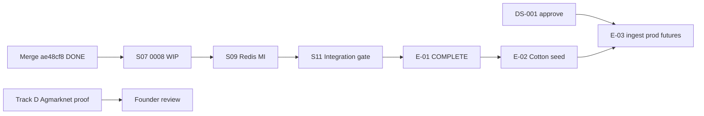

# PI3 Program Status — Complete E-01 & Data Viability Proof

| Field | Value |
|-------|-------|
| **Increment** | PI3 — E-01 closure (S07/S09/S11) + real-data research |
| **Date** | 2026-06-04 |
| **HEAD (committed)** | `ae48cf8` — E-01 S05–S06 and PI2: signals, forecast foundation, research |
| **HEAD migration chain** | `0001` → `0007_forecast_and_features` |
| **Working tree** | **Dirty** — S07 `0008` + decision ORM/repos in flight; Track E doc uncommitted |
| **Synthesized by** | KDO PI3 Track G (end-of-run disk + git scan) |

---

## 1. Track Summary

| Track | Scope | Deliverable | @ `ae48cf8` | @ disk (end scan) | Status |
|-------|-------|-------------|-------------|-------------------|--------|
| **0 — Merge** | Commit PI2/S05–S06 baseline | `ae48cf8` | **Yes** | **Yes** | **COMPLETE** |
| **A** | E-01-S07 decision persistence | [E01_S07_COMPLETION_REPORT.md](../reviews/E01_S07_COMPLETION_REPORT.md) + `0008` | **No** | `0008_decision_stack.py`, `models/decision.py`, repos (WIP) | **BLOCKED** (in progress — report/tests absent) |
| **B** | E-01-S09 Redis MI | [E01_S09_COMPLETION_REPORT.md](../reviews/E01_S09_COMPLETION_REPORT.md) | **Yes** (BLOCKED doc) | Same | **BLOCKED** — waiting S07 |
| **C** | E-01-S11 integration gate | [E01_S11_COMPLETION_REPORT.md](../reviews/E01_S11_COMPLETION_REPORT.md) | **No** | **Yes** (BLOCKED doc) | **BLOCKED** — S07+S09 incomplete |
| **D** | Agmarknet data proof | [AGMARKNET_DATA_PROOF.md](../research/AGMARKNET_DATA_PROOF.md) | **No** | **No** | **MISSING** |
| **E** | Cotton domain model v1 | [COTTON_DOMAIN_MODEL_V1.md](../research/COTTON_DOMAIN_MODEL_V1.md) | **No** | **Yes** (untracked) | **COMPLETE** (disk; not in git) |
| **F** | DS-001 founder package | [DS001_FOUNDER_DECISION_PACKAGE.md](../research/DS001_FOUNDER_DECISION_PACKAGE.md) | **Yes** | **Yes** | **COMPLETE** |
| **G** | Program dashboard | PI3_PROGRAM_STATUS.md (this file) | **No** | **Yes** | **COMPLETE** (this write) |
| **Final** | Executive summary | [PI3_EXECUTIVE_SUMMARY.md](../reviews/PI3_EXECUTIVE_SUMMARY.md) | **No** | **Yes** | **COMPLETE** (paired write) |

**Legend:** **COMPLETE** = deliverable exists and meets charter (or explicit BLOCKED report per stop rule). **BLOCKED** = dependency or gate failure documented. **MISSING** = expected path absent at scan time.

---

## 2. E-01 Story Progress

| Story | @ `ae48cf8` | @ disk | Report |
|-------|-------------|--------|--------|
| S01–S04, S08, S10 | Done | Done | Tracked reports |
| S05, S06 | Done | Done | S05, S06 reports |
| **S07** | Not started | **WIP** (`0008` untracked) | **MISSING** |
| **S09** | Not started | Not started | **BLOCKED** (committed) |
| **S11** | Not started | Gate assessed | **BLOCKED** ([report](../reviews/E01_S11_COMPLETION_REPORT.md)) |

| Metric | Value |
|--------|-------|
| Stories done @ HEAD | **8 / 11** (~73%) |
| Stories done @ disk (if S07 accepted) | **8 / 11** — S07 not shippable until report + tests + commit |
| Migration head @ HEAD | `0007` |
| Migration head @ disk (WIP) | `0008` (untracked; breaks linear chain test until committed with chain bump) |

---

## 3. Health

| Area | Status | Notes |
|------|--------|-------|
| **Platform (E-00)** | Green | M0 complete |
| **E-01 schema** | Yellow | S07 in flight; S09/S11 blocked |
| **Git / CI** | Yellow | `main` **ahead 1** of `origin/main`; push + CI not verified this scan |
| **Research (PI3)** | Yellow | E, F done; D missing; PI2 Agmarknet reality check is fallback only |
| **Governance** | Yellow | DS-001 package ready; **founder signature still absent** |

---

## 4. Blockers

| Blocker | Blocks | Does not block |
|---------|--------|----------------|
| **S07 incomplete** | S09, S11, E-01 epic closure | E-02 doc-only prep |
| **S09 BLOCKED on S07** | Redis MI, MI publish path | S07 DDL work |
| **S11 BLOCKED** (report on disk) | E-01 integration gate, confident E-02/E-03 start | Partial E-02 design |
| **AGMARKNET_DATA_PROOF missing** | PI3 “real sample” sign-off | PI2 [AGMARKNET_REALITY_CHECK.md](../research/AGMARKNET_REALITY_CHECK.md) (API patterns, no live pull archive) |
| **DS-001 unsigned** | REQ-071 production futures, full DVA, TDS-009 Futures agent | E-01 S07/S09/S11 schema |
| **WIP `0008` uncommitted** | Clean pytest chain @ HEAD; CI truth on `main` | — |

---

## 5. Critical Path

| Priority | Item | Owner |
|----------|------|-------|
| **P0** | Finish S07 — commit `0008` + ORM + repos + tests + E01_S07 report | Track A |
| **P0** | Retry S09 after `0008` is head | Track B |
| **P0** | S11 integration gate after S07+S09 | Track C |
| **P1** | Deliver AGMARKNET_DATA_PROOF.md (live/API sample rows) | Track D |
| **P1** | Commit COTTON_DOMAIN_MODEL_V1.md | Track E hygiene |
| **P1** | Push `ae48cf8` + PI3 follow-up; CI green | Commit gate |
| **P2** | Founder DS-001 approve/reject | Governance |
| **P3** | E-02-S04 cotton seed | After E-01-S11 per program plan |

**Do not start:** forecast engine, signal engine, agent runtime, production ingestion (PI3 stop rule).

---

## 6. Quality Gates @ synthesis

| Gate | Result |
|------|--------|
| `pytest` @ `ae48cf8` clean tree | **39 passed**, 20 skipped (no `DATABASE_URL`) |
| `pytest` with untracked `0008` | **1 failed** — `test_alembic_revision_chain_linear` (head drift) |
| `ruff` / `mypy` | Not re-run this synthesis |
| `alembic upgrade head` | **Not re-run** — disk may be `0008` when S07 lands |

---

## 7. PI3 Deliverable Checklist

| # | Deliverable | Status |
|---|-------------|--------|
| 1 | Merge commit `ae48cf8` | **COMPLETE** |
| 2 | E01_S07_COMPLETION_REPORT.md + `0008` shipped | **BLOCKED** (WIP on disk) |
| 3 | E01_S09_COMPLETION_REPORT.md | **BLOCKED** (committed) |
| 4 | E01_S11_COMPLETION_REPORT.md | **BLOCKED** (on disk, uncommitted) |
| 5 | AGMARKNET_DATA_PROOF.md | **MISSING** |
| 6 | COTTON_DOMAIN_MODEL_V1.md | **COMPLETE** (uncommitted) |
| 7 | DS001_FOUNDER_DECISION_PACKAGE.md | **COMPLETE** |
| 8 | PI3_PROGRAM_STATUS.md | **COMPLETE** |
| 9 | PI3_EXECUTIVE_SUMMARY.md | **COMPLETE** |

---

## 8. References

| Doc | Role |
|-----|------|
| [PI2_EXECUTIVE_SUMMARY.md](../reviews/PI2_EXECUTIVE_SUMMARY.md) | Prior increment baseline |
| [KDO_MULTI_AGENT_CRITICAL_PATH_AUDIT.md](../reviews/KDO_MULTI_AGENT_CRITICAL_PATH_AUDIT.md) | Merge-before-synthesis playbook |
| [E01_PROGRAM_STATUS.md](./E01_PROGRAM_STATUS.md) | Story dashboard @ merge gate |

---

*End of PI3 program status.*
