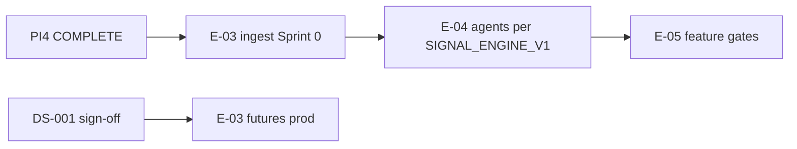

# PI4 Program Status — Commodity Intelligence Activation

| Field | Value |
|-------|-------|
| **Increment** | PI4 — E-02 implementation + intelligence research (Tracks A–H) |
| **Date** | 2026-06-04 |
| **HEAD (committed)** | PI4 merge commit (parent `dbe24d9` — E-01 S11 integration gate) |
| **HEAD migration chain** | `0001` → `0008_decision_stack` |
| **Working tree @ merge** | **Clean** after PI4 commit |
| **Synthesized by** | KDO PI4 Track H (final merge gate) |

---

## 1. Track Summary

| Track | Scope | Deliverable | @ disk | Status |
|-------|-------|-------------|--------|--------|
| **0 — Baseline** | Push + sanity gates | HEAD `dbe24d9` on `origin/main` | **Yes** | **COMPLETE** |
| **A** | E-02-S01–S07 implementation | [E02_COMPLETION_REPORT.md](../reviews/E02_COMPLETION_REPORT.md) + cotton seed + APIs | **Yes** | **COMPLETE** |
| **B** | Signal engine spec v1 | [SIGNAL_ENGINE_V1.md](../research/SIGNAL_ENGINE_V1.md) | **Yes** | **COMPLETE** |
| **C** | Cotton intelligence model v1 | [COTTON_INTELLIGENCE_MODEL_V1.md](../research/COTTON_INTELLIGENCE_MODEL_V1.md) | **Yes** | **COMPLETE** |
| **D** | Agmarknet production onboarding | [AGMARKNET_PRODUCTION_ONBOARDING.md](../research/AGMARKNET_PRODUCTION_ONBOARDING.md) | **Yes** | **COMPLETE** |
| **E** | Weather data strategy v1 | [WEATHER_DATA_STRATEGY_V1.md](../research/WEATHER_DATA_STRATEGY_V1.md) | **Yes** | **COMPLETE** |
| **F** | DVA proof strategy | [DVA_PROOF_STRATEGY.md](../research/DVA_PROOF_STRATEGY.md) | **Yes** | **COMPLETE** |
| **G** | DS-001 one-page founder memo | [DS001_FOUNDER_DECISION_PACKAGE.md](../research/DS001_FOUNDER_DECISION_PACKAGE.md) | **Yes** (unsigned) | **COMPLETE** (doc); **governance open** |
| **H** | Program dashboard | PI4_PROGRAM_STATUS.md (this file) | **Yes** | **COMPLETE** |
| **Final** | Executive summary | [PI4_EXECUTIVE_SUMMARY.md](../reviews/PI4_EXECUTIVE_SUMMARY.md) | **Yes** | **COMPLETE** |

**Legend:** **COMPLETE** = charter deliverable on disk and merged. **governance open** = founder action still required.

---

## 2. E-02 Story Progress (Track A)

| Story | Title | @ disk | Report / evidence |
|-------|-------|--------|-------------------|
| E-02-S01 | Cotton commodity + profile | **Done** — `cotton.json` + seed runner | [E02_COMPLETION_REPORT.md](../reviews/E02_COMPLETION_REPORT.md) |
| E-02-S02 | Registry versioning / activation | **Done** — create + activate + audit | Report §S02 |
| E-02-S03 | Config validation | **Done** — `validation/registry.py` + unit tests | Report §S03 |
| E-02-S04 | Cotton seed v1.0.0 | **Done** — Telangana regions/markets | `fixtures/cotton.json`, integration tests |
| E-02-S05 | Public registry APIs | **Done** — `GET /v1/commodities`, active registry | [registry.py](../../backend/app/api/v1/registry.py) |
| E-02-S06 | Internal activation API | **Done** — ops API key routes | Report §S06 |
| E-02-S07 | RegistryService + cache | **Done** — `backend/app/services/registry/` | 300s TTL cache |

| Metric | Value |
|--------|-------|
| Stories done @ merge | **7 / 7** |
| E02 completion report | **COMPLETE** |
| Production `commodity_id=cotton` active registry | **Yes** (after seed bootstrap) |

---

## 3. Health

| Area | Status | Notes |
|------|--------|-------|
| **Platform (E-00)** | Green | M0 complete |
| **E-01 data foundation** | Green | 11/11; head `0008`; S11 gate |
| **E-02 registry epic** | Green | Track A complete; E-03 FK targets available |
| **PI4 research (B–G)** | Green | All tracks on disk and committed |
| **Git / CI** | Green | `pytest` / `ruff` / `mypy` green @ merge (no `DATABASE_URL`) |
| **Governance** | Yellow | DS-001 memo ready; **founder signature absent** |

---

## 4. Blockers (post-PI4)

| Blocker | Blocks | Does not block |
|---------|--------|----------------|
| **OGD production API key** | Agmarknet production ingest | E-03 design / fixture ingest |
| **DS-001 unsigned** | REQ-071 production futures, full DVA Track B | Spot-only exploratory ingest |
| **IMD IP whitelist** | Production weather ingest | NASA POWER dev/gap-fill (Track E) |

**Resolved @ PI4:** E02 completion report, cotton seed, registry APIs, SIGNAL_ENGINE_V1, COTTON_INTELLIGENCE_MODEL_V1, `test_enum_values_match_tds`.

---

## 5. Dependencies

| Upstream | Downstream | Status |
|----------|------------|--------|
| E-01-S10 `0003_commodity_registry` | E-02 all stories | **Done** |
| E-02-S04 cotton + markets | E-03 Agmarknet bootstrap FK | **Ready** |
| E-02-S07 `RegistryService` | E-04 orchestration config read | **Ready** |
| Track D onboarding doc | E-03 Sprint 0 ops | **Ready** |
| Track E weather strategy | E-03 weather ingest tiering | **Ready** |
| Track F DVA strategy | E-06 bake-off / promotion | **Ready** |
| Track G DS-001 memo | E-03 futures + production DVA | **Open** (signature) |
| Track B signal spec | E-04 agents | **Ready** (spec) |
| E-03 observations | E-04 signal runtime | **Open** |

---

## 6. Critical Path

| Priority | Item | Owner |
|----------|------|-------|
| **P0** | **START E-03** — OGD key + IMD whitelist + Agmarknet bootstrap | E-03 |
| **P1** | Founder DS-001 OPTION A/B sign-off | Governance |
| **P2** | E-04 agent runtime (after observations) | E-04 |
| **P3** | E-05 MI aggregation | After E-04 |

**Do not start (PI4 stop rule — lifted for E-03):** forecast runtime, decision runtime, LLM agents until E-03/E-04 gates pass.

---

## 7. Quality Gates @ merge

| Gate | Result |
|------|--------|
| `git push origin main` (PI4) | **Done** @ merge gate |
| `alembic heads` | **`0008_decision_stack`** |
| `pytest` (no `DATABASE_URL`) | **62 passed**, 41 skipped, 0 failed |
| `ruff check .` | **Pass** |
| `mypy` | **Pass** (106 files) |
| `alembic upgrade head` | No new migration; head unchanged |

---

## 8. PI4 Deliverable Checklist

| # | Deliverable | Status |
|---|-------------|--------|
| 1 | Baseline gate `dbe24d9` pushed | **COMPLETE** |
| 2 | E02_COMPLETION_REPORT.md + E-02 S01–S07 | **COMPLETE** |
| 3 | SIGNAL_ENGINE_V1.md | **COMPLETE** |
| 4 | COTTON_INTELLIGENCE_MODEL_V1.md | **COMPLETE** |
| 5 | AGMARKNET_PRODUCTION_ONBOARDING.md | **COMPLETE** |
| 6 | WEATHER_DATA_STRATEGY_V1.md | **COMPLETE** |
| 7 | DVA_PROOF_STRATEGY.md | **COMPLETE** |
| 8 | DS001_FOUNDER_DECISION_PACKAGE.md (one-page) | **COMPLETE** (unsigned) |
| 9 | PI4_PROGRAM_STATUS.md | **COMPLETE** |
| 10 | PI4_EXECUTIVE_SUMMARY.md | **COMPLETE** |

**Recommendation:** **START E-03**

---

## 9. References

| Doc | Role |
|-----|------|
| [PI3_EXECUTIVE_SUMMARY.md](../reviews/PI3_EXECUTIVE_SUMMARY.md) | Prior increment — E-01 closure |
| [E02_EXECUTION_PLAN.md](./E02_EXECUTION_PLAN.md) | E-02 story order |
| [E03_DATA_INGESTION_READINESS.md](../research/E03_DATA_INGESTION_READINESS.md) | E-03 prerequisite matrix |
| [E01_PROGRAM_STATUS.md](./E01_PROGRAM_STATUS.md) | E-01 dashboard |

---

*End of PI4 program status.*
