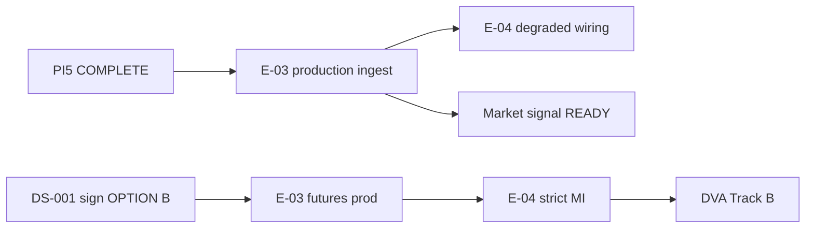

# PI5 Program Status — Data Ingestion Activation Spikes

| Field | Value |
|-------|-------|
| **Increment** | PI5 — E-03 activation spikes + readiness (Tracks A–H) |
| **Date** | 2026-06-04 |
| **HEAD (pre-merge)** | `faf3e668d7a42540d23654b3425606067999657e` (PI4 @ `main`) |
| **HEAD migration chain** | `0001` → `0008_decision_stack` |
| **Working tree @ merge** | PI5 deliverables staged for commit |
| **Synthesized by** | KDO PI5 Track H (final merge gate) |

---

## 1. Track Summary

| Track | Scope | Deliverable | @ disk | Status |
|-------|-------|-------------|--------|--------|
| **0 — Baseline** | PI4 @ `main` | `faf3e66` — E-02 + intelligence research | **Yes** | **COMPLETE** |
| **A** | E-03 Sprint 0 repository audit | [E03_SPRINT0_AUDIT.md](../reviews/E03_SPRINT0_AUDIT.md) | **Yes** | **COMPLETE** |
| **B** | Agmarknet ingest spike (parse/map/lookup) | `backend/app/services/ingest/agmarknet/` + [AGMARKNET_SPIKE_REPORT.md](../reviews/AGMARKNET_SPIKE_REPORT.md) | **Yes** | **COMPLETE** |
| **C** | Observation population proof | 8 cotton rows + [OBSERVATION_POPULATION_REPORT.md](../reviews/OBSERVATION_POPULATION_REPORT.md) | **Yes** | **COMPLETE** |
| **D** | Weather access spike | `backend/app/spike/weather/` + [WEATHER_SPIKE_REPORT.md](../reviews/WEATHER_SPIKE_REPORT.md) | **Yes** | **COMPLETE** |
| **E** | Signal input readiness (E-04 prereq) | [SIGNAL_INPUT_READINESS.md](../research/SIGNAL_INPUT_READINESS.md) | **Yes** | **COMPLETE** |
| **F** | DVA backtest preparation | [DVA_BACKTEST_PREPARATION.md](../research/DVA_BACKTEST_PREPARATION.md) | **Yes** | **COMPLETE** |
| **G** | DS-001 founder memo (GO OPTION B) | [DS001_FOUNDER_DECISION_PACKAGE.md](../research/DS001_FOUNDER_DECISION_PACKAGE.md) | **Yes** (unsigned) | **COMPLETE** (doc); **governance open** |
| **H** | Program dashboard | PI5_PROGRAM_STATUS.md (this file) | **Yes** | **COMPLETE** |
| **Final** | Executive summary | [PI5_EXECUTIVE_SUMMARY.md](../reviews/PI5_EXECUTIVE_SUMMARY.md) | **Yes** | **COMPLETE** |

**Legend:** **COMPLETE** = charter deliverable on disk @ merge. **governance open** = founder signature still required.

**PI5 stop rule (honored):** No signal engine, forecast engine, decision runtime, or LLM agent implementation.

---

## 2. Spike / Proof Progress

| Proof | Metric | Evidence |
|-------|--------|----------|
| Agmarknet OGD → drafts | **PASS** — 4/4 Telangana mandis resolve | Track B unit tests (12) |
| Observation DB persist | **PASS** — 7 price + 1 arrival | Track C @ `kn-test-pg:5433` |
| Weather NASA POWER | **PASS** — 5/5 districts HTTP 200 | Track D live probe |
| Weather IMD PRIMARY | **GATED** — HTTP 401 (API key) | WS-01 onboarding |
| Signal inputs @ DB | **8 rows**, 2 dates, 2/4 mandis | Track E inventory |
| DVA runnable today | **No** — B-01 through B-05 | Track F blocker matrix |
| DS-001 founder | **OPEN** — KDO recommends OPTION B | Track G |

---

## 3. Health

| Area | Status | Notes |
|------|--------|-------|
| **E-00 platform** | Green | M0 complete |
| **E-01 data foundation** | Green | Head `0008`; observation DDL ready |
| **E-02 registry** | Green | Cotton v1.0.0 + 4 Telangana mandis |
| **PI5 spikes (A–G)** | Green | All tracks on disk; non-production modules only |
| **E-03 production ingest** | Yellow | Spike + proof done; pipeline/cron/OGD key open |
| **E-04 signal runtime** | Red (inputs) | Market PARTIAL; Weather BLOCKED; Futures BLOCKED |
| **Git / CI** | Green | Gates @ merge (see §7) |
| **Governance** | Yellow | DS-001 memo recommends B; **unsigned** |

---

## 4. Blockers (post-PI5)

| Blocker | Blocks | Does not block |
|---------|--------|----------------|
| **OGD production API key (G2)** | Agmarknet production cron | Spike mapper, fixture CI, Track C proof |
| **DS-001 unsigned (B-01)** | REQ-071 futures prod, DVA Track B, strict MI | E-03 Sprint 0 Agmarknet + NASA POWER dev |
| **IMD IP whitelist (WS-01)** | IMD PRIMARY weather cron | NASA POWER SECONDARY (proven) |
| **E-03 production pipeline (G1, G9)** | Daily refresh, dedupe, quality snapshot | One-off population proof |
| **E-04–E-07 not built (B-03–B-05)** | DVA compute | Schema + spike modules |
| **30+ mandi national belt (DVA-BP03)** | Promotion-grade DVA | Telangana proof |

**Resolved @ PI5:** Agmarknet parse/map contract, FK-valid observation insert, weather API viability, signal-input gap analysis, DVA data requirements doc.

---

## 5. Dependencies

| Upstream | Downstream | Status |
|----------|------------|--------|
| E-02 cotton seed + `source_identifiers` | Agmarknet `market_id` lookup | **Proven** (Track B/C) |
| Track B mapper | Track C population | **Done** |
| Track C observations | Track E Market partial | **Done** (sparse) |
| Track D NASA POWER | E-03 weather dev load | **Ready** |
| Track D IMD onboarding | E-03 weather PRIMARY | **Open** (WS-01) |
| Track G DS-001 OPTION B | Futures ingest + DVA Track B | **Open** (signature) |
| E-03 30d+ Agmarknet backfill | E-04 Market READY | **Open** |
| E-03 weather DDL + persist | E-04 Weather READY | **Open** |
| E-04 agents | E-05 MI / E-06 forecast | **Open** |
| E-03 + E-04 + E-06 + E-07 | DVA calibration | **Open** |

---

## 6. Critical Path

| Priority | Item | Owner |
|----------|------|-------|
| **P0** | **START E-03** — Agmarknet production pipeline + 30d backfill + `data_quality_snapshot` | E-03 |
| **P1** | Founder DS-001 **OPTION B** sign-off + vendor/NDU contract | Governance |
| **P2** | Weather observation DDL + NASA POWER dev load; IMD PRIMARY post WS-01 | E-03 |
| **P3** | E-04 agent wiring (degraded) after M-1; **not** production MI | E-04 |
| **P4** | DVA calibration batch (E-07 + TDS-011) after data + pipeline | E-06/E-07 |

**Do not start @ PI5:** signal/forecast/decision/LLM **runtime** (honored). E-04 **wiring tests** allowed in degraded mode per Track E.

---

## 7. Quality Gates @ merge

| Gate | Result |
|------|--------|
| `pytest` (no `DATABASE_URL`) | **79 passed**, 43 skipped, 0 failed |
| `pytest` + `DATABASE_URL` @ 5433 (integration) | Observation population **2 passed** |
| `ruff check .` | **Pass** |
| `mypy` | **Pass** (119 files) |
| `alembic upgrade head` @ 5433 | **Pass** — head `0008_decision_stack` |
| `alembic heads` | **`0008_decision_stack`** |

---

## 8. PI5 Deliverable Checklist

| # | Deliverable | Status |
|---|-------------|--------|
| 1 | E03_SPRINT0_AUDIT.md | **COMPLETE** |
| 2 | Agmarknet ingest spike + AGMARKNET_SPIKE_REPORT.md | **COMPLETE** |
| 3 | Observation population proof (8 rows) + report | **COMPLETE** |
| 4 | Weather spike + WEATHER_SPIKE_REPORT.md | **COMPLETE** |
| 5 | SIGNAL_INPUT_READINESS.md | **COMPLETE** |
| 6 | DVA_BACKTEST_PREPARATION.md | **COMPLETE** |
| 7 | DS001_FOUNDER_DECISION_PACKAGE.md (GO OPTION B) | **COMPLETE** (unsigned) |
| 8 | PI5_PROGRAM_STATUS.md | **COMPLETE** |
| 9 | PI5_EXECUTIVE_SUMMARY.md | **COMPLETE** |

**Recommendation:** **START E-03**

---

## 9. References

| Doc | Role |
|-----|------|
| [PI4_EXECUTIVE_SUMMARY.md](../reviews/PI4_EXECUTIVE_SUMMARY.md) | Prior increment — E-02 + research |
| [PI4_PROGRAM_STATUS.md](./PI4_PROGRAM_STATUS.md) | PI4 dashboard |
| [E03_DATA_INGESTION_READINESS.md](../research/E03_DATA_INGESTION_READINESS.md) | Source matrix |
| [SIGNAL_ENGINE_V1.md](../research/SIGNAL_ENGINE_V1.md) | E-04 spec (not implemented) |

---

*End of PI5 program status.*
