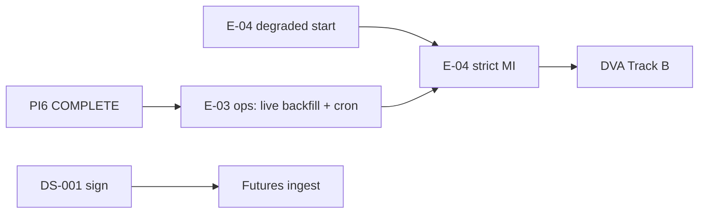

# PI6 Program Status — Production Data Foundation

| Field | Value |
|-------|-------|
| **Increment** | PI6 — E-03 production ingest + weather persistence + quality (Tracks A–H) |
| **Date** | 2026-06-04 |
| **Baseline** | `894a6a8` — PI5 data ingestion activation spikes + readiness |
| **HEAD migration chain** | `0001` → `0010_partition_backfill` |
| **Working tree @ merge** | PI6 deliverables staged for commit |
| **Synthesized by** | KDO PI6 Track H (final merge gate) |

---

## 1. Track Summary

| Track | Scope | Deliverable | @ disk | Status |
|-------|-------|-------------|--------|--------|
| **0 — Audit** | PI6 repo baseline @ `894a6a8` | [PI6_REPO_AUDIT.md](../reviews/PI6_REPO_AUDIT.md) | **Yes** | **COMPLETE** |
| **A** | E-03-S01 Agmarknet production ingestion | `services/ingest/agmarknet/` + [E03_S01_COMPLETION_REPORT.md](../reviews/E03_S01_COMPLETION_REPORT.md) | **Yes** | **COMPLETE** |
| **B** | Historical cotton backfill (24–36 mo) | `backfill.py`, `0010`, [HISTORICAL_BACKFILL_REPORT.md](../reviews/HISTORICAL_BACKFILL_REPORT.md) | **Yes** | **COMPLETE** |
| **C** | Weather observation DDL (SI-02) | `0009`, ORM/repos + [WEATHER_PERSISTENCE_REPORT.md](../reviews/WEATHER_PERSISTENCE_REPORT.md) | **Yes** | **COMPLETE** |
| **D** | NASA POWER ingest → `weather_observation` | `services/ingest/weather/` + [NASA_POWER_INGESTION_REPORT.md](../reviews/NASA_POWER_INGESTION_REPORT.md) | **Yes** | **COMPLETE** |
| **E** | `data_quality_snapshot` ingest wiring | `services/quality/` + [DATA_QUALITY_REPORT.md](../reviews/DATA_QUALITY_REPORT.md) | **Yes** | **COMPLETE** |
| **F** | Observation coverage analysis | [OBSERVATION_COVERAGE_ANALYSIS.md](../research/OBSERVATION_COVERAGE_ANALYSIS.md) | **Yes** | **COMPLETE** |
| **G** | Signal readiness (E-04 gate) | [SIGNAL_READINESS_ASSESSMENT.md](../research/SIGNAL_READINESS_ASSESSMENT.md) | **Yes** | **COMPLETE** |
| **H** | Program dashboard + executive summary | PI6_PROGRAM_STATUS.md (this file) | **Yes** | **COMPLETE** |
| **Final** | Executive summary | [PI6_EXECUTIVE_SUMMARY.md](../reviews/PI6_EXECUTIVE_SUMMARY.md) | **Yes** | **COMPLETE** |

**Legend:** **COMPLETE** = charter deliverable on disk @ merge.

**PI6 stop rule (honored):** No signal engine, forecast engine, decision runtime, or LLM agent implementation.

---

## 2. Data Foundation Progress

| Proof | Metric | Evidence |
|-------|--------|----------|
| Agmarknet production pipeline | **PASS** — OGD client, pagination, dedupe, CLI | Track A (24 Agmarknet tests) |
| Historical backfill framework | **PASS** — 36-mo window, `0010` partitions, fixture replay | Track B (10 unit + 1 integration) |
| Weather DDL + repository | **PASS** — `0009_weather_observations` | Track C (6 tests) |
| NASA POWER persistence | **PASS** — 5,620 rows @ 5433 (36-mo run) | Track D |
| Quality snapshot wiring | **PASS** — post Agmarknet/weather ingest | Track E (8 ingest tests) |
| Mandi history depth | **YELLOW** — proof-scale (8 facts, 2 dates) vs 36-mo target | Tracks F/G; live backfill ops-dependent |
| DS-001 founder | **OPEN** — unsigned | Governance (inherits PI5) |

---

## 3. Health

| Area | Status | Notes |
|------|--------|-------|
| **E-00 platform** | Green | M0 complete |
| **E-01 data foundation** | Green | Head `0010_partition_backfill`; weather + observation partitions |
| **E-02 registry** | Green | Cotton v1.0.0 + 4 Telangana mandis (+ 2 belt regions for weather) |
| **PI6 ingest (A–E)** | Green | Production modules + CLIs; no scheduler |
| **E-03 ops** | Yellow | `OGD_API_KEY`, live 36-mo backfill, daily cron open |
| **E-04 signal runtime** | Yellow | **START (degraded)** per Track G; strict MI blocked on Futures |
| **Git / CI** | Green | Gates @ merge (see §7) |
| **Governance** | Yellow | DS-001 unsigned |

---

## 4. Blockers (post-PI6)

| Blocker | Blocks | Does not block |
|---------|--------|----------------|
| **Live Agmarknet 36-mo backfill not executed (SR-01)** | Market z-scores, Policy spot, joint weather–mandi features | Pipeline, fixture CI, degraded E-04 wiring |
| **DS-001 unsigned (SR-02)** | Strict MI, licensed futures, DVA Track B | E-04 agent stubs, NASA weather tier-2 |
| **MSP / PIB / CCI absent (SR-03)** | Policy high-confidence tiers | Low-confidence Policy after MSP seed |
| **IMD PRIMARY (WS-01)** | Production weather tier-1 | NASA POWER dev/backfill (proven) |
| **E-04–E-07 runtime not built** | Forecasting, DVA compute | Schema + ingest + research specs |
| **Production scheduler (SI-08)** | Automated daily refresh | Manual CLIs |

**Resolved @ PI6:** Production Agmarknet path, backfill framework, weather persistence DDL, NASA ingest, DQS writer, partition backfill DDL, coverage + signal readiness assessments.

---

## 5. Dependencies

| Upstream | Downstream | Status |
|----------|------------|--------|
| E-02 cotton seed + `source_identifiers` | Agmarknet `market_id` lookup | **Proven** |
| Track A pipeline | Track B backfill | **Done** |
| Track C `0009` | Track D NASA ingest | **Done** |
| Tracks A/B/D | Track E quality snapshot | **Done** |
| Track G SR-01 backfill ops | E-04 Market READY | **Open** |
| Track G DS-001 | E-04 strict MI + DVA | **Open** |
| E-04 agents | E-05 MI / E-06 forecast | **Open** |

---

## 6. Critical Path

| Priority | Item | Owner |
|----------|------|-------|
| **P0** | **CONTINUE E-03** — execute `agmarknet_backfill.py` live; daily Agmarknet + DQS refresh | E-03 ops |
| **P1** | **START E-04** — agent wiring, neutral/degraded outputs (Track G) | E-04 |
| **P2** | Founder **DS-001** sign-off + futures ingest | Governance |
| **P3** | `msp_inr_quintal` seed + PIB/CCI design | E-02 / E-03 |
| **P4** | IMD PRIMARY post WS-01 | E-03 weather |

**Do not start @ PI6:** signal/forecast/decision/LLM **runtime** implementation (honored). E-04 **degraded wiring** allowed per Track G.

---

## 7. Quality Gates @ merge

| Gate | Result |
|------|--------|
| `pytest` (no `DATABASE_URL`, `-m "not integration"`) | **110 passed**, 2 skipped, 0 failed |
| `pytest` + `DATABASE_URL` @ 5433 (full suite) | **168 passed**, 1 skipped, 0 failed |
| `ruff check` | **Pass** |
| `mypy` (`backend/app`) | **Pass** (102 files) |
| `alembic upgrade head` @ 5433 | **Pass** — head `0010_partition_backfill` |
| Backfill reproducible (`--fixture --dry-run`) | **Pass** |
| Agmarknet ingest repeatable (`--fixture`, dedupe on re-run) | **Pass** |

---

## 8. PI6 Deliverable Checklist

| # | Deliverable | Status |
|---|-------------|--------|
| 1 | PI6_REPO_AUDIT.md | **COMPLETE** |
| 2 | E03_S01_COMPLETION_REPORT + production Agmarknet | **COMPLETE** |
| 3 | HISTORICAL_BACKFILL_REPORT + backfill framework | **COMPLETE** |
| 4 | WEATHER_PERSISTENCE_REPORT + migration `0009` | **COMPLETE** |
| 5 | NASA_POWER_INGESTION_REPORT (5,620 rows proof) | **COMPLETE** |
| 6 | DATA_QUALITY_REPORT | **COMPLETE** |
| 7 | OBSERVATION_COVERAGE_ANALYSIS.md | **COMPLETE** |
| 8 | SIGNAL_READINESS_ASSESSMENT.md | **COMPLETE** |
| 9 | PI6_PROGRAM_STATUS.md | **COMPLETE** |
| 10 | PI6_EXECUTIVE_SUMMARY.md | **COMPLETE** |

**Recommendation:** **START E-04 (degraded)** — **CONTINUE E-03 (ops backfill)**

---

## 9. References

| Doc | Role |
|-----|------|
| [PI5_EXECUTIVE_SUMMARY.md](../reviews/PI5_EXECUTIVE_SUMMARY.md) | Prior increment — spikes + readiness |
| [PI5_PROGRAM_STATUS.md](./PI5_PROGRAM_STATUS.md) | PI5 dashboard |
| [SIGNAL_ENGINE_V1.md](../research/SIGNAL_ENGINE_V1.md) | E-04 spec (not implemented) |
| [WEATHER_DATA_STRATEGY_V1.md](../research/WEATHER_DATA_STRATEGY_V1.md) | IMD / NASA tiering |

---

*End of PI6 program status.*
