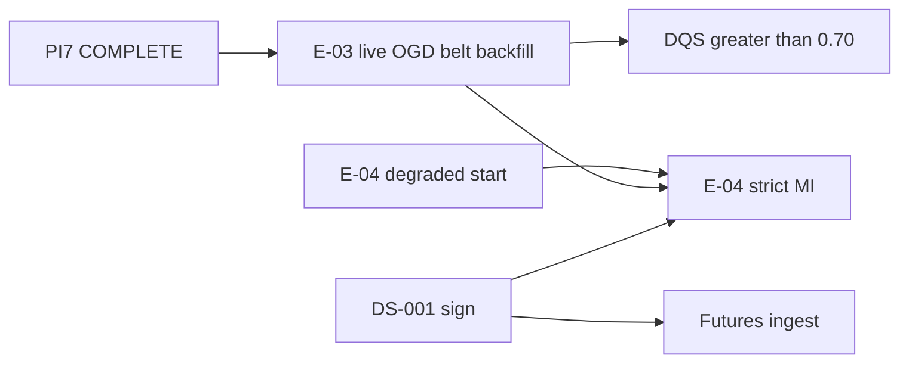

# PI7 Program Status — Data Coverage Expansion

| Field | Value |
|-------|-------|
| **Increment** | PI7 — cotton belt registry + historical backfill + quality trend (Tracks A–H) |
| **Date** | 2026-06-04 |
| **Baseline** | `f72a1fb` — PI6 production data foundation |
| **HEAD migration chain** | `0001` → `0010_partition_backfill` |
| **Working tree @ merge** | PI7 Tracks A–G + Track H synthesis staged for commit |
| **Synthesized by** | KDO PI7 Track H (final merge gate) |

---

## 1. Track Summary

| Track | Scope | Deliverable | @ disk | Status |
|-------|-------|-------------|--------|--------|
| **A** | E-03-S02 belt historical backfill | `backfill.py`, `expected_markets.py`, [E03_S02_COMPLETION_REPORT.md](../reviews/E03_S02_COMPLETION_REPORT.md) | **Yes** | **COMPLETE** |
| **B** | Cotton belt market seed (27 mandis) | `cotton.json`, [MARKET_COVERAGE_REPORT.md](../reviews/MARKET_COVERAGE_REPORT.md) | **Yes** | **COMPLETE** |
| **C** | Weather persistence verification (PI6) | [WEATHER_PERSISTENCE_COMPLETION_REPORT.md](../reviews/WEATHER_PERSISTENCE_COMPLETION_REPORT.md) | **Yes** | **COMPLETE** |
| **D** | NASA POWER 36-mo backfill @ 5433 | [NASA_POWER_BACKFILL_REPORT.md](../reviews/NASA_POWER_BACKFILL_REPORT.md) | **Yes** | **COMPLETE** |
| **E** | DQS trend + empty-weather fix | [DATA_QUALITY_TREND_REPORT.md](../reviews/DATA_QUALITY_TREND_REPORT.md) | **Yes** | **COMPLETE** |
| **F** | Observation coverage gaps | [OBSERVATION_COVERAGE_GAPS.md](../research/OBSERVATION_COVERAGE_GAPS.md) | **Yes** | **COMPLETE** |
| **G** | Signal readiness gate (E-04) | [SIGNAL_READINESS_GATE.md](../research/SIGNAL_READINESS_GATE.md) | **Yes** | **COMPLETE** |
| **H** | Program dashboard + executive summary | PI7_PROGRAM_STATUS.md (this file) | **Yes** | **COMPLETE** |
| **Final** | Executive summary | [PI7_EXECUTIVE_SUMMARY.md](../reviews/PI7_EXECUTIVE_SUMMARY.md) | **Yes** | **COMPLETE** |

**Legend:** **COMPLETE** = charter deliverable on disk @ merge.

**PI7 stop rule (honored):** No signal engine, forecast engine, decision runtime, or LLM agent implementation.

---

## 2. Data Foundation Metrics (@ 5433 post–Track A fixture)

| Metric | Value | Evidence |
|--------|-------|----------|
| **Observation rows (Agmarknet cotton)** | **8,792** | 7,693 price + 1,099 arrival ([E03_S02](../reviews/E03_S02_COMPLETION_REPORT.md)) |
| **Markets seeded (belt)** | **27** | [MARKET_COVERAGE_REPORT.md](../reviews/MARKET_COVERAGE_REPORT.md) |
| **Markets with ≥1 price row** | **2 / 27** | `mkt_tg_khammam_apmc`, `mkt_tg_warangal` |
| **Coverage ratio (belt, latest date)** | **0.0741** | 2/27 on `as_of_date` 2026-06-03 |
| **Completeness ratio (36-mo window)** | **1.0000** | 1,099 / 1,099 days with belt-union price data |
| **`overall_quality_score`** | **0.3161** | Target **> 0.70**; gap **0.3839** |
| **Weather rows (NASA POWER)** | **5,620** | 5 TG belt regions; [NASA_POWER_BACKFILL_REPORT.md](../reviews/NASA_POWER_BACKFILL_REPORT.md) |
| **Live OGD backfill** | **BLOCKED** | `OGD_API_KEY` not registered |

**Quality trend:** PI6 proof ingest **0.0617** → PI7 partial fixture **0.1374** → PI7 belt fixture **0.3161** ([DATA_QUALITY_TREND_REPORT.md](../reviews/DATA_QUALITY_TREND_REPORT.md)).

---

## 3. Health

| Area | Status | Notes |
|------|--------|-------|
| **E-00 platform** | Green | M0 complete |
| **E-01 data foundation** | Green | Head `0010_partition_backfill` |
| **E-02 registry** | Green | Cotton v1.0.0 + **27** belt mandis (5 states) |
| **PI7 ingest (A–E)** | Green | Belt backfill CLI; DQS refresh on `--stats` |
| **E-03 ops** | Yellow | Live OGD blocked; 25/27 mandis empty on fixture |
| **E-04 signal runtime** | Yellow | **START (degraded)**; production MI **NOT READY** |
| **Git / CI** | Green | Gates @ merge (see §7) |
| **Governance** | Yellow | DS-001 unsigned |

---

## 4. Blockers (post-PI7)

| Blocker | Blocks | Does not block |
|---------|--------|----------------|
| **Live OGD belt backfill (SR-01 / OC7-01)** | Belt coverage, DQS **> 0.70**, Market z-scores | Fixture CI, degraded E-04 wiring |
| **25/27 mandis empty (OC7-02)** | Belt `coverage_ratio` | Engineering path for ingest |
| **8,792 non-validated rows (anomaly cap 0.30)** | DQS score ceiling | Calendar completeness |
| **DS-001 unsigned (SR-02)** | Strict MI, Futures agent | E-04 stubs |
| **E-04–E-07 runtime not built** | Forecasting, DVA compute | Schema + ingest + research |
| **IMD PRIMARY (WS-01)** | Production weather tier-1 | NASA tier-2 (proven) |

**Resolved @ PI7:** Belt market seed, 36-mo fixture backfill framework, NASA re-backfill proof, DQS trend wiring, coverage + signal readiness gate docs.

---

## 5. Dependencies

| Upstream | Downstream | Status |
|----------|------------|--------|
| Track B (27 markets) | Track A backfill scope | **Done** |
| Track C `0009`/`0010` | Track D NASA ingest | **Done** |
| Track A backfill | Track E DQS snapshot | **Done** |
| Track F gaps analysis | Track G signal gate | **Done** |
| SR-01 live OGD | DQS **> 0.70**, Market **READY** | **Open** |
| DS-001 | E-04 strict MI | **Open** |

---

## 6. Critical Path

| Priority | Item | Owner |
|----------|------|-------|
| **P0** | **CONTINUE E-03** — register `OGD_API_KEY`; live `agmarknet_backfill.py --scope belt` | E-03 ops |
| **P1** | **START E-04** — agent wiring, neutral/degraded outputs ([SIGNAL_READINESS_GATE.md](../research/SIGNAL_READINESS_GATE.md)) | E-04 |
| **P2** | Row validation / `VALIDATED` status to drop anomaly penalty | E-03 |
| **P3** | Populate 4/4 TG primary mandis (Karimnagar, Kesamudram) | E-03 / fixtures |
| **P4** | Founder **DS-001** + futures ingest | Governance |
| **P5** | MSP seed + PIB/CCI design | E-02 / E-03 |

**Do not start @ PI7:** signal/forecast/decision/LLM **runtime** (honored). E-04 **degraded wiring** allowed.

---

## 7. Quality Gates @ merge

| Gate | Result |
|------|--------|
| `pytest` (no `DATABASE_URL`, `-m "not integration"`) | **129 passed**, 2 skipped, 0 failed |
| `pytest` + `DATABASE_URL` @ 5433 (full suite) | **187 passed**, 1 skipped, 0 failed |
| `ruff check` | **Pass** |
| `mypy` (`backend/app`) | **Pass** (102 files) |
| `alembic upgrade head` @ 5433 | **Pass** — head `0010_partition_backfill` |
| Fixture backfill `--dry-run` (seeded DB) | **Pass** |
| Fixture backfill re-run (dedupe) | **Pass** — 0 rows on repeat (3-day window @ merge gate) |

---

## 8. PI7 Deliverable Checklist

| # | Deliverable | Status |
|---|-------------|--------|
| 1 | E03_S02_COMPLETION_REPORT (8,792 rows, 0.3161) | **COMPLETE** |
| 2 | MARKET_COVERAGE_REPORT (27 markets) | **COMPLETE** |
| 3 | WEATHER_PERSISTENCE_COMPLETION_REPORT | **COMPLETE** |
| 4 | NASA_POWER_BACKFILL_REPORT (5,620 rows) | **COMPLETE** |
| 5 | DATA_QUALITY_TREND_REPORT | **COMPLETE** |
| 6 | OBSERVATION_COVERAGE_GAPS.md | **COMPLETE** |
| 7 | SIGNAL_READINESS_GATE.md | **COMPLETE** |
| 8 | PI7_PROGRAM_STATUS.md | **COMPLETE** |
| 9 | PI7_EXECUTIVE_SUMMARY.md | **COMPLETE** |

**Recommendation:** **START E-04 (degraded)** — **CONTINUE E-03 (live OGD)** — **BLOCKED** strict MI / production signals / live belt until `OGD_API_KEY`

---

## 9. References

| Doc | Role |
|-----|------|
| [PI6_EXECUTIVE_SUMMARY.md](../reviews/PI6_EXECUTIVE_SUMMARY.md) | Prior increment |
| [PI6_PROGRAM_STATUS.md](./PI6_PROGRAM_STATUS.md) | PI6 dashboard |
| [SIGNAL_ENGINE_V1.md](../research/SIGNAL_ENGINE_V1.md) | E-04 spec (not implemented) |

---

*End of PI7 program status.*
