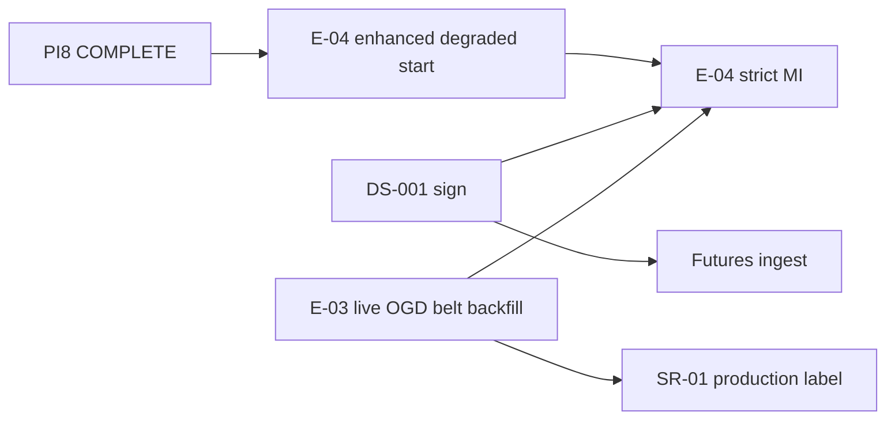

# PI8 Program Status — Data Validation and Publication

| Field | Value |
|-------|-------|
| **Increment** | PI8 — observation validation, anomaly analysis, weather activation, quality improvement, market coverage, signal recheck (Tracks A–G) |
| **Date** | 2026-06-04 |
| **Baseline** | `058230e` — PI7 data coverage expansion |
| **HEAD migration chain** | `0001` → `0011_observation_validation_rejected` |
| **Working tree @ merge** | PI8 Tracks A–F + Track G synthesis staged for commit |
| **Synthesized by** | KDO PI8 Track G (final merge gate) |

---

## 1. Track Summary

| Track | Scope | Deliverable | @ disk | Status |
|-------|-------|-------------|--------|--------|
| **A** | Observation validation pipeline | `ObservationValidationService`, migration `0011`, [OBSERVATION_VALIDATION_REPORT.md](../reviews/OBSERVATION_VALIDATION_REPORT.md) | **Yes** | **COMPLETE** |
| **B** | Anomaly reduction analysis | [ANOMALY_ANALYSIS_REPORT.md](../reviews/ANOMALY_ANALYSIS_REPORT.md) | **Yes** | **COMPLETE** |
| **C** | Weather persistence activation @ 5433 | [WEATHER_ACTIVATION_REPORT.md](../reviews/WEATHER_ACTIVATION_REPORT.md) | **Yes** | **COMPLETE** |
| **D** | Quality score improvement + snapshot refresh | [QUALITY_IMPROVEMENT_REPORT.md](../reviews/QUALITY_IMPROVEMENT_REPORT.md) | **Yes** | **COMPLETE** |
| **E** | Belt market coverage (fixture replay) | [MARKET_COVERAGE_IMPROVEMENT.md](../reviews/MARKET_COVERAGE_IMPROVEMENT.md) | **Yes** | **COMPLETE** |
| **F** | Signal readiness recheck (E-04) | [SIGNAL_READINESS_RECHECK.md](../research/SIGNAL_READINESS_RECHECK.md) | **Yes** | **COMPLETE** |
| **G** | Program dashboard + executive summary | PI8_PROGRAM_STATUS.md (this file) | **Yes** | **COMPLETE** |
| **Final** | Executive summary | [PI8_EXECUTIVE_SUMMARY.md](../reviews/PI8_EXECUTIVE_SUMMARY.md) | **Yes** | **COMPLETE** |

**Legend:** **COMPLETE** = charter deliverable on disk @ merge.

**PI8 stop rule (honored):** No signal engine, forecast engine, decision runtime, or LLM agent implementation.

---

## 2. Data Foundation Metrics (@ 5433 post–PI8)

| Metric | Value | Evidence |
|--------|-------|----------|
| **Observation rows validated (Agmarknet cotton)** | **61,544** | 60,445 price + 1,099 arrival ([OBSERVATION_VALIDATION_REPORT](../reviews/OBSERVATION_VALIDATION_REPORT.md)) |
| **Markets seeded (belt)** | **27** | [MARKET_COVERAGE_REPORT.md](../reviews/MARKET_COVERAGE_REPORT.md) |
| **Markets with ≥1 price row** | **18 / 27** | [MARKET_COVERAGE_IMPROVEMENT.md](../reviews/MARKET_COVERAGE_IMPROVEMENT.md) |
| **TG primary basket reporting** | **4 / 4** | Karimnagar, Kesamudram populated (Track E) |
| **Coverage ratio (belt, latest date)** | **0.6667** | 18/27 on `as_of_date` 2026-06-03 |
| **Completeness ratio (36-mo window)** | **1.0000** | 1,099 / 1,099 days with belt-union price data |
| **`overall_quality_score` (Agmarknet refresh)** | **0.8515** | Post Track A validation; anomaly penalty **0.00** |
| **`overall_quality_score` (blended snapshot)** | **0.7088** | Agmarknet + weather merge ([QUALITY_IMPROVEMENT_REPORT](../reviews/QUALITY_IMPROVEMENT_REPORT.md)) |
| **Weather rows (NASA POWER)** | **5,620** | 5 TG belt regions; [WEATHER_ACTIVATION_REPORT.md](../reviews/WEATHER_ACTIVATION_REPORT.md) |
| **Live OGD backfill** | **BLOCKED** | `OGD_API_KEY` not registered |

**Quality trend:** PI7 belt fixture **0.3161** → PI8 pre-validation **~0.5520** → PI8 post-validation Agmarknet **0.8515** → blended **0.7088** (weather tier anomaly penalty active).

---

## 3. Health

| Area | Status | Notes |
|------|--------|-------|
| **E-00 platform** | Green | M0 complete |
| **E-01 data foundation** | Green | Head `0011_observation_validation_rejected` |
| **E-02 registry** | Green | Cotton v1.0.0 + **27** belt mandis (5 states) |
| **PI8 ingest (A–E)** | Green | Validation pipeline; belt fixture replay; weather activated |
| **E-03 ops** | Yellow | Live OGD blocked; 9/27 mandis fixture-empty; weather rows still `received` |
| **E-04 signal runtime** | Yellow | **START (enhanced degraded)**; production MI **NOT READY** |
| **Git / CI** | Green | Gates @ merge (see §7) |
| **Governance** | Yellow | DS-001 unsigned |

---

## 4. Blockers (post-PI8)

| Blocker | Blocks | Does not block |
|---------|--------|----------------|
| **Live OGD belt backfill (SR-01 / OC7-01)** | Production corpus label; 9 empty mandis | Fixture CI, enhanced degraded E-04 |
| **DS-001 unsigned (SR-02)** | Strict MI, Futures agent | E-04 Market/Weather transforms |
| **E-04–E-07 runtime not built** | Forecasting, DVA compute | Schema + ingest + research |
| **Weather validation (5,620 `received`)** | Blended DQS ceiling (~0.57 weather raw) | Tier-2 Weather agent (degraded) |
| **IMD PRIMARY (WS-01)** | Production weather tier-1 | NASA tier-2 (proven @ 5433) |

**Resolved @ PI8:** OC7-06 validation lifecycle (61,544 rows promoted); belt fixture coverage 2→18 mandis; weather tier activated on integration DB; DQS **> 0.70** on Agmarknet snapshot; TG primary 4/4 basket.

---

## 5. Dependencies

| Upstream | Downstream | Status |
|----------|------------|--------|
| Track E (18/27 coverage) | Track A validation scope | **Done** |
| Track A validation | Track D DQS refresh | **Done** |
| Track C weather activation | Track D blended snapshot | **Done** |
| Track B anomaly analysis | Track A validation design | **Done** |
| Track F signal recheck | Track G synthesis | **Done** |
| SR-01 live OGD | Production label, 9 mandis | **Open** |
| DS-001 | E-04 strict MI | **Open** |

---

## 6. Critical Path

| Priority | Item | Owner |
|----------|------|-------|
| **P0** | **START E-04** — Market price + Weather tier-2 transforms, AC harness ([SIGNAL_READINESS_RECHECK.md](../research/SIGNAL_READINESS_RECHECK.md)) | E-04 |
| **P1** | **CONTINUE E-03** — register `OGD_API_KEY`; live belt backfill; 9 mandi tail | E-03 ops |
| **P2** | Weather row validation (5,620 `received` → `validated`) | E-03 |
| **P3** | Founder **DS-001** + futures ingest | Governance |
| **P4** | Arrival breadth across TG basket | E-03 / fixtures |
| **P5** | MSP seed + PIB/CCI design | E-02 / E-03 |

**Do not start @ PI8:** signal/forecast/decision/LLM **runtime** beyond degraded agent wiring spec (honored).

---

## 7. Quality Gates @ merge

| Gate | Result |
|------|--------|
| `pytest` (no `DATABASE_URL`, `-m "not integration"`) | **137 passed**, 2 skipped, 0 failed |
| `pytest` + `DATABASE_URL` @ 5433 (full suite) | **196 passed**, 1 skipped, 0 failed |
| `ruff check` | **Pass** |
| `mypy` (`backend/app`) | **Pass** (106 files) |
| `alembic upgrade head` @ 5433 | **Pass** — head `0011_observation_validation_rejected` |
| Observation validation (61,544 rows) | **Pass** — 0 rejected |
| Blended DQS **> 0.70** | **Pass** — **0.7088** |

---

## 8. PI8 Deliverable Checklist

| # | Deliverable | Status |
|---|-------------|--------|
| 1 | OBSERVATION_VALIDATION_REPORT (61,544 validated, 0.8515) | **COMPLETE** |
| 2 | ANOMALY_ANALYSIS_REPORT | **COMPLETE** |
| 3 | WEATHER_ACTIVATION_REPORT (5,620 rows) | **COMPLETE** |
| 4 | QUALITY_IMPROVEMENT_REPORT (0.7088 blended) | **COMPLETE** |
| 5 | MARKET_COVERAGE_IMPROVEMENT (18/27) | **COMPLETE** |
| 6 | SIGNAL_READINESS_RECHECK (E-04 enhanced degraded viable) | **COMPLETE** |
| 7 | Migration `0011_observation_validation_rejected` | **COMPLETE** |
| 8 | PI8_PROGRAM_STATUS.md | **COMPLETE** |
| 9 | PI8_EXECUTIVE_SUMMARY.md | **COMPLETE** |

**Recommendation:** **START E-04 (enhanced degraded)** — **CONTINUE E-03 (live OGD)** — **BLOCKED** strict MI / production signals until DS-001 + SR-01

---

## 9. References

| Doc | Role |
|-----|------|
| [PI7_EXECUTIVE_SUMMARY.md](../reviews/PI7_EXECUTIVE_SUMMARY.md) | Prior increment |
| [PI7_PROGRAM_STATUS.md](./PI7_PROGRAM_STATUS.md) | PI7 dashboard |
| [SIGNAL_ENGINE_V1.md](../research/SIGNAL_ENGINE_V1.md) | E-04 spec (not implemented) |

---

*End of PI8 program status.*
