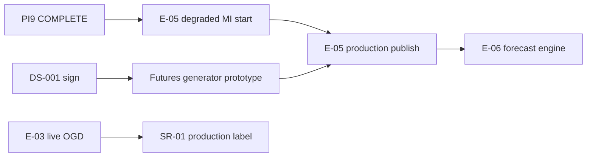

# PI9 Program Status — Signal Generation Foundation

| Field | Value |
|-------|-------|
| **Increment** | PI9 — Market/Weather signal runtime, snapshot persistence, replay, quality, E-03 parallel, forecast readiness (Tracks A–H) |
| **Date** | 2026-06-04 |
| **Baseline** | `e9fa355` — PI8 data validation and publication |
| **HEAD migration chain** | `0001` → `0012_signal_pi9_contract` |
| **Working tree @ merge** | PI9 Tracks A–G + Track H synthesis staged for commit |
| **Synthesized by** | KDO PI9 Track H (final merge gate) |

---

## 1. Track Summary

| Track | Scope | Deliverable | @ disk | Status |
|-------|-------|-------------|--------|--------|
| **Audit** | Repo baseline @ `e9fa355` | [PI9_REPO_AUDIT.md](../reviews/PI9_REPO_AUDIT.md) | **Yes** | **COMPLETE** |
| **A** | E-04-S01 Market Signal Runtime | `MarketSignalGenerator`, [E04_S01_COMPLETION_REPORT.md](../reviews/E04_S01_COMPLETION_REPORT.md) | **Yes** | **COMPLETE** |
| **B** | E-04-S02 Weather Signal Runtime | `WeatherSignalGenerator`, [E04_S02_COMPLETION_REPORT.md](../reviews/E04_S02_COMPLETION_REPORT.md) | **Yes** | **COMPLETE** |
| **C** | SignalSnapshot persistence @ `0012` | [SIGNAL_PERSISTENCE_REPORT.md](../reviews/SIGNAL_PERSISTENCE_REPORT.md) | **Yes** | **COMPLETE** |
| **D** | Signal replay harness | [SIGNAL_REPLAY_REPORT.md](../reviews/SIGNAL_REPLAY_REPORT.md) | **Yes** | **COMPLETE** |
| **E** | `SignalQualityService` | [SIGNAL_QUALITY_REPORT.md](../reviews/SIGNAL_QUALITY_REPORT.md) | **Yes** | **COMPLETE** |
| **F** | E-03 parallel (non-blocking) | [E03_PARALLEL_STATUS.md](../reviews/E03_PARALLEL_STATUS.md) | **Yes** | **COMPLETE** |
| **G** | Forecast readiness (research) | [FORECAST_READINESS_ASSESSMENT.md](../research/FORECAST_READINESS_ASSESSMENT.md) | **Yes** | **COMPLETE** (E-05 **PARTIAL**) |
| **H** | Program dashboard + executive summary | PI9_PROGRAM_STATUS.md (this file) | **Yes** | **COMPLETE** |

**Research (parallel):** [FUTURES_SIGNAL_PROTOTYPE.md](../research/FUTURES_SIGNAL_PROTOTYPE.md) — DS-001 downgrade **YES** (production blocker only).

**PI9 stop rule (honored):** No forecast engine, decision engine, recommendation engine, or LLM agent implementation.

---

## 2. Signal Runtime Metrics (@ 5433 post–PI9)

| Metric | Value | Evidence |
|--------|-------|----------|
| **Migration head** | `0012_signal_pi9_contract` | Alembic @ 5433 |
| **Agmarknet validated rows** | **61,544** | 60,445 price + 1,099 arrival (PI8 corpus restored @ 5433) |
| **Weather rows (NASA POWER)** | **5,620+** | 5 TG belt regions |
| **Structured signal agents (enhanced degraded)** | **2** | Market + Weather |
| **Market feature signals** | **4** | price_momentum, arrival_momentum, price_vs_msp_distance, price_acceleration |
| **Weather feature signals** | **4** | rainfall_deviation, rainfall_shock, temperature_stress, harvest_risk_indicator |
| **Replay cycles / track** | **5** | Tracks A, B, C — **PASS** |
| **Signal coverage ratio** | **0.5000** | 2 / 4 registry agents (Market + Weather) |
| **Required coverage ratio** | **0.5000** | Market present; Futures missing (DS-001) |
| **Mean agent confidence** | **0.6150** | Market **0.68**, Weather **0.55** |
| **Signal freshness** | **`fresh`** | 2.0 h lag @ assessment clock |
| **Combined snapshot hash (fixture)** | `b6d4aece6ec48f4d9b0ec60410677e54474911ba999bb32d95a48c275078f66b` | [SIGNAL_REPLAY_REPORT](../reviews/SIGNAL_REPLAY_REPORT.md) §4 |

---

## 3. Health

| Area | Status | Notes |
|------|--------|-------|
| **E-01 data foundation** | Green | Head `0012_signal_pi9_contract`; append-only signal repos |
| **E-04 signal runtime (degraded)** | Green | Market + Weather generators, replay PASS |
| **E-04 strict MI** | Red | Futures agent absent; DS-001 unsigned |
| **E-03 ops** | Yellow | Live OGD blocked; 9/27 fixture-empty mandis; weather rows largely `received` |
| **E-05 MI framework** | Yellow | **START allowed (degraded)**; production publish **NOT READY** |
| **Git / CI** | Green | Gates @ merge (see §7) |
| **Governance** | Yellow | DS-001 founder sign-off OPEN |

---

## 4. Blockers (post-PI9)

| Blocker | Blocks | Does not block |
|---------|--------|----------------|
| **DS-001 unsigned (SR-02)** | Strict MI, production Futures ingest, E-06 strict handoff | E-05 degraded MI engineering |
| **Futures agent not built** | `required_coverage_ratio` = 1.0, TDS-009 §9 publish | Enhanced degraded signals (Market + Weather) |
| **Live OGD (SR-01)** | Production corpus label | Fixture CI, degraded E-04/E-05 |
| **Weather validation gap** | Blended DQS ceiling | Weather tier-2 generator (degraded) |
| **LangGraph orchestration** | Full E-04 AC-06 graph | Deterministic per-agent generators |

**Resolved @ PI9:** Signal generators built; `0012` snapshot contract; replay determinism proven; `SignalQualityService` operational; DS-001 downgraded to production-only blocker per [FUTURES_SIGNAL_PROTOTYPE.md](../research/FUTURES_SIGNAL_PROTOTYPE.md).

---

## 5. Dependencies

| Upstream | Downstream | Status |
|----------|------------|--------|
| PI8 validated observations | Tracks A, B | **Done** |
| Track C persistence @ `0012` | Tracks A, B, D | **Done** |
| Tracks A + B | Track D replay | **Done** |
| Tracks A + B + C | Track E quality | **Done** |
| Tracks A–E | Track G forecast readiness | **Done** |
| Track F E-03 parallel | Weather validation promotion | **Open** (optional batch path wired) |
| DS-001 + Futures generator | Strict MI / E-06 | **Open** |

---

## 6. Critical Path

| Priority | Item | Owner |
|----------|------|-------|
| **P0** | **START E-05** — degraded MI aggregation (B/R/N stubs, partial snapshot materialization) | E-05 |
| **P1** | **CONTINUE E-04** — Futures prototype generator (NCDEX bhav path); Policy stub research | E-04 |
| **P2** | **CONTINUE E-03** — register `OGD_API_KEY`; weather validation batch; 9 mandi tail | E-03 ops |
| **P3** | Founder **DS-001** sign-off | Governance |
| **P4** | LangGraph orchestration graph (AC-06) | E-04 (post-degraded) |

**Do not start @ PI9 merge:** E-06 forecast engine, decision runtime, LLM agents (honored).

---

## 7. Quality Gates @ merge

| Gate | Result |
|------|--------|
| `pytest` (no `DATABASE_URL`) | **180 passed**, 59 skipped, 0 failed |
| `pytest` + `DATABASE_URL` @ 5433 | **238 passed**, 1 skipped, 0 failed |
| `pytest tests/replay/test_signal_replay.py` (+ `@5433`) | **5 passed** (fixture + DB integration) |
| `ruff check` | **Pass** |
| `mypy` | **Pass** (161 source files) |
| `alembic upgrade head` @ 5433 | **Pass** — head `0012_signal_pi9_contract` |
| Signal generation deterministic | **Pass** — 5-cycle replay Tracks A/B/C |
| Replay validation | **Pass** — same inputs = same outputs |

---

## 8. PI9 Deliverable Checklist

| # | Deliverable | Status |
|---|-------------|--------|
| 1 | PI9_REPO_AUDIT.md | **COMPLETE** |
| 2 | E04_S01 + `MarketSignalGenerator` | **COMPLETE** |
| 3 | E04_S02 + `WeatherSignalGenerator` | **COMPLETE** |
| 4 | Migration `0012` + SIGNAL_PERSISTENCE_REPORT | **COMPLETE** |
| 5 | Replay harness + SIGNAL_REPLAY_REPORT | **COMPLETE** |
| 6 | SignalQualityService + SIGNAL_QUALITY_REPORT | **COMPLETE** |
| 7 | E03_PARALLEL_STATUS | **COMPLETE** |
| 8 | FORECAST_READINESS_ASSESSMENT (E-05 PARTIAL) | **COMPLETE** |
| 9 | FUTURES_SIGNAL_PROTOTYPE (DS-001 downgrade YES) | **COMPLETE** |
| 10 | PI9_PROGRAM_STATUS.md | **COMPLETE** |
| 11 | PI9_EXECUTIVE_SUMMARY.md | **COMPLETE** |

**Recommendation:** **START E-05 (enhanced degraded)** — **CONTINUE E-04 (Futures prototype + Policy research)** — **BLOCKED** strict MI / production MI publish / E-06 until DS-001 + Futures agent

---

## 9. References

| Doc | Role |
|-----|------|
| [PI8_EXECUTIVE_SUMMARY.md](../reviews/PI8_EXECUTIVE_SUMMARY.md) | Prior increment |
| [PI8_PROGRAM_STATUS.md](./PI8_PROGRAM_STATUS.md) | PI8 dashboard |
| [SIGNAL_ENGINE_V1.md](../research/SIGNAL_ENGINE_V1.md) | E-04/E-05 spec |
| [FORECAST_READINESS_ASSESSMENT.md](../research/FORECAST_READINESS_ASSESSMENT.md) | E-05 gate |

---

*End of PI9 program status.*
