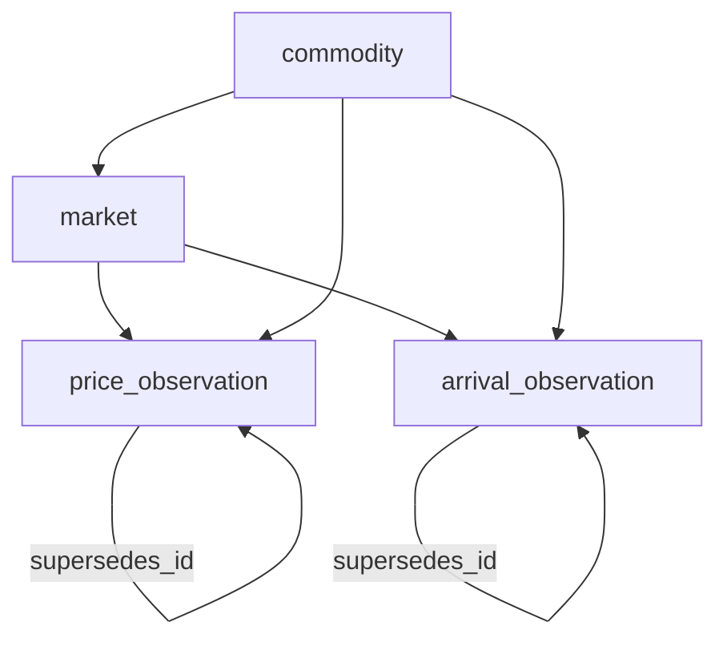

# S04 Readiness Review — Observation Time-Series (E-01-S04)

**Workstream:** Track C — documentation only (no S04 code)  
**Date:** 2026-06-04  
**Epic:** E-01 Data Foundation  
**Prerequisite head:** `0004_data_quality_snapshot` (Phase 2 complete)

**Authoritative sources:** [E-01-Data-Foundation.md](../stories/E-01-Data-Foundation.md) S04, [E01_EXECUTION_PLAN.md](./E01_EXECUTION_PLAN.md), [TDS-006](../tds/TDS-006-Data-Model.md) §3.6–3.7, §4, §9, [ADR-002](../adrs/ADR-002-schema-migrations-alembic.md)

---

## 1. Executive Summary

E-01-S04 creates partitioned append-only `price_observation` and `arrival_observation` tables (migration `0005_observations_partitioned`). Prerequisites S03, S10, and S08 are satisfied at head `0004`. S04 does not FK to `registry_id`; it can proceed in parallel with S05–S07 planning once migration PRs are serialized.

---

## 2. Partition Strategy

| Table | Partition key | Granularity | Initial children |
|-------|---------------|-------------|------------------|
| `price_observation` | `as_of_date` | RANGE monthly | Current month + **DEFAULT** |
| `arrival_observation` | `as_of_date` | RANGE monthly | Current month + **DEFAULT** |

**Ops playbook (ADR-002):** Each new calendar month requires a forward migration or scripted `ATTACH PARTITION` — not automated in E-01. DEFAULT partition prevents insert failures before ops adds the next month child.

**Pruning alignment:** 7-year hot retention per TDS-006 §3.6; automated archive/prune is future ops.

---

## 3. Volume Estimates (Phase 1 cotton)

| Assumption | Estimate | Notes |
|------------|----------|-------|
| Active mandis (cotton) | ~50–150 markets | E-02 seed scope |
| Price rows / market / day | 1–3 price types | TDS-006 `price_type` |
| Daily price inserts | ~150–450 rows | Low tens of MB/month Phase 1 |
| Arrival rows / market / day | ~1 | Lower cardinality than prices |
| 7-year hot row count (order of magnitude) | <5M price rows | Monthly partitions keep scans bounded |

Monthly RANGE is sufficient per DM2-004 (E01 execution plan R-B-03 mitigation).

---

## 4. Migration Impacts

| Rev | Action | Depends on |
|-----|--------|------------|
| `0005_observations_partitioned` | CREATE partitioned `price_observation`, `arrival_observation` | `0002` (market FK), `0004` head |

| Object | Detail |
|--------|--------|
| `validation_status` enum | `received`, `validated`, `published`, `superseded` |
| `supersedes_id` | Nullable self-FK on both tables |
| Money fields | `Numeric` not float (E-01-S01 technical notes) |
| Reversibility | Required per E-01-S03 AC-5 / ADR-002 §3 |

**No impact on:** `commodity_registry`, `data_quality_snapshot` (already at head).

---

## 5. FK Dependencies

| FK | On delete | Required for insert |
|----|-----------|---------------------|
| `market_id` → `market` | RESTRICT | Yes |
| `commodity_id` → `commodity` | CASCADE | Yes |
| `supersedes_id` → self | SET NULL | No |

**Not required:** `registry_id` (observations are market-scoped facts).

---

## 6. Index Strategy

| Table | Index | Purpose |
|-------|-------|---------|
| `price_observation` | PK `observation_id` | Row identity |
| `price_observation` | `(commodity_id, as_of_date DESC)` | Backtest range scans + partition prune |
| `price_observation` | `(market_id, observed_at DESC)` | Latest by market |
| `price_observation` | `(source, as_of_date)` | Ingest reconciliation |
| `arrival_observation` | PK `observation_id` | Row identity |
| `arrival_observation` | `(commodity_id, as_of_date DESC)` | Range queries |
| `arrival_observation` | `(market_id, observed_at DESC)` | Latest by market |

Indexes created on parent propagate to partition children (PostgreSQL 15).

---

## 7. Repository Pattern

Append-only per [REPOSITORY_PATTERN.md](../../backend/app/persistence/REPOSITORY_PATTERN.md): `insert` only; corrections via new row + `supersedes_id`. No in-place UPDATE of published observation values.

---

## 8. Test Checklist (for S04 implementation)

| Test | Requirement |
|------|-------------|
| `test_price_observation_append_only` | Two rows same market, different `as_of_date` |
| `test_partition_pruning_explain` | Optional EXPLAIN shows partition constraint |
| FK enforcement | Invalid `market_id` rejected |
| `validation_status` enum | Invalid value rejected |

---

## 9. Risks

| ID | Risk | Severity | Mitigation |
|----|------|----------|------------|
| R-S04-01 | Partition child drift (new months) | Medium | Ops runbook in S04 DoD |
| R-S04-02 | Concurrent Alembic PRs | Medium | Serialize migrations; single head |
| R-S04-03 | High ingest before partition ops | Low | DEFAULT partition |

---

## 10. Go / No-Go Checklist

| # | Item | Status |
|---|------|--------|
| 1 | S03 reference entities at head | **Green** — `0002` |
| 2 | S10 registry at head | **Green** — `0003` |
| 3 | S08 quality snapshot at head | **Green** — `0004` |
| 4 | Append-only repository pattern documented | **Green** — S02 |
| 5 | Partition ops playbook drafted | **Green** — this doc |
| 6 | E-03 event emission | **Out of scope** — prep only |
| 7 | Cotton seed markets | **Blocked on E-02** — use `cotton_test` fixture |

**Recommendation:** **Proceed with S04 implementation** after founder Phase 2 sign-off; no schema blockers remain.

---

*End of S04 readiness review — documentation only.*
