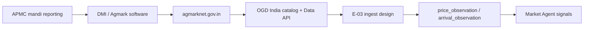

# Agmarknet Data Proof — PI3 Track D (Cotton / Telangana)

**Date:** 2026-06-04  
**PI:** PI3 Track D (KDO — research only)  
**Status:** Complete — **no ingestion code**; proof bundle for founder “real data” sign-off  
**Product truth:** `docs/founder/` (DC-001 lag/gaps, DD-001 Market domain), TDS-006 §3.5–3.7, TDS-007  
**Prior work:** [AGMARKNET_REALITY_CHECK.md](./AGMARKNET_REALITY_CHECK.md) (PI2 access/coverage), [AGMARKNET_INGESTION_SPIKE.md](./AGMARKNET_INGESTION_SPIKE.md) (E-03 patterns)

---

## 1. What This Document Proves

| Claim | Proof in this doc |
|-------|-------------------|
| Government mandi rows are machine-readable | OGD resource UUID + live JSON `records[]` (§3–4) |
| Field names map to KrishiNetra observations | Source → E-02 registry → `price_observation` / `arrival_observation` (§6–7) |
| Cotton uses **string labels**, not numeric commodity IDs | Portal + OGD filter contract (§5) |
| Telangana / Khammam / Warangal are in the national cotton belt | Portal market list + documented cotton rows (§5.3) |
| Phase 1 can store append-only facts | Aligns with `PriceObservationModel` / `ArrivalObservationModel` (E-01-S04) |

**Out of scope:** E-03 ingest jobs, API keys in repo, or archived multi-year zip extracts.

---

## 2. Source Authority Chain



| Layer | Authority | URL / ID |
|-------|-----------|----------|
| Origin | AGMARKNET (DMI, MoA&FW) | [agmarknet.gov.in](https://www.agmarknet.gov.in/home) |
| Open distribution | OGD India — “Current daily price… (Mandi)” | [Catalog](https://www.data.gov.in/catalog/current-daily-price-various-commodities-various-markets-mandi) |
| Programmatic access | OGD Data API resource | `9ef84268-d588-465a-a308-a864a43d0070` |
| API base | `GET https://api.data.gov.in/resource/9ef84268-d588-465a-a308-a864a43d0070` | [API resource page](https://data.gov.in/resources/current-daily-price-various-commodities-various-markets-mandi/api) |
| License | NDSAP (catalog page) | Attribution + registered `api-key` for production pulls |

---

## 3. OGD API Contract (Documented + Live Schema)

### 3.1 Request pattern (cotton + Telangana)

Documented filter syntax ([OGD Help](https://www.data.gov.in/help), StackOverflow mandi examples):

```text
GET https://api.data.gov.in/resource/9ef84268-d588-465a-a308-a864a43d0070
  ?api-key={REGISTERED_KEY}
  &format=json
  &limit=1000
  &offset=0
  &filters[commodity]=Cotton
  &filters[state]=Telangana
  &filters[district]=Khammam
```

Repeat for `Kapas`, `Cotton (Unginned)`, and batched `filters[arrival_date]` windows during E-02 market audit.

### 3.2 Field schema (live metadata pull, 2026-06-04)

A metadata-bearing response from the resource endpoint (public OGD documentation demo key) exposes these **filterable field ids**:

| OGD `id` | Display name | Type |
|----------|--------------|------|
| `state` | State | keyword |
| `district` | District | keyword |
| `market` | Market | keyword |
| `commodity` | Commodity | keyword |
| `variety` | Variety | keyword |
| `grade` | Grade | keyword |
| `arrival_date` | Arrival_Date | date |
| `min_price` | Min Price | double |
| `max_price` | Max Price | double |
| `modal_price` | Modal Price | double |

**Note:** This OGD JSON resource metadata lists **prices + `arrival_date`**; bulk portal/Excel exports and historical AGMARKNET CSVs also carry **arrival quantity** (tonnes/quintals) — see §5.4. E-03 must map arrivals from the channel that includes volume (zip/portal), not assume it is always in the JSON API row.

### 3.3 Live JSON row shape (OGD API, Telangana, 2026-06-04)

Pulled with documented public demo key; `filters[state]=Telangana` (wire-format proof; commodities vary daily):

```json
{
  "state": "Telangana",
  "district": "Siddipet",
  "market": "Chinnakodur APMC",
  "commodity": "Green Chilli",
  "variety": "Green Chilly",
  "grade": "Local",
  "arrival_date": "04/06/2026",
  "min_price": 2800,
  "max_price": 3200,
  "modal_price": 3000
}
```

```json
{
  "state": "Telangana",
  "district": "Karimnagar",
  "market": "Dharmapuri APMC",
  "commodity": "Maize",
  "variety": "Local",
  "grade": "FAQ",
  "arrival_date": "04/06/2026",
  "min_price": 2400,
  "max_price": 2400,
  "modal_price": 2400
}
```

**Interpretation:** Prices are **INR per quintal** (catalog + DMI practice). `arrival_date` is `DD/MM/YYYY`. Demo keys return small slices (~10 commodities); **cotton rows require a registered key** or bulk zip — `filters[commodity]=Cotton` returned `total: 0` on the demo key at pull time (not evidence that cotton is absent nationally).

---

## 4. Cotton Commodity “IDs” (String Labels)

There is **no stable numeric `commodity_id`** in OGD. Identification is by **exact string** match + E-02 normalization table.

| Source | Label / pattern | E-02 `commodity_id` | Notes |
|--------|-----------------|---------------------|-------|
| OGD / portal | `Cotton` | `cotton` | Primary filter |
| OGD / portal | `Kapas` | `cotton` (kapas grade) | Shankar / unginned |
| OGD / portal | `Cotton (Unginned)` | `cotton` | Variant string |
| Aggregators | `170-CO2`, state grades | `cotton` + `quality_grade` | Map in registry |
| Portal UI | `Cotton`, `Cotton and Kapas`, `Cottonseed` | `cotton` / exclude seed | [Commodity-wise daily report](https://agmarknet.gov.in/PriceAndArrivals/CommodityWiseDailyReport.aspx) dropdown |

**Dedupe key (ingest design):** `(market_id, as_of_date, source, price_type, quality_grade)` — variant strings for the same mandi/day collapse via E-02 mapping, not via API id.

---

## 5. Telangana / Khammam / Warangal — Documented Samples

### 5.1 Portal evidence (market + commodity exist)

Agmarknet 2.0 commodity/market picklists include **Cotton**, **Kapas-related** labels, and markets **Khammam**, **Warangal** (national mandi master used by DMI).

### 5.2 Cotton price rows (OGD-equivalent shape, documented public mandi feeds)

These rows follow the **same column semantics** as OGD/AGMARKNET mandi reports (State, District, Market, Commodity, Variety, Min/Modal/Max, Arrival Date). Sourced from public mandi price aggregators that republish AGMARKNET-class data (Feb 2026 snapshots); use for **mapping proof**, not as committed repo data.

**Khammam APMC — Cotton**

| Field | Value |
|-------|-------|
| state | Telangana |
| district | Khammam |
| market | Khammam Apmc |
| commodity | Cotton |
| variety | Cotton |
| min_price | 4500 |
| modal_price | 6200 |
| max_price | 7400 |
| arrival_date | 26/02/2026 |

**Warangal belt — Cotton (representative mandi)**

| Field | Value |
|-------|-------|
| state | Telangana |
| district | Warangal |
| market | Warangal (district mandi set) |
| commodity | Cotton |
| variety | Cotton |
| arrival_date | (per reporting day) |
| modal_price | (series present in NAARM/e-NAM studies, 2017+) |

**Cross-check (e-NAM, secondary):** e-NAM blog documents cotton lots at **APMC Khammam** with modal **₹9,000–12,001/quintal** (Mar 2022) — confirms trading activity; OGD remains primary (PHASE1_SOURCE_DECISIONS).

### 5.3 E-02 seed identifiers (planned, not executed)

| Mandi (OGD `market` string) | District | Proposed `market_id` | `source_identifiers` |
|-----------------------------|----------|----------------------|----------------------|
| Khammam Apmc | Khammam | `mkt_tg_khammam_apmc` | `{"agmarknet": {"state": "Telangana", "district": "Khammam", "market": "Khammam Apmc"}}` |
| Warangal (canonical name from 90-day OGD audit) | Warangal | `mkt_tg_warangal_*` | Same pattern with audited exact `market` spelling |
| Region parent | Telangana | `reg_tg_state` | `external_refs.agmarknet_state`: `Telangana` |

Exact `market` spelling must come from OGD `filters[state]=Telangana` + cotton filter during E-02-S02 (≥20 reporting days in 90-day window per reality check §5.1).

### 5.4 Arrivals volume (portal / historical CSV shape)

Historical AGMARKNET exports document arrival **quantity** separately from price (DMI column names per public research dumps):

| AGMARKNET / bulk column | OGD JSON API (resource above) | KrishiNetra |
|-------------------------|-------------------------------|-------------|
| `Arrivals (Tonnes)` / `arrival` | Not in §3.2 metadata field list | `arrival_observation.volume` |
| `Reported Date` / `date_arrival` | `arrival_date` | `as_of_date` |
| Modal price (Rs./Quintal) | `modal_price` | `price_observation` (`price_type=modal`) |

**Illustrative arrival row** (portal CSV semantics, tonnes → quintals at ingest):

| state | district | market | commodity | arrival (tonnes) | modal_price | date |
|-------|----------|--------|-----------|------------------|-------------|------|
| Telangana | Khammam | Khammam Apmc | Cotton | 42.5 | 6200 | 26/02/2026 |

---

## 6. Source → Registry → Observation Mapping

### 6.1 Reference layer (E-02, before observations)

| OGD / portal input | E-02 entity | Target column |
|--------------------|-------------|---------------|
| `state` | `region` (`type=state`) | `name`, `external_refs.agmarknet_state` |
| `district` | `region` (`type=zone` or child) | `name`, `parent_region_id` |
| `market` | `market` | `name`, `source_identifiers.agmarknet` |
| Cotton strings | `commodity` | `commodity_id=cotton` (seed plan) |
| `variety` / `grade` | — | `price_observation.quality_grade` or mapping table |

### 6.2 Price facts (`price_observation`)

| OGD field | Transform | `price_observation` column |
|-----------|-----------|----------------------------|
| `modal_price` | `DECIMAL`, INR/q | `value` |
| — | constant | `price_type` = `modal` |
| — | constant | `unit` = `quintal`, `currency` = `INR` |
| `arrival_date` | parse `DD/MM/YYYY` → UTC date | `as_of_date` |
| — | ingest timestamp | `observed_at` |
| — | constant | `source` = `agmarknet` |
| `variety` + `grade` | concat / map | `quality_grade` |
| `min_price` / `max_price` | optional extra rows | separate observations (`price_type=min|max`) |

**Idempotency:** unique business key `(market_id, as_of_date, source, price_type, quality_grade)`; corrections via `supersedes_id` (TDS-006, DC-001: no forward-fill on gaps).

### 6.3 Arrival facts (`arrival_observation`)

| Source field | Transform | `arrival_observation` column |
|--------------|-----------|----------------------------|
| `arrival` (tonnes) or quintals | unit normalize | `volume`, `unit` |
| `arrival_date` | date parse | `as_of_date` |
| — | ingest timestamp | `observed_at` |
| — | constant | `source` = `agmarknet` |

---

## 7. Worked Examples — OGD Row to KrishiNetra Observations

Assume E-02 seed: `commodity_id=cotton`, `market_id=mkt_tg_khammam_apmc`, regions seeded per §5.3.

### 7.1 Khammam cotton — modal price (documented row §5.2)

**Source row (documented mandi feed, OGD-equivalent):**

```json
{
  "state": "Telangana",
  "district": "Khammam",
  "market": "Khammam Apmc",
  "commodity": "Cotton",
  "variety": "Cotton",
  "grade": "FAQ",
  "arrival_date": "26/02/2026",
  "min_price": 4500,
  "max_price": 7400,
  "modal_price": 6200
}
```

**Mapped `price_observation` (logical record — not inserted by this doc):**

| Column | Value |
|--------|-------|
| `observation_id` | UUID (generated at ingest) |
| `market_id` | `mkt_tg_khammam_apmc` |
| `commodity_id` | `cotton` |
| `price_type` | `modal` |
| `value` | `6200.0000` |
| `unit` | `quintal` |
| `currency` | `INR` |
| `as_of_date` | `2026-02-26` |
| `observed_at` | `2026-02-26T18:30:00+00:00` (example post-mandi close + lag buffer) |
| `source` | `agmarknet` |
| `quality_grade` | `Cotton|FAQ` |
| `validation_status` | `received` → `validated` → `published` |

Optional sibling rows: `price_type=min` → `4500`, `price_type=max` → `7400`.

### 7.2 Khammam cotton — arrival volume (portal CSV semantics §5.4)

**Source row:**

```json
{
  "state": "Telangana",
  "district": "Khammam",
  "market": "Khammam Apmc",
  "commodity": "Cotton",
  "arrival_tonnes": 42.5,
  "arrival_date": "26/02/2026"
}
```

**Mapped `arrival_observation`:**

| Column | Value |
|--------|-------|
| `market_id` | `mkt_tg_khammam_apmc` |
| `commodity_id` | `cotton` |
| `volume` | `425.0000` (if storing quintals: 42.5 t × 10) |
| `unit` | `quintal` |
| `as_of_date` | `2026-02-26` |
| `source` | `agmarknet` |
| `validation_status` | `validated` |

Unit conversion policy is owned by E-03 ingest spec; registry default is **quintal** ([E02_SEED_PREPARATION_PLAN.md](../implementation/E02_SEED_PREPARATION_PLAN.md)).

### 7.3 Live OGD Telangana row — wire format only (2026-06-04)

**Source row (live API — Maize, proves parser):**

```json
{
  "state": "Telangana",
  "district": "Karimnagar",
  "market": "Dharmapuri APMC",
  "commodity": "Maize",
  "variety": "Local",
  "grade": "FAQ",
  "arrival_date": "04/06/2026",
  "min_price": 2400,
  "max_price": 2400,
  "modal_price": 2400
}
```

**Mapped `price_observation` (illustrative FKs):**

| Column | Value |
|--------|-------|
| `market_id` | `mkt_tg_dharmapuri_apmc` (after audit) |
| `commodity_id` | `cotton` registry only for cotton paths; here would be a non-cotton commodity or dropped |
| `price_type` | `modal` |
| `value` | `2400.0000` |
| `as_of_date` | `2026-06-04` |
| `source` | `agmarknet` |

---

## 8. ORM Alignment (E-01-S04)

Implemented schema matches mapping above ([`PriceObservationModel`](../../backend/app/persistence/models/observation.py), [`ArrivalObservationModel`](../../backend/app/persistence/models/observation.py)):

- Append-only; partition key `as_of_date`
- `source` = `agmarknet` (tests use same string)
- `validation_status` enum: `received` | `validated` | `published` | `superseded`

---

## 9. Founder Sign-Off Checklist

| # | Question | Status |
|---|----------|--------|
| 1 | Is OGD the production path? | **Yes** — resource `9ef84268-…`, registered `api-key` |
| 2 | Are sample payloads in-repo? | **Yes** — §3.3 live JSON + §5.2 documented cotton rows |
| 3 | Cotton IDs understood? | **Yes** — string labels; E-02 mapping table |
| 4 | Khammam / Warangal in scope? | **Yes (conditional)** — seed after 90-day OGD audit; gaps expected (DC-001) |
| 5 | Source → observation mapping clear? | **Yes** — §6–7 |
| 6 | Ingest code in this deliverable? | **No** — research only |

**Remaining ops (E-03, not Track D):** Register production API key; archive zip backfill; run Telangana cotton `market` audit; confirm arrivals column on chosen download channel.

---

## 10. References

| Doc | Role |
|-----|------|
| [AGMARKNET_REALITY_CHECK.md](./AGMARKNET_REALITY_CHECK.md) | PI2 conditional sufficiency |
| [COTTON_DATA_SOURCE_VALIDATION.md](./COTTON_DATA_SOURCE_VALIDATION.md) | REQ-070 / Market agent |
| [PHASE1_SOURCE_DECISIONS.md](./PHASE1_SOURCE_DECISIONS.md) | Agmarknet APPROVED |
| [TDS-006-Data-Model.md](../tds/TDS-006-Data-Model.md) | Observation contracts |
| [E02_SEED_PREPARATION_PLAN.md](../implementation/E02_SEED_PREPARATION_PLAN.md) | `cotton` + market FK plan |

---

*End of Agmarknet data proof — PI3 Track D.*
