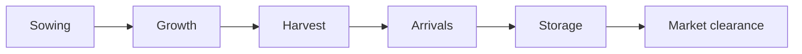

# Commodity Lifecycle Model — Phase 1

**Date:** 2026-06-04  
**Epic:** E-01 Phase 4 (research)  
**Status:** Conceptual model — informs agents and features, not schema  
**Primary commodity:** Cotton (detailed); placeholders for chilli, turmeric, maize, paddy

---

## 1. Purpose

Map agricultural **lifecycle phases** to observation windows, signal timing, and data sources so ingestion and agents respect seasonality (no future leakage per TDS-006 §5).

---

## 2. Lifecycle Phases (Generic)

| Phase | Typical signals | Observation types |
|-------|-----------------|-------------------|
| Sowing | Acreage, soil moisture | Weather, policy (MSP announce) |
| Growth | Rain anomaly, pest risk | Weather |
| Harvest | Pick rate, quality | Weather, arrivals ramp |
| Arrivals | Mandi volume spike | Agmarknet arrivals |
| Storage | Humidity loss, carry cost | Weather, price carry |
| Clearance | Export demand, futures curve | Global, Demand, Futures |

---

## 3. Cotton (Detailed — Phase 1 Reference)

| Phase | Months (India, indicative) | Key events | Data sources |
|-------|----------------------------|------------|--------------|
| **Sowing** | May–Jul | Kharif planting | State acreage stats, NASA POWER rain |
| **Growth** | Aug–Sep | Monsoon peak, boll fill | IMD rainfall, drought indices |
| **Harvest** | Oct–Feb (north→south) | Picking waves by state | Weather dry spells, mandi arrivals onset |
| **Arrivals** | Oct–Mar | Peak mandi inflow | Agmarknet arrivals, modal price |
| **Storage** | Nov–Jun | Ginning, warehouse | Humidity risk, basis vs futures |
| **Rain windows** | Aug–Sep (quality), Oct–Nov (pick disruption) | Unseasonal rain | IMD nowcast + anomaly features |

**Critical rain windows:**

- **Aug–Sep:** Excess rain → quality downgrade (micronaire, color).
- **Oct–Nov:** Rain during peak pick (Maharashtra, Gujarat) → arrival delays, price spikes.
- **Post-harvest:** Unseasonal showers → storage mold risk.

**Registry link:** Cotton `weather_variables[]` in CommodityRegistry (E-02) should list rainfall, humidity, acreage.

---

## 4. Placeholder Commodities (Phase 7+)

| Commodity | Sowing | Harvest | Arrival peak | Notes |
|-----------|--------|---------|--------------|-------|
| **Chilli** | Jun–Jul | Dec–Mar | Jan–Apr | Quality moisture-sensitive |
| **Turmeric** | May–Jun | Jan–Mar | Feb–May | Long storage; policy MSP rare |
| **Maize** | Jun–Jul (kharif) | Sep–Oct | Oct–Nov | Dual season in some states |
| **Paddy** | Jun–Jul | Oct–Nov | Nov–Jan | MSP-heavy; procurement overlap |

Schema unchanged — lifecycle informs **E-02 registry seed** and agent calendars per commodity.

---

## 5. Data Sources by Phase (Cotton)

| Phase | Primary | Secondary |
|-------|---------|-----------|
| Sowing/Growth | IMD, NASA POWER | USDA India production estimates |
| Harvest/Arrivals | Agmarknet | eNAM confirmatory |
| Storage/Price | Agmarknet, NCDEX KAPAS | CCI procurement announcements |
| Global context | USDA WASDE, ICAC | — |

---

## 6. Unknowns

| ID | Unknown | Impact |
|----|---------|--------|
| LC-01 | State-level harvest calendar granularity | Weather agent regional weights |
| LC-02 | Ginning lag between farm-gate and market | Arrival vs price lead-lag |
| LC-03 | CCI procurement timing vs market floor | Policy agent coupling |

---

## 7. Forecasting Dependency

Lifecycle modeling is **required before credible forecasting** — features must be phase-aware (e.g. arrival z-score only meaningful during arrival season). E-01 stores schema only; E-03/E-05 implement phase gates.

---

*End of commodity lifecycle model.*
