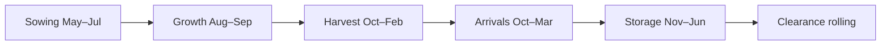

# Cotton Domain Model V1 — India (Research)

**Date:** 2026-06-04  
**PI:** PI3 Track E (KDO)  
**Status:** Research only — informs agents, registry, and features; no schema or implementation  
**Sources:** [COMMODITY_LIFECYCLE_MODEL.md](./COMMODITY_LIFECYCLE_MODEL.md), [PROCUREMENT_SIGNAL_MODEL.md](./PROCUREMENT_SIGNAL_MODEL.md), [WEATHER_SIGNAL_FRAMEWORK.md](./WEATHER_SIGNAL_FRAMEWORK.md)

---

## 1. Purpose

Consolidate Phase 1 cotton **domain knowledge** — lifecycle, harvest waves, mandi arrivals, government procurement, and weather effects — into a single reference. Signal implications are derived from domain behavior, not from implementation contracts.

This document informs E-02 registry seed, E-03 ingest calendars, and E-05 agent phase gates. It does **not** define schema, APIs, or agent code.

---

## 2. Cotton Lifecycle (India, Kharif)

Cotton follows a six-phase agricultural and market cycle. Phases overlap; calendar months are indicative.



| Phase | Months (indicative) | Domain events | Primary data |
|-------|---------------------|---------------|--------------|
| **Sowing** | May–Jul | Kharif planting; acreage decisions | State acreage stats, NASA POWER rain |
| **Growth** | Aug–Sep | Monsoon peak, boll fill | IMD rainfall, drought indices |
| **Harvest** | Oct–Feb (north→south) | Picking waves by state | Dry spells, mandi arrival onset |
| **Arrivals** | Oct–Mar | Peak mandi inflow | Agmarknet arrivals, modal price |
| **Storage** | Nov–Jun | Ginning, warehouse carry | Humidity risk, basis vs futures |
| **Clearance** | Rolling | Export demand, inventory drawdown | USDA WASDE, ICAC, futures curve |

**Forecasting dependency:** Features must be phase-aware — e.g. arrival z-scores are meaningful only during the arrival window. Observations at `as_of_date` T must use only data with `observed_at ≤ T` (no future leakage).

---

## 3. Harvest Waves

Indian cotton harvest is **not simultaneous** — it sweeps north to south over several months, creating staggered supply pressure and regional price divergence.

### 3.1 Regional calendar

| Region | Typical harvest window | Notes |
|--------|------------------------|-------|
| **North** (Punjab, Haryana) | Oct–Dec | Earlier pick; arrival peak shifts earlier |
| **Central** (Maharashtra, Gujarat) | Oct–Nov peak pick | Highest rain-disruption risk during peak pick |
| **South** (Telangana — Khammam, Warangal) | Oct–Jan | Phase 1 primary mandi coverage |
| **South** (broader) | Nov–Feb | Later waves extend harvest tail |

Harvest waves drive:

- **Staggered mandi arrivals** — volume spikes roll through regions rather than hitting all at once.
- **Regional price strength** — local supply timing affects modal price divergence across mandis.
- **Weather sensitivity shifts** — `harvest_window_score` weight varies by region and month (LC-01: state-level calendar granularity is an open unknown).

### 3.2 Picking dynamics

- **Favorable conditions:** Clear dry spells accelerate picking → more supply reaches market → near-term price pressure.
- **Disruption:** Rain during peak pick (especially Oct–Nov in MH/GJ) delays picking, reduces quality, and causes short-term price spikes as arrivals stall.
- **Quality at pick:** Rain at harvest degrades micronaire and color — a quality downgrade that affects ginning yield and market acceptance.

### 3.3 Farm-gate to mandi lag

Ginning lag between farm-gate pickup and mandi-reported arrival is an open unknown (LC-02). This affects the lead-lag between weather/harvest events and observable market signals.

---

## 4. Arrivals

Arrivals are the primary **market observation window** for cotton — mandi volume and modal price during Oct–Mar carry the highest signal-to-noise for supply-side price dynamics.

### 4.1 Arrival season characteristics

| Attribute | Domain behavior |
|-----------|-----------------|
| **Peak window** | Oct–Mar (overlaps harvest tail and storage onset) |
| **Volume pattern** | Ramp from first regional picks through multi-wave peaks |
| **Price pattern** | Modal price volatility rises with arrival ramp; regional strength diverges |
| **Off-season** | May–Sep mandi volume minimal — arrival-based metrics are not meaningful |

### 4.2 Arrival drivers

1. **Harvest progress** — dry weather accelerates; rain delays.
2. **Regional wave timing** — north picks earlier, south later.
3. **Ginning throughput** — converts raw cotton to marketable form; lag unknown (LC-02).
4. **Storage decisions** — farmers/ginners may hold if prices below MSP floor or if humidity risk is high.

### 4.3 Primary sources

| Source | Role |
|--------|------|
| **Agmarknet** | Primary — daily modal price and arrival volume |
| **eNAM** | Confirmatory cross-check |
| **NCDEX KAPAS** | Storage/carry phase — basis vs spot (when licensed) |

---

## 5. Procurement (Government)

Government intervention in Indian cotton operates through **MSP** (price floor) and **CCI** (Cotton Corporation of India) active buying. Procurement removes supply from the open market and establishes a price floor in covered geographies.

### 5.1 Core concepts

| Concept | Domain meaning | Market effect |
|---------|----------------|---------------|
| **MSP** | Minimum Support Price (INR/quintal) | Floor — spot within ±3% triggers proximity alert |
| **CCI procurement** | Government agency buying cotton | Active buying supports floor; removes volume from open market |
| **Announcement** | Cabinet/ministry price fixes | Step-change in expected floor level |
| **Volume** | MT procured by region/month | Supply removal; affects local availability |
| **Geography** | State/mandi coverage | Regional floor effects — national + top-3 cotton states (MH, GJ, TS) in Phase 1 |

### 5.2 Procurement timing vs lifecycle

| Phase | Procurement relevance |
|-------|----------------------|
| **Sowing** | MSP announce events set floor for upcoming season; CCI window planning — typically inactive |
| **Growth** | Low relevance unless export restriction |
| **Harvest** | MSP proximity computed vs Agmarknet modal; ±3% rule activates Decision coupling |
| **Arrivals peak** | **Highest relevance** — active CCI buying provides floor support |
| **Storage** | Volume updates refine Policy confidence; MSP revision rare mid-season |
| **Clearance** | PIB events (export/procurement); MSP revision rare |

### 5.3 Source inventory

| Source | Content | Frequency | Reliability |
|--------|---------|-----------|-------------|
| **PIB** | MSP announcements, CCI press releases | Event-driven | High (official) |
| **CCI website** | Procurement notices, centers | Weekly–seasonal | Medium (manual scrape risk) |
| **DAC&FW / Agri Ministry** | Policy circulars | Seasonal | High |
| **Agmarknet** | Indirect — spot vs MSP proximity | Daily | Derived, not procurement volume |
| **RTI / annual reports** | Historical procurement volumes | Annual | Backfill only |

### 5.4 Domain gaps

- No machine-readable CCI API — event ingest feasible; volume series needs manual/RTI backfill.
- Volume reporting lag — announcement events are primary; volume is secondary with documented staleness.
- CCI procurement timing vs market floor coupling is an open unknown (LC-03).

---

## 6. Weather Effects

Weather drives supply timing, quality, and storage risk across the cotton lifecycle. Effects are **conditional and lagged** — typically 2–8 weeks before price impact.

### 6.1 Observations vs signals (domain layer)

| Layer | What it represents |
|-------|--------------------|
| **Observation** | Measured rainfall, temperature, humidity at grid/district |
| **Forecast** | IMD/NWP predicted rainfall 1–7 days — agent input, not a standalone market fact |
| **StructuredSignal** | Daily Weather agent output aggregating observations + short forecasts |

Raw gridded IMD/NASA POWER rows are inputs, not signals. The Weather agent produces one daily signal with sub-risks in components.

### 6.2 Weather risks by lifecycle phase

| Phase | Calendar | Weather driver | Domain effect |
|-------|----------|----------------|---------------|
| **Sowing / germination** | Jun–Jul | Pre-monsoon rain, soil moisture | Acreage bias — drought limits planting |
| **Growth / boll development** | Aug–Sep | Excess rain → pest, quality | Micronaire/color downgrade risk |
| **Harvest / picking** | Oct–Feb (regional) | Dry spells favor picking; rain disrupts | Supply timing and quality at pick |
| **Post-harvest / storage** | Nov–Mar | Humidity, unseasonal rain | Mold, quality loss, carry cost |
| **Quality** | Harvest period | Rain at pick | Downgrade micronaire, color |

### 6.3 Critical rain windows

These windows are the highest-impact weather events for cotton price dynamics:

| Window | Calendar | Domain impact |
|--------|----------|---------------|
| **Boll fill** | Aug–Sep | Excess rain → quality downgrade (micronaire, color) → bearish quality outlook |
| **Peak pick** | Oct–Nov (MH, GJ) | Rain during peak picking → arrival delays, short-term price spikes |
| **Post-harvest storage** | Nov–Mar | Unseasonal showers → storage mold risk, quality loss |

### 6.4 Weather data sources

| Source | Variables | Cadence | Phase 1 role |
|--------|-----------|---------|--------------|
| **IMD** | District rainfall, warnings | Daily | Primary India rainfall |
| **NASA POWER** | Grid rainfall, temp, humidity | Daily | Gap-fill / historical backfill |
| **State ag stats** | Acreage reports | Seasonal | Acreage proxy in signal components |

Weather is an **optional** agent in cotton registry — missing data applies confidence penalty, not pipeline abort.

---

## 7. Signal Implications

Domain behavior maps to agent outputs. This section consolidates signal interpretation without defining implementation.

### 7.1 Lifecycle → signal interpretation

| Stage | Weather | Market | Policy |
|-------|---------|--------|--------|
| **Sowing** (May–Jul) | Bullish if drought limits acreage; bearish if excess pre-monsoon rain delays planting | Low mandi volume — arrival z-scores **not meaningful** | MSP announce → step-change in floor; CCI typically inactive |
| **Growth** (Aug–Sep) | Excess rain → bearish quality; drought → bullish supply fear | Early price drift; arrivals minimal | Low relevance unless export restriction |
| **Harvest** (Oct–Feb) | Dry window → favorable harvest progress (bearish near-term pressure); rain at pick → bearish quality | Arrival ramp begins — **arrival z-score activating** | MSP proximity vs modal; ±3% rule |
| **Arrivals peak** (Oct–Mar) | Post-harvest humidity → storage risk | **Primary Market season** — volume spike, modal volatility | Active CCI → floor support; volume MTD |
| **Storage** (Nov–Jun) | Humidity/unseasonal rain → bearish quality/storage | Carry / basis vs KAPAS | Procurement volume updates confidence |
| **Clearance** (rolling) | Less weather-sensitive | Export demand, clearance pricing | PIB events |

### 7.2 Candidate signal components

**Weather agent** (one StructuredSignal/day):

```json
{
  "rainfall_anomaly_7d": -0.15,
  "rainfall_anomaly_30d": 0.08,
  "drought_index": 0.22,
  "harvest_window_score": 0.71,
  "storage_humidity_risk": 0.35,
  "acreage_proxy_pct_change": -0.02,
  "forecast_rain_3d_mm": 12.5,
  "primary_driver": "harvest_window"
}
```

**Policy agent** (procurement StructuredSignal):

```json
{
  "msp_inr_quintal": 7121,
  "spot_vs_msp_pct": -0.025,
  "cci_active_procurement": true,
  "procurement_volume_mt_mtd": 125000,
  "announcement_date": "2026-06-01",
  "geography": ["Maharashtra", "Gujarat"]
}
```

### 7.3 Agent relevance by lifecycle stage

| Agent | Sowing | Growth | Harvest | Arrivals | Storage | Clearance |
|-------|--------|--------|---------|----------|---------|-----------|
| **Market** | L | M | M | **H** | M | **H** |
| **Weather** | **H** | **H** | **H** | M | M | L |
| **Policy** | M | L | M | **H** | **H** | M |
| **Futures** | L | L | M | M | **H** | **H** |
| **Demand** | M | M | L | M | M | **H** |
| **Global** | M | M | L | L | M | **H** |

### 7.4 Phase gating rules (conceptual)

| Rule | Condition | Implication |
|------|-----------|-------------|
| FG-01 | Outside Oct–Mar | Do not compute arrival volume z-score or arrival trend |
| FG-02 | Outside May–Jul | Mask or low-weight acreage proxy |
| FG-03 | Outside harvest/storage windows | Suppress harvest window score or storage humidity risk |
| FG-04 | Futures feed unavailable | Suppress basis/carry features; spot-only with confidence penalty |
| FG-05 | All gates | No observation after `as_of_date` |

### 7.5 Rain window → signal direction

| Window | Key components | Direction bias |
|--------|----------------|----------------|
| Boll fill (Aug–Sep) | `rainfall_anomaly_30d`, quality sub-score | Excess rain → **bearish** |
| Peak pick (Oct–Nov) | `harvest_window_score`, `rainfall_anomaly_7d`, `forecast_rain_3d_mm` | Rain disruption → **bullish** short-term (delays, spikes) |
| Post-harvest (Nov–Mar) | `storage_humidity_risk` | High humidity → **bearish** (lower confidence) |

### 7.6 Market regime overlap

Lifecycle conditions intersect with regime detection:

| Regime | Lifecycle trigger | Affected agents |
|--------|-------------------|-----------------|
| `TIGHT_SUPPLY` | Arrivals + low arrival z-score | Market, Weather |
| `MSP_FLOOR` | Arrivals/Storage + spot within ±3% MSP + CCI active | Policy, Market |
| `CURVE_BACKWARDATION` | Storage/Clearance + steep futures slope | Futures |
| `EXPORT_PUSH` | Clearance + strong export demand | Demand, Global |

### 7.7 Procurement as first-class Policy signal

| Criterion | Assessment |
|-----------|------------|
| Predictive for price? | **Yes, near-term** — CCI buying supports floor; announcements shock basis |
| Structured enough? | **Partially** — boolean flags + volumes map to components |
| Daily granularity? | **No** — event/volume periodic, not daily like mandi |
| Agent fit | **Policy agent**, not Market observation |

**Phase 1 recommendation:** First-class Policy StructuredSignal; primary sources = PIB + registry MSP + derived spot proximity; volume series conditional on manual/RTI backfill.

---

## 8. Data Sources Summary

| Domain area | Primary | Secondary |
|-------------|---------|-----------|
| Sowing/Growth | IMD, NASA POWER | USDA India production estimates, state acreage |
| Harvest/Arrivals | Agmarknet (price, arrivals) | eNAM confirmatory |
| Storage/Price | Agmarknet, NCDEX KAPAS | CCI announcements (PIB) |
| Procurement | PIB, registry MSP | CCI website, DAC&FW circulars |
| Global context | USDA WASDE, ICAC | — |

**Registry link:** Cotton `weather_variables[]` should list rainfall, humidity, acreage.

---

## 9. Open Unknowns

| ID | Unknown | Domain impact |
|----|---------|---------------|
| LC-01 | State-level harvest calendar granularity | Regional weather weights; harvest wave timing |
| LC-02 | Ginning lag (farm-gate → mandi) | Arrival vs price lead-lag |
| LC-03 | CCI procurement timing vs market floor | Policy–Market coupling during arrivals |
| WQ-01 | Grid → cotton-belt aggregation weights | Weather signal regional accuracy |
| WQ-02 | ERA5 vs IMD precedence for backfill | Historical weather feature consistency |
| WQ-03 | Forecast horizon cap before confidence decay | Harvest-window signal reliability |

---

## 10. Traceability

| Section | Source document |
|---------|-----------------|
| §2 Lifecycle | COMMODITY_LIFECYCLE_MODEL §2–3 |
| §3 Harvest waves | COMMODITY_LIFECYCLE_MODEL §3, COTTON_LIFECYCLE_SIGNAL_MAPPING §9 |
| §4 Arrivals | COMMODITY_LIFECYCLE_MODEL §3, §5 |
| §5 Procurement | PROCUREMENT_SIGNAL_MODEL §2–8 |
| §6 Weather effects | WEATHER_SIGNAL_FRAMEWORK §2–5, COMMODITY_LIFECYCLE_MODEL §3 |
| §7 Signal implications | All three sources; COTTON_LIFECYCLE_SIGNAL_MAPPING §3–8 |

---

*End of cotton domain model V1.*
