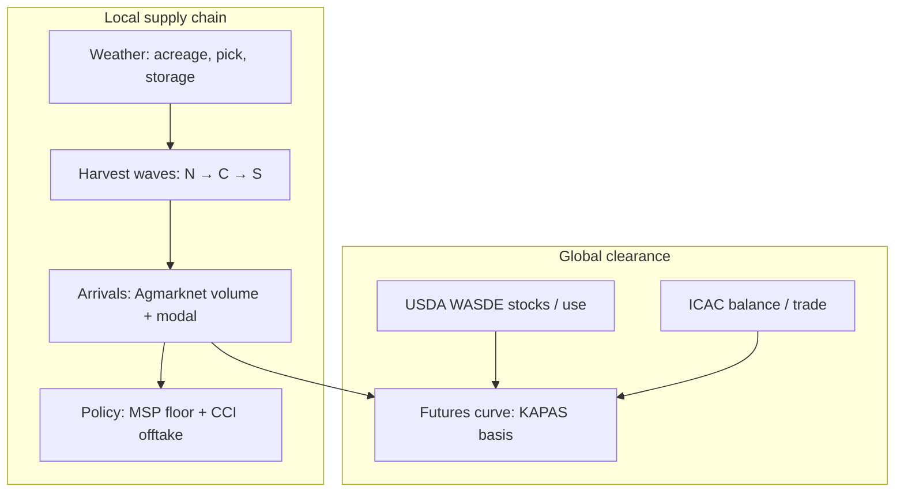

# Cotton Intelligence Model V1 — India (Research)

**Date:** 2026-06-04  
**PI:** PI4 Track C (KDO)  
**Status:** Research only — expert-trader intelligence synthesis; no schema, APIs, or code  
**Sources:** [COTTON_DOMAIN_MODEL_V1.md](./COTTON_DOMAIN_MODEL_V1.md), [COTTON_LIFECYCLE_SIGNAL_MAPPING.md](./COTTON_LIFECYCLE_SIGNAL_MAPPING.md), [COMMODITY_LIFECYCLE_MODEL.md](./COMMODITY_LIFECYCLE_MODEL.md), [PROCUREMENT_SIGNAL_MODEL.md](./PROCUREMENT_SIGNAL_MODEL.md), [WEATHER_SIGNAL_FRAMEWORK.md](./WEATHER_SIGNAL_FRAMEWORK.md), [SIGNAL_MATH_SPECIFICATION.md](./SIGNAL_MATH_SPECIFICATION.md)

---

## 1. Purpose

This document is the **intelligence layer** above the cotton domain model: how an experienced India cotton trader *reads* the market by weaving lifecycle phase, mandi arrivals, weather windows, government floor (MSP/CCI), and global balance (USDA/ICAC) into bullish, bearish, or neutral conviction — without implementation detail.

It informs E-02 registry calendars, E-05 agent phase gates, and E-06 narrative validation. It does **not** define schema, ingest jobs, or agent code.

---

## 2. Expert Trader Mental Model

Indian cotton is not one market at one time. It is a **north-to-south harvest wave** (Oct–Feb), a **mandi arrival ramp** (Oct–Mar), a **government floor** that activates when spot drifts toward MSP and CCI opens buying, and a **global lint balance** that sets export appetite and import parity during clearance. The expert does not average these forces; they **gate** them by calendar month and region.

**Three questions the trader asks every morning:**

1. **Where are we in the crop year?** (Sowing → Growth → Harvest → Arrivals → Storage → Clearance)
2. **What is physical cotton doing today?** (Arrival volume vs normal; modal trend; regional divergence)
3. **What is the floor and the ceiling?** (Floor = MSP + CCI; ceiling = export parity + global stocks drawdown)

Conviction is **directional** (bullish / bearish / neutral), **magnitude** (how strong), and **confidence** (data completeness and phase appropriateness). A bullish weather read during May sowing is not the same trade as a bullish arrival stall in November — different horizons, different agents.

---

## 3. Lifecycle as the Master Clock

| Phase | Months (indicative) | Trader focus | Intelligence weight |
|-------|---------------------|--------------|---------------------|
| **Sowing** | May–Jul | Acreage intent, pre-monsoon moisture | Weather **H**, Market **L**, Policy **M** (MSP announce) |
| **Growth** | Aug–Sep | Boll fill, monsoon excess/deficit | Weather **H**, Market **M**, Policy **L** |
| **Harvest** | Oct–Feb (regional) | Pick pace, rain at pick, arrival onset | Weather **H**, Market **M**, Policy **M** |
| **Arrivals** | Oct–Mar | Mandi volume z-score, modal volatility | Market **H**, Policy **H**, Weather **M** |
| **Storage** | Nov–Jun | Carry, humidity, basis vs KAPAS | Futures **H**, Policy **H**, Weather **M** |
| **Clearance** | Rolling | Export demand, global stocks, curve | Global **H**, Demand **H**, Futures **H** |

**Non-negotiable discipline:** Arrival z-scores and arrival trends are meaningful **only Oct–Mar** (FG-01). Off-season mandi volume is noise — treating May arrivals like November is how models hallucinate supply gluts.

**Harvest waves (regional):**

| Region | Pick window | Trader note |
|--------|-------------|-------------|
| North (PB, HR) | Oct–Dec | Earlier arrival peak; less Oct–Nov rain risk than west |
| Central (MH, GJ) | Oct–Nov peak pick | Highest **harvest rain** sensitivity — one wet week moves Khammam-adjacent psychology too |
| South (TS — Khammam, Warangal) | Oct–Jan | Phase 1 primary mandi belt; watch Telangana volume vs Maharashtra |

Staggered waves mean **national** arrival spikes are rare; the expert watches **regional** z-scores and strength indices, not a single India print.

---

## 4. Arrivals — The Primary Local Signal

Arrivals are the highest signal-to-noise window for **physical supply** hitting cash markets.

| Observation | Bullish read | Bearish read | Neutral read |
|-------------|--------------|--------------|--------------|
| Volume **below** seasonal norm, price **firm** | Tight supply — crop short or held back | — | Thin reporting day |
| Volume **above** norm, price **soft** | — | Harvest glut / wave peak | — |
| Volume **up**, price **up** | — | Unusual — check quality discount or MSP proximity | Conflicting — low conviction |
| Volume **down**, price **down** | Demand weakness possible | — | Weak clearance |

**Drivers the trader chains mentally:**

1. Harvest progress (dry = more cotton soon = bearish near-term pressure)
2. Regional wave (north peaked, south still ramping)
3. Ginning lag (farm-gate → mandi — LC-02; delays can mimic tight supply briefly)
4. **Hold behavior** when spot < MSP or humidity threatens warehouse stock

**Sources:** Agmarknet (primary modal + arrivals), eNAM (confirmatory), NCDEX KAPAS (storage/carry when licensed).

---

## 5. Weather — Conditional and Lagged (2–8 Weeks)

Weather is not “rain = down.” It is **window-specific**:

| Window | Calendar | Typical price bias | Mechanism |
|--------|----------|-------------------|-----------|
| **Boll fill** | Aug–Sep | Bearish on excess rain | Quality downgrade (micronaire, color) → lower ginning yield acceptance |
| **Peak pick** | Oct–Nov (MH, GJ) | **Bullish short-term** on disruption | Picking stops → arrivals stall → modal spikes |
| **Favorable dry pick** | Oct–Feb | Bearish near-term | Supply accelerates to mandi |
| **Post-harvest storage** | Nov–Mar | Bearish on humidity | Mold, quality loss, distressed selling |
| **Sowing drought** | May–Jul | Bullish (lagged) | Acreage fear |

**Expert rule:** A 3-day IMD nowcast of heavy rain over Gujarat in late October is a **trade catalyst**; a 30-day anomaly in June is an **acreage story**, not a mandi trade.

Weather agent outputs aggregate observations (IMD, NASA POWER gap-fill) into one daily structured read — components such as `harvest_window_score`, `rainfall_anomaly_7d`, `storage_humidity_risk`, and `acreage_proxy_pct_change` — with `primary_driver` naming which window dominates *today*.

---

## 6. Procurement — MSP Floor and CCI Offtake

Government intervention is the **price floor narrative** for Indian cotton.

| Concept | Trader meaning | When it bites |
|---------|----------------|---------------|
| **MSP** | Published INR/quintal floor | All year as reference; **±3% proximity** to Agmarknet modal triggers floor alert |
| **CCI active procurement** | Government buying removes open-market supply | **Arrivals peak** and **Storage** — highest Policy agent relevance |
| **Announcement** | Step-change in expected floor | Sowing (forward season) and event shocks |
| **Volume (MT)** | Supply removal by state | Low frequency — stale volume still moves **confidence**, not daily direction |

**Policy signal shape (conceptual):**

- `msp_inr_quintal`, `spot_vs_msp_pct`, `cci_active_procurement`, `procurement_volume_mt_mtd`, `geography`

**Expert coupling:** When spot is within ±3% of MSP **and** CCI is actively buying in Maharashtra/Gujarat/Telangana, the trader stops hunting “cheap cotton” on the mandi — the floor is real (`MSP_FLOOR` regime). When spot is 8% above MSP, CCI stories are background; arrivals and export parity lead.

**Gaps:** No machine-readable CCI API; volume lags announcements; LC-03 — timing of CCI centers vs local modal floor is still an open coupling.

---

## 7. Global Supply — USDA, ICAC, and Clearance

During **Storage** and **Clearance**, the expert lifts eyes from Telangana mandis to **world lint balance**.

| Source | What the trader extracts | Directional use |
|--------|-------------------------|-----------------|
| **USDA WASDE** | World/U.S. ending stocks, China use, India production revision | Lower world stocks → **bullish** export demand for Indian lint; surprise India crop cut → **bullish** local |
| **ICAC** | Balance sheet, trade flows | Confirms or contradicts USDA narrative |
| **Futures curve (KAPAS)** | Basis, backwardation/contango | Storage carry trades; `CURVE_BACKWARDATION` when spot > deferred |

Global agent is **low** weight during Arrivals (local physical dominates) and **high** during Clearance. A WASDE report does not override a November arrival spike **that week** — but it sets whether March–June export push is credible.

**Interim product note:** Full curve/basis features require licensed NCDEX KAPAS (DS-001). Spot + weather + policy paths still support research narratives; promotion claims need futures path.

---

## 8. Integrated Signal Logic (Conceptual)

Agents produce daily structured signals; market intelligence aggregates bullish / bearish / neutral with magnitude and confidence. The trader analogue:

| Agent | Core question | Dominant lifecycle stages |
|-------|---------------|----------------------------|
| **Market** | What are mandis doing? | Arrivals **H**, Clearance **H** |
| **Weather** | Which rain window matters? | Sowing, Growth, Harvest **H** |
| **Policy** | Is the floor active? | Arrivals, Storage **H** |
| **Futures** | What is carry saying? | Storage, Clearance **H** |
| **Demand** | Export/offtake strength? | Clearance **H** |
| **Global** | World balance shift? | Clearance **H** |

**Regime overlays (TDS-009):**

| Regime | Trigger (conceptual) | Trader behavior |
|--------|----------------------|-----------------|
| `TIGHT_SUPPLY` | Arrivals + low arrival z-score | Favor holds; fade glut headlines |
| `MSP_FLOOR` | Spot ±3% MSP + CCI active | Buy dips toward MSP; respect government bid |
| `CURVE_BACKWARDATION` | Steep spot premium in futures | Favor cash / spot inventory over deferred |
| `EXPORT_PUSH` | Strong export demand signal | Bullish clearance; watch parity caps |

---

## 9. Scenario Playbooks — Bullish, Bearish, Neutral

Each scenario is a **narrative composite** — how an expert would brief a desk. Dates and numbers are illustrative.

### 9.1 Bullish scenarios

#### B1 — Harvest rain disrupts peak pick (Oct–Nov, MH/GJ)

**Setup:** Extended IMD warning for unseasonal rain over Maharashtra and Gujarat during peak picking. `harvest_window_score` collapses; `forecast_rain_3d_mm` elevated; `rainfall_anomaly_7d` positive.

**Chain:** Rain → picking delayed → farm-gate cotton trapped → Agmarknet arrivals **below** seasonal z-score for key markets → modal **firms** despite “harvest season.”

**Expert line:** “The crop is there, but it is not in the mandi yet. This is a two-to-three-week bull trap on glut fears — until trucks move.”

**Agents:** Weather **bullish** (short-term), Market **bullish** (tight arrivals), Policy neutral unless MSP already in play.

**Confidence:** High if rain verified; decays when dry spell returns and arrival spike follows (often **bearish** reversal — see B→flip in §9.3).

---

#### B2 — Tight supply during arrivals (low z-score, firm modal)

**Setup:** November, Telangana markets reporting arrival volume z-score **−1.2** vs five-year norm; modal price trend positive; regional strength index positive.

**Chain:** Weak monsoon in growth (acreage fear realized) OR held back supply at farm-gate → mandi starved → `TIGHT_SUPPLY` regime.

**Expert line:** “Volume is not showing up. Do not short into an empty arrival print.”

**Agents:** Market **bullish**, Weather **bullish** if drought narrative consistent, Policy **bullish** if CCI active and spot drifting to MSP (floor support).

---

#### B3 — CCI floor + MSP proximity during arrivals

**Setup:** MSP ₹7,121/qtl; Agmarknet modal ₹6,950 (−2.4% vs MSP); PIB confirms CCI procurement open in Maharashtra and Gujarat; `cci_active_procurement` true; volume MTD rising.

**Chain:** Private trade reluctant to sell below effective floor → open-market supply **removed** → local availability tightens even if arrivals are moderate.

**Expert line:** “Government is the bid. Basis to MSP is the trade, not the headline arrival number.”

**Agents:** Policy **bullish**, Market **bullish** near floor, Global secondary.

**Regime:** `MSP_FLOOR`.

---

#### B4 — USDA stocks surprise (global, clearance/storage)

**Setup:** WASDE cuts U.S. and world ending stocks by 1.5–2 M bales vs trade expectation; China import demand revised up; India production unchanged.

**Chain:** World lint tighter → export parity improves → Indian mill and exporter buying interest → KAPAS curve firms (when licensed).

**Expert line:** “The mandi is local; WASDE is the export ceiling remover. Bullish for March clearance, not necessarily for today’s Khammam modal.”

**Agents:** Global **bullish**, Demand **bullish**, Futures **bullish**; Market may lag until export orders surface.

---

### 9.2 Bearish scenarios

#### R1 — Arrival spike after dry harvest (glut wave)

**Setup:** Favorable dry spell in October; `harvest_window_score` high; by mid-November north and central waves coincide — Agmarknet arrivals z-score **+1.8**; modal price **softening** week-on-week.

**Chain:** Fast pick → ginning flush → mandi overwhelmed → rising modal + rising arrivals = classic **supply pressure** (Market bearish rule).

**Expert line:** “The crop walked in the gate. This is the wave you sell — not the rain delay story.”

**Agents:** Market **bearish**, Weather **bearish** (favorable harvest = supply flow), Policy neutral unless MSP absorbs volume.

**Flip risk:** If spike exhausts and volume collapses, scenario can hand off to B2 within weeks.

---

#### R2 — Quality downgrade (Aug–Sep boll fill rain)

**Setup:** `rainfall_anomaly_30d` strongly positive during boll development; quality chatter (micronaire, color) from trade press; arrivals later show wider modal dispersion.

**Chain:** Excess rain → fiber quality down → effective supply **higher** in discount tiers → bearish quality outlook; may pressure ginners to move stock before further deterioration.

**Expert line:** “Bad cotton is still cotton — it clears at a discount and drags the average modal.”

**Agents:** Weather **bearish** (quality window), Market **bearish** when arrivals show high volume at weak grades.

---

#### R3 — MSP announce with no CCI follow-through + high arrivals

**Setup:** Cabinet raises MSP for next season (bullish **announcement** for farmers) but current season spot **8% above** MSP; CCI inactive; arrivals elevated.

**Chain:** Policy signal step-up is **forward**; current cash market already saturated → no floor support → announcement does not lift near-term cash.

**Expert line:** “MSP is next year’s politics. Today’s mandi is bearish glut.”

**Agents:** Policy mixed (announce bullish structurally, spot bearish operationally), Market **bearish**.

---

#### R4 — USDA stocks build / India crop revision up

**Setup:** WASDE increases India production 1 M bales; world ending stocks above consensus; ICAC confirms surplus.

**Chain:** Export competition rises → Indian FOB less competitive → clearance demand soft → bearish Storage/Clearance.

**Expert line:** “World cotton is heavy — Indian exporter has to discount to move lint.”

**Agents:** Global **bearish**, Demand **bearish**, Futures **bearish** on curve; local Market may still be neutral if mandi tight — **divergence** lowers confidence.

---

### 9.3 Neutral scenarios

#### N1 — Conflicting arrival and price (reporting noise)

**Setup:** Arrivals up 15% but modal flat; `primary_markets_reporting_pct` only 0.72; mixed regional signals.

**Chain:** Composite Market direction → **neutral**; magnitude low.

**Expert line:** “No trade — fix the data first. Half the mandis did not report.”

---

#### N2 — Off-season (May–Sep)

**Setup:** Minimal mandi volume; trader tempted to use stale arrival z-score.

**Chain:** FG-01 suppresses arrival features; Weather sowing/acreage may matter; Market price trend low signal-to-noise.

**Expert line:** “Cotton is in the field, not the mandi. Neutral on cash until October.”

---

#### N3 — Global bullish vs local glut (divergence)

**Setup:** WASDE bullish stocks cut but November Indian arrival spike (R1) simultaneous.

**Chain:** Global **bullish**, Market **bearish** → MI neutral or low confidence; horizon split (export vs cash).

**Expert line:** “World wants lint in six months; the mandi is drowning today. Neutral near-term, bullish medium-term — label the horizon or you will get chopped.”

---

#### N4 — MSP proximity but CCI inactive

**Setup:** Spot −2.8% vs MSP (within ±3% alert) but no CCI procurement window; farmers holding.

**Chain:** Floor **threatened** but not **confirmed** → Policy neutral-bullish, Market neutral.

**Expert line:** “MSP is near but government is not buying. Wait for the PIB.”

---

## 10. Expert Trader Narratives (Season Arc)

### 10.1 Opening the kharif book (May–July)

“The desk starts with acreage fear and MSP politics. I watch NASA POWER and IMD for pre-monsoon stress in Telangana and Gujarat — drought here is a **bullish** July story for next season’s arrivals. MSP announcement resets the floor chart for the year; CCI is usually quiet. I do not touch arrival z-scores — there is nothing in the mandi.”

### 10.2 Monsoon quality window (August–September)

“August is micronaire roulette. Excess rain in central India is **bearish** for quality, not necessarily for tonnage. The market may not move until ginners see the bale, but the smart money marks weather bearish and waits for confirmation in November arrivals.”

### 10.3 Harvest battlefield (October–November)

“October is regional. Punjab trucks early; Gujarat rain is the headline risk. One bad week in Surat district is **bullish** Khammam psychology even if Telangana did not rain — because traders price **national** tightness fear. When the sky clears, the arrival spike is **bearish** and fast. I trade the transition, not the average.”

### 10.4 Arrivals peak (December–February)

“Volume is truth. I rank markets by reporting coverage and watch z-score plus modal together: up/up is glut (**bearish**), down/up is tight (**bullish**). CCI activity near MSP is the policy overlay — if government is buying, I stop fading dips above MSP−3%.”

### 10.5 Storage and global hand (March–June)

“Mandi noise fades. Humidity in warehouse belts matters for **bearish** quality scares. KAPAS basis and USDA March/May cycles set export ambition. WASDE day is a clearance event — Indian stocks revision moves local FOB; world stocks move competitiveness. Backwardation says hold spot; contango says sell and roll.”

---

## 11. Decision Coupling (Conceptual, No Code)

| Rule | Condition | Trader implication |
|------|-----------|-------------------|
| MSP proximity | Spot within ±3% of registry MSP | Floor alert; pair with CCI flag |
| CCI floor | `near_msp` AND `cci_active_procurement` | Government-backed bid — favor long cash / avoid aggressive shorts |
| Arrival gating | Outside Oct–Mar | Ignore arrival z-score and arrival trend |
| No leakage | Signals at date T use only data observed ≤ T | No peeking at tomorrow’s WASDE or mandi print |
| Futures degraded | `futures_feed_ok=false` | Suppress basis/carry; spot-only with confidence penalty |

---

## 12. Confidence and Horizon Discipline

| Factor | Effect on confidence |
|--------|----------------------|
| Lifecycle phase mismatch (e.g. arrival z in June) | **Suppress** feature — treat as neutral |
| Low mandi reporting coverage | Reduce Market confidence |
| Stale CCI volume | Reduce Policy confidence; event flags still valid |
| Missing futures feed | Reduce Futures/MI; spot narratives still usable for research |
| Global vs local conflict | Lower composite conviction; split horizons explicitly |

**Magnitude** rises when multiple agents align (e.g. B2 tight arrivals + B3 CCI + B4 WASDE cut). **Neutral** is a valid output — forced direction in noisy off-season data is how backtests lie.

---

## 13. Data Sources (Intelligence Map)

| Domain | Primary | Secondary |
|--------|---------|-----------|
| Lifecycle / arrivals | Agmarknet modal + arrivals | eNAM |
| Weather | IMD district rain | NASA POWER gap-fill |
| Procurement | PIB MSP/CCI releases | CCI website, DAC&FW; spot vs MSP derived from Agmarknet |
| Storage / carry | Agmarknet, NCDEX KAPAS | — |
| Global | USDA WASDE | ICAC |
| Acreage proxy | State ag stats | USDA India production estimates |

---

## 14. Open Unknowns (Intelligence Risk)

| ID | Unknown | Intelligence impact |
|----|---------|---------------------|
| LC-01 | State-level harvest calendar granularity | Regional weather weights mis-timed |
| LC-02 | Ginning lag (farm-gate → mandi) | False tight/loose arrival reads |
| LC-03 | CCI timing vs market floor | Policy–Market coupling error in `MSP_FLOOR` |
| WQ-01–03 | Grid aggregation, ERA5 vs IMD, forecast horizon | Weather confidence decay |

---

## 15. Traceability

| Section | Source |
|---------|--------|
| §2–3 Lifecycle & expert model | COTTON_DOMAIN_MODEL_V1 §2–3, COTTON_LIFECYCLE_SIGNAL_MAPPING §2–3 |
| §4 Arrivals | COTTON_DOMAIN_MODEL_V1 §4, SIGNAL_MATH §3.3 |
| §5 Weather | WEATHER_SIGNAL_FRAMEWORK, COTTON_DOMAIN_MODEL_V1 §6 |
| §6 Procurement | PROCUREMENT_SIGNAL_MODEL, COTTON_DOMAIN_MODEL_V1 §5 |
| §7 Global | COMMODITY_LIFECYCLE_MODEL §5, FUTURES_DEPENDENCY_ANALYSIS §5 |
| §8 Agents & regimes | COTTON_LIFECYCLE_SIGNAL_MAPPING §5–8 |
| §9 Scenarios | Synthesized from domain + SIGNAL_MATH direction rules |
| §10 Narratives | Expert synthesis (Track C deliverable) |
| §11–12 Gating & confidence | COTTON_LIFECYCLE_SIGNAL_MAPPING §6, FG-01–05 |

---

*End of cotton intelligence model V1.*
