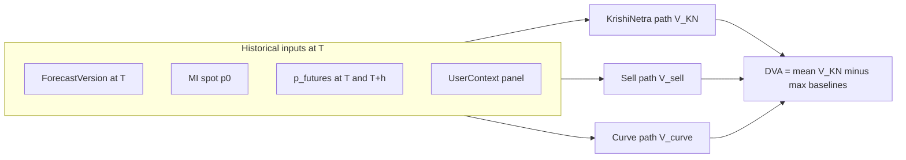
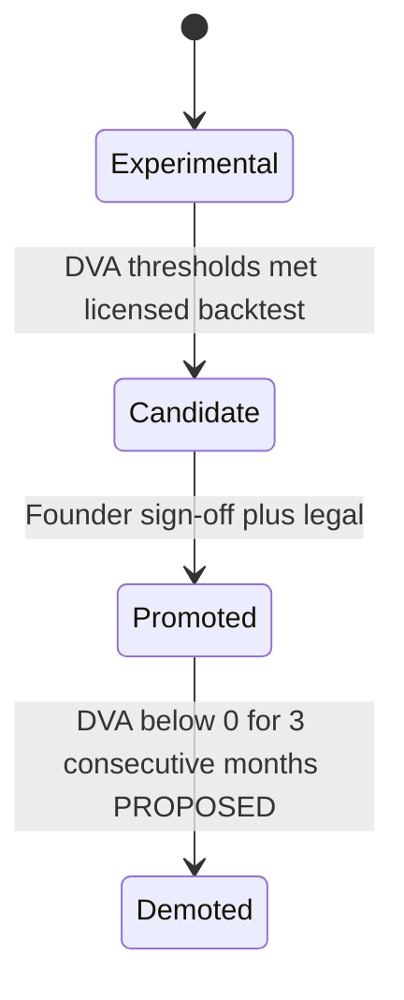

# DVA Proof Strategy — Pre-Production Evidence Plan

**Date:** 2026-06-04  
**PI:** PI4 Track F (KDO — research only)  
**Status:** Complete — **no implementation**; defines how Decision Value Added (DVA) is proven before production promotion  
**Sources:** [TDS-000-KPI-Framework.md](../tds/TDS-000-KPI-Framework.md), [TDS-011-Calibration-Architecture.md](../tds/TDS-011-Calibration-Architecture.md), [FUTURES_DEPENDENCY_ANALYSIS.md](./FUTURES_DEPENDENCY_ANALYSIS.md)  
**Related:** TDS-007 §8–9 (backtest, gates G3/G4/G6), TDS-008 §10 (three-strategy simulation), FD-003, FD-009, FD-020, REQ-082, REQ-103

---

## 1. What This Document Defines

| Question | Answer in this doc |
|----------|-------------------|
| What is DVA? | Primary promotion metric (FD-009); formula and unit |
| What must be proven? | KrishiNetra strategy beats approved baselines net of carry |
| Over what window? | **12 calendar months** (founder-approved) |
| Which benchmarks? | Immediate sell + hold-to-futures-curve (FD-003) |
| What counts as success? | Approved promotion thresholds + prerequisite gates |
| What counts as failure? | Threshold miss, missing curve baseline, or gate block |
| Can DVA be proven without licensed futures? | **Exploratory only** — not production-grade (see §6) |

**Out of scope:** Calibration batch code, dashboard implementation, ingest jobs, registry tuning execution.

---

## 2. DVA Definition (Authoritative)

From TDS-000 §3.1 and TDS-011 §8.1:

\[
\text{DVA}_{12m} = \overline{V_{\text{KN}}} - \max(\overline{V_{\text{sell}}}, \overline{V_{\text{curve}}})
\]

| Term | Meaning |
|------|---------|
| \(V_{\text{KN}}\) | Cumulative **net realized value** following published KrishiNetra recommendation over the evaluation path |
| \(V_{\text{sell}}\) | Immediate sell at spot \(p_0\) at decision date |
| \(V_{\text{curve}}\) | Hold-to-futures-curve baseline (FD-003, REQ-082) |
| Net value | \(V = \sum_t (p_t \cdot q_t - \text{carry}_t)\) — storage, financing, quality loss per TDS-008 |
| Unit | INR per quintal-equivalent or % of notional position value |
| Universe | Cotton Phase 1 (panel of UserContext profiles per TDS-008 §10.1) |

**Hierarchy (FD-009):** DVA is the **primary** product success metric. Forecast KPIs (RMSE, MAPE, DA) **inform** tuning only; they are **not** promotion gates.

---

## 3. Proof Objective

Prove that the **deterministic** Decision Engine + pinned ForecastVersion + CommodityRegistry version delivers **sustained economic value** versus the strongest passive alternative, before:

1. Moving recommendation state from **Experimental** → **Candidate** → **Promoted** (TDS-011 §9.2), and  
2. Making public value claims (REQ-102, OQ-009 legal gate pending).

Proof is **offline backtest + replay audit**, not live A/B in Phase 1.

---

## 4. Benchmarks (Three-Strategy Backtest — FD-020)

Every DVA proof run must simulate **three** strategies on the same historical panel and `as_of_date` grid (TDS-008 §10.1):

| Strategy | Label | Definition | Role in DVA |
|----------|-------|------------|-------------|
| **KrishiNetra** | \(V_{\text{KN}}\) | Deterministic recommendation at T; realized P&L at T+h with carry | Numerator path |
| **Sell now** | \(V_{\text{sell}}\) | Liquidate at \(p_0\) on decision date | Baseline competitor |
| **Hold to curve** | \(V_{\text{curve}}\) | \(V_{curve} = (p_{futures,h} - p_0) \cdot q - Carry_{curve}(h)\) | Baseline competitor (FD-003) |

DVA uses **max** of the two baselines — KrishiNetra must beat the **better** passive path, not only spot sell.

**Without licensed \(p_{futures,h}\):** \(V_{\text{curve}}\) is undefined — full DVA proof is **blocked** (FUTURES_DEPENDENCY_ANALYSIS §3, §4.6).

---

## 5. Evaluation Window

| Parameter | Value | Status |
|-----------|-------|--------|
| **Backtest window** | **12 calendar months** | **APPROVED** (TDS-000 §6, TDS-011 §9.1) |
| Monthly bucketing | Calendar months (not rolling 30-day) | KPI-A04 |
| Rolling report | 12m DVA recomputed monthly for ops/founder | TDS-011 §8.2 |
| Per-regime slice | Quarterly DVA by MSP/CCI/liquidity regime | TDS-011 §8.2 (diagnostic, not alternate gate) |

**Simulation grid:** For each `as_of_date` T in the window:

1. Load ForecastVersion and SignalSnapshot at T (no lookahead — TDS-007 §8.6 leakage audit).  
2. Apply farmer + trader UserContext **panel**.  
3. Run Decision Engine (deterministic).  
4. Observe **realized** mandi/futures prices at horizons 30/60/90 as applicable.  
5. Compute net value per strategy with **identical** carry model in backtest and live (NFR-TRC-002, KPI-A02).

Walk-forward discipline per TDS-007 §8.2 applies: training/feature versions must not leak future data into T.

---

## 6. Data Prerequisites (Proof vs Exploration)

From FUTURES_DEPENDENCY_ANALYSIS — classification for **credible production proof**:

| Prerequisite | Production proof | Exploratory only |
|--------------|-------------------|------------------|
| Agmarknet spot (24+ mo cotton basket) | **REQUIRED** | REQUIRED |
| Licensed NCDEX KAPAS EOD (REQ-071, DS-001) | **REQUIRED** | Deferred |
| \(p_{futures,h}\) for hold-to-curve | **REQUIRED** | Missing → curve leg omitted |
| Gate G6 (Futures + Market ≥ 99% days) | **REQUIRED** | Fail until feed live |
| Full TDS-007 futures feature vector | **REQUIRED** for promoted model | Spot-only subset allowed for pipeline validation |
| 6-agent SignalSnapshot with Futures | **REQUIRED** for MI-backed decisions | Degraded snapshot — not promotion-grade |

### 6.1 Dual-track bake-off (recommended sequencing)

| Track | Purpose | DVA evidence quality | Promotion use |
|-------|---------|----------------------|---------------|
| **A — Exploratory** | Spot + weather + policy; validate ingest, agents, replay | **Low–Medium** — no FD-003 bar | **Cannot** satisfy G3/G4 |
| **B — Licensed** | Path D: Agmarknet + IMD + policy + **licensed** KAPAS EOD | **High** — meets DD-005, G6, curve baseline | **Only** track for production proof |

**Rule:** Spot-only DVA > 0% is **insufficient** for promotion. Gate G6 + FD-003 explicitly block false promotion (FUTURES_DEPENDENCY_ANALYSIS §9).

---

## 7. Success Criteria (Pass)

### 7.1 Primary promotion gate (founder-approved)

All of the following must pass on **Track B** (licensed data) over the **12-month** backtest:

| Criterion | Threshold | Source |
|-----------|-----------|--------|
| Aggregate DVA | **> 3%** | TDS-000 §3.1, TDS-011 §9.1 |
| Positive DVA months | **> 70%** of 12 months with \(DVA_m > 0\) | TDS-000 §3.2 |
| Deterministic replay | **100%** match on audit sample dates | REQ-103, TDS-011 §9.1 |
| Backtest window length | 12 calendar months | Approved |

Operational stretch (not standalone gate): aggregate DVA **> 2%** before marketing language; Positive DVA **≥ 75%** months (TDS-000 §3.2).

### 7.2 Prerequisite technical gates (same bake-off)

| Gate | Criterion | Source |
|------|-----------|--------|
| G1 | Leakage audit pass | TDS-007 §8.6 |
| G2 | Replay hash 100% on sample | TDS-007 §8.7 |
| G6 | Futures + Market agents present **≥ 99%** of backtest days | TDS-007 §9, FD-030 |
| G7 | No LLM in decision/forecast path | TC-001 |

### 7.3 Supporting ops gates (PROPOSED — TDS-000 §6)

| Criterion | Threshold |
|-----------|-----------|
| Daily refresh success | ≥ 95% trailing 30d |
| Forecast generation success | ≥ 97% trailing 30d |
| Legal review | Complete (OQ-009 — **PENDING**) |

### 7.4 Promotion state transition

When §7.1–7.2 pass in **staging** backtest:

**Candidate** = limited pilot; **Promoted** = general availability (TDS-011 §9.2).

---

## 8. Failure Criteria (Fail / Defer)

### 8.1 Hard fail — do not promote

| Condition | Consequence |
|-----------|-------------|
| \(\text{DVA}_{12m} \leq 3\%\) on licensed backtest | Remain **Experimental**; no public value claims |
| Positive DVA months ≤ 70% | Same |
| Replay audit < 100% on sample | Block promotion (REQ-103) |
| G6 not met (< 99% Futures + Market days) | Block promotion |
| G1 leakage audit fail | Block promotion; fix pipeline |
| \(V_{\text{curve}}\) computed from non-REQ-071 feed (e.g. public bhav dev scrape) | Invalidate proof run |
| Spot-only backtest passed but licensed track not run | **False pass** — treat as fail for production |

### 8.2 Defer — proof incomplete, not failed

| Condition | Meaning |
|-----------|---------|
| DS-001 / licensed feed not closed | Run Track A only; **defer** G3/G4/G6 |
| < 12 months historical data | Extend window or narrow universe with founder ack |
| Legal gate (OQ-009) open | Technical DVA may pass; promotion to **Promoted** still blocked |

### 8.3 Post-promotion demotion signals (PROPOSED — TDS-011 §9.2, §13.1)

| Condition | Response |
|-----------|----------|
| Live rolling DVA **< 0** for **3 consecutive calendar months** | Demote to **Experimental**; registry review |
| Hold success < 45% for 30d with n>30 | Trigger offline decision calibration |
| RMSE₃₀ > 1.5× 90d baseline (7d) | Drift warning — block **new** promotions |

---

## 9. Proof Procedure (Logical Steps)

No code — ordered evidence bundle for calibration / model sign-off:

| Step | Activity | Output artifact |
|------|----------|-----------------|
| 1 | **Freeze versions** — `model_version`, `calibration_version`, `CommodityRegistry`, decision_rules | Version manifest |
| 2 | **Assemble 12mo panel** — cotton mandi basket, licensed KAPAS EOD, IMD/policy as per full feature set | Data coverage report (G6) |
| 3 | **Leakage audit** — features at T use only data ≤ T | G1 sign-off |
| 4 | **Walk-forward backtest** — grid of `as_of_date`; three strategies per TDS-008 §10 | Per-session P&L tables |
| 5 | **Aggregate DVA** — monthly \(DVA_m\), then 12m mean; Positive DVA % | DVA report (TDS-011 `dva_rolling`) |
| 6 | **Replay audit** — re-run Decision Engine on sample dates; compare hashes | G2 sign-off |
| 7 | **Gate checklist** — G1–G4, G6–G7 + ops PROPOSED gates | `promotion_review` traffic light (TDS-011 §15.2) |
| 8 | **Founder + legal** — Candidate → Promoted | Approval record (OQ-009) |

**Cadence:** Monthly rolling 12m DVA for monitoring; full promotion proof re-run when registry or `model_version` changes (offline bake-off before version pin deploy — TDS-011 §14).

---

## 10. Secondary Metrics (Inform Only)

These **do not** gate promotion (TDS-000 §2, §5) but must be reported with the proof bundle:

| Metric | Use in proof narrative |
|--------|------------------------|
| RMSE / MAPE / MAE by horizon | Model health; drift detection |
| Directional accuracy | Confidence band tuning |
| Hold / Partial sell success | Explain DVA variance; OQ-007 outcome dependency |
| Confidence calibration | Trust; must not worsen >15% vs baseline at promotion |
| Forecast KPIs | **Not** substitutes for DVA pass |

---

## 11. Decision: What “Proven” Means

| Claim | Minimum evidence |
|-------|------------------|
| “Pipeline can compute DVA” | Track A exploratory backtest + G2 replay on spot snapshot |
| “DVA positive in research” | Track A with documented caveats — **not** for farmers |
| **“Production-ready decision value”** | Track B: 12mo, DVA > 3%, >70% positive months, G1/G2/G6/G7, REQ-071 feed, founder + legal |
| “Beats hold-to-curve” | Implicit in DVA formula when \(V_{\text{curve}} > V_{\text{sell}}\); report both baselines separately in dashboard §15.2 |

---

## 12. Assumptions

| ID | Assumption |
|----|------------|
| DVA-P01 | Carry model identical in backtest and live (KPI-A02) |
| DVA-P02 | Monthly DVA uses calendar months (KPI-A04) |
| DVA-P03 | Partial sell default 50% quantity (TDS-008) |
| DVA-P04 | Demotion at 3 negative DVA months is PROPOSED (CAL-003) |
| DVA-P05 | Inferred outcomes (OQ-007) not required for **pre-production** backtest proof; required for live calibration loop |

---

## 13. Open Questions

| ID | Item | Impact on proof |
|----|------|-----------------|
| OQ-007 | Outcome validation UX | Live DVA monitoring only |
| OQ-009 | Legal gate on promotion | Blocks **Promoted** state |
| OQ-004 | Material signal movement | Stability KPI, not DVA gate |
| DS-001 | Licensed vendor selection | Blocks Track B |

---

## 14. Traceability

| Topic | Document / REQ |
|-------|----------------|
| DVA formula, 3%, 70%, 12mo | TDS-000 §3, §6 |
| Promotion state machine, demotion | TDS-011 §8–9, §13 |
| Futures / curve dependency | FUTURES_DEPENDENCY_ANALYSIS §3–5 |
| Three-strategy simulation | TDS-008 §10, FD-020 |
| Gates G3, G4, G6 | TDS-007 §9 |
| Hold-to-curve | FD-003, REQ-082 |
| DVA primary | FD-009, REQ-083, REQ-102 |

---

*End of DVA proof strategy.*
