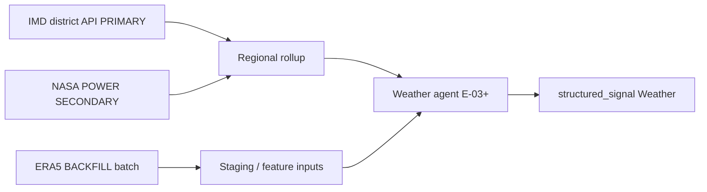

# IMD Feasibility Assessment — Phase 1 Cotton Weather

**Date:** 2026-06-04  
**PI:** PI2 Track C (KDO rerun — research only)  
**Status:** Complete — no agent/ingest code; no architecture changes  
**Product truth:** `docs/founder/` (DD-002 Weather, DA-001, DA-004), TDS-004, TDS-007, TDS-009  
**Technical inputs:** [COTTON_DATA_SOURCE_VALIDATION.md](./COTTON_DATA_SOURCE_VALIDATION.md), [WEATHER_SIGNAL_FRAMEWORK.md](./WEATHER_SIGNAL_FRAMEWORK.md), [PHASE1_SOURCE_DECISIONS.md](./PHASE1_SOURCE_DECISIONS.md)

---

## 1. Executive Recommendation — PRIMARY / SECONDARY / BACKFILL

| Tier | Source | Phase 1 role | Rationale |
|------|--------|--------------|-----------|
| **PRIMARY** | **IMD public REST APIs** (district/state rainfall, warnings, nowcast) | Operational daily Weather agent inputs after whitelist | Official India meteorology; matches founder §10 IMD example (DD-002) |
| **SECONDARY** | **NASA POWER** | Gap-fill when district missing; local dev without whitelist; near-real-time gridded backup | Free, no IP whitelist; PHASE1_SOURCE_DECISIONS **APPROVED** |
| **BACKFILL** | **ERA5 (Copernicus CDS)** and/or **NASA POWER** long pulls | **36–60 months** regional daily aggregates for seasonal features | ERA5 for consistent reanalysis; NASA POWER for faster 1981+ daily without CDS batch jobs |

**Not PRIMARY:** ERA5 (reanalysis lag, batch ops). **Not weather source for acreage:** acreage proxy uses state ag stats / USDA per TDS-004 and WEATHER_SIGNAL_FRAMEWORK — IMD does not publish cotton acreage.

**Registry note (TDS-009):** Weather agent is **optional** for cotton — missing weather reduces confidence; pipeline does not abort.

---

## 2. IMD — Access Paths and Whitelist

### 2.1 Public APIs (operational tier → PRIMARY)

Documented in [IMD API Reference](https://api.imd.gov.in/public/api_reference.html) and [IMD APIs portal](https://mausam.imd.gov.in/responsive/apis.php):

| Endpoint | URL | Use |
|----------|-----|-----|
| District rainfall | `https://api.imd.gov.in/api/v1/districtrainfall` | Daily actual, normal, departure, cumulative |
| District rainfall by id | `.../districtrainfall?id={OBJ_ID}` | Single-district pull |
| State rainfall | `https://api.imd.gov.in/api/v1/staterainfall` | State aggregates |
| District nowcast / warnings | Same reference doc | Short-horizon `forecast_rain_3d` inputs (framework §4) |
| AWS/ARG, river basin QPF | Reference doc | Optional; higher ops complexity |

**Sample district record** (Adilabad — Telangana cotton belt adjacent):

```json
{
  "OBJ_ID": "164",
  "District": "ADILABAD",
  "Date": "2023-01-31",
  "Daily Actual": "0.00",
  "Daily Normal": "1.70",
  "Daily Departure Per": "-100%",
  "Daily Category": "NR"
}
```

Category codes: LE, E, N, D, LD, NR, ND (documented in API reference).

### 2.2 Whitelist and operational constraints

| Requirement | Detail | Impact |
|-------------|--------|--------|
| **IP whitelist** | Required — apply via link on [IMD APIs page](https://mausam.imd.gov.in/responsive/apis.php) | Staging/prod egress IPs must be registered before cron ingest |
| **Attribution** | Mandatory IMD attribution | Product legal/display |
| **SLA** | Not formally published | Retry + cache; `signals_missing` / quality penalty on outage |
| **Support** | [api.imd.gov.in contact](https://api.imd.gov.in/public/contact.php) | sankar.nath@imd.gov.in, kavita.navria@imd.gov.in |
| **Portal login** | [api.imd.gov.in/login](https://api.imd.gov.in/public/login.php) | Separate from whitelist — confirm org onboarding with IMD |

**Dev unblock:** Use **SECONDARY (NASA POWER)** until whitelist approved — PHASE1_SOURCE_DECISIONS already approves this path.

### 2.3 Historical tier — IMD-DSP (not PRIMARY for Phase 1 bootstrap)

| Item | Detail |
|------|--------|
| Portal | [dsp.imdpune.gov.in](https://dsp.imdpune.gov.in/) |
| Registration | Category: Government / Research / **Commercial** — identity + Certificate of Undertaking |
| Data delivery | Online request → payment if applicable → download |
| Terms | Restricts commercial use, redistribution, third-party transfer without **written IMD approval** |
| DSP note | Portal directs some users to [data.gov.in](https://data.gov.in/) for open meteorological products without enrolment |

**Commercial KrishiNetra:** Treat DSP as **legal gate** in addition to technical access (Track C §3.3). Operational PRIMARY remains free API tier; deep station history is **BACKFILL via ERA5/NASA POWER** unless IMD grants commercial DSP/API extension.

---

## 3. NASA POWER — SECONDARY

| Dimension | Assessment |
|-----------|------------|
| Access | HTTPS REST; **no authentication** ([POWER docs](https://power.larc.nasa.gov/docs/services/api/temporal/daily/)) |
| Variables | `PRECTOTCORR`, `T2M`, `RH2M`, etc. — agriculture community `community=AG` |
| History | Daily meteorology **1981–present**; ~0.5° grid |
| Latency | ~2–3 days (meteorology) per POWER availability |
| License | Open; CC BY 4.0 — attribution required ([AWS open data registry](https://registry.opendata.aws/nasa-power/)) |
| Cotton fit | Roll grid to Telangana / national cotton belt regions; drought anomaly features in WEATHER_SIGNAL_FRAMEWORK |

**Example request:**

```text
GET https://power.larc.nasa.gov/api/temporal/daily/point
  ?parameters=PRECTOTCORR,T2M,RH2M
  &community=AG
  &longitude=79.75
  &latitude=17.25
  &start=20230601
  &end=20240531
  &format=JSON
```

**SECONDARY uses:** (1) whitelist pending, (2) district `ND`/missing day gap-fill, (3) optional cross-check IMD vs grid.

---

## 4. ERA5 — BACKFILL

| Dimension | Assessment |
|-----------|------------|
| Access | [Copernicus CDS](https://cds.climate.copernicus.eu/) — account + `cdsapi` token |
| Variables | Total precipitation, 2m temperature, etc. — hourly/daily reanalysis |
| History | ERA5 family from **1940** onward (CDS documentation) |
| Resolution | ~31 km — adequate for regional cotton belt rollups |
| Latency | **Not operational** — reanalysis consolidation ~2 months behind |
| License | As of **2025-07-02**, CDS products moving to **CC BY 4.0** (commercial use permitted with attribution — verify dataset page at ingest time) |
| Ops cost | Large pulls are queue-based; plan batch jobs for 36–60 mo windows |

**BACKFILL uses:** Seasonal norms, `rainfall_anomaly_30d`, drought index baselines when IMD API history is shallow and DSP is not licensed.

---

## 5. Comparison Matrix — IMD vs NASA POWER vs ERA5

| Criterion | IMD API (PRIMARY) | IMD-DSP | NASA POWER (SECONDARY) | ERA5 (BACKFILL) |
|-----------|-------------------|---------|------------------------|-----------------|
| Official India authority | **Yes** | **Yes** | No (NASA) | No (ECMWF/C3S) |
| District rainfall semantics | **Yes** — matches Indian admin districts | Station/gridded archives | Gridded interpolation | Grid |
| Real-time / daily ops | **Yes** | No (batch order) | Yes (T+2–3d) | No |
| Whitelist / auth | **IP whitelist** | Account + undertaking | None | CDS API token |
| Commercial clarity | Grey until legal sign-off | **Restricted** | Open | CC BY 4.0 (2025+ CDS) |
| Free historical depth (36–60 mo) | Limited on API | Paid / restricted | **1981+** | **1940+** |
| Forecast rain 1–7d | Nowcast/warning endpoints | N/A | No | No |
| Mandi-level precision | No (district) | No | No | No |
| Acreage | **No** | **No** | **No** | **No** |
| PHASE1_SOURCE_DECISIONS | CONDITIONAL | Legal path only | **APPROVED** | Not listed — BACKFILL tier |

---

## 6. Phase 1 Cotton Weather — Logical Flow (no architecture change)



| Layer | TDS-006 / framework | Notes |
|-------|---------------------|-------|
| Raw observations | Staging / feature inputs (E-03) | **Not** `price_observation` |
| StructuredSignal | `structured_signal` agent_type=Weather | One row/day TDS-004 |
| Forecast rain | Agent input only until agent runs | Not persisted as signal prematurely |

---

## 7. Telangana Cotton Belt — IMD District Mapping

Weather agent rolls **district-level** IMD data to cotton regions (Telangana + national belt). Districts adjacent to product focus:

| Product focus | IMD districts to map (examples) |
|---------------|----------------------------------|
| Telangana cotton | Khammam, Warangal, Karimnagar, Nalgonda, Mahabubabad, … |
| Verification | Pull `districtrainfall` for `OBJ_ID` or district name; confirm OBJ_ID in E-02 `region.external_refs` |

**Gap:** District rainfall ≠ mandi location — aggregation weights are E-03 design (WQ-01 class), not founder spec change.

---

## 8. Risks and Mitigations

| ID | Risk | Mitigation |
|----|------|------------|
| IMD-01 | Whitelist delay | NASA POWER SECONDARY for dev and gap-fill |
| IMD-02 | DSP commercial / redistribution | Legal review before claiming “official IMD historical” in MI |
| IMD-03 | District vs mandi granularity | Regional rollup + confidence penalty |
| IMD-04 | Monsoon API instability | Cache last-good; quality snapshot |
| IMD-05 | Acreage absent | Omit or reduce `acreage_proxy` confidence per TDS-004 |

---

## 9. Minimum Historical Window

| Source | Window | Tier |
|--------|--------|------|
| Weather regional daily | **36 months** minimum | BACKFILL + ongoing PRIMARY ([WEATHER_SIGNAL_FRAMEWORK.md](./WEATHER_SIGNAL_FRAMEWORK.md), [HISTORICAL_DATA_BOOTSTRAP_PLAN.md](./HISTORICAL_DATA_BOOTSTRAP_PLAN.md) §3.5) |
| Stretch | **60 months** | ERA5/NASA POWER batch when ops capacity allows |
| Forecast train (TDS-007) | **24 months** minimum | Separate from weather feature depth — mandi prices drive DVA path |

---

## 10. Recommendation Summary

| Tier | Action for E-03 planning |
|------|-------------------------|
| **PRIMARY** | Submit IMD IP whitelist for prod/staging; ingest district rainfall daily |
| **SECONDARY** | Implement NASA POWER pull for gaps and pre-whitelist dev |
| **BACKFILL** | 36 mo NASA POWER and/or ERA5 regional aggregates before Weather agent backtest |
| **Legal** | Parallel track for DSP/commercial clarity if IMD-only historical is required |

---

*End of IMD feasibility assessment.*
