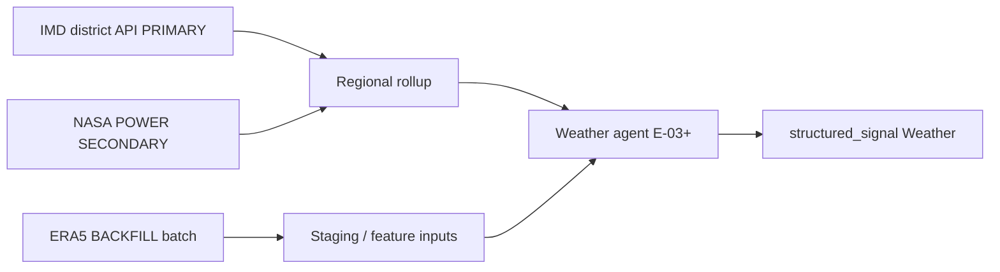

# Weather Data Strategy V1 — Phase 1 Cotton

**Date:** 2026-06-04  
**PI:** PI4 Track E (KDO — research only)  
**Status:** Founder strategy record — no ingest code; no architecture changes  
**Product truth:** `docs/founder/` (DD-002 Weather, DA-001, DA-004), TDS-004, TDS-007, TDS-009  
**Technical inputs:** [IMD_FEASIBILITY_ASSESSMENT.md](./IMD_FEASIBILITY_ASSESSMENT.md), [WEATHER_SIGNAL_FRAMEWORK.md](./WEATHER_SIGNAL_FRAMEWORK.md), [PHASE1_SOURCE_DECISIONS.md](./PHASE1_SOURCE_DECISIONS.md), [HISTORICAL_DATA_BOOTSTRAP_PLAN.md](./HISTORICAL_DATA_BOOTSTRAP_PLAN.md)

---

## 1. Founder Decision — PRIMARY / SECONDARY / BACKFILL

| Tier | Source | Phase 1 role |
|------|--------|--------------|
| **PRIMARY** | **IMD public REST APIs** (district/state rainfall, warnings, nowcast) | Operational daily Weather agent inputs after IP whitelist |
| **SECONDARY** | **NASA POWER** | Gap-fill when district missing; local dev before whitelist; gridded cross-check |
| **BACKFILL** | **ERA5 (Copernicus CDS)** and/or **NASA POWER** long pulls | **36–60 months** regional daily aggregates for seasonal features |

**Approve this tiering for E-03 weather ingest and Weather agent backtest bootstrap.**

| Explicitly not PRIMARY | Reason |
|------------------------|--------|
| ERA5 | Reanalysis lag (~2 months); queue-based batch — not daily ops |
| NASA POWER (alone) | Not official India meteorology; lacks district departure semantics |
| IMD-DSP | Commercial/legal gate; batch order — not Phase 1 operational path |

**Registry (TDS-009):** Weather agent is **optional** for cotton — missing weather reduces confidence; pipeline does not abort.

**Not a weather source:** Cotton **acreage** proxy uses state ag stats / USDA per TDS-004 — IMD does not publish cotton acreage.

---

## 2. Source Comparison — IMD vs NASA POWER vs ERA5

Synthesized from [IMD_FEASIBILITY_ASSESSMENT.md](./IMD_FEASIBILITY_ASSESSMENT.md) §3–5.

### 2.1 At a glance

| Criterion | IMD API | NASA POWER | ERA5 |
|-----------|---------|------------|------|
| **Authority (India)** | Official IMD | NASA (global) | ECMWF/Copernicus |
| **District rainfall semantics** | Yes — Indian admin districts | Gridded (~0.5°) | Gridded (~31 km) |
| **Real-time / daily ops** | Yes | Yes (T+2–3 days) | No (~2 mo reanalysis lag) |
| **Auth / access** | IP whitelist required | None (HTTPS REST) | CDS account + API token |
| **Commercial clarity** | Grey until legal sign-off | Open (CC BY 4.0) | CC BY 4.0 (CDS 2025+ — verify at ingest) |
| **Free historical depth** | Limited on public API | **1981+** daily | **1940+** |
| **Short-horizon rain forecast** | Nowcast/warning endpoints | No | No |
| **Mandi-level precision** | No (district) | No | No |
| **PHASE1_SOURCE_DECISIONS** | **CONDITIONAL** | **APPROVED** | Not listed — BACKFILL tier |

### 2.2 IMD (PRIMARY)

| Dimension | Detail |
|-----------|--------|
| **Endpoints** | District/state rainfall (`api.imd.gov.in`), district nowcast/warnings — see IMD API reference |
| **Strengths** | Official India meteorology; daily actual/normal/departure/cumulative; matches founder DD-002 IMD example |
| **Constraints** | IP whitelist (staging/prod egress); mandatory attribution; no formal SLA |
| **Dev unblock** | Use NASA POWER until whitelist approved |
| **Deep history** | IMD-DSP portal — commercial undertaking, redistribution restrictions; **not** Phase 1 PRIMARY |

### 2.3 NASA POWER (SECONDARY + BACKFILL option)

| Dimension | Detail |
|-----------|--------|
| **Access** | Free HTTPS REST; no authentication |
| **Variables** | `PRECTOTCORR`, `T2M`, `RH2M` (agriculture community) |
| **History** | Daily **1981–present**; ~0.5° grid |
| **Latency** | ~2–3 days behind real time |
| **SECONDARY uses** | Whitelist pending; district `ND`/missing day gap-fill; optional IMD vs grid cross-check |
| **BACKFILL uses** | Faster 36–60 mo regional pulls without CDS queue jobs |

### 2.4 ERA5 (BACKFILL)

| Dimension | Detail |
|-----------|--------|
| **Access** | Copernicus CDS + `cdsapi` token |
| **Variables** | Precipitation, 2m temperature, etc. — hourly/daily reanalysis |
| **History** | ERA5 family from **1940** onward |
| **Resolution** | ~31 km — adequate for regional cotton-belt rollups |
| **BACKFILL uses** | Seasonal norms, `rainfall_anomaly_30d`, drought index baselines when IMD API history is shallow and DSP is not licensed |
| **Ops** | Large pulls are queue-based — plan batch jobs for 36–60 mo windows |

### 2.5 When to prefer ERA5 vs NASA POWER for backfill

| Situation | Prefer |
|-----------|--------|
| Need consistent global reanalysis baselines | **ERA5** |
| Need fastest free 36–60 mo daily without CDS ops | **NASA POWER** |
| IMD operational + shallow API history only | **Both acceptable** — ERA5 for anomaly stability; NASA POWER for speed (resolves WQ-02 in framework) |

---

## 3. Operational Flow (logical — no architecture change)

| Layer | Contract | Notes |
|-------|----------|-------|
| Raw observations | Staging / feature inputs (E-03) | **Not** `price_observation` |
| StructuredSignal | `structured_signal` agent_type=Weather | One row/day TDS-004 |
| Forecast rain | Agent input until agent runs | Not persisted as signal prematurely |

---

## 4. Telangana Cotton Belt — IMD Mapping

Weather agent rolls **district-level** IMD data to cotton regions. Example districts: Khammam, Warangal, Karimnagar, Nalgonda, Mahabubabad. Confirm `OBJ_ID` in E-02 `region.external_refs` via `districtrainfall` API.

**Known gap:** District rainfall ≠ mandi location — aggregation weights are E-03 design (WQ-01), not founder spec change.

---

## 5. Minimum Historical Window

| Source | Window | Tier |
|--------|--------|------|
| Weather regional daily | **36 months** minimum | BACKFILL + ongoing PRIMARY |
| Stretch | **60 months** | ERA5/NASA POWER batch when ops capacity allows |
| DVA forecast train (TDS-007) | **24 months** minimum | Mandi prices — separate from weather feature depth |

---

## 6. Risks and Mitigations

| ID | Risk | Mitigation |
|----|------|------------|
| IMD-01 | Whitelist delay | NASA POWER SECONDARY for dev and gap-fill |
| IMD-02 | DSP commercial / redistribution | Legal review before “official IMD historical” in MI |
| IMD-03 | District vs mandi granularity | Regional rollup + confidence penalty |
| IMD-04 | Monsoon API instability | Cache last-good; quality snapshot |
| IMD-05 | Acreage absent | Omit or reduce `acreage_proxy` confidence per TDS-004 |

---

## 7. E-03 Action Checklist (post-approval)

| Tier | Action |
|------|--------|
| **PRIMARY** | Submit IMD IP whitelist for prod/staging; ingest district rainfall daily |
| **SECONDARY** | Implement NASA POWER pull for gaps and pre-whitelist dev |
| **BACKFILL** | Load 36 mo NASA POWER and/or ERA5 regional aggregates before Weather agent backtest |
| **Legal** | Parallel track for DSP/commercial clarity if IMD-only deep history is required |

---

## 8. Alternatives Considered

| Alternative | Verdict |
|-------------|---------|
| NASA POWER as PRIMARY | **Rejected** — not official India district semantics; founder DD-002 cites IMD |
| ERA5 as PRIMARY | **Rejected** — reanalysis lag and batch ops unsuitable for daily agent |
| IMD-DSP as PRIMARY | **Rejected** — legal/commercial gate; use for station archives only if licensed |
| Single backfill source only | **Deferred** — founder may pick ERA5 *or* NASA POWER for 36 mo; both documented |

---

## 9. Sign-off

| Field | Value |
|-------|-------|
| **Decision** | Approve PRIMARY=IMD API, SECONDARY=NASA POWER, BACKFILL=ERA5 and/or NASA POWER (36–60 mo) |
| **Blocks E-03 if** | No IMD whitelist **and** no SECONDARY fallback plan |
| **Does not block pipeline** | Weather optional per TDS-009 |

---

*End of weather data strategy V1.*
