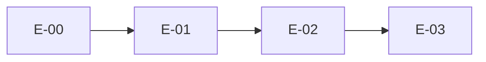

# Implementation Readiness Review

**Date:** 2026-06-03  
**Reviewer role:** Technical Delivery Lead  
**Baseline:** Frozen architecture — TDS-000 through TDS-014, `docs/founder/*`, `docs/stories/*`, `docs/adrs/*`  
**Decision:** **Proceed to Sprint 0** (E-00-S01 implementation authorized)

---

## Executive Summary

| Overall readiness | **YELLOW-GREEN** |
|-------------------|------------------|
| Sprint 0 (E-00) | **GREEN** — safe to start |
| Sprint 1 (E-01, E-02) | **YELLOW** — proceed with documented clarifications |
| Phase 1 delivery (E-03+) | **YELLOW** — open questions and data contracts need resolution before MI/Decision go-live |

**Recommendation:** Begin **E-00-S01 only**. Do not block Sprint 0 on Phase 1 open questions. Escalate documentation sync and founder-approved parameters before E-07/E-10.

---

## 1. Category Readiness Matrix

| Category | Rating | Blocking Sprint 0? | Blocking Sprint 1? |
|----------|--------|------------------|---------------------|
| 1. Founder Artifacts | **GREEN** | No | No |
| 2. TDS Artifacts | **GREEN** | No | No |
| 3. ADRs | **GREEN** | No | No |
| 4. Stories (E-00–E-02) | **GREEN** | No | No |
| 5. Traceability | **YELLOW** | No | No |
| 6. Dependency Mapping | **GREEN** | No | No |
| 7. Sprint Sequencing | **GREEN** | No | No |
| 8. Data Source Assumptions | **YELLOW** | No | Yes (E-03) |
| 9. Open Questions | **YELLOW** | No | Partial (E-07, E-10) |

---

## 2. Founder Artifacts

**Rating: GREEN**

| Artifact | Present | Notes |
|----------|---------|-------|
| FOUNDER_DECISIONS.md | Yes | 31 decisions indexed |
| CONSTRAINTS.md | Yes | TC-001, PC-001 load-bearing |
| TRACEABILITY_MATRIX.md | Yes | ~101 REQ rows |
| OPEN_QUESTIONS.md | Yes | 9 open/implied items |
| PERSONAS, NFR, GLOSSARY, etc. | Yes | 9 files under `docs/founder/` |
| Founder docx (v5) | Not in repo | Markdown package is implementation baseline per project |

### Issues

| ID | Severity | Issue | Impact | Blocking | Recommended action |
|----|----------|-------|--------|----------|-------------------|
| F-001 | Low | `OPEN_QUESTIONS.md` still lists OQ-005, OQ-006, OQ-008 as open | Stories/TDS-009 use founder clarifications (±3% MSP, 50% partial, DVA gate) | Doc drift; team confusion | **Non-blocking** — Update OPEN_QUESTIONS.md in separate docs PR (not new requirement) |
| F-002 | Low | No single "approved clarifications" founder file in repo | Clarifications live in stories/TDS-009 only | Traceability gap | **Non-blocking** — Record in review; optional founder ack doc |

---

## 3. TDS Artifacts

**Rating: GREEN**

| TDS | Present | Role |
|-----|---------|------|
| TDS-000 through TDS-014 | Yes | 15 files — complete Wave 1–3 set |
| TDS-001–005 | Context, domain, services, agents, events | Frozen |
| TDS-006–008, 011 | Data, forecast, decision, calibration | Frozen |
| TDS-009–010, 012–014 | MI framework, APIs, security, repo, epics | Frozen |

### Issues

| ID | Severity | Issue | Impact | Blocking | Recommended action |
|----|----------|-------|--------|----------|-------------------|
| T-001 | Medium | TDS-006 §3.3 lists `minimum_agents[]`; TDS-009/ADR-003 use `required_agents[]` / `optional_agents[]` | Implementer ambiguity | E-01-S10, E-02 | **Non-blocking** — ADR-003 supersedes for implementation; do not edit TDS without architecture change request |
| T-002 | Low | TDS-004 references `minimum_agents` for cotton failure handling | Same as T-001 | E-04 | **Non-blocking** — Implement per TDS-009 at runtime |
| T-003 | Low | TDS-013 `docs/` tree omits `stories/`, `adrs/`, `reviews/` | Cosmetic | None | **Non-blocking** — Root README links (E-00-S01) |

---

## 4. ADRs

**Rating: GREEN**

| ADR | Status | Covers |
|-----|--------|--------|
| ADR-001 | Accepted | Monorepo + import boundaries |
| ADR-002 | Accepted | Alembic migrations |
| ADR-003 | Accepted | Registry versioning + required/optional agents |
| ADR-004 | Accepted | Local dev stack (uv/poetry TBD) |

### Issues

| ID | Severity | Issue | Impact | Blocking | Recommended action |
|----|----------|-------|--------|----------|-------------------|
| A-001 | Low | Package manager (`uv` vs `poetry`) not locked | E-00-S02 | Sprint 0 | **Non-blocking** — Decide at E-00-S02; ADR-004 allows either |
| A-002 | None | — | — | — | — |

---

## 5. Stories

**Rating: GREEN**

| Epic | Stories | Coverage |
|------|---------|----------|
| E-00 | 8 (S01–S08) | TDS-013, REQ-120 |
| E-01 | 11 (S01–S11) | TDS-006, TDS-005 |
| E-02 | 7 (S01–S07) | TDS-006, TDS-009, TDS-010 |

See [STORY_AUDIT.md](./STORY_AUDIT.md) for per-story verification.

### Issues

| ID | Severity | Issue | Impact | Blocking | Recommended action |
|----|----------|-------|--------|----------|-------------------|
| S-001 | Low | E-01 marked "starts Sprint 0" in header but TDS-014 places E-01 in Sprint 1 | Planning noise | None | **Non-blocking** — Follow TDS-014 Sprint 1 for E-01 after E-00 |
| S-002 | None | All stories have testable AC | — | — | — |

---

## 6. Traceability

**Rating: YELLOW**

| Link | Status |
|------|--------|
| Stories → TDS | Complete for E-00–E-02 |
| Stories → REQ/FD | Present per story |
| TDS-014 → Epics | Complete E-00–E-12 |
| Stories → ADRs | E-00, E-01, E-02 reference ADRs where needed |

### Issues

| ID | Severity | Issue | Impact | Blocking | Recommended action |
|----|----------|-------|--------|----------|-------------------|
| TR-001 | Medium | Founder OPEN_QUESTIONS not synced with story-embedded resolutions | Audit confusion | Phase 1 gates | **Non-blocking** for Sprint 0 |
| TR-002 | Low | No automated REQ-ID checker in CI yet | Drift over time | Later | **Non-blocking** — E-00-S04+ CI optional enhancement |

---

## 7. Dependency Mapping

**Rating: GREEN**

| Dependency | Valid | Notes |
|------------|-------|-------|
| E-00 → E-01 | Yes | Schema needs repo + CI |
| E-01-S03 before E-02-S01 | Yes | Tables before seed |
| E-01-S10 before E-02-S02 | Yes | Registry table before versioning |
| E-02 → E-03 | Yes | Registry sources for ingestion |
| E-00-S08 before E-01-S05 | Yes | Signal contract types |

### Issues

| ID | Severity | Issue | Impact | Blocking | Recommended action |
|----|----------|-------|--------|----------|-------------------|
| D-001 | None | — | — | — | — |

---

## 8. Sprint Sequencing

**Rating: GREEN**

| Sprint | Epics | Readiness |
|--------|-------|-----------|
| Sprint 0 | E-00 (S01–S08) | **Ready** |
| Sprint 1 | E-01, E-02 | **Ready** after E-00 M0 |
| Sprint 2+ | E-03+ per TDS-014 | **Not in scope** of this review |

### Issues

| ID | Severity | Issue | Impact | Blocking | Recommended action |
|----|----------|-------|--------|----------|-------------------|
| SP-001 | None | E-00 order S01→S08 documented in SPRINT0_EXECUTION_PLAN | — | — | — |

---

## 9. Data Source Assumptions

**Rating: YELLOW**

| Assumption | Source | Sprint impact |
|------------|--------|---------------|
| Agmarknet, eNAM, IMD, USDA, ICAC public | REQ-070, TDS-007 | E-03 |
| Commercial futures feed licensed | REQ-071 | E-03 — **not validated in repo** |
| Daily batch cadence | REQ-140 (working answer) | E-03, E-05 |
| Cotton-only Phase 1 | FD-001 | E-02 seed |

### Issues

| ID | Severity | Issue | Impact | Blocking | Recommended action |
|----|----------|-------|--------|----------|-------------------|
| DS-001 | High | No futures feed vendor contract documented in repo | E-03, DVA backtest | E-03 | **Non-blocking** Sprint 0–1; **blocking** before E-06 production |
| DS-002 | Medium | Agmarknet lag/gap mitigation assumed (FD-030) | Forecast quality | E-03 | **Non-blocking** Sprint 0 |
| DS-003 | Low | India data residency PROPOSED (TDS-012) | Deployment | Later | **Non-blocking** |

---

## 10. Open Questions

**Rating: YELLOW**

| ID | Topic | Phase 1 urgency | Blocks Sprint 0? | Blocks Sprint 1? | Action |
|----|-------|-----------------|------------------|------------------|--------|
| OQ-001 | Stability gating / update frequency | High | No | No | Use working answer; field test later |
| OQ-002 | Trust display | Medium | No | No | Defer to E-08/E-09 |
| OQ-003 | Financing | Low | No | No | Phase 5 |
| OQ-004 | Material signal movement | High | No | No | PROPOSED τ=15% in TDS-008 — **founder ack before E-07** |
| OQ-005 | Near MSP | — | No | No | **Resolved:** ±3% per TDS-009/stories — sync OPEN_QUESTIONS |
| OQ-006 | Partial quantity | — | No | No | **Resolved:** 50% default — sync OPEN_QUESTIONS |
| OQ-007 | Outcome capture | High | No | Partial E-01-S07 | Define in E-09/E-10 — not Sprint 0 |
| OQ-008 | DVA promotion threshold | — | No | No | **Resolved:** 12mo, DVA>3%, >70% months — sync OPEN_QUESTIONS |
| OQ-009 | Legal advice | High | No | No | **Non-blocking** code; **blocking** public promotion |

### Conflicts requiring approval (do not assume)

| ID | Conflict | Record |
|----|----------|--------|
| C-001 | `minimum_agents` (TDS-006) vs `required_agents`/`optional_agents` (TDS-009) | **Resolved by ADR-003** — implement TDS-009; no founder re-approval needed if architecture review already approved |
| C-002 | Cotton signal weights PROPOSED in TDS-009 | **Non-blocking** seed; DVA bake-off may tune — document only |
| C-003 | TDS-013 path `agents/global/` vs Python keyword | E-04 agent wiring | — | **Resolved (E-00-S02):** [ADR-005](../adrs/ADR-005-agent-package-naming.md) — `agents/global_signals/` |

**No STOP condition** for Sprint 0 — no RED items block E-00.

**E-00-S01 completion (2026-06-03):** Layout validation passed (`python3 tests/unit/test_repo_layout.py`). See delivery summary in project README / sprint gate.

---

## 11. Implementation Authorization

| Phase | Authorized? | Scope |
|-------|-------------|-------|
| Sprint 0 E-00-S01 | **YES** | Monorepo scaffold only |
| Sprint 0 E-00-S02–S08 | Pending | After S01 review gate |
| Sprint 1 | Pending | After M0 (E-00 complete) |

---

## 12. References

- [STORY_AUDIT.md](./STORY_AUDIT.md)
- [SPRINT0_EXECUTION_PLAN.md](./SPRINT0_EXECUTION_PLAN.md)
- [TDS-014](../tds/TDS-014-Epic-Mapping.md)
