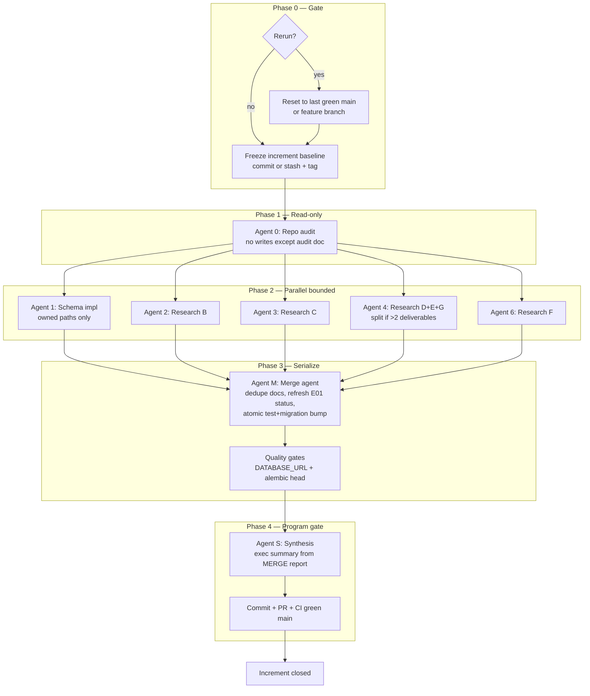

# KDO Multi-Agent Critical Path Audit

**Date:** 2026-06-04  
**Scope:** KrishiNetra KDO orchestration — PI2 single-agent vs 5-agent parallel rerun  
**Method:** Repo inspection (`git`, migrations, tests, status docs) + merge notes in [PI2_REPO_AUDIT.md](./PI2_REPO_AUDIT.md) and [PI2_EXECUTIVE_SUMMARY.md](./PI2_EXECUTIVE_SUMMARY.md)  
**Rule:** Evidence-based; **no PI2 deliverables regenerated**; **no code changes**

---

## 1. Executive Summary

PI2 was executed twice (Phase 4 single coordinator; PI2 rerun with audit + S06 + parallel research + synthesis). Work landed on disk and passes local gates, but **git `origin/main` @ `364ec5e` does not contain S05/S06 migrations, PI2 docs, or updated chain tests**. Three program dashboards disagree on migration head and S06 status. Synthesis (Agent 5) explicitly allows finishing before peer agents, which worked this run but is a structural race. **Recommended fix:** enforce a **linear orchestration DAG** with a dedicated **merge/commit agent** as the only writer to shared status files and git, and treat **commit + CI green on `main`** as the increment completion gate—not synthesis markdown.

---

## 2. PI2 Rerun Evidence (Repo State)

### 2.1 Git truth vs disk truth

| Signal | Value | Evidence |
|--------|-------|----------|
| `git rev-parse HEAD` | `364ec5e` | `E-01 Phase 2 and Phase 3: registry, quality, observations` |
| Tracked migrations @ HEAD | `0001` → `0005` | `git ls-tree HEAD …/migrations/versions/` |
| Untracked migrations | `0006_signals_partitioned.py`, `0007_forecast_and_features.py` | `git status` |
| `alembic heads` (workspace) | `0007_forecast_and_features` | `uv run alembic heads` |
| Working tree | **Dirty** — 14 modified, 25+ untracked | `git status` (2026-06-04 audit) |

**Split-brain on tests:** `tests/unit/test_alembic_revision_chain.py` is **modified locally** to assert head `0007`; **committed** copy @ HEAD asserts `0005`. CI on `origin/main` runs against HEAD only—local “green” does not imply remote green until atomic commit.

### 2.2 Status document collision

| Document | Claims | Conflict |
|----------|--------|----------|
| `E01_PROGRAM_STATUS.md` (working tree) | Head `0006`, S06 **not started**, Phase 4 stop | Stale vs disk `0007` and PI2 |
| `E01_PROGRAM_STATUS.md` @ HEAD | Head `0005`, 6/11 stories, Phase 3 | Stale vs working tree |
| `PI2_PROGRAM_STATUS.md` (untracked) | Head `0007`, S06 **Done**, 8/11 | True on disk only |
| `PROGRAM_STATUS.md` @ HEAD | Phase 1, 2026-06-03 | Ignores PI2 entirely |

[PI2_REPO_AUDIT.md](./PI2_REPO_AUDIT.md) §7 and [PI2_EXECUTIVE_SUMMARY.md](./PI2_EXECUTIVE_SUMMARY.md) §4 document the same drift; Agent 5 flagged `E01_PROGRAM_STATUS.md` as stale but did not reconcile it (synthesis scope).

### 2.3 PI2 deliverables on disk (not in git)

Per [PI2_REPO_AUDIT.md](./PI2_REPO_AUDIT.md) and [PI2_EXECUTIVE_SUMMARY.md](./PI2_EXECUTIVE_SUMMARY.md) deliverable table:

| Category | On disk | @ `364ec5e` |
|----------|---------|-------------|
| `PI2_REPO_AUDIT.md`, `PI2_EXECUTIVE_SUMMARY.md`, `PI2_PROGRAM_STATUS.md` | Yes | No |
| Research B–G (10 files) | Yes (untracked) | No |
| S05/S06 code, migrations, unit tests | Yes (mostly untracked) | No |
| `E01_S05_COMPLETION_REPORT.md`, `E01_S06_COMPLETION_REPORT.md` | Yes | No |

### 2.4 Duplicate orchestration (Phase 4 vs PI2)

| Aspect | Phase 4 (single-agent) | PI2 rerun (multi-agent) |
|--------|------------------------|-------------------------|
| S05 implementation | Done ([E01_PHASE4_EXECUTIVE_SUMMARY.md](./E01_PHASE4_EXECUTIVE_SUMMARY.md)) | Assumed pre-existing |
| S06 | **Out of scope** per Phase 4 stop rule | Agent 1 track A — [E01_S06_COMPLETION_REPORT.md](./E01_S06_COMPLETION_REPORT.md) notes **validate only** (`0007` already at head) |
| Agmarknet research | `AGMARKNET_INGESTION_SPIKE.md` (Phase 4) | `AGMARKNET_REALITY_CHECK.md` (PI2 Track B) — overlapping intent, different filenames |
| Weather | `WEATHER_SIGNAL_FRAMEWORK.md` | `IMD_FEASIBILITY_ASSESSMENT.md` |
| Lifecycle | `COMMODITY_LIFECYCLE_MODEL.md` | `COTTON_LIFECYCLE_SIGNAL_MAPPING.md` |

Risk: two program narratives and duplicate research paths without a merge agent to dedupe or deprecate Phase 4 artifacts.

### 2.5 Test state

| Run | Result | Notes |
|-----|--------|-------|
| `pytest` no `DATABASE_URL` | **39 passed**, 20 skipped, 0 failed | [PI2_REPO_AUDIT.md](./PI2_REPO_AUDIT.md) §6; requires untracked `0006`/`0007` on disk |
| `pytest` with Postgres (prior session) | 56–57 passed, 1 failed/skip | `test_version_activation` dirty-DB flake ([PI2_PROGRAM_STATUS.md](../implementation/PI2_PROGRAM_STATUS.md) R-06) |
| `test_alembic_revision_chain_linear` @ HEAD (clean tree) | Expects `0005` | `git show HEAD:tests/unit/test_alembic_revision_chain.py` |
| Same test (current workspace) | Expects `0007` | Uncommitted diff |

**CI implication:** Pushing only migrations without chain-test update (or vice versa) breaks `main`. [`.github/workflows/ci.yml`](../../.github/workflows/ci.yml) runs `alembic upgrade head` then full `pytest` with `DATABASE_URL`.

### 2.6 Synthesis timing

[PI2_EXECUTIVE_SUMMARY.md](./PI2_EXECUTIVE_SUMMARY.md) §4:

> *Honest merge after disk scan (Agent 5 may complete before other agents finish writing)*

At synthesis time all named deliverables were present—**lucky merge**, not enforced barrier. Agent 5 also ran quality gates (pytest/ruff/mypy) that can pass before implementation agents finish writing or before migrations are committed.

---

## 3. Critical Path Failure Mode Analysis

### 3.1 Dependency ordering

| Dependency | Intended order | PI2 observation |
|------------|----------------|-----------------|
| Audit → implement | Audit read-only before code agents | **Met** — [PI2_REPO_AUDIT.md](./PI2_REPO_AUDIT.md) Agent 1 audit only; no S06 impl in audit |
| Migrations sequential | `0005` → `0006` → `0007` | **Met on disk**; **not met in git** |
| S05 → S06 | `snapshot_id` FK chain | **Met on disk** |
| Research → synthesis | All tracks before exec summary | **Not enforced** — synthesis may run early |
| S06 → S07 → S11 | Engineering critical path | **Open** — correctly not started in PI2 |

### 3.2 File ownership collisions

| Shared artifact | Writers observed | Risk |
|-----------------|------------------|------|
| `E01_PROGRAM_STATUS.md` | Phase 4 coordinator; PI2 agents (modified, stale) | **HIGH** — founder reads wrong % complete |
| `tests/unit/test_alembic_revision_chain.py` | Implementation agent(s) | **HIGH** — CI/local mismatch if commit partial |
| `docs/research/*` | Phase 4 + PI2 parallel tracks | **MEDIUM** — duplicate spikes, no canonical index |
| Agent 4 | Tracks D, E, G in one agent | **MEDIUM** — context overload; no cross-track merge review |

No agent was chartered as **sole owner** of program dashboards; Agent 5 wrote PI2 status but not E-01 dashboard refresh.

### 3.3 Race conditions

| Race | Severity | Evidence |
|------|----------|----------|
| Synthesis before research complete | **YELLOW** | PI2 exec summary disclaimer |
| Synthesis before S06 validation complete | **YELLOW** | S06 report: validate-only; impl may predate audit |
| Parallel agents → dirty DB / migration tests | **LOW** | `test_alembic_downgrade_one_revision` flake under parallel DB mutation ([E01_S06_COMPLETION_REPORT.md](./E01_S06_COMPLETION_REPORT.md)) |
| Quality gates before all code landed | **YELLOW** | 39 pass without DB; integration skipped |

### 3.4 Git truth vs disk truth

| Failure | Trigger | Impact |
|---------|---------|--------|
| Program claims “PI2 complete” | Synthesis docs | Founder/PM false confidence |
| CI green on `main` | HEAD without `0006`/`0007` | Remote does not match local head `0007` |
| Partial commit | Migrations without tests or docs | Broken chain or misleading audit |
| Rerun without rollback | Second PI2 on dirty tree | Duplicate reports, overlapping research filenames |

### 3.5 Duplicate orchestration

Rerunning PI2 without:

1. Committing or stashing prior increment work  
2. Freezing Phase 4 artifact set as read-only baseline  
3. Assigning deprecate-vs-supersede rules for research filenames  

…produces **overwriting narrative** (Phase 4 says next is S06; PI2 says S06 done) while **git still at S04-equivalent head** (`0005`).

### 3.6 Quality gate timing

| Gate | When run | Gap |
|------|----------|-----|
| `ruff` / `mypy` | Agent 5 / S06 validation | OK for workspace |
| `pytest` no DB | Agent 5 | Skips 20 integration tests — S05/S06 DB AC not proven |
| `alembic upgrade head` | Prior session; not re-run at synthesis | [PI2_PROGRAM_STATUS.md](../implementation/PI2_PROGRAM_STATUS.md) §6 |
| CI on `main` | Only on committed push | **Not run** for PI2 increment |

### 3.7 Commit/push as program gate

| State | PI2 claim | Git reality |
|-------|-----------|-------------|
| PI2 documentation increment | “Complete pending commit” ([PI2_PROGRAM_STATUS.md](../implementation/PI2_PROGRAM_STATUS.md) §8) | **Accurate** |
| E-01 S06 shipped | Exec summary “Yes” | **No** — untracked @ HEAD |

**Finding:** KDO treats markdown synthesis as increment done; git/CI gate is optional—**critical process gap**.

---

## 4. Recommended Agent Sequencing (Critical Path)

**Hard rules:**

1. **Agent 0 (audit)** completes before any implementation or research writes.  
2. **No agent** edits `E01_PROGRAM_STATUS.md` except **Merge agent** after all parallel work lands.  
3. **Synthesis agent** reads only Merge agent output + audit; does not run gates first.  
4. **Migration + chain test + completion report** commit in **one atomic changeset**.  
5. **Increment done** = `COMMIT` + CI on `main` (or merged PR), not synthesis file existence.

---

## 5. Risk Register (RED / YELLOW / GREEN)

| ID | Risk | Level | Evidence | Mitigation |
|----|------|-------|----------|------------|
| CP-01 | Git HEAD lags disk migrations (`0005` vs `0007`) | **RED** | `git status`, [PI2_REPO_AUDIT.md](./PI2_REPO_AUDIT.md) §1–2 | Atomic commit; block synthesis “complete” until pushed |
| CP-02 | Competing program status docs | **RED** | E01 vs PI2 vs PROGRAM_STATUS | Single owner (Merge agent); deprecate stale with date |
| CP-03 | Uncommitted test head bump (`0007` assert, migrations untracked) | **RED** | `git diff test_alembic_revision_chain.py` | Commit migrations + tests together; CI required |
| CP-04 | PI2 rerun on dirty tree without rollback | **RED** | Phase 4 + PI2 overlapping research | Freeze baseline; branch per increment |
| CP-05 | Synthesis before parallel agents finish | **YELLOW** | [PI2_EXECUTIVE_SUMMARY.md](./PI2_EXECUTIVE_SUMMARY.md) §4 | Merge agent barrier; synthesis waits on checklist |
| CP-06 | Quality gates without `DATABASE_URL` | **YELLOW** | 20 skipped tests | Merge agent runs full pytest before synthesis |
| CP-07 | Agent 4 multi-track research (D,E,G) | **YELLOW** | Three PI2 research files same agent | Split tracks or time-box per deliverable |
| CP-08 | Duplicate research artifacts (Phase 4 vs PI2) | **YELLOW** | Spike vs reality-check pairs | Merge agent index: canonical vs superseded |
| CP-09 | `test_version_activation` dirty DB | **GREEN** | PI2 R-06 | Session-scoped commodity IDs in integration tests |
| CP-10 | DS-001 unsigned (governance) | **GREEN** (pre-existing) | PI2 exec §5 | Parallel founder track; does not block S07 schema |

---

## 6. Multi-Agent Playbook (PI3+)

### 6.1 Agent roles

| Role | ID | Writes | Forbidden |
|------|-----|--------|-----------|
| **Baseline freeze** | Coordinator | Tag/branch note | — |
| **Audit** | Agent 0 | `docs/reviews/*_REPO_AUDIT.md` only | Code, migrations, status dashboards |
| **Implementation** | Agent 1 | `backend/…`, story tests, story completion report | Research, exec summary, `E01_PROGRAM_STATUS.md` |
| **Research (1 track each)** | Agents 2–7 | One deliverable path per agent | Shared files, migrations |
| **Merge** | Agent M | `E01_PROGRAM_STATUS.md`, dedupe index, test chain bump, changelog | Executive recommendation |
| **Synthesis** | Agent S | `PIx_EXECUTIVE_SUMMARY.md`, `PIx_PROGRAM_STATUS.md` | Implementation, git commit |
| **Commit gate** | Human or Agent C | Git commit + PR | — |

### 6.2 Gates (checklist)

| Gate | Owner | Pass criteria |
|------|-------|---------------|
| G0 Increment freeze | Coordinator | Clean tree or dedicated `feature/pi3-*` branch |
| G1 Audit complete | Agent 0 | Audit doc lists HEAD vs disk explicitly |
| G2 Parallel complete | Agents 1–7 | All paths in merge manifest exist on disk |
| G3 Merge complete | Agent M | Single migration head; E01 status matches disk; no duplicate canonical research |
| G4 Quality | Agent M | `ruff`, `mypy`, `pytest` with `DATABASE_URL`, `alembic upgrade head` |
| G5 Synthesis | Agent S | Exec summary references G3 manifest only |
| G6 Program closed | Commit gate | One PR; CI green; `origin/main` HEAD = disk head |

### 6.3 File ownership matrix (PI3 example)

| Path pattern | Owner |
|--------------|-------|
| `docs/reviews/PI3_REPO_AUDIT.md` | Agent 0 |
| `backend/app/persistence/migrations/versions/*` | Agent 1 (one story per increment) |
| `docs/research/<TRACK>_*.md` | One agent per track |
| `docs/implementation/E01_PROGRAM_STATUS.md` | **Merge agent only** |
| `docs/implementation/PI3_PROGRAM_STATUS.md` | Agent S (after G3) |
| `docs/reviews/PI3_EXECUTIVE_SUMMARY.md` | Agent S (after G4) |

### 6.4 Rerun policy

1. Do not start PIx rerun on `main` with uncommitted PI(x-1) work.  
2. If rerun required: `git stash` or commit PI(x-1) first; document rollback SHA in audit.  
3. Supersede prior research via Merge agent index—do not delete Phase artifacts without trace.

### 6.5 What PI2 did well (keep)

- Audit agent **read-only** with explicit HEAD vs disk table ([PI2_REPO_AUDIT.md](./PI2_REPO_AUDIT.md)).  
- Synthesis **honest** about early completion risk.  
- Stop rule respected (no S07/S09/S11, no ML/agents).  
- Parallel research tracks B–G isolated under `docs/research/`.

---

## 7. Immediate Hygiene (Post-Audit, Not Executed Here)

Ordered actions for program owner (no code gen in this audit):

1. Single atomic PR: `0006`, `0007`, models/repos/tests, chain test, S05/S06 reports, PI2 docs, research B–G.  
2. Merge agent refresh of `E01_PROGRAM_STATUS.md` to head `0007` and 8/11 stories—or mark PI2 status as canonical until merged.  
3. Add `docs/research/README.md` canonical index (Phase 4 vs PI2 supersession)—optional, Merge agent owned.  
4. Archive or tag Phase 4 baseline SHA before PI3.

---

## 8. Top 5 Critical Path Risks (Summary)

| Rank | Risk | Level |
|------|------|-------|
| 1 | **Git HEAD vs disk migration head** — program “done” while `origin/main` stops at `0005` | RED |
| 2 | **Uncommitted atomic unit broken** — migrations untracked, chain test modified separately | RED |
| 3 | **Stale / competing status dashboards** — E01 vs PI2 vs PROGRAM_STATUS | RED |
| 4 | **Duplicate increment without rollback** — Phase 4 + PI2 overlapping scope and research | RED |
| 5 | **Synthesis and gates before merge barrier** — Agent 5 may finish before peers; pytest without DB | YELLOW |

**Recommended sequencing fix:** Insert **Merge agent (G3)** and **Commit gate (G6)** between parallel agents and synthesis; run **audit → parallel impl/research → merge + full DB pytest → synthesis → single commit/CI**; never mark an increment complete until `main` HEAD matches disk migration head.

---

*End of KDO multi-agent critical path audit.*
