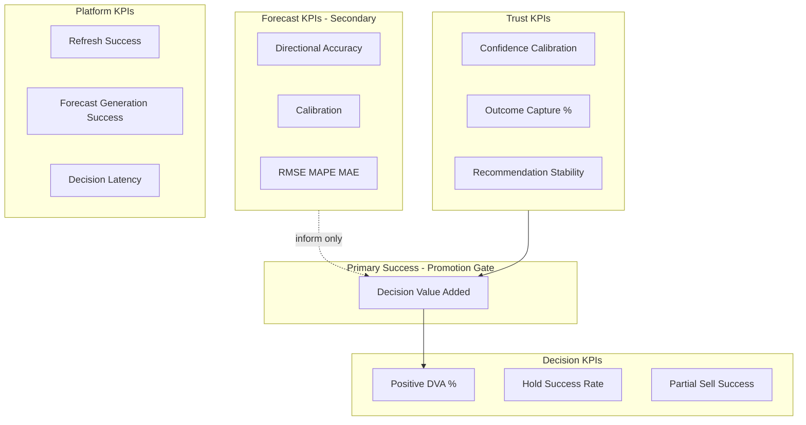
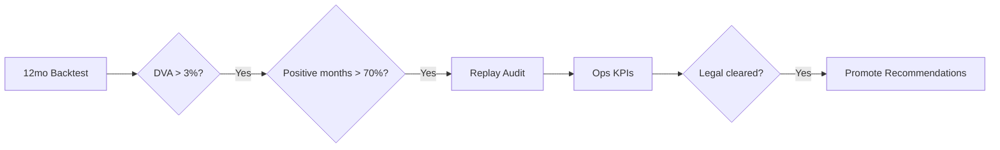

# TDS-000 — KPI Framework

**Wave:** 2  
**Status:** Draft  
**Sources:** `docs/founder/*`, TDS-001–005, founder clarifications (DVA promotion gate)  
**Purpose:** Define measurable business and technical KPIs for forecast quality, decision value, trust, and platform health.

**Founder decisions:** FD-003 (futures benchmark), FD-009 (DVA primary), FD-020 (three-strategy backtest), FD-021 (trust framework)

---

## 1. KPI Hierarchy

**Principle (FD-009, REQ-083):** Forecast accuracy KPIs are **secondary** to Decision KPIs for product promotion.

---

## 2. Forecast KPIs

### 2.1 RMSE (Root Mean Square Error)

| Field | Definition |
|-------|------------|
| **Formula** | \( \text{RMSE} = \sqrt{\frac{1}{n}\sum_{i=1}^{n}(y_i - \hat{y}_i)^2} \) where \(y_i\) = realized price at horizon \(h\), \(\hat{y}_i\) = point forecast at same horizon, evaluated per `as_of_date` in backtest |
| **Unit** | INR per quintal (cotton Phase 1) or normalized price index |
| **Horizons** | Computed separately for 30, 60, 90 days (REQ-076) |
| **Why it matters** | Penalizes large forecast errors that would distort net hold value and farmer trust |
| **Target value (Phase 1)** | **PROPOSED:** RMSE₃₀ ≤ 8% of spot price; RMSE₆₀ ≤ 10%; RMSE₉₀ ≤ 12% — cotton-specific, subject to ops calibration |
| **Promotion threshold** | **Not a promotion gate** (FD-009). Monitor only; alert if RMSE₃₀ degrades >20% vs 90-day rolling baseline |

**Traceability:** REQ-081, NFR-CAL-001 | **Refs:** TDS-007 §8

---

### 2.2 MAPE (Mean Absolute Percentage Error)

| Field | Definition |
|-------|------------|
| **Formula** | \( \text{MAPE} = \frac{100\%}{n}\sum_{i=1}^{n}\left|\frac{y_i - \hat{y}_i}{y_i}\right| \) |
| **Why it matters** | Scale-free comparison across price regimes and mandis; useful for Agmarknet-gap periods |
| **Target value (Phase 1)** | **PROPOSED:** MAPE₃₀ ≤ 7%; MAPE₆₀ ≤ 9%; MAPE₉₀ ≤ 11% |
| **Promotion threshold** | Not a promotion gate; supplementary to RMSE |

**Caveat:** Undefined when \(y_i \approx 0\); exclude or cap denominators in implementation (Wave 3).

---

### 2.3 MAE (Mean Absolute Error)

| Field | Definition |
|-------|------------|
| **Formula** | \( \text{MAE} = \frac{1}{n}\sum_{i=1}^{n}|y_i - \hat{y}_i| \) |
| **Why it matters** | Robust to outliers vs RMSE; easier stakeholder communication in INR |
| **Target value (Phase 1)** | **PROPOSED:** MAE₃₀ ≤ 500 INR/qtl (illustrative; calibrate to cotton spot level at launch) |
| **Promotion threshold** | Not a promotion gate |

---

### 2.4 Directional Accuracy

| Field | Definition |
|-------|------------|
| **Formula** | \( \text{DA} = \frac{1}{n}\sum_{i=1}^{n}\mathbf{1}[\text{sign}(\hat{y}_i - p_0) = \text{sign}(y_i - p_0)] \) where \(p_0\) = spot at `as_of_date` |
| **Why it matters** | Economically useful holds/sells depend on direction more than point precision (FD-019, REQ-080) |
| **Target value (Phase 1)** | **PROPOSED:** DA₃₀ ≥ 58%; DA₆₀ ≥ 55%; DA₉₀ ≥ 52% |
| **Promotion threshold** | Not a promotion gate; **inform** confidence band width tuning (TDS-011) |

**Traceability:** REQ-081, FD-019

---

### 2.5 Forecast KPI Summary Table

| KPI | Primary? | Target (Phase 1) | Promotion gate |
|-----|----------|------------------|----------------|
| RMSE | No | PROPOSED per horizon | No |
| MAPE | No | PROPOSED per horizon | No |
| MAE | No | PROPOSED per horizon | No |
| Directional Accuracy | No | PROPOSED ≥52–58% | No |
| Confidence calibration | Trust (§4) | See §4.1 | Indirect |

---

## 3. Decision KPIs

### 3.1 DVA (Decision Value Added)

| Field | Definition |
|-------|------------|
| **Formula** | \( \text{DVA} = \overline{V_{\text{KN}}} - \max(\overline{V_{\text{sell}}}, \overline{V_{\text{curve}}}) \) where \(V\) = cumulative **net realized value** after carry over evaluation window, KrishiNetra strategy follows published recommendation, sell = immediate sell at spot, curve = hold-to-futures-curve (FD-003) |
| **Net value per path** | \( V = \sum_t (p_t \cdot q_t - \text{carry}_t) \) with storage, financing, quality loss per TDS-008 |
| **Window** | **12 calendar months** rolling (founder-approved promotion definition) |
| **Unit** | INR per quintal-equivalent or % of notional position value |
| **Why it matters** | **Primary product success metric** (FD-009, REQ-083, REQ-101) |
| **Target value (Phase 1)** | DVA > 0% sustained; operational target DVA > 2% before marketing claims |
| **Promotion threshold** | **APPROVED: DVA > 3%** over 12-month backtest (founder clarification) |

**Traceability:** REQ-100–REQ-102, FD-003, FD-009, FD-020 | **Refs:** TDS-008 §10, TDS-011 §5

---

### 3.2 Positive DVA %

| Field | Definition |
|-------|------------|
| **Formula** | \( \text{Positive DVA \%} = \frac{\text{count(months where DVA}_m > 0)}{12} \times 100\% \) |
| **Why it matters** | Consistency of value add—not one lucky month (REQ-102 "consistently") |
| **Target value (Phase 1)** | ≥ 75% months positive (operational stretch above gate) |
| **Promotion threshold** | **APPROVED: > 70%** of months with positive DVA (founder clarification) |

---

### 3.3 Hold Recommendation Success Rate

| Field | Definition |
|-------|------------|
| **Formula** | \( \text{Hold Success} = \frac{\text{count(Hold sessions where } V_{\text{actual hold}} > V_{\text{sell at decision date}})}{\text{count(Hold sessions with validated outcome)}} \) |
| **Scope** | Sessions where `action_type` ∈ {Hold, Partial Hold} |
| **Why it matters** | Trust risk when holds fail locally (§21); measures actionability of hold calls |
| **Target value (Phase 1)** | **PROPOSED:** ≥ 60% (conservative default mitigation FD-029) |
| **Promotion threshold** | Not standalone gate; contributes to DVA composite |

---

### 3.4 Partial Sell Success Rate

| Field | Definition |
|-------|------------|
| **Formula** | \( \text{Partial Sell Success} = \frac{\text{count(Partial Sell where } V_{\text{partial}} > V_{\text{full sell at decision}})}{\text{count(Partial Sell with validated outcome)}} \) |
| **Partial quantity** | Default **50%** per founder clarification (TDS-008) |
| **Why it matters** | Liquidity mitigation (FD-028, REQ-131); validates partial-default UX |
| **Target value (Phase 1)** | **PROPOSED:** ≥ 55% |
| **Promotion threshold** | Not standalone gate |

---

### 3.5 Decision KPI Summary Table

| KPI | Primary? | Target | Promotion gate |
|-----|----------|--------|----------------|
| DVA (12mo) | **Yes** | > 2% ops; **> 3% promote** | **DVA > 3%** APPROVED |
| Positive DVA % | **Yes** | ≥ 75% ops | **> 70%** APPROVED |
| Hold Success Rate | No | PROPOSED ≥ 60% | No |
| Partial Sell Success Rate | No | PROPOSED ≥ 55% | No |

---

## 4. Trust KPIs

### 4.1 Confidence Calibration

| Field | Definition |
|-------|------------|
| **Formula** | Reliability diagram: bucket forecasts by stated confidence \(c\); \( \text{Calibration error} = \sum_b | \bar{c}_b - \bar{y}_b | \); also Brier score for directional events |
| **Scope** | Forecast confidence bands (TDS-007) and recommendation confidence metadata |
| **Why it matters** | NFR-TRS-001, REQ-084; prevents over-reliance (OQ-002) |
| **Target value (Phase 1)** | Mean calibration error ≤ 0.08 |
| **Promotion threshold** | Not hard gate; must not worsen >15% vs baseline at promotion time |

---

### 4.2 Outcome Capture %

| Field | Definition |
|-------|------------|
| **Formula** | \( \text{Outcome Capture \%} = \frac{\text{sessions with validated Outcome}}{\text{delivered Decision Sessions}} \times 100\% \) |
| **Why it matters** | Flywheel (FD-023, REQ-110); without outcomes, calibration cannot improve |
| **Target value (Phase 1)** | **PROPOSED:** ≥ 15% at 90 days post-launch; ≥ 25% at 180 days |
| **Promotion threshold** | Not hard gate for model promotion; **required** for live calibration loop (TDS-011) |

**Open:** OQ-007 outcome workflow

---

### 4.3 Recommendation Stability

| Field | Definition |
|-------|------------|
| **Formula** | \( \text{Stability} = 1 - \frac{\text{flip count}}{\text{eligible refresh cycles}} \) where flip = `action_type` change for same position key without material signal movement |
| **Material movement** | Per TDS-008 §9 (pending OQ-004 thresholds) |
| **Why it matters** | REQ-140, NFR-TRS-004; noisy flips erode trust |
| **Target value (Phase 1)** | **PROPOSED:** Stability ≥ 85% weekly for returning users |
| **Promotion threshold** | Not hard gate; monitor with REQ-140 field tests |

---

## 5. Platform KPIs

### 5.1 Daily Refresh Success

| Field | Definition |
|-------|------------|
| **Formula** | \( \text{Refresh Success} = \frac{\text{days with MI\_SNAPSHOT\_READY by cutoff}}{\text{calendar days}} \times 100\% \) |
| **Cutoff** | **PROPOSED:** 06:00 IST (configurable) |
| **Why it matters** | REQ-140 daily cadence; stale MI invalidates decisions |
| **Target value (Phase 1)** | ≥ 98% monthly |
| **Promotion threshold** | ≥ 95% over trailing 30 days before public promotion |

---

### 5.2 Forecast Generation Success

| Field | Definition |
|-------|------------|
| **Formula** | \( \text{FG Success} = \frac{\text{FORECAST\_GENERATED with status=complete}}{\text{DATA\_REFRESH\_STARTED}} \times 100\% \) |
| **Why it matters** | FD-012 central precompute; failure blocks MI |
| **Target value (Phase 1)** | ≥ 99% |
| **Promotion threshold** | ≥ 97% trailing 30 days |

---

### 5.3 Decision Latency

| Field | Definition |
|-------|------------|
| **Formula** | \( \text{Latency} = t_{\text{RECOMMENDATION\_GENERATED}} - t_{\text{DECISION\_REQUESTED}} \) (p50, p95, p99) |
| **Scope** | Excludes user think-time; includes deterministic Decision + one Explainability pass (FD-015) |
| **Why it matters** | TC-008 cost bound; farmer UX on mobile |
| **Target value (Phase 1)** | p95 ≤ 3s deterministic only; p95 ≤ 8s with Explainability |
| **Promotion threshold** | p95 ≤ 10s end-to-end (PROPOSED) |

**Traceability:** REQ-064, FD-015, NFR-SCL-002

---

## 6. Unified Promotion Gate (Approved)

Recommendations and public value claims require **all** of:

| Criterion | Threshold | Status |
|-----------|-----------|--------|
| Backtest window | 12 calendar months | **APPROVED** |
| Aggregate DVA | > 3% | **APPROVED** |
| Positive DVA months | > 70% of months in window | **APPROVED** |
| Deterministic replay | 100% match on sample audit dates (REQ-103) | **APPROVED** (REQ-103) |
| Daily refresh success | ≥ 95% trailing 30d | **PROPOSED** ops gate |
| Forecast generation success | ≥ 97% trailing 30d | **PROPOSED** ops gate |
| Legal review | Complete | **PENDING** (OQ-009) |

**Traceability:** REQ-102, founder clarification, FD-020, FD-027

---

## 7. KPI Measurement Ownership

| KPI category | Producer module | Consumer |
|--------------|-----------------|----------|
| Forecast KPIs | Calibration batch / Forecast Service | Model selection (TDS-007), dashboards |
| Decision KPIs | Calibration batch | Promotion gate (TDS-011) |
| Trust KPIs | Calibration Service | Explainability tuning, ops |
| Platform KPIs | Orchestration / monitoring | SRE, on-call |

---

## 8. Assumptions

| ID | Assumption |
|----|------------|
| KPI-A01 | Forecast error targets are PROPOSED until 90 days live cotton data |
| KPI-A02 | DVA computed net of carry identically in backtest and live (NFR-TRC-002) |
| KPI-A03 | Hold/Partial success require validated outcomes—numerator may be small early |
| KPI-A04 | Monthly DVA buckets use calendar months, not rolling 30-day |

---

## 9. Open Questions

| ID | Question | KPI affected |
|----|----------|--------------|
| OQ-004 | Material signal movement | Stability |
| OQ-007 | Outcome validation rules | Outcome Capture %, Hold/Partial success |
| OQ-002 | Trust display | Confidence Calibration presentation |

---

## 10. Founder Approval Status

| Item | Status |
|------|--------|
| DVA > 3%, 12mo, >70% months | **Approved** |
| Forecast KPI targets | **PROPOSED — needs ops/founder sign-off** |
| Platform latency targets | **PROPOSED** |
| Legal gate on promotion | **Pending** |

---

## 11. Cross-References

| Document | Link |
|----------|------|
| TDS-007 | Forecast evaluation, backtest |
| TDS-008 | DVA strategy definitions, net value |
| TDS-011 | Calibration pipeline, promotion execution |
| TDS-006 | Entities storing KPI inputs |
