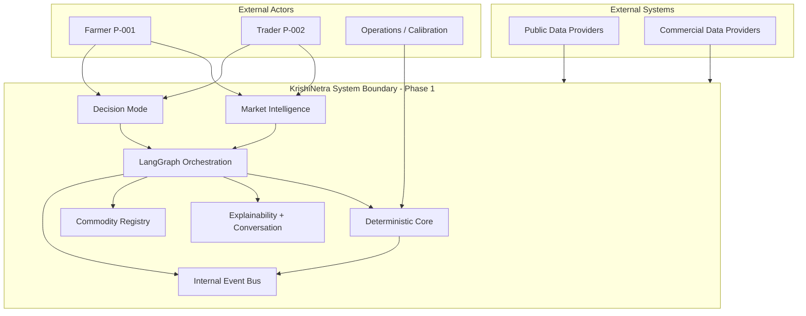
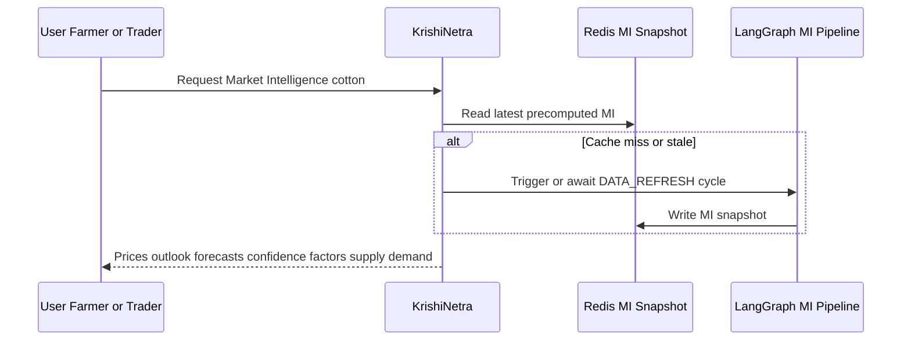
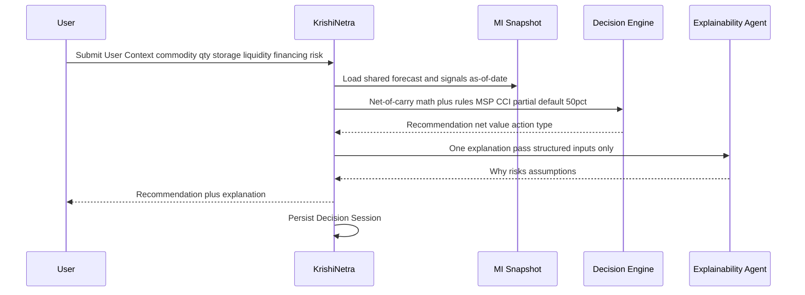
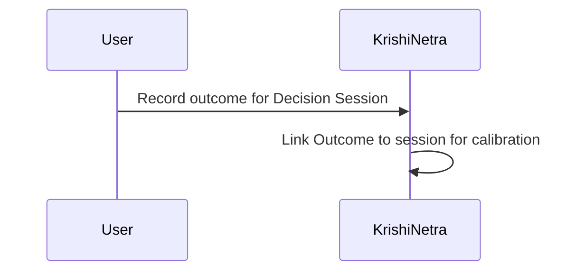

# TDS-001 — System Context

**Wave:** 1  
**Status:** Draft for engineering review  
**Sources:** `docs/founder/*` (Founder Intent Package)  
**Approved architecture (not revisited):** Modular Monolith, Python/FastAPI, PostgreSQL, Redis, LangGraph, event-driven internal communication, deterministic core + LLM explainability only

---

## 1. System Purpose

KrishiNetra is the **intelligence layer for agricultural inventory decisions**. It answers **"What should I do next?"** by combining market intelligence with personal context (liquidity, storage, financing, risk) and **explainable, auditable reasoning**—not merely "What is today's price?"

| Aspect | Definition |
|--------|------------|
| Core hypothesis | Farmers and traders improve realized outcomes when intelligence integrates market signals with personal constraints (REQ-001, REQ-002) |
| Economic frame | All evaluation and recommendations use **net realized value** after carry (FD-002, REQ-011, REQ-023) |
| Validation bar | System must demonstrate **decision value added** vs sell-at-harvest and hold-to-futures-curve before promotion (FD-003, FD-009, REQ-012) |
| Phase 1 commodity | **Cotton only** (FD-001, REQ-010, REQ-120) |

**Founder decisions:** FD-001, FD-002, FD-003, FD-006, FD-011, FD-012

---

## 2. System Boundaries

### 2.1 In Scope (Phase 1)

| Boundary | Contents |
|----------|----------|
| **Product modes** | Market Intelligence Mode (no registration); Decision Mode (user context required) |
| **Users** | Farmer (P-001), Trader (P-002)—trader intelligence is **per-position**, not portfolio (founder clarification) |
| **Commodity** | Cotton reference implementation via Commodity Registry (REQ-074, REQ-073) |
| **Intelligence pipeline** | Six deterministic domain agents → Forecast → shared MI precompute; per-user Decision + Explainability |
| **Outputs** | MI: prices, outlook, 30/60/90 forecasts, confidence, bullish/bearish factors, supply/demand; Decision: Sell/Hold/Partial Sell/Partial Hold net of carry + reasoning |
| **Data** | Public + commercial ingestion; proprietary decision sessions and outcomes (REQ-072, FD-023) |
| **Orchestration** | LangGraph within modular monolith; event-driven internal communication |
| **Persistence** | PostgreSQL (system of record); Redis (MI precompute cache, session hot paths) |

### 2.2 Out of Scope (Phase 1)

| Item | Roadmap / notes | Requirement refs |
|------|-----------------|------------------|
| Multi-commodity live intelligence | Phase 7 | REQ-126, FD-010 |
| Portfolio-level trader intelligence | Phase 2+ personalization | Founder clarification; REQ-022 note |
| Enterprise persona (P-003) | Post–Phase 1 | REQ-003 |
| Inventory registration entity | Phase 2 | REQ-091, REQ-121 |
| Warehouse, financing, marketplace | Phases 4–6 | REQ-123–REQ-125 |
| Farmer monetization | Explicitly free | FD-005, REQ-112 |
| Trader paid subscription | Later | FD-025, REQ-113 |
| Registration for Market Intelligence | Prohibited in Phase 1 | FD-011, REQ-030, PC-008 |
| LLM in forecast or decision math | Prohibited always | TC-001, FD-006, REQ-015 |

### 2.3 System Boundary Diagram

---

## 3. External Actors

| Actor | Role | Phase 1 interaction | Persona / reqs |
|-------|------|----------------------|----------------|
| **Farmer** | Cotton producer seeking sell/hold guidance | MI without login; Decision with context | P-001; REQ-021, REQ-014 |
| **Trader** | Cotton inventory holder | MI without login; **per-position** Decision sessions | P-002; founder clarification |
| **Operations / Data team** | Ingestion monitoring, backtest, calibration | Internal; not end-user product | REQ-100–REQ-103, NFR-CAL-* |
| **Legal / Compliance** (future) | Advice framing review | Advisory; not in runtime path Phase 1 | RC-001, OQ-009 |

**Not Phase 1 actors:** Enterprise buyer (P-003), warehouse operator, lender, marketplace participant.

---

## 4. External Systems & Data Providers

### 4.1 Public Data Providers (REQ-070)

| Provider | Data domain | Used by |
|----------|-------------|---------|
| **Agmarknet** | Mandi prices, arrivals (lag/gap risk DC-001) | Market Agent |
| **eNAM** | National market prices | Market Agent |
| **IMD** | Rainfall, drought, weather | Weather Agent (incl. acreage proxy inputs) |
| **Agriculture Ministry** | MSP, policy, CCI-related | Policy Agent |
| **USDA** | Global supply/demand | Global, Demand |
| **ICAC** | Cotton industry statistics | Global, Demand |

### 4.2 Commercial Data Providers (REQ-071)

| Provider type | Data domain | Used by |
|---------------|-------------|---------|
| **Futures feeds** | Curve, basis, open interest | Futures Agent; benchmark (FD-003) |
| **Industry reports** | Demand refinement | Demand Agent |

### 4.3 External Dependency List

| Dependency | Criticality | Failure impact | Mitigation (founder) |
|------------|-------------|----------------|----------------------|
| Agmarknet | High | Price/arrival gaps | Basis modeling + futures feed (FD-030, REQ-133) |
| Futures feed | High | No curve benchmark | Blocks DVA validation (FD-027) |
| IMD | Medium | Weather signal degradation | Forecast confidence down-ranking |
| LLM provider (Explainability/Conversation) | Medium | No narrative reasoning; deterministic outputs still valid | Degrade to structured-only display (Wave 2 UX) |
| PostgreSQL | High | No persistence | — (Wave 2 ops) |
| Redis | Medium | MI latency/cost; rebuild from precompute job | Re-run MI pipeline |

---

## 5. User Interaction Flows

### 5.1 Market Intelligence Flow (Unregistered)

**Requirements:** REQ-030–REQ-037, REQ-031–REQ-035 | **Decisions:** FD-011, FD-012

**Characteristics:**
- No user identity required (NFR-REL-001)
- Same snapshot for all users (NFR-REP-005, NFR-SCL-001)
- Refreshed on **daily data cadence** (REQ-140; provisional OQ-001)

### 5.2 Decision Mode Flow (Per-Position)

**Requirements:** REQ-040–REQ-047, REQ-064 | **Decisions:** FD-015, FD-016, FD-017, FD-018

**Founder clarifications applied:**
- **Near MSP:** spot within **±3%** of MSP triggers MSP/CCI floor rule evaluation (FD-008)
- **Partial Sell default:** **50%** of quantity when Partial Sell recommended (PC-011)
- **Trader:** one session = one position; no cross-position aggregation (founder clarification)

### 5.3 Outcome Capture Flow (Flywheel)

**Requirements:** REQ-110, REQ-111, NFR-TRC-004 | **Decision:** FD-023

**Open:** Outcome capture UX and validation mechanics (OQ-007)—Wave 1 designs event `OUTCOME_CAPTURED`; workflow TBD.

### 5.4 Conversation Flow (Optional, Post-Explanation)

**Requirements:** REQ-059, NFR-EXP-005 | **Constraint:** TC-005

User asks natural-language questions **only over the explanation artifact**; Conversation Agent must not access raw model internals or alter recommendation.

---

## 6. Phase 1 Scope Boundary Summary

| Capability | In | Out |
|------------|----|-----|
| Cotton Commodity Registry | ✓ | Other commodities |
| 6 domain agents + Forecast + Decision | ✓ | — |
| Explainability + Conversation LLM | ✓ | LLM forecast/decision |
| Central MI precompute | ✓ | Per-user MI recompute |
| Per-position Decision | ✓ | Portfolio aggregation |
| Decision sessions + outcomes | ✓ | Inventory entity |
| 12-month DVA backtest gate | ✓ (design-time) | Public promotion until met |
| Daily refresh + stability gating | ✓ (provisional) | Final thresholds OQ-004 |

---

## 7. Approved Technology Context (Reference Only)

These decisions are **approved and fixed** for Wave 1 design; this TDS does not redefine them.

| Layer | Choice |
|-------|--------|
| Architecture style | Modular Monolith |
| Backend | Python + FastAPI |
| Database | PostgreSQL |
| Cache | Redis |
| Orchestration | LangGraph |
| Internal integration | Event-driven |

Wave 1 documents describe **logical** structure aligned to these choices without specifying APIs, schemas, or deployment.

---

## 8. Assumptions

| ID | Assumption | Basis |
|----|------------|-------|
| ASM-001 | Phase 1 serves cotton markets in India with MSP/CCI policy relevance | FD-001, §12 |
| ASM-002 | Daily batch refresh is sufficient for Phase 1 intelligence | REQ-140, OQ-001 working answer |
| ASM-003 | Commercial futures feed is licensed and available for Phase 1 | REQ-071 |
| ASM-004 | Users can supply financing and risk profiles at sufficient granularity for net-of-carry math | REQ-040 |
| ASM-005 | Explainability LLM failure does not block delivery of deterministic recommendation | NFR-IMP-001 |
| ASM-006 | Modular monolith modules communicate via internal events, not synchronous chains for MI refresh | Approved architecture |
| ASM-007 | Redis holds latest MI artifact keyed by commodity + as-of-date | FD-012, NFR-SCL-001 |

---

## 9. Open Issues

| ID | Issue | Source | Wave 1 impact |
|----|-------|--------|---------------|
| OQ-001 | Stability gating thresholds for recommendation flips | OPEN_QUESTIONS | Design hook in Decision Service; thresholds TBD |
| OQ-002 | Trust score display format | OPEN_QUESTIONS | Explainability output shape deferred |
| OQ-004 | Material signal movement definition | OPEN_QUESTIONS | Event-driven refresh may emit signals; flip logic TBD |
| OQ-007 | Outcome capture workflow | OPEN_QUESTIONS | OUTCOME_CAPTURED event defined; producer UX TBD |
| OQ-009 | Legal classification of guidance | OPEN_QUESTIONS | **Requires founder/legal approval** before scale |

### Resolved by founder clarifications (not open in Wave 1)

| Former OQ | Resolution |
|-----------|------------|
| OQ-005 Near MSP | ±3% of MSP |
| OQ-006 Partial quantity | Default Partial Sell = 50% |
| OQ-008 Consistently adds value | 12-month backtest, DVA > 3%, positive DVA in >70% of months |
| Acreage agent | Weather Agent Phase 1 |

---

## 10. Items Requiring Founder Approval

| Item | Status |
|------|--------|
| Near MSP ±3% | **Approved** (founder clarification) |
| Partial Sell 50% default | **Approved** |
| DVA promotion thresholds | **Approved** |
| Per-position trader scope | **Approved** |
| Trust UI format (OQ-002) | **Pending** |
| Stability / material movement thresholds (OQ-004) | **Pending** |
| Legal advice framing (OQ-009) | **Pending** |
| Outcome capture mechanics (OQ-007) | **Pending** |

---

## 11. Requirement Traceability (Context Level)

| Context element | Requirement IDs | Founder decisions |
|-----------------|-----------------|-------------------|
| System purpose | REQ-001, REQ-002, REQ-020 | FD-001–FD-003 |
| MI without registration | REQ-030, REQ-036 | FD-011 |
| Central precompute | REQ-037, REQ-098 | FD-012 |
| Decision inputs/outputs | REQ-040–REQ-047 | FD-016–FD-018, FD-008 |
| Deterministic boundary | REQ-015, REQ-062, REQ-063 | FD-006, FD-007 |
| Phase 1 scope | REQ-120, PC-001 | FD-001, FD-024 |
| Promotion gate | REQ-102, REQ-100–REQ-101 | FD-020, FD-009 |

---

## 12. Document Control

| Version | Date | Author role |
|---------|------|-------------|
| 0.1 | Wave 1 | Lead Solution Architect |

**Next wave (out of scope):** REST APIs, persistence schemas, infrastructure, CI/CD.
