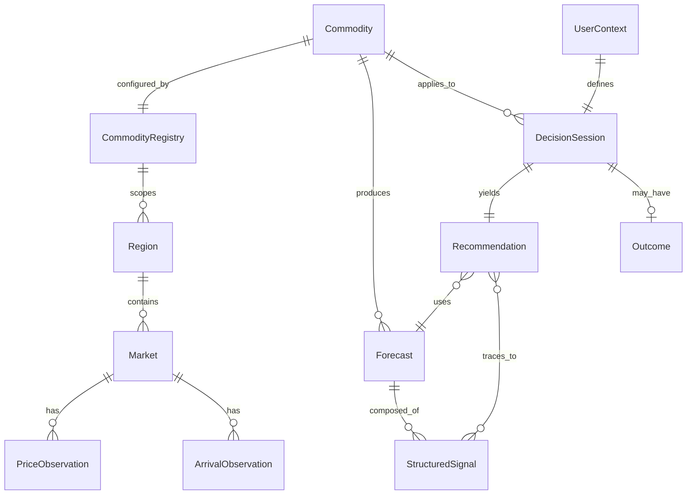
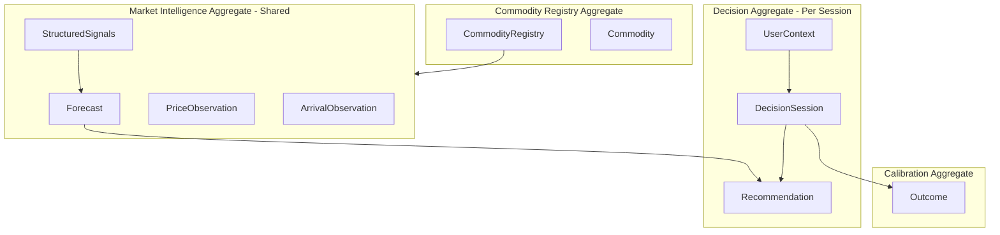
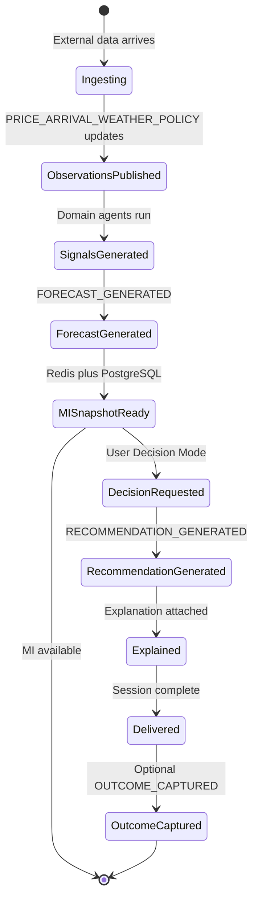

# TDS-002 — Domain Model

**Wave:** 1  
**Status:** Draft — conceptual model only (no SQL, no API contracts)  
**Sources:** `docs/founder/*`, founder clarifications  
**Requirements:** REQ-090, REQ-073, REQ-074, REQ-040–REQ-047

---

## 1. Purpose

This document defines the **conceptual domain model** for KrishiNetra Phase 1. It establishes entity meaning, attributes, relationships, lifecycles, and aggregate boundaries for engineering alignment—without database schemas or persistence design (Wave 2).

**Founder decisions:** FD-001 (cotton-first), FD-008 (MSP/CCI rule), FD-022 (commodity-configurable), FD-023 (flywheel)

---

## 2. Domain Overview Diagram

---

## 3. Entity Definitions

### 3.1 Commodity

| Aspect | Definition |
|--------|------------|
| **Purpose** | Identifies an agricultural commodity for which KrishiNetra provides intelligence and decisions. Phase 1: **cotton only**. |
| **Key attributes** | `commodity_id`, `name`, `status` (active/inactive), `reference_implementation_flag` (cotton=true) |
| **Relationships** | 1:1 with Commodity Registry configuration; 1:N Forecasts; scopes Decision Sessions |
| **Lifecycle** | `draft` → `active` (Phase 1 cotton) → `deprecated` (future) |
| **Domain ownership** | **Commodity Registry** bounded context |
| **Traceability** | REQ-010, REQ-074, FD-001 |

---

### 3.2 Commodity Registry

| Aspect | Definition |
|--------|------------|
| **Purpose** | Per-commodity configuration driving ingestion, agents, horizons, and decision parameters. Enables commodity-configurable architecture without redesigning core patterns (FD-022). |
| **Key attributes** | `registry_id`, `commodity_id`, `price_sources[]`, `arrival_sources[]`, `demand_drivers[]`, `policy_drivers[]`, `weather_variables[]` (incl. **acreage** per founder clarification), `quality_dimensions[]`, `storage_characteristics`, `forecast_horizons[]` (30/60/90), `decision_rules[]` (e.g., MSP/CCI floor parameters), `version`, `effective_from` |
| **MSP/CCI rule parameters** | `msp_proximity_pct` = **3%** (founder clarification); `cci_active_procurement_flag` source mapping |
| **Partial sell default** | `default_partial_sell_pct` = **50%** (founder clarification) |
| **Relationships** | Configures all domain agents and Forecast/Decision behavior for one Commodity |
| **Lifecycle** | `versioned` — new registry version published; intelligence runs against active version |
| **Domain ownership** | **Commodity Registry Service** (configuration aggregate root) |
| **Traceability** | REQ-073, REQ-075, DC-004, FD-022 |

**Cotton reference (REQ-075):** arrivals, futures curve, MSP, CCI procurement, mill demand, exports, weather, acreage (Weather Agent), global inventories.

---

### 3.3 Region

| Aspect | Definition |
|--------|------------|
| **Purpose** | Geographic or market segmentation for prices, arrivals, and regional strength signals. |
| **Key attributes** | `region_id`, `name`, `type` (state/mandi/zone), `parent_region_id`, `commodity_id` |
| **Relationships** | N Markets per Region; scopes Price and Arrival observations |
| **Lifecycle** | Stable reference data; occasional additions |
| **Domain ownership** | **Market Intelligence** (read-heavy reference) |
| **Traceability** | REQ-090, DD-001 regional strength |

---

### 3.4 Market

| Aspect | Definition |
|--------|------------|
| **Purpose** | A trading venue or price discovery context (e.g., mandi, exchange-linked market) within a Region. |
| **Key attributes** | `market_id`, `region_id`, `commodity_id`, `market_type`, `identifiers` (Agmarknet/eNAM refs) |
| **Relationships** | Parent Region; child Price and Arrival observations |
| **Lifecycle** | Reference data aligned to ingestion sources |
| **Domain ownership** | **Market Intelligence** |
| **Traceability** | REQ-031, REQ-050 |

---

### 3.5 Price Observation

| Aspect | Definition |
|--------|------------|
| **Purpose** | Point-in-time or period price measurement from a source, anchored for deterministic replay. |
| **Key attributes** | `observation_id`, `market_id`, `commodity_id`, `price_type` (spot/mandi/futures-linked), `value`, `unit`, `currency`, `observed_at`, `ingested_at`, `source`, `as_of_date`, `quality_grade` (optional) |
| **Relationships** | Belongs to Market; feeds Market Agent structured signal; inputs Decision net hold value (current price) |
| **Lifecycle** | `received` → `validated` → `published` (emits PRICE_UPDATED) → `superseded` |
| **Domain ownership** | **Ingestion / Market Intelligence** (observation aggregate) |
| **Traceability** | REQ-031, REQ-070, NFR-AUD-002, NFR-TRC-001 |

---

### 3.6 Arrival Observation

| Aspect | Definition |
|--------|------------|
| **Purpose** | Physical flow or arrival volume signal for supply assessment. |
| **Key attributes** | `observation_id`, `market_id`, `commodity_id`, `volume`, `unit`, `observed_at`, `as_of_date`, `source` |
| **Relationships** | Belongs to Market; feeds Market Agent |
| **Lifecycle** | Same pattern as Price Observation; emits ARRIVAL_UPDATED |
| **Domain ownership** | **Ingestion / Market Intelligence** |
| **Traceability** | REQ-050, REQ-075 |

---

### 3.7 Forecast

| Aspect | Definition |
|--------|------------|
| **Purpose** | Deterministic 30/60/90-day cotton outlook with confidence bands, shared across all users for a given data refresh. |
| **Key attributes** | `forecast_id`, `commodity_id`, `as_of_date`, `horizons[]` (30/60/90), `point_estimates[]`, `confidence_bands[]`, `directional_bias`, `composed_signal_refs[]`, `model_version`, `generated_at` |
| **Relationships** | Produced from StructuredSignals (all domain agents); consumed by Recommendation and MI |
| **Lifecycle** | `pending` → `generated` (FORECAST_GENERATED) → `published_to_mi` → `archived` |
| **Domain ownership** | **Forecast Service** (deterministic aggregate) |
| **Traceability** | REQ-056, REQ-076, REQ-032, FD-012, NFR-REP-001 |

**Constraint:** No LLM involvement (TC-001).

---

### 3.8 Recommendation

| Aspect | Definition |
|--------|------------|
| **Purpose** | Deterministic sell/hold guidance for a specific user context, net of carry, with traceable rule application. |
| **Key attributes** | `recommendation_id`, `action_type` (Sell | Hold | Partial Sell | Partial Hold), `net_value_after_carry`, `partial_quantity_pct` (default **50%** for Partial Sell), `net_hold_value_components` (forecast price, current price, storage, financing, quality loss, risk adjustment), `rules_applied[]` (e.g., MSP/CCI floor), `msp_proximity_triggered` (bool), `forecast_ref`, `signal_snapshot_refs[]`, `as_of_date`, `stability_token` (flip gating, TBD OQ-004) |
| **Relationships** | 1:1 with Decision Session; depends on Forecast + User Context |
| **Lifecycle** | `computed` → `explained` → `delivered` → `superseded` (if stability-gated refresh changes call) |
| **Domain ownership** | **Decision Service** (deterministic aggregate) |
| **Traceability** | REQ-041–REQ-047, REQ-044, FD-016, FD-018, FD-008 |

**MSP/CCI rule (founder clarification):** `msp_proximity_triggered` when spot within **±3%** of MSP and CCI actively procuring.

---

### 3.9 User Context

| Aspect | Definition |
|--------|------------|
| **Purpose** | Personal constraints for net-of-carry decision math. One context per **position** (farmer lot or trader position)—not a portfolio aggregate in Phase 1. |
| **Key attributes** | `context_id`, `commodity_id`, `quantity`, `storage_access` (bool/level), `liquidity_need` (enum/severity), `financing_profile` (cost of capital, obligations), `risk_profile` (tolerance tier), `persona_type` (farmer/trader), `region_preference` (optional) |
| **Relationships** | Input to Decision Session; no cross-session aggregation in Phase 1 |
| **Lifecycle** | `captured` → `bound_to_session` → `immutable_for_session` |
| **Domain ownership** | **User Context Service** |
| **Traceability** | REQ-040, REQ-021, REQ-022 (per-position only Phase 1) |

---

### 3.10 Decision Session

| Aspect | Definition |
|--------|------------|
| **Purpose** | Immutable binding of user context, market as-of-date, recommendation, and explanation for audit, backtest correlation, and flywheel. |
| **Key attributes** | `session_id`, `user_context_ref`, `commodity_id`, `as_of_date`, `recommendation_ref`, `explanation_ref`, `mi_snapshot_ref`, `created_at`, `persona_type` |
| **Relationships** | 1 User Context; 1 Recommendation; 0..1 Outcome |
| **Lifecycle** | `requested` (DECISION_REQUESTED) → `computed` → `explained` → `delivered` → `outcome_pending` → `outcome_recorded` → `used_for_calibration` |
| **Domain ownership** | **Decision Service** (session aggregate root) |
| **Traceability** | REQ-064, REQ-072, REQ-110, FD-023, NFR-TRC-004 |

---

### 3.11 Outcome

| Aspect | Definition |
|--------|------------|
| **Purpose** | Realized economic result after a decision session, feeding calibration and proprietary dataset (FD-023). |
| **Key attributes** | `outcome_id`, `session_id`, `realized_net_value`, `action_taken` (user-reported or inferred), `observation_period`, `recorded_at`, `validation_status` |
| **Relationships** | Optional 1:1 with Decision Session |
| **Lifecycle** | `pending` → `captured` (OUTCOME_CAPTURED) → `validated` → `ingested_for_calibration` |
| **Domain ownership** | **Calibration / Decision** (cross-cutting; producer TBD OQ-007) |
| **Traceability** | REQ-110, REQ-111, NFR-TRS-005 |

---

## 4. Supporting Concept: Structured Signal

Not a primary business entity in founder §15, but **load-bearing** for auditability (FD-013).

| Attribute | Description |
|-----------|-------------|
| `signal_id` | Unique per agent per as-of-date |
| `agent_type` | Market, Weather, Policy, Demand, Futures, Global |
| `commodity_id` | Cotton Phase 1 |
| `value` | Normalized numeric |
| `direction` | bullish / bearish / neutral |
| `magnitude` | Strength scalar |
| `confidence` | 0–1 calibrated |
| `as_of_timestamp` | Required (NFR-AUD-002) |
| `source_observations[]` | Trace refs |

**Weather Agent Phase 1** includes **acreage** signal (founder clarification).

---

## 5. Aggregate Boundaries

| Aggregate | Root entity | Consistency rule |
|-----------|-------------|------------------|
| **Commodity Registry** | CommodityRegistry | Versioned config; agents read active version only |
| **Market Intelligence** | Forecast (published snapshot) | One active MI snapshot per commodity per as-of-date; shared all users |
| **Decision Session** | DecisionSession | Recommendation immutable once delivered unless new session |
| **Observations** | PriceObservation / ArrivalObservation | Append-only; supersede by newer as-of |
| **Calibration** | Outcome | Linked to exactly one session |

---

## 6. Domain Ownership Map

| Bounded context | Entities owned | Services (TDS-003) |
|-----------------|----------------|-------------------|
| Configuration | Commodity, CommodityRegistry | Commodity Registry Service |
| Market Intelligence | Region, Market, Observations, Forecast, StructuredSignal (published) | Market Intelligence Service, Forecast Service |
| Decision | UserContext, DecisionSession, Recommendation | Decision Service, User Context Service |
| Explanation | Explanation artifact (not §15 entity; derived) | Explainability Service |
| Calibration | Outcome | Decision Service + future Calibration module |

---

## 7. Lifecycle: End-to-End Data Refresh

---

## 8. Phase 1 vs Future Entities

| Entity | Phase 1 | Future phase |
|--------|---------|--------------|
| Commodity, Registry, Region, Market, Observations, Forecast, Recommendation, UserContext, DecisionSession, Outcome | ✓ | — |
| Inventory | — | Phase 2 (REQ-091) |
| Warehouse | — | Phase 4 |
| Financing | — | Phase 5 |
| Marketplace Transaction | — | Phase 6 |

---

## 9. Assumptions

| ID | Assumption |
|----|------------|
| DM-001 | Explanation is a derived artifact linked to DecisionSession, not a founder §15 core entity |
| DM-002 | StructuredSignal may be persisted embedded in Forecast snapshot or separately; persistence is Wave 2 |
| DM-003 | Trader "position" maps 1:1 to Decision Session in Phase 1 |
| DM-004 | Immutability of delivered recommendation is required for NFR-TRC-001 unless explicit new session |

---

## 10. Open Questions

| ID | Question | Impact on model |
|----|----------|---------------|
| OQ-004 | Material signal movement | `stability_token` on Recommendation |
| OQ-007 | Outcome validation | `validation_status` on Outcome |
| OQ-001 | Flip policy | Recommendation `superseded` lifecycle |

---

## 11. Founder Clarifications Applied

| Clarification | Model impact |
|---------------|--------------|
| Near MSP ±3% | `msp_proximity_triggered`, registry `msp_proximity_pct` |
| Partial Sell 50% | `default_partial_sell_pct`, `partial_quantity_pct` |
| Acreage → Weather Agent | `weather_variables` includes acreage in Registry |
| Per-position trader | No Portfolio aggregate; UserContext is single-position |
| DVA promotion | Outcome + backtest artifacts (design-time); not entity change |

---

## 12. Requirement Traceability

| Entity | REQ IDs |
|--------|---------|
| All core entities | REQ-090 |
| Commodity Registry | REQ-073, REQ-074, REQ-075 |
| Recommendation rules | REQ-046, REQ-047 |
| User Context inputs | REQ-040 |
| Flywheel | REQ-110, REQ-111 |
