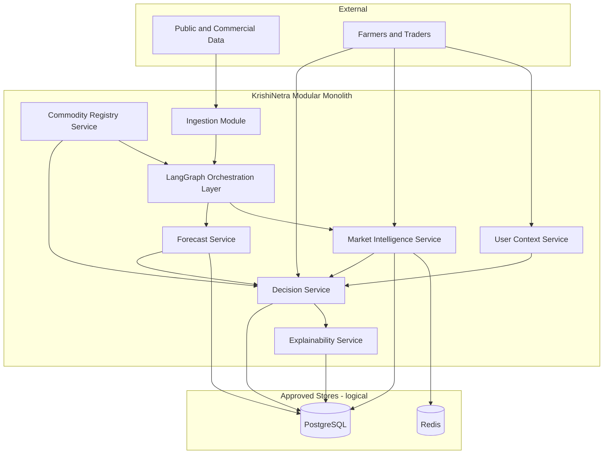
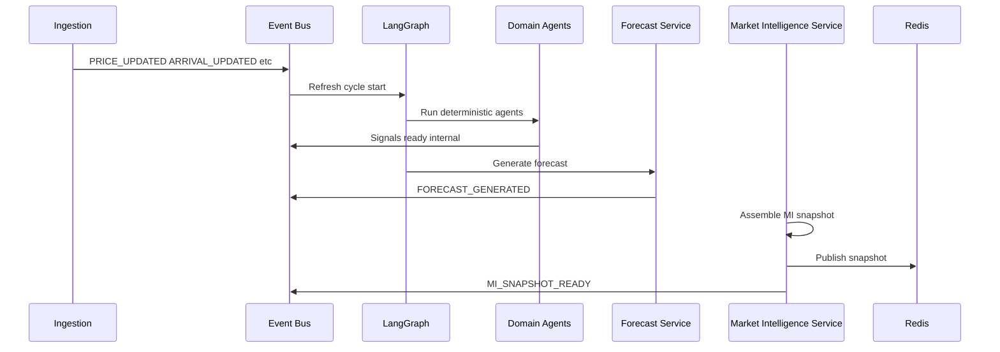
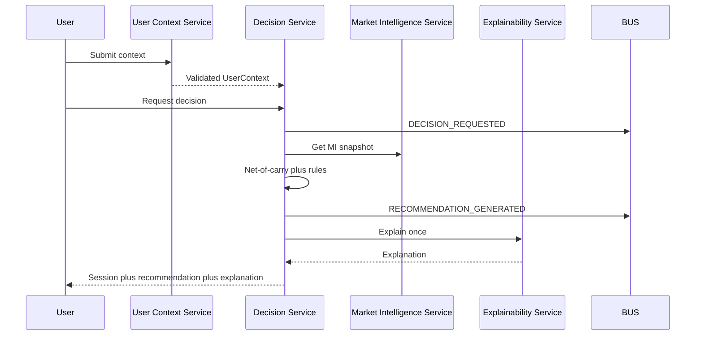
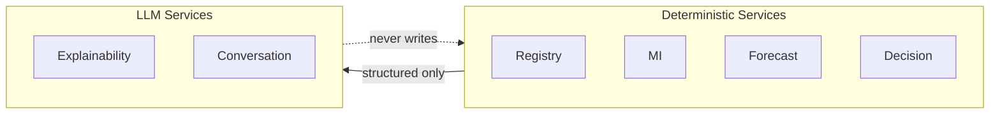

# TDS-003 — Service Architecture

**Wave:** 1  
**Status:** Draft — logical services only (no REST APIs, no deployment)  
**Architecture style:** Modular Monolith (approved)  
**Integration:** Event-driven internal communication (approved)  
**Sources:** `docs/founder/*`, TDS-001, TDS-002

---

## 1. Purpose

Define **logical services** within the KrishiNetra modular monolith: responsibilities, inputs, outputs, dependencies, and event participation. Each service exists to enforce founder boundaries—especially **central MI precompute** (FD-012), **deterministic core isolation** (FD-006, FD-007), and **commodity configurability** (FD-022).

---

## 2. Service Landscape

---

## 3. Service Catalog

| Service | Why it exists | Primary reqs | Founder decisions |
|---------|---------------|--------------|-------------------|
| **Commodity Registry Service** | Commodity-configurable behavior without code forks per commodity | REQ-073, REQ-096 | FD-022 |
| **Market Intelligence Service** | Shared, zero-marginal-cost intelligence for all users | REQ-030–REQ-037 | FD-011, FD-012 |
| **Forecast Service** | Isolated deterministic outlook generation for audit/backtest | REQ-056, REQ-076 | FD-006, FD-007 |
| **Decision Service** | Per-position net-of-carry recommendations + sessions + outcomes | REQ-040–REQ-047 | FD-015, FD-016, FD-018 |
| **User Context Service** | Captures and validates position-level context | REQ-040 | FD-015 |
| **Explainability Service** | LLM narrative layer only; never alters numbers | REQ-043, REQ-058 | FD-007, TC-005 |

**Cross-cutting:** LangGraph Orchestration Layer coordinates agents and services on events—not a business service, but the approved orchestration mechanism.

**Ingestion Module:** Supports observation publishing; grouped with MI pipeline for Wave 1 (not a separate catalog service per task list, but acknowledged as logical component).

---

## 4. Service Specifications

### 4.1 Commodity Registry Service

| Dimension | Detail |
|-----------|--------|
| **Responsibilities** | Load and serve active Commodity Registry version; expose agent source mappings, forecast horizons, decision rule parameters (MSP ±3%, partial sell 50%); validate commodity_id for Phase 1 (= cotton) |
| **Inputs** | Registry version activation requests (internal); commodity_id queries |
| **Outputs** | Registry configuration snapshot (in-memory/cacheable); configuration change notifications |
| **Dependencies** | PostgreSQL (registry store) |
| **Events published** | `REGISTRY_VERSION_ACTIVATED` (conceptual; may be operational only Wave 1) |
| **Events consumed** | None in MI path |
| **Why it exists** | FD-022: extend by commodity in Phase 7 without rewriting Forecast/Decision contracts |

**Traceability:** REQ-073, REQ-074, REQ-096, TC-009

---

### 4.2 Market Intelligence Service

| Dimension | Detail |
|-----------|--------|
| **Responsibilities** | Orchestrate domain agent execution on data refresh; assemble MI snapshot (prices, outlook, forecasts, confidence, bullish/bearish factors, supply/demand); serve unregistered MI reads from Redis; enforce single shared snapshot per commodity+as_of_date |
| **Inputs** | `PRICE_UPDATED`, `ARRIVAL_UPDATED`, `WEATHER_UPDATED`, `POLICY_UPDATED`, demand/futures/global signal events; Commodity Registry config; raw observations |
| **Outputs** | MI snapshot artifact; `MI_SNAPSHOT_READY` (conceptual companion to FORECAST_GENERATED) |
| **Dependencies** | Commodity Registry Service; Forecast Service; LangGraph; Redis; PostgreSQL; domain agent modules |
| **Events published** | `FORECAST_GENERATED` (after Forecast Service); `MI_SNAPSHOT_READY` |
| **Events consumed** | All domain `*_UPDATED` events; `FORECAST_GENERATED` |
| **Why it exists** | FD-012, REQ-037: precompute once, serve all users at zero marginal MI cost (NFR-SCL-001) |

**Traceability:** REQ-031–REQ-035, REQ-037, REQ-098, NFR-REP-005

---

### 4.3 Forecast Service

| Dimension | Detail |
|-----------|--------|
| **Responsibilities** | Consume structured signals from six domain agents; run deterministic model; produce 30/60/90 outlooks with confidence bands; persist forecast for as-of-date replay |
| **Inputs** | Aggregated StructuredSignals; Commodity Registry (horizons, model version); `as_of_date` |
| **Outputs** | Forecast entity; `FORECAST_GENERATED` event |
| **Dependencies** | Commodity Registry Service; PostgreSQL; domain signals (via events or orchestration state) |
| **Events published** | `FORECAST_GENERATED` |
| **Events consumed** | Signal bundle ready (internal orchestration milestone) |
| **Why it exists** | FD-006: forecast math isolated from LLM and from per-user Decision path; enables NFR-REP-001 and backtest REQ-103 |

**Traceability:** REQ-056, REQ-076, REQ-080, NFR-REP-001

---

### 4.4 User Context Service

| Dimension | Detail |
|-----------|--------|
| **Responsibilities** | Accept and validate Decision Mode inputs; bind context to session; enforce per-position semantics (no portfolio aggregation Phase 1); support farmer and trader persona types |
| **Inputs** | User-submitted context: commodity, quantity, storage access, liquidity need, financing profile, risk profile |
| **Outputs** | UserContext entity; validated context handle for Decision Service |
| **Dependencies** | Commodity Registry (commodity validation); PostgreSQL |
| **Events published** | None (synchronous handoff to Decision within monolith acceptable; session event originates from Decision) |
| **Events consumed** | None |
| **Why it exists** | REQ-040 separates personal constraints from shared MI; supports per-position trader model (founder clarification) |

**Traceability:** REQ-040, REQ-021, REQ-022 (per-position)

---

### 4.5 Decision Service

| Dimension | Detail |
|-----------|--------|
| **Responsibilities** | On Decision request: load MI snapshot + Forecast for as_of_date; run net-of-carry math; apply named rules (MSP/CCI floor at ±3% MSP + active CCI); emit Sell/Hold/Partial Sell/Partial Hold with default 50% partial; apply stability gating when defined; create DecisionSession; trigger Explainability; accept Outcome capture |
| **Inputs** | UserContext; MI snapshot; Forecast; Policy signals for MSP/CCI rule; Commodity Registry decision parameters |
| **Outputs** | Recommendation; DecisionSession; `DECISION_REQUESTED` (ingress), `RECOMMENDATION_GENERATED` |
| **Dependencies** | User Context Service; Market Intelligence Service (snapshot); Forecast Service; Commodity Registry Service; PostgreSQL |
| **Events published** | `DECISION_REQUESTED`, `RECOMMENDATION_GENERATED` |
| **Events consumed** | Optional: `MI_SNAPSHOT_READY` (readiness); not required per request if cache hit |
| **Why it exists** | FD-015: per-user scope is **only** deterministic math + rules—not domain agents or forecast re-run |

**Traceability:** REQ-041–REQ-047, REQ-064, REQ-110, FD-008, FD-016, FD-018

**Promotion gate (design-time):** DVA backtest >3% over 12 months, positive in >70% months (founder clarification)—evaluated outside hot path.

---

### 4.6 Explainability Service

| Dimension | Detail |
|-----------|--------|
| **Responsibilities** | Single LLM pass per Decision session: Why, what could go wrong, which assumptions matter; optional Conversation over explanation artifact; **must not** modify Recommendation |
| **Inputs** | Structured signals snapshot; Recommendation; Forecast summary; rules_applied; UserContext (non-PII facets for narrative) |
| **Outputs** | Explanation artifact linked to DecisionSession |
| **Dependencies** | Decision Service; external LLM provider; PostgreSQL |
| **Events published** | `EXPLANATION_GENERATED` (conceptual) |
| **Events consumed** | `RECOMMENDATION_GENERATED` |
| **Why it exists** | FD-007, TC-005, REQ-085: transparency without contaminating deterministic path (NFR-EXP-004) |

**Traceability:** REQ-043, REQ-058, REQ-059, REQ-085, NFR-EXP-001–003

---

## 5. Service Interaction Diagrams

### 5.1 Daily Market Intelligence Refresh (Event-Driven)

**Requirements:** REQ-037, REQ-070, REQ-071, NFR-SCL-001

### 5.2 Decision Mode Request

**Requirements:** REQ-064, TC-008, FD-015

### 5.3 Module Boundaries in Monolith

| Module | Maps to service | Shared infrastructure |
|--------|-----------------|-------------------------|
| `registry` | Commodity Registry Service | PostgreSQL |
| `ingestion` | Ingestion (observation publishers) | PostgreSQL |
| `agents` | Domain agents (invoked by orchestration) | — |
| `forecast` | Forecast Service | PostgreSQL |
| `market_intelligence` | Market Intelligence Service | Redis, PostgreSQL |
| `decision` | Decision Service | PostgreSQL |
| `user_context` | User Context Service | PostgreSQL |
| `explainability` | Explainability Service | PostgreSQL, LLM |
| `orchestration` | LangGraph layer | Event bus |

Modules communicate via **internal events** (approved)—avoid tight synchronous coupling on MI refresh path.

---

## 6. Event Participation Summary

| Service | Publishes | Consumes |
|---------|-----------|----------|
| Ingestion | PRICE_UPDATED, ARRIVAL_UPDATED, WEATHER_UPDATED, POLICY_UPDATED, (+ demand/futures/global equivalents) | — |
| Forecast | FORECAST_GENERATED | Signals ready |
| Market Intelligence | MI_SNAPSHOT_READY, (proxies FORECAST_GENERATED visibility) | *_UPDATED, FORECAST_GENERATED |
| User Context | — | — |
| Decision | DECISION_REQUESTED, RECOMMENDATION_GENERATED, OUTCOME_CAPTURED | RECOMMENDATION_GENERATED → Explainability |
| Explainability | EXPLANATION_GENERATED | RECOMMENDATION_GENERATED |

Full event catalog: **TDS-005**.

---

## 7. Caching Strategy (Logical)

| Artifact | Store | Owner | Invalidation |
|----------|-------|-------|--------------|
| Active MI snapshot | Redis | Market Intelligence Service | New `MI_SNAPSHOT_READY` / `FORECAST_GENERATED` |
| Commodity Registry active version | In-process + Redis optional | Commodity Registry Service | REGISTRY_VERSION_ACTIVATED |
| Forecast by as_of_date | PostgreSQL (+ Redis optional) | Forecast Service | New forecast for as_of_date |

**Constraint:** CC-001, CC-002—MI must not recompute per user.

---

## 8. Deterministic vs LLM Service Boundary

**Constraints:** TC-001, TC-002, TC-011, NFR-REP-003

---

## 9. Assumptions

| ID | Assumption |
|----|------------|
| SA-001 | FastAPI application hosts all modules in one deployable unit (modular monolith) |
| SA-002 | Event bus is in-process async (e.g., internal queue) for Wave 1—not external broker required |
| SA-003 | LangGraph state machine owns agent execution order for MI refresh |
| SA-004 | Conversation is submodule of Explainability Service or invoked by it |
| SA-005 | Backtest/calibration runs as batch module reading PostgreSQL snapshots, not inline |

---

## 10. Open Issues

| ID | Issue | Affected service |
|----|-------|------------------|
| OQ-001 | Stability gating | Decision Service |
| OQ-004 | Material signal movement | Decision Service, MI |
| OQ-007 | Outcome capture | Decision Service |
| OQ-002 | Trust display | Explainability Service |

---

## 11. Items Requiring Founder Approval

| Item | Status |
|------|--------|
| Modular monolith decomposition | **Approved** (task brief) |
| Event-driven internal comms | **Approved** |
| Six services listed | **Derived from founder spec** |
| Stability thresholds | **Pending** (OQ-004) |

---

## 12. Requirement Traceability

| Service | Primary REQ IDs |
|---------|-----------------|
| Commodity Registry | REQ-073, REQ-074, REQ-096 |
| Market Intelligence | REQ-030–REQ-037, REQ-031–REQ-035 |
| Forecast | REQ-056, REQ-076, REQ-080 |
| User Context | REQ-040 |
| Decision | REQ-041–REQ-047, REQ-100–REQ-103, REQ-110 |
| Explainability | REQ-043, REQ-058, REQ-059, REQ-085 |
