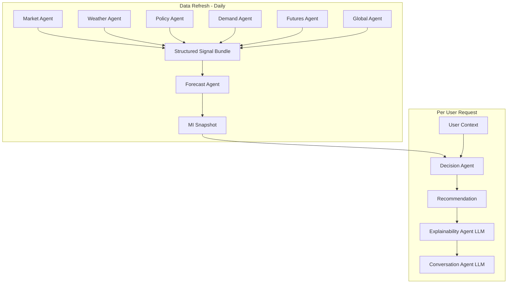
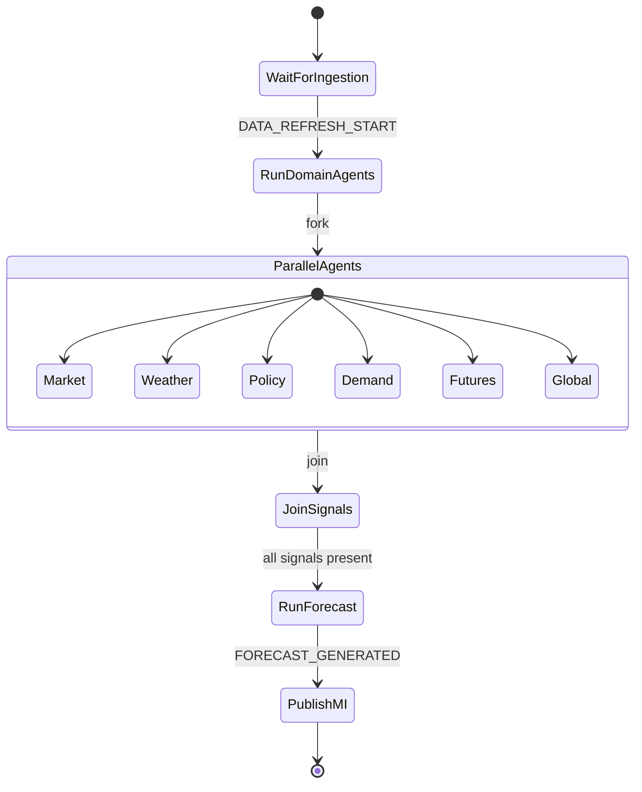
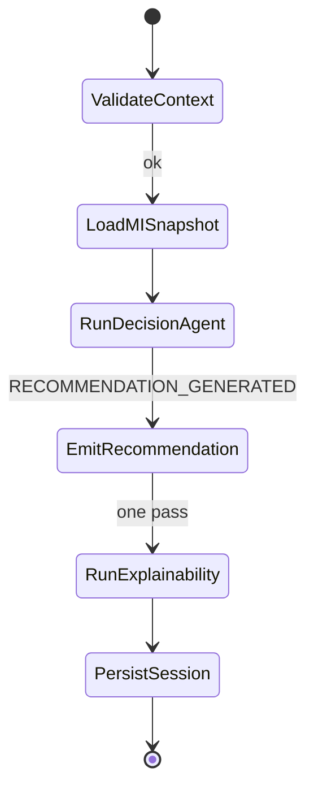

# TDS-004 — Agent Architecture

**Wave:** 1  
**Status:** Draft  
**Orchestration:** LangGraph (approved)  
**Sources:** `docs/founder/*`, TDS-003, founder clarifications

---

## 1. Purpose

Define all KrishiNetra agents: purpose, inputs, outputs, signal contract, execution frequency, failure handling, and traceability. Enforce the **deterministic / LLM split** (FD-006, FD-007, TC-001).

---

## 2. Agent Classification

| Class | Agents | Implementation constraint |
|-------|--------|---------------------------|
| **Deterministic domain agents** | Market, Weather, Policy, Demand, Futures, Global | Structured signals only; no LLM |
| **Deterministic analytical agents** | Forecast, Decision | Pure functions of inputs + as_of_date; no LLM |
| **LLM agents** | Explainability, Conversation | Narrative only; non-authoritative for numbers |

---

## 3. Structured Signal Contract (All Domain Agents)

**Founder decision:** FD-013 | **Requirements:** REQ-060, REQ-061 | **NFR:** NFR-AUD-001, NFR-AUD-002

| Field | Type (conceptual) | Required | Description |
|-------|-------------------|----------|-------------|
| `agent_type` | enum | Yes | Market, Weather, Policy, Demand, Futures, Global |
| `commodity_id` | id | Yes | `cotton` Phase 1 |
| `value` | decimal | Yes | Normalized signal strength |
| `direction` | enum | Yes | bullish, bearish, neutral |
| `magnitude` | decimal | Yes | Relative strength 0–1 scale (calibrated per agent) |
| `confidence` | decimal | Yes | 0–1 |
| `as_of_timestamp` | datetime | Yes | Data anchor for replay |
| `signal_components[]` | struct | No | Sub-metrics for traceability (e.g., acreage, rainfall) |
| `source_refs[]` | id[] | Yes | Observation lineage |

**Prohibited:** Free text, natural language, or LLM output in signal payload (TC-003, TC-004).

---

## 4. Deterministic Domain Agents

### 4.1 Market Agent

| Dimension | Detail |
|-----------|--------|
| **Purpose** | Encode domestic/regional cotton conditions: prices, arrivals, regional strength |
| **Inputs** | PriceObservation[], ArrivalObservation[] per Registry mappings; Commodity Registry active version |
| **Outputs** | StructuredSignal (`agent_type=Market`) |
| **Signal components** | Mandi price trend, arrival volume trend, regional strength index |
| **Execution frequency** | Once per **data refresh cycle** (daily per REQ-140) as part of MI precompute |
| **Failure handling** | If Agmarknet gap: degrade confidence; rely on basis-adjusted futures-implied price per FD-030; emit signal with `confidence` penalty and `source_refs` noting gap |
| **Traceability** | `source_refs` → PriceObservation, ArrivalObservation IDs; logged in Forecast `composed_signal_refs` |
| **REQ / FD** | REQ-050, REQ-075, FD-013, FD-030 |

---

### 4.2 Weather Agent

| Dimension | Detail |
|-----------|--------|
| **Purpose** | Rainfall, drought, production-risk—including **acreage** in Phase 1 (founder clarification) |
| **Inputs** | IMD weather data; acreage statistics (Registry `weather_variables`); historical norms |
| **Outputs** | StructuredSignal (`agent_type=Weather`); sub-components for rainfall, drought, **acreage** |
| **Execution frequency** | Daily data refresh (MI precompute) |
| **Failure handling** | Missing acreage: omit sub-component, reduce confidence; do not block Forecast if rainfall signal valid |
| **Traceability** | `signal_components.acreage`, `signal_components.rainfall_deficit` |
| **REQ / FD** | REQ-051, REQ-075; resolves DATA_DOMAINS acreage ambiguity |

---

### 4.3 Policy Agent

| Dimension | Detail |
|-----------|--------|
| **Purpose** | MSP level, CCI procurement status, export restrictions |
| **Inputs** | Agriculture Ministry feeds; MSP/CCI state; Registry policy_drivers |
| **Outputs** | StructuredSignal (`agent_type=Policy`); includes `cci_active_procurement` flag for Decision rule |
| **Execution frequency** | Daily refresh; intra-day refresh if policy event ingested (optional Wave 1) |
| **Failure handling** | Stale policy data: hold last known with confidence decay; flag in MI supply/demand narrative via Explainability only |
| **Traceability** | MSP value, CCI status refs for MSP/CCI floor rule (±3% proximity computed in Decision Agent) |
| **REQ / FD** | REQ-052, REQ-046, FD-008 |

---

### 4.4 Demand Agent

| Dimension | Detail |
|-----------|--------|
| **Purpose** | Mill demand, domestic consumption, export demand |
| **Inputs** | USDA, ICAC, industry reports (commercial); Registry demand_drivers |
| **Outputs** | StructuredSignal (`agent_type=Demand`) |
| **Execution frequency** | Daily MI precompute |
| **Failure handling** | Commercial report delay: use last report with confidence penalty |
| **Traceability** | Mill/offtake/export sub-components in `signal_components` |
| **REQ / FD** | REQ-053, REQ-075 |

---

### 4.5 Futures Agent

| Dimension | Detail |
|-----------|--------|
| **Purpose** | Futures curve, basis, open interest—benchmark signal for hold-to-curve (FD-003) |
| **Inputs** | Commercial futures feed; spot refs for basis |
| **Outputs** | StructuredSignal (`agent_type=Futures`); curve shape metadata for Forecast and backtest |
| **Execution frequency** | Daily; potentially higher frequency for curve leg if feed allows (Wave 2) |
| **Failure handling** | **Critical:** missing futures feed blocks reliable DVA—MI publishes with explicit data-quality warning; Forecast confidence reduced (NFR-TRS-001 data quality) |
| **Traceability** | Curve snapshot ref, basis estimate methodology version |
| **REQ / FD** | REQ-054, REQ-082, REQ-133, FD-003, FD-030 |

---

### 4.6 Global Agent

| Dimension | Detail |
|-----------|--------|
| **Purpose** | International demand and global inventory conditions |
| **Inputs** | USDA, ICAC global series; Registry mappings |
| **Outputs** | StructuredSignal (`agent_type=Global`) |
| **Execution frequency** | Daily MI precompute |
| **Failure handling** | Use last available with confidence decay |
| **Traceability** | Global inventory level ref in `signal_components` |
| **REQ / FD** | REQ-055, REQ-075 |

---

## 5. Deterministic Analytical Agents

### 5.1 Forecast Agent

| Dimension | Detail |
|-----------|--------|
| **Purpose** | Produce deterministic 30/60/90-day outlook with probability bands |
| **Inputs** | StructuredSignal bundle (all six domain agents); Commodity Registry horizons; `as_of_date` |
| **Outputs** | Forecast entity; not a StructuredSignal—downstream typed artifact |
| **Signal contract** | N/A (consumes signals, produces Forecast) |
| **Execution frequency** | Once per data refresh after domain agents (FD-012) |
| **Failure handling** | If any agent missing: run with available signals if Registry `minimum_agents` met (cotton: require Futures + Market); else abort MI publish and alert ops |
| **Traceability** | `composed_signal_refs[]` on Forecast; full replay from signals + model_version (NFR-TRC-001, REQ-103) |
| **REQ / FD** | REQ-056, REQ-076, FD-006, NFR-REP-001 |

**Constraint:** TC-001 — no LLM.

---

### 5.2 Decision Agent

| Dimension | Detail |
|-----------|--------|
| **Purpose** | Net-of-carry math + named rules → Sell/Hold/Partial Sell/Partial Hold |
| **Inputs** | Forecast; current price from MI; UserContext; Policy signal (MSP/CCI); Commodity Registry rules |
| **Outputs** | Recommendation (deterministic); triggers `RECOMMENDATION_GENERATED` |
| **Net hold value** | forecast_price(h) − current_price − storage(h) − financing(h, cost_of_capital) − quality_loss(h) − risk_adjustment (REQ-045) |
| **Named rules** | **MSP/CCI floor:** if spot within **±3%** of MSP AND CCI actively procuring → adjust hold calculus (FD-008, founder clarification) |
| **Partial default** | Partial Sell → **50%** of quantity unless user override (future Wave 2) |
| **Liquidity default** | Partial-sell bias under high liquidity need (FD-028, REQ-131) |
| **Execution frequency** | **Per Decision request** (not per data refresh) |
| **Failure handling** | Missing UserContext field → validation error, no recommendation; missing MI snapshot → reject or queue until MI ready |
| **Stability gating** | Compare to prior session recommendation; flip only on material signal movement (OQ-004 TBD)—REQ-140 |
| **Traceability** | `rules_applied[]`, `signal_snapshot_refs`, `as_of_date`, formula version (NFR-AUD-003, NFR-AUD-004) |
| **REQ / FD** | REQ-057, REQ-041–REQ-047, FD-015, FD-016, FD-018 |

**Constraint:** TC-001, TC-002 — no LLM.

---

## 6. LLM Agents

### 6.1 Explainability Agent

| Dimension | Detail |
|-----------|--------|
| **Purpose** | Convert structured signals + Recommendation into human-readable explanation |
| **Inputs** | StructuredSignal snapshot (read-only); Recommendation; Forecast summary; `rules_applied`; UserContext facets safe for narrative |
| **Outputs** | Explanation artifact: **Why?** **What could go wrong?** **Which assumptions matter?** (REQ-085, NFR-EXP-001–003) |
| **Signal contract** | N/A — consumes structured JSON, outputs prose |
| **Execution frequency** | **One pass per Decision session** (FD-015, TC-008, REQ-064) |
| **Failure handling** | On LLM timeout/error: return structured fallback (bullet list from signals + recommendation metadata); **Recommendation unchanged** |
| **Traceability** | Log prompt hash, model version, input artifact IDs—no recomputation of numbers |
| **REQ / FD** | REQ-058, REQ-043, FD-007, NFR-EXP-004 |

**Constraint:** Must not alter Recommendation (NFR-IMP-001).

---

### 6.2 Conversation Agent

| Dimension | Detail |
|-----------|--------|
| **Purpose** | Natural-language Q&A **over the explanation artifact only** |
| **Inputs** | Explanation artifact; user question; session_id |
| **Outputs** | Conversational response (non-persistent or append to session log) |
| **Execution frequency** | On demand, multi-turn allowed; **not** part of MI precompute |
| **Failure handling** | Refuse questions requiring raw model internals or recommendation changes; redirect to explanation scope (NFR-EXP-005) |
| **Traceability** | Conversation log linked to session_id |
| **REQ / FD** | REQ-059, TC-005 |

---

## 7. Orchestration Flow (LangGraph)

### 7.1 Graph: MI Refresh (Scheduled / Event-Triggered)

**Requirements:** REQ-037, REQ-098, FD-012

### 7.2 Graph: Decision Request

**Optional branch:** Conversation Agent invoked after PersistSession on user message.

---

## 8. Execution Frequency Summary

| Agent | Trigger | Frequency | Shared vs per-user |
|-------|---------|-----------|----------------------|
| Market | DATA_REFRESH / observation events | Daily (provisional) | Shared |
| Weather | DATA_REFRESH | Daily | Shared |
| Policy | DATA_REFRESH | Daily | Shared |
| Demand | DATA_REFRESH | Daily | Shared |
| Futures | DATA_REFRESH | Daily | Shared |
| Global | DATA_REFRESH | Daily | Shared |
| Forecast | After domain agents | Daily | Shared |
| Decision | DECISION_REQUESTED | Per request | Per-user |
| Explainability | RECOMMENDATION_GENERATED | Per request (once) | Per-user |
| Conversation | User message | Per message | Per-user |

---

## 9. Failure Handling Matrix

| Failure type | Domain agents | Forecast | Decision | Explainability |
|--------------|---------------|----------|----------|----------------|
| Source timeout | Degrade confidence | Continue if minimum met | N/A | N/A |
| Missing critical futures | Penalize Futures signal | Lower confidence / abort | Use last MI if policy allows | N/A |
| Invalid user context | N/A | N/A | Reject request | N/A |
| LLM outage | N/A | N/A | Deliver recommendation | Structured fallback |
| Duplicate refresh | Idempotent by as_of_date | Overwrite forecast version | N/A | N/A |

---

## 10. Traceability Requirements (All Agents)

| Requirement | Implementation concept |
|-------------|------------------------|
| NFR-TRC-001 | Store `as_of_date`, agent versions, signal IDs, model versions on Forecast and Recommendation |
| NFR-TRC-002 | Decision Agent code path identical in backtest batch and live |
| NFR-TRC-003 | Recommendation links to all six domain signals + Forecast |
| NFR-TRC-004 | Session links to Outcome when captured |
| REQ-103 | Backtest module reads same artifacts as live |

**Backtest promotion criteria (founder clarification):** 12-month window, DVA > 3%, positive DVA in >70% of months—evaluated in calibration module, not inline in Decision Agent.

---

## 11. Agent-to-Service Mapping

| Agent | Owning service (TDS-003) |
|-------|--------------------------|
| Market–Global (6) | Market Intelligence Service (invoked via LangGraph) |
| Forecast | Forecast Service |
| Decision | Decision Service |
| Explainability, Conversation | Explainability Service |

---

## 12. Assumptions

| ID | Assumption |
|----|------------|
| AA-001 | LangGraph parallelizes six domain agents on MI refresh |
| AA-002 | Agent implementations are stateless; state in PostgreSQL + Redis |
| AA-003 | Cotton Registry pins agent minimum data requirements |
| AA-004 | Conversation Agent shares LLM provider config with Explainability |

---

## 13. Open Issues

| ID | Issue | Agents affected |
|----|-------|-----------------|
| OQ-004 | Material signal movement thresholds | Decision |
| OQ-001 | Stability field testing | Decision |
| OQ-002 | Trust display | Explainability |

---

## 14. Founder Clarifications Applied

| Clarification | Agent impact |
|---------------|--------------|
| Acreage → Weather | Weather Agent `signal_components.acreage` |
| Near MSP ±3% | Decision Agent MSP/CCI rule |
| Partial Sell 50% | Decision Agent default partial quantity |
| DVA gate | Calibration/backtest module, not agent runtime |
| Per-position trader | Decision Agent one UserContext per invocation |

---

## 15. Requirement Traceability

| Agent | REQ IDs | FD IDs |
|-------|---------|--------|
| All domain | REQ-050–055, REQ-060, REQ-061 | FD-013 |
| Forecast | REQ-056, REQ-076 | FD-006, FD-012 |
| Decision | REQ-057, REQ-041–047 | FD-008, FD-015–018 |
| Explainability | REQ-058, REQ-085 | FD-007 |
| Conversation | REQ-059 | TC-005 |
| Boundary | REQ-015, REQ-062, REQ-063 | FD-006, FD-007 |
