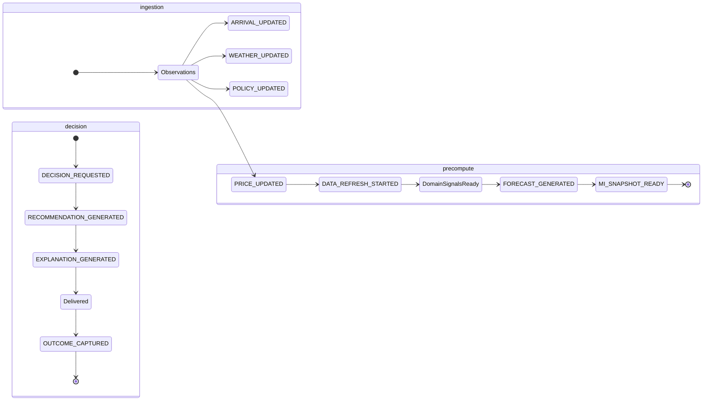
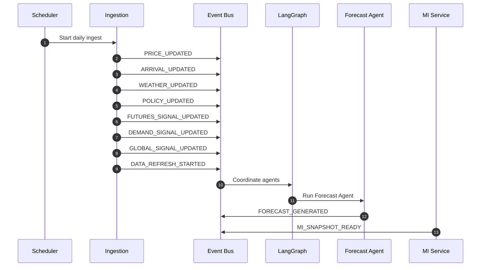
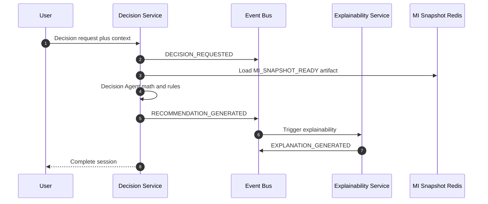
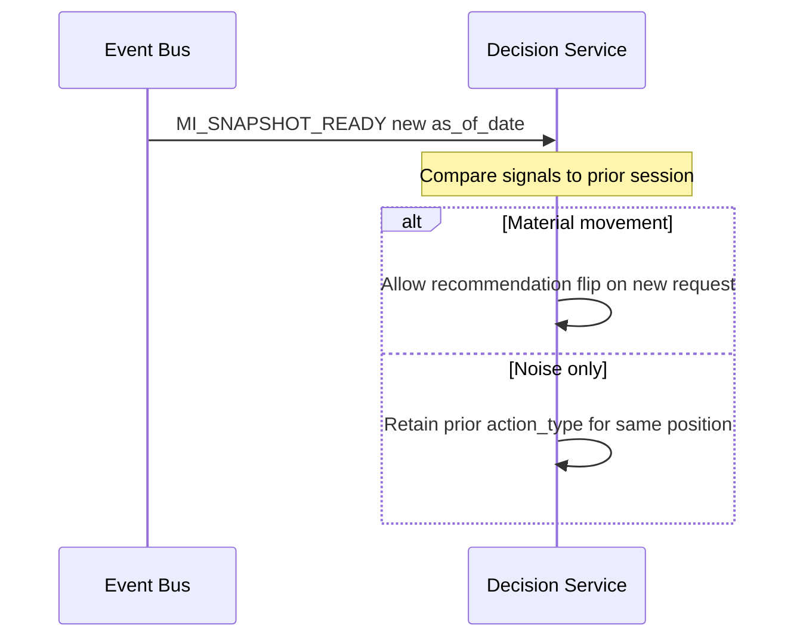
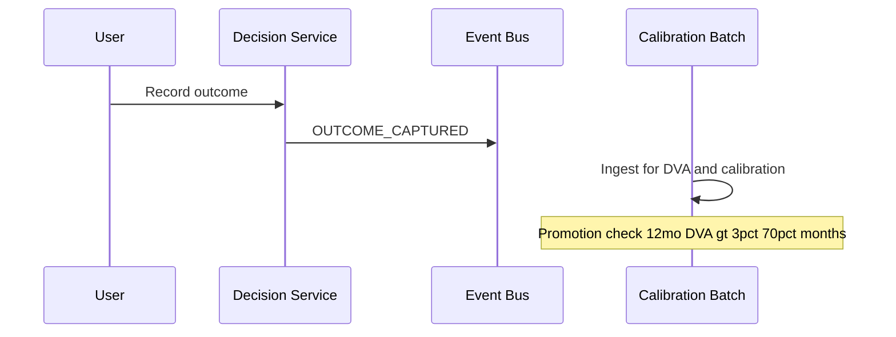

# TDS-005 — Event Model

**Wave:** 1  
**Status:** Draft — business events only (no message schemas, no broker topology)  
**Integration pattern:** Event-driven internal communication (approved)  
**Sources:** `docs/founder/*`, TDS-003, TDS-004

---

## 1. Purpose

Define **business events** for KrishiNetra Phase 1: producers, consumers, conceptual payloads, and trigger conditions. Events decouple ingestion, MI precompute, forecast, decision, and explainability within the modular monolith—supporting FD-012 (central precompute) and reproducibility (FD-014).

**Explicitly out of scope Wave 1:** JSON schemas, Avro/Protobuf, Kafka topic names, dead-letter configuration.

---

## 2. Event Design Principles

| Principle | Source |
|-----------|--------|
| Events represent **business facts**, not command RPCs | Derived from founder flywheel |
| MI path is **append-and-publish**; Decision path is **request-response wrapped in events** for audit | FD-012, FD-015 |
| Every event carries **`as_of_date`** or **`occurred_at`** for traceability | NFR-AUD-002, NFR-TRC-001 |
| Deterministic pipeline events never include LLM text | TC-003, TC-004 |
| Idempotent processing by `(event_type, commodity_id, as_of_date, entity_id)` | NFR-REP-005 |

---

## 3. Event Catalog

### 3.1 PRICE_UPDATED

| Dimension | Detail |
|-----------|--------|
| **Producer** | Ingestion Module (on successful price observation persist) |
| **Consumers** | LangGraph orchestration (MI refresh coordinator); Market Intelligence Service (indirect via orchestration) |
| **Payload concept** | `commodity_id`, `market_id`, `observation_id`, `price_value`, `unit`, `observed_at`, `as_of_date`, `source` |
| **Trigger conditions** | New or revised price observation from Agmarknet, eNAM, or derived basis-adjusted price |
| **REQ / FD** | REQ-031, REQ-070, REQ-050 |

---

### 3.2 ARRIVAL_UPDATED

| Dimension | Detail |
|-----------|--------|
| **Producer** | Ingestion Module |
| **Consumers** | LangGraph orchestration; Market Agent |
| **Payload concept** | `commodity_id`, `market_id`, `observation_id`, `volume`, `observed_at`, `as_of_date`, `source` |
| **Trigger conditions** | New or revised arrival volume published |
| **REQ / FD** | REQ-050, REQ-075 |

---

### 3.3 WEATHER_UPDATED

| Dimension | Detail |
|-----------|--------|
| **Producer** | Ingestion Module |
| **Consumers** | LangGraph orchestration; Weather Agent (incl. **acreage** updates per founder clarification) |
| **Payload concept** | `commodity_id`, `region_id`, `metric_type` (rainfall, drought_index, **acreage**), `value`, `observed_at`, `as_of_date`, `source` (IMD, etc.) |
| **Trigger conditions** | Daily weather ingest or acreage report availability |
| **REQ / FD** | REQ-051, REQ-070 |

---

### 3.4 POLICY_UPDATED

| Dimension | Detail |
|-----------|--------|
| **Producer** | Ingestion Module |
| **Consumers** | LangGraph orchestration; Policy Agent; Decision Service (reads Policy signal snapshot, not raw event) |
| **Payload concept** | `commodity_id`, `msp_value`, `cci_procurement_active`, `export_restriction_flag`, `effective_at`, `as_of_date`, `source` |
| **Trigger conditions** | MSP revision, CCI procurement program state change, export policy change |
| **REQ / FD** | REQ-052, REQ-046, FD-008 |

---

### 3.5 DEMAND_SIGNAL_UPDATED (Domain)

| Dimension | Detail |
|-----------|--------|
| **Producer** | Ingestion Module or scheduled commercial report ingest |
| **Consumers** | Demand Agent (via orchestration) |
| **Payload concept** | `commodity_id`, `metric` (mill_demand, exports, consumption), `value`, `as_of_date`, `source` |
| **Trigger conditions** | USDA/ICAC/industry report ingest |
| **REQ / FD** | REQ-053, REQ-071 |

*Note: Named separately from minimum list to cover Demand agent; grouped under data refresh in orchestration.*

---

### 3.6 FUTURES_SIGNAL_UPDATED (Domain)

| Dimension | Detail |
|-----------|--------|
| **Producer** | Ingestion Module (commercial feed) |
| **Consumers** | Futures Agent (via orchestration) |
| **Payload concept** | `commodity_id`, `curve_snapshot_ref`, `basis`, `open_interest`, `as_of_date`, `source` |
| **Trigger conditions** | Futures feed tick aggregated to daily snapshot (Phase 1) |
| **REQ / FD** | REQ-054, REQ-071, FD-003 |

---

### 3.7 GLOBAL_SIGNAL_UPDATED (Domain)

| Dimension | Detail |
|-----------|--------|
| **Producer** | Ingestion Module |
| **Consumers** | Global Agent (via orchestration) |
| **Payload concept** | `commodity_id`, `global_inventory_level`, `demand_index`, `as_of_date`, `source` |
| **Trigger conditions** | USDA/ICAC global data ingest |
| **REQ / FD** | REQ-055 |

---

### 3.8 FORECAST_GENERATED

| Dimension | Detail |
|-----------|--------|
| **Producer** | Forecast Service / Forecast Agent |
| **Consumers** | Market Intelligence Service; Redis cache writer; optional calibration/backtest subscriber |
| **Payload concept** | `forecast_id`, `commodity_id`, `as_of_date`, `horizons` [30,60,90], `confidence_band_summary`, `model_version`, `composed_signal_refs[]` |
| **Trigger conditions** | All required domain signals available for cotton Registry minimum; Forecast Agent completes successfully |
| **REQ / FD** | REQ-056, REQ-076, FD-012, NFR-REP-001 |

---

### 3.9 MI_SNAPSHOT_READY

| Dimension | Detail |
|-----------|--------|
| **Producer** | Market Intelligence Service |
| **Consumers** | Redis publication; internal health monitors; optional alerting |
| **Payload concept** | `commodity_id`, `as_of_date`, `mi_snapshot_ref`, `forecast_id`, `price_summary`, `outlook_summary`, `confidence`, `factor_refs` (bullish/bearish), `generated_at` |
| **Trigger conditions** | FORECAST_GENERATED processed; MI assembly complete |
| **REQ / FD** | REQ-037, REQ-032–REQ-035, FD-011, FD-012 |

---

### 3.10 DECISION_REQUESTED

| Dimension | Detail |
|-----------|--------|
| **Producer** | Decision Service (on user Decision Mode request) |
| **Consumers** | Audit log; metrics; optional async Explainability trigger confirmation |
| **Payload concept** | `session_id`, `user_context_id`, `commodity_id`, `persona_type`, `requested_at`, `mi_snapshot_ref` |
| **Trigger conditions** | Valid User Context submitted; user initiates Decision Mode |
| **REQ / FD** | REQ-040, REQ-064, FD-015 |

---

### 3.11 RECOMMENDATION_GENERATED

| Dimension | Detail |
|-----------|--------|
| **Producer** | Decision Service / Decision Agent |
| **Consumers** | Explainability Service; audit log; session persistence |
| **Payload concept** | `recommendation_id`, `session_id`, `action_type`, `net_value_after_carry`, `partial_quantity_pct`, `rules_applied[]`, `msp_proximity_triggered`, `as_of_date`, `forecast_id`, `signal_snapshot_refs[]` |
| **Trigger conditions** | Decision Agent completes net-of-carry + rules (incl. MSP ±3%, partial 50% default) |
| **REQ / FD** | REQ-041–REQ-047, REQ-057, FD-016, FD-018 |

---

### 3.12 EXPLANATION_GENERATED

| Dimension | Detail |
|-----------|--------|
| **Producer** | Explainability Service / Explainability Agent |
| **Consumers** | Session persistence; Conversation Agent (grounding) |
| **Payload concept** | `explanation_id`, `session_id`, `recommendation_id`, `why`, `risks`, `assumptions`, `llm_model_version` |
| **Trigger conditions** | RECOMMENDATION_GENERATED; one explanation pass (TC-008) |
| **REQ / FD** | REQ-043, REQ-058, REQ-085, NFR-EXP-001–003 |

---

### 3.13 OUTCOME_CAPTURED

| Dimension | Detail |
|-----------|--------|
| **Producer** | Decision Service (or dedicated outcome endpoint module) |
| **Consumers** | Calibration module (batch); proprietary dataset pipeline |
| **Payload concept** | `outcome_id`, `session_id`, `realized_net_value`, `action_taken`, `observation_period`, `recorded_at` |
| **Trigger conditions** | User or system records post-decision outcome (workflow OQ-007 TBD) |
| **REQ / FD** | REQ-110, REQ-111, FD-023, NFR-TRC-004 |

---

### 3.14 DATA_REFRESH_STARTED / DATA_REFRESH_COMPLETED (Orchestration)

| Dimension | Detail |
|-----------|--------|
| **Producer** | LangGraph scheduler or ingestion batch coordinator |
| **Consumers** | All domain agents (STARTED); MI_SNAPSHOT_READY path (COMPLETED) |
| **Payload concept** | `refresh_id`, `commodity_id`, `as_of_date`, `started_at` / `completed_at`, `agent_status[]` |
| **Trigger conditions** | Scheduled daily cadence (REQ-140) or manual ops trigger |
| **REQ / FD** | REQ-140, FD-012 |

---

## 4. Event Producer / Consumer Matrix

| Event | Producer | Primary consumers |
|-------|----------|-------------------|
| PRICE_UPDATED | Ingestion | Orchestration → Market Agent |
| ARRIVAL_UPDATED | Ingestion | Orchestration → Market Agent |
| WEATHER_UPDATED | Ingestion | Orchestration → Weather Agent |
| POLICY_UPDATED | Ingestion | Orchestration → Policy Agent |
| DEMAND_SIGNAL_UPDATED | Ingestion | Orchestration → Demand Agent |
| FUTURES_SIGNAL_UPDATED | Ingestion | Orchestration → Futures Agent |
| GLOBAL_SIGNAL_UPDATED | Ingestion | Orchestration → Global Agent |
| FORECAST_GENERATED | Forecast Service | MI Service, Redis |
| MI_SNAPSHOT_READY | MI Service | Cache, Decision (read), monitors |
| DECISION_REQUESTED | Decision Service | Audit, metrics |
| RECOMMENDATION_GENERATED | Decision Service | Explainability, persistence |
| EXPLANATION_GENERATED | Explainability Service | Persistence, Conversation |
| OUTCOME_CAPTURED | Decision Service | Calibration batch |
| DATA_REFRESH_* | Orchestration | Agent pipeline |

---

## 5. Event Lifecycle Diagram

---

## 6. Event Sequencing Examples

### 6.1 Happy Path: Daily MI Refresh

**Timing assumption (ASM-002 TDS-001):** Daily batch; not real-time tick-by-tick Phase 1.

---

### 6.2 Happy Path: User Decision Session

---

### 6.3 Stability Gating (Provisional — OQ-004)

When material signal movement is defined:

**Status:** Thresholds **pending founder approval** (OQ-004).

---

### 6.4 Outcome Flywheel

**Promotion criteria (approved):** 12-month backtest, DVA > 3%, positive DVA in >70% of months.

---

## 7. Event → Requirement Traceability

| Event | Requirement IDs | NFR IDs |
|-------|-----------------|---------|
| PRICE_UPDATED, ARRIVAL_UPDATED | REQ-031, REQ-050, REQ-070 | NFR-AUD-002 |
| WEATHER_UPDATED | REQ-051, REQ-075 | — |
| POLICY_UPDATED | REQ-052, REQ-046 | NFR-AUD-003 |
| FORECAST_GENERATED | REQ-056, REQ-076, REQ-037 | NFR-REP-001, NFR-REP-005 |
| MI_SNAPSHOT_READY | REQ-030–REQ-037 | NFR-SCL-001 |
| DECISION_REQUESTED | REQ-040, REQ-064 | — |
| RECOMMENDATION_GENERATED | REQ-041–REQ-047 | NFR-TRC-001, NFR-AUD-004 |
| EXPLANATION_GENERATED | REQ-043, REQ-085 | NFR-EXP-001–003 |
| OUTCOME_CAPTURED | REQ-110, REQ-111 | NFR-TRC-004, NFR-TRS-005 |

---

## 8. Events Explicitly Excluded Phase 1

| Event | Reason |
|-------|--------|
| INVENTORY_REGISTERED | Phase 2 entity (REQ-091) |
| FINANCING_APPROVED | Phase 5 (REQ-124) |
| MARKETPLACE_TRANSACTION | Phase 6 (REQ-125) |
| PORTFOLIO_AGGREGATED | Per-position only Phase 1 (founder clarification) |
| RECOMMENDATION_PROMOTED | Batch/ops decision after backtest gate, not runtime user event |

---

## 9. Assumptions

| ID | Assumption |
|----|------------|
| EV-001 | In-process event dispatcher sufficient for Wave 1 modular monolith |
| EV-002 | Events are persisted to audit log table for DECISION and RECOMMENDATION path (Wave 2 detail) |
| EV-003 | Domain signal events may be batched into DATA_REFRESH rather than processed individually in Phase 1 |
| EV-004 | MI_SNAPSHOT_READY is the consumer-facing readiness marker; FORECAST_GENERATED alone is insufficient for MI reads |
| EV-005 | Idempotency keys prevent duplicate MI publishes on re-ingest same as_of_date |

---

## 10. Open Issues

| ID | Issue | Events affected |
|----|-------|-----------------|
| OQ-001 | Daily vs intra-day refresh | DATA_REFRESH_*, all ingestion |
| OQ-004 | Material signal movement | RECOMMENDATION_GENERATED gating |
| OQ-007 | Outcome capture trigger | OUTCOME_CAPTURED producer UX |

---

## 11. Items Requiring Founder Approval

| Item | Status |
|------|--------|
| Event list for Phase 1 | **Derived from founder spec** |
| DVA promotion thresholds | **Approved** (calibration consumer) |
| Stability gating behavior | **Pending** (OQ-004) |
| Outcome capture workflow | **Pending** (OQ-007) |

---

## 12. Founder Decision Cross-Reference

| Decision | Event model impact |
|----------|-------------------|
| FD-012 | MI precompute chain ending in MI_SNAPSHOT_READY |
| FD-014 | as_of_date on all deterministic events |
| FD-015 | DECISION_REQUESTED → single RECOMMENDATION + EXPLANATION |
| FD-023 | OUTCOME_CAPTURED enables flywheel |
| FD-006 | No LLM events in forecast/decision chain |

---

## 13. Document Control

| Version | Wave |
|---------|------|
| 0.1 | 1 |

**Wave 2 (out of scope):** Message schemas, serialization, broker selection, retry/DLQ policies, event versioning.
