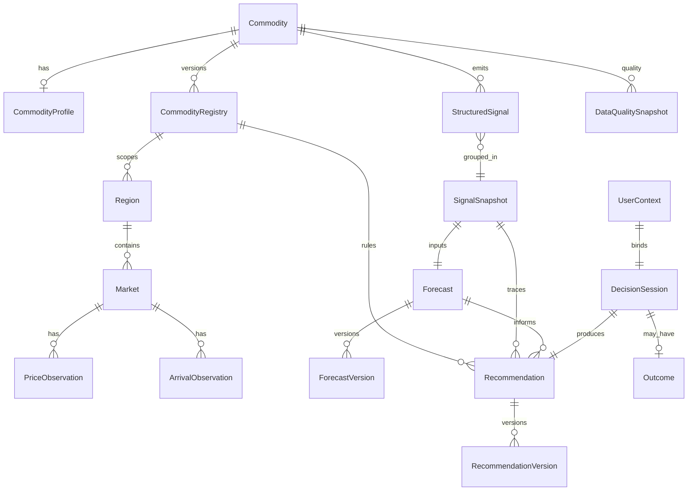
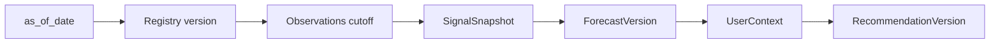

# TDS-006 — Data Model (Canonical Persistence)

**Wave:** 2  
**Status:** Draft — logical/physical design without SQL DDL  
**Store:** PostgreSQL (approved), Redis cache for MI hot reads (approved)  
**Sources:** TDS-002, TDS-003, TDS-005, `docs/founder/*`

**Explicitly out of scope:** SQL DDL, REST APIs, migration scripts (Wave 3+)

---

## 1. Purpose

Define the **canonical persistence model** supporting:

- Deterministic historical replay (NFR-TRC-001, REQ-103)
- Forecast and recommendation versioning (FD-014)
- Central MI precompute (FD-012)
- Calibration flywheel (FD-023)
- Commodity-configurable expansion (FD-022)

---

## 2. ER Diagram (Canonical)

---

## 3. Entity Specifications

### 3.1 Commodity

| Field | Detail |
|-------|--------|
| **Purpose** | Root identity for intelligence scope; Phase 1 = cotton |
| **Primary key** | `commodity_id` (string, stable, e.g. `cotton`) |
| **Attributes** | `name`, `status` (draft/active/deprecated), `reference_implementation_flag`, `created_at`, `updated_at` |
| **Relationships** | 1:0..1 CommodityProfile; 1:N CommodityRegistry versions; parent of observations, forecasts, sessions |
| **Indexes** | PK `commodity_id`; partial index on `status='active'` |
| **Retention** | Indefinite |
| **Ownership** | Commodity Registry Service |
| **REQ / FD** | REQ-010, REQ-090, FD-001 |

---

### 3.2 CommodityProfile

| Field | Detail |
|-------|--------|
| **Purpose** | Static descriptive metadata (display, units, quality grades) separate from versioned operational registry |
| **Primary key** | `commodity_id` (FK → Commodity) |
| **Attributes** | `display_name`, `unit` (quintal), `currency` (INR), `quality_dimensions[]`, `storage_characteristics` (conceptual JSON), `created_at` |
| **Relationships** | 1:1 Commodity |
| **Indexes** | PK `commodity_id` |
| **Retention** | Indefinite; updated in place (non-versioned) |
| **Ownership** | Commodity Registry Service |
| **REQ / FD** | REQ-073, DC-004 |

---

### 3.3 CommodityRegistry

| Field | Detail |
|-------|--------|
| **Purpose** | Versioned operational configuration: sources, agents, horizons, decision rule parameters |
| **Primary key** | `registry_id` (UUID) |
| **Attributes** | `commodity_id`, `version` (semver/int), `effective_from`, `effective_to`, `is_active`, `price_sources[]`, `arrival_sources[]`, `demand_drivers[]`, `policy_drivers[]`, `weather_variables[]` (incl. acreage), `forecast_horizons[]` [30,60,90], `decision_rules` (MSP proximity **3%**, partial sell **50%**, MSP/CCI rule defs), `minimum_agents[]`, `formula_version`, `created_at` |
| **Relationships** | N:1 Commodity; referenced by Forecast, Recommendation, agent runs |
| **Indexes** | PK `registry_id`; UNIQUE (`commodity_id`, `version`); partial UNIQUE (`commodity_id`) WHERE `is_active=true` |
| **Retention** | All versions indefinite (replay) |
| **Ownership** | Commodity Registry Service |
| **REQ / FD** | REQ-073, REQ-074, FD-022, FD-008 |

---

### 3.4 Region

| Field | Detail |
|-------|--------|
| **Purpose** | Geographic/market segmentation |
| **Primary key** | `region_id` |
| **Attributes** | `commodity_id`, `name`, `type` (state/mandi/zone), `parent_region_id`, `external_refs` (Agmarknet codes) |
| **Relationships** | N:1 Commodity; 1:N Markets |
| **Indexes** | PK `region_id`; (`commodity_id`, `type`) |
| **Retention** | Indefinite |
| **Ownership** | Market Intelligence / Ingestion |

---

### 3.5 Market

| Field | Detail |
|-------|--------|
| **Purpose** | Price discovery venue within region |
| **Primary key** | `market_id` |
| **Attributes** | `region_id`, `commodity_id`, `market_type`, `name`, `source_identifiers` |
| **Relationships** | N:1 Region; 1:N observations |
| **Indexes** | PK `market_id`; (`commodity_id`, `region_id`) |
| **Retention** | Indefinite |
| **Ownership** | Market Intelligence / Ingestion |

---

### 3.6 PriceObservation

| Field | Detail |
|-------|--------|
| **Purpose** | Append-only time-series price facts for replay and signals |
| **Primary key** | `observation_id` (UUID) |
| **Attributes** | `market_id`, `commodity_id`, `price_type`, `value`, `unit`, `currency`, `observed_at`, `ingested_at`, `as_of_date`, `source`, `quality_grade`, `supersedes_id`, `validation_status` |
| **Relationships** | N:1 Market; lineage to StructuredSignal via `source_observation_refs` |
| **Indexes** | PK `observation_id`; **time-series:** (`commodity_id`, `as_of_date` DESC); (`market_id`, `observed_at` DESC); (`source`, `as_of_date`) |
| **Retention** | **7 years** hot in PostgreSQL; archive to cold storage after (PROPOSED) |
| **Ownership** | Ingestion Module |
| **REQ / FD** | REQ-031, REQ-070, NFR-AUD-002 |

---

### 3.7 ArrivalObservation

| Field | Detail |
|-------|--------|
| **Purpose** | Append-only arrival volume time-series |
| **Primary key** | `observation_id` (UUID) |
| **Attributes** | `market_id`, `commodity_id`, `volume`, `unit`, `observed_at`, `as_of_date`, `source`, `ingested_at`, `supersedes_id` |
| **Relationships** | N:1 Market |
| **Indexes** | PK; (`commodity_id`, `as_of_date` DESC); (`market_id`, `observed_at` DESC) |
| **Retention** | Same as PriceObservation |
| **Ownership** | Ingestion Module |

---

### 3.8 StructuredSignal

| Field | Detail |
|-------|--------|
| **Purpose** | Single agent output per run conforming to signal contract (FD-013) |
| **Primary key** | `signal_id` (UUID) |
| **Attributes** | `agent_type`, `commodity_id`, `as_of_date`, `as_of_timestamp`, `value`, `direction`, `magnitude`, `confidence`, `signal_components` (JSON), `source_observation_refs[]`, `registry_id`, `agent_version` |
| **Relationships** | Grouped into SignalSnapshot; N:1 CommodityRegistry |
| **Indexes** | PK; UNIQUE (`commodity_id`, `as_of_date`, `agent_type`, `registry_id`); (`as_of_date` DESC) |
| **Retention** | **3 years** minimum for calibration; align with SignalSnapshot |
| **Ownership** | Domain agents (via orchestration) |

---

### 3.9 SignalSnapshot

| Field | Detail |
|-------|--------|
| **Purpose** | Immutable bundle of six domain signals for a given `as_of_date`—Forecast input and Decision traceability |
| **Primary key** | `snapshot_id` (UUID) |
| **Attributes** | `commodity_id`, `as_of_date`, `registry_id`, `signal_ids[]` (6), `snapshot_hash`, `created_at`, `data_quality_snapshot_id` |
| **Relationships** | 1:1 per (commodity, as_of_date, registry version); 1:N Forecasts; referenced by Recommendation |
| **Indexes** | PK; UNIQUE (`commodity_id`, `as_of_date`, `registry_id`); GIN on `signal_ids` optional |
| **Retention** | Indefinite (replay critical) |
| **Ownership** | Forecast Service / MI Service |

---

### 3.10 Forecast

| Field | Detail |
|-------|--------|
| **Purpose** | Logical forecast identity for a commodity across time |
| **Primary key** | `forecast_id` (UUID) |
| **Attributes** | `commodity_id`, `created_at` |
| **Relationships** | 1:N ForecastVersion; referenced by Recommendation |
| **Indexes** | PK `forecast_id` |
| **Retention** | Indefinite |
| **Ownership** | Forecast Service |

*Note:* Operational reads use **ForecastVersion** (below).

---

### 3.11 ForecastVersion (Versioning)

| Field | Detail |
|-------|--------|
| **Purpose** | Immutable versioned forecast output per `as_of_date` and model run |
| **Primary key** | `forecast_version_id` (UUID) |
| **Attributes** | `forecast_id`, `commodity_id`, `as_of_date`, `registry_id`, `snapshot_id`, `model_family` (candidate tag), `model_version`, `horizon_30` {point, lower, upper, direction, confidence}, `horizon_60` {...}, `horizon_90` {...}, `feature_set_ref`, `composed_signal_refs[]`, `generated_at`, `status` (complete/failed/partial), `is_published` |
| **Relationships** | N:1 Forecast; N:1 SignalSnapshot; feeds MI snapshot |
| **Indexes** | PK; UNIQUE (`commodity_id`, `as_of_date`, `model_version`, `registry_id`); (`as_of_date` DESC, `is_published`); (`snapshot_id`) |
| **Retention** | **All versions indefinite** for backtest replay |
| **Ownership** | Forecast Service |
| **REQ / FD** | REQ-056, REQ-076, NFR-REP-001, NFR-TRC-001 |

**Versioning rule:** New row per daily refresh; never UPDATE published numeric fields.

---

### 3.12 UserContext

| Field | Detail |
|-------|--------|
| **Purpose** | Immutable position-level inputs for one Decision session |
| **Primary key** | `context_id` (UUID) |
| **Attributes** | `commodity_id`, `quantity`, `storage_access`, `liquidity_need` (enum), `financing_profile` (cost_of_capital_pct, obligation_flags), `risk_profile` (tier), `persona_type` (farmer/trader), `region_preference`, `position_label` (optional), `captured_at`, `context_hash` |
| **Relationships** | 1:1 DecisionSession |
| **Indexes** | PK; (`persona_type`, `captured_at` DESC) for analytics |
| **Retention** | **5 years** (proprietary flywheel) |
| **Ownership** | User Context Service |

---

### 3.13 DecisionSession

| Field | Detail |
|-------|--------|
| **Purpose** | Audit root binding context, MI, recommendation, explanation |
| **Primary key** | `session_id` (UUID) |
| **Attributes** | `context_id`, `commodity_id`, `as_of_date`, `registry_id`, `forecast_version_id`, `snapshot_id`, `mi_snapshot_ref`, `recommendation_id`, `explanation_id`, `persona_type`, `status`, `created_at`, `delivered_at` |
| **Relationships** | 1:1 UserContext, Recommendation; 0..1 Outcome |
| **Indexes** | PK; (`commodity_id`, `as_of_date` DESC); (`context_id`); (`status`, `created_at`) |
| **Retention** | **5 years** minimum |
| **Ownership** | Decision Service |

---

### 3.14 Recommendation

| Field | Detail |
|-------|--------|
| **Purpose** | Logical recommendation identity (session-scoped) |
| **Primary key** | `recommendation_id` (UUID) |
| **Attributes** | `session_id`, `commodity_id`, `created_at` |
| **Relationships** | 1:N RecommendationVersion (typically 1 delivered); 1:1 DecisionSession |
| **Indexes** | PK; UNIQUE (`session_id`) |
| **Retention** | Align with DecisionSession |
| **Ownership** | Decision Service |

---

### 3.15 RecommendationVersion (Versioning)

| Field | Detail |
|-------|--------|
| **Purpose** | Immutable deterministic output with full trace |
| **Primary key** | `recommendation_version_id` (UUID) |
| **Attributes** | `recommendation_id`, `version` (int, starts 1), `action_type`, `net_value_after_carry`, `partial_quantity_pct`, `net_hold_value_components` (JSON), `rules_applied[]`, `msp_proximity_triggered`, `formula_version`, `decision_trace` (JSON), `stability_token`, `supersedes_version_id`, `created_at`, `is_delivered` |
| **Relationships** | N:1 Recommendation; refs ForecastVersion, SignalSnapshot |
| **Indexes** | PK; (`recommendation_id`, `version`); (`action_type`, `created_at`) |
| **Retention** | Indefinite for delivered versions |
| **Ownership** | Decision Service |
| **REQ / FD** | REQ-041–REQ-047, NFR-AUD-004 |

**Versioning rule:** New version only on new session or explicit stability-gated supersede (TDS-008).

---

### 3.16 Outcome

| Field | Detail |
|-------|--------|
| **Purpose** | Realized result for calibration |
| **Primary key** | `outcome_id` (UUID) |
| **Attributes** | `session_id`, `realized_net_value`, `action_taken`, `observation_period_start`, `observation_period_end`, `recorded_at`, `validation_status` (pending/validated/rejected), `validation_method`, `ground_truth_refs[]` |
| **Relationships** | 1:1 DecisionSession |
| **Indexes** | PK; UNIQUE (`session_id`); (`validation_status`, `recorded_at`) |
| **Retention** | Indefinite (proprietary asset) |
| **Ownership** | Calibration module |
| **REQ / FD** | REQ-110, REQ-111, FD-023 |

---

### 3.17 DataQualitySnapshot

| Field | Detail |
|-------|--------|
| **Purpose** | Per-refresh health of sources and signals for trust and confidence adjustment (TDS-011) |
| **Primary key** | `quality_snapshot_id` (UUID) |
| **Attributes** | `commodity_id`, `as_of_date`, `registry_id`, `source_health` (JSON per source: fresh/stale/missing), `overall_quality_score` (0–1), `agmarknet_lag_hours`, `futures_feed_ok`, `signals_missing[]`, `confidence_penalty_factor`, `created_at` |
| **Relationships** | Linked from SignalSnapshot, ForecastVersion, MI snapshot |
| **Indexes** | PK; UNIQUE (`commodity_id`, `as_of_date`, `registry_id`) |
| **Retention** | **2 years** |
| **Ownership** | Ingestion / Calibration |

---

## 4. Time-Series Strategy

| Data class | Pattern | Partition key | Query pattern |
|------------|---------|---------------|---------------|
| PriceObservation | Append-only, supersede chain | `as_of_date` monthly | Latest by market; range for backtest |
| ArrivalObservation | Append-only | `as_of_date` monthly | Same |
| StructuredSignal | One row per agent per day | `as_of_date` monthly | By snapshot |
| ForecastVersion | One published per day | `as_of_date` monthly | Latest published |
| Event audit log (Wave 3) | Append-only | `occurred_at` daily | Trace |

**PostgreSQL recommendation:** Native range partitioning on `as_of_date` for observation and forecast tables (implementation Wave 3).

**Redis (not PostgreSQL):** Latest MI snapshot keyed `mi:{commodity_id}:{as_of_date}` — denormalized projection, not source of truth.

---

## 5. Historical Replay Strategy

**Goal (REQ-103, NFR-TRC-001):** Reconstruct Forecast and Recommendation for any historical `as_of_date`.

| Step | Data loaded | Constraint |
|------|-------------|------------|
| 1 | CommodityRegistry where `effective_from <= as_of_date < effective_to` | Version pinned |
| 2 | Observations where `observed_at <= end_of_as_of_date` | No future leakage |
| 3 | SignalSnapshot for (`commodity_id`, `as_of_date`, `registry_id`) | Or regenerate from signals |
| 4 | ForecastVersion with matching `snapshot_id`, `model_version` | Published or replay flag |
| 5 | UserContext + DecisionSession + RecommendationVersion | Same `formula_version` |

**Replay hash:** `snapshot_hash` + `model_version` + `formula_version` + `registry_id` → verify bit-identical recommendation.

---

## 6. Forecast Versioning

| Event | Action |
|-------|--------|
| Daily refresh success | INSERT ForecastVersion, `is_published=true` |
| Model retrain same day | INSERT new version; only one `is_published` per (commodity, as_of_date) |
| Failed run | INSERT `status=failed`; MI may use last published with quality penalty |
| Backtest run | INSERT `is_published=false`, `replay_run_id` (Wave 3 attribute) |

**MI pointer:** `mi_snapshot.forecast_version_id` → active published version.

---

## 7. Recommendation Versioning

| Scenario | Version behavior |
|----------|----------------|
| New Decision session | `version=1`, `is_delivered=true` after explain |
| Stability-gated flip (same position key) | **PROPOSED:** new session required Phase 1; no in-place mutation |
| Formula/registry change | New sessions use new `formula_version`; old sessions immutable |
| Supersede | `supersedes_version_id` chain for audit only |

---

## 8. Data Ownership Matrix

| Entity | Authoritative writer | Readers |
|--------|---------------------|---------|
| Commodity, Profile, Registry | Registry Service | All modules |
| Region, Market | Ingestion (bootstrap), Registry | Agents, MI |
| Observations | Ingestion | Agents, Feature store |
| StructuredSignal, SignalSnapshot | Orchestration/Agents | Forecast, Decision, Calibration |
| ForecastVersion | Forecast Service | MI, Decision, Calibration |
| UserContext | User Context Service | Decision |
| DecisionSession, RecommendationVersion | Decision Service | Explainability, Calibration |
| Outcome | Calibration (validated write) | Calibration |
| DataQualitySnapshot | Ingestion/Calibration | Forecast, Decision, MI |

---

## 9. Partitioning Recommendations

| Table | Partition | Rationale |
|-------|-----------|-----------|
| price_observation | RANGE `as_of_date` monthly | High volume mandi data |
| arrival_observation | RANGE `as_of_date` monthly | Same |
| forecast_version | RANGE `as_of_date` monthly | Daily rows |
| structured_signal | RANGE `as_of_date` monthly | 6 agents × daily |
| decision_session | RANGE `created_at` quarterly | Lower volume |
| commodity_registry | None (low volume) | Version table |

**Pruning:** Observations hot 7 years; signals 3 years; align with retention §3.

---

## 10. Feature Store (Logical Tables — Wave 2)

Not separate founder entities; persisted for TDS-007:

| Store | Key | Contents |
|-------|-----|----------|
| `feature_set` | `feature_set_id` | Metadata: `as_of_date`, `registry_id`, `feature_hash` |
| `feature_vector` | (`feature_set_id`, `feature_name`) | Computed features per category (Market, Weather, …) |

Linked from `ForecastVersion.feature_set_ref`.

---

## 11. Assumptions

| ID | Assumption |
|----|------------|
| DM2-001 | CommodityProfile separated from CommodityRegistry for stable vs versioned config |
| DM2-002 | Forecast/Recommendation logical IDs exist for FK clarity; versions hold immutability |
| DM2-003 | Explanation stored outside this doc (Wave 3) linked by `explanation_id` on session |
| DM2-004 | Monthly partitioning sufficient Phase 1 cotton volume |

---

## 12. Open Questions

| ID | Impact |
|----|--------|
| OQ-007 | Outcome `validation_status` rules |
| OQ-004 | `stability_token` schema |

---

## 13. Cross-References

| Doc | Link |
|-----|------|
| TDS-002 | Conceptual model predecessor |
| TDS-007 | Feature store population |
| TDS-008 | RecommendationVersion fields |
| TDS-011 | DataQualitySnapshot consumption |
| TDS-000 | KPI data sources |
