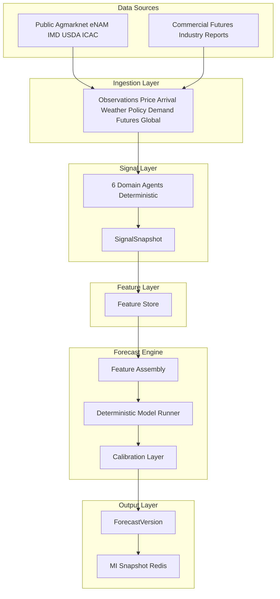
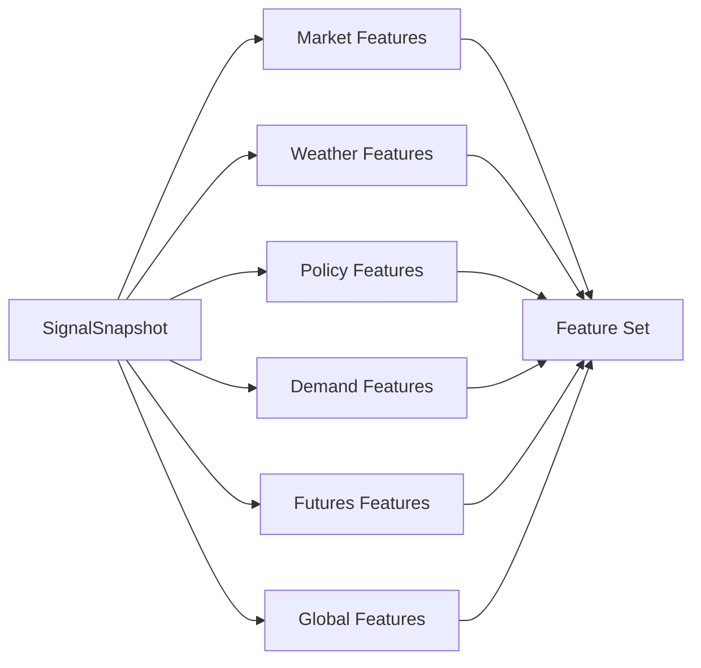
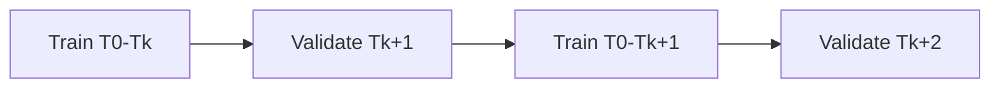
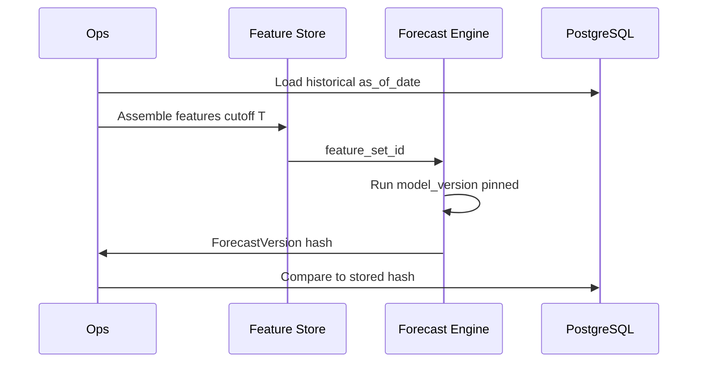

# TDS-007 — Forecast Architecture

**Wave:** 2  
**Status:** Draft — intelligence engine design (no ML model selection, no code)  
**Sources:** TDS-001–006, `docs/founder/*`  
**Priority:** Primary Wave 2 document for data foundation and intelligence engine

**Frozen constraints:** Deterministic forecasting only (TC-001, FD-006); cotton Phase 1; LangGraph orchestration; central precompute (FD-012)

---

## 1. Purpose

Design the **end-to-end forecast pipeline** from external data through observations, signals, features, and deterministic forecast outputs—with rigorous **pre-production validation** that does not violate reproducibility or founder promotion gates.

**Founder decisions:** FD-006, FD-012, FD-019, FD-030, FD-003

**Requirements:** REQ-056, REQ-076, REQ-080–REQ-082, REQ-100, REQ-103, REQ-133

---

## 2. Pipeline Overview

**Event alignment (TDS-005):** OBS publishes `*_UPDATED` → orchestration → `FORECAST_GENERATED` → `MI_SNAPSHOT_READY`.

---

## 3. Data Sources → Observations

| Source | Observation types | Agent consumer | Quality notes |
|--------|-------------------|----------------|---------------|
| Agmarknet | Price, Arrival | Market | Lag/gaps DC-001; basis adjustment FD-030 |
| eNAM | Price | Market | Secondary price |
| IMD | Weather (+ acreage inputs) | Weather | Acreage per founder → Weather Agent |
| Agriculture Ministry | Policy MSP CCI | Policy | MSP/CCI floor inputs |
| USDA / ICAC | Demand, Global | Demand, Global | Slower cadence |
| Futures feed | Futures curve basis OI | Futures | **Critical** for benchmark |
| Industry reports | Demand refinement | Demand | Commercial delay handling |

**Ingestion rules:**
- Every observation carries `as_of_date`, `source`, `ingested_at` (NFR-AUD-002)
- Supersede chain via `supersedes_id` (TDS-006)
- Emit DataQualitySnapshot on each refresh (TDS-011)

---

## 4. Observations → Signals

Six deterministic domain agents (TDS-004) produce **StructuredSignal** rows grouped into **SignalSnapshot** per (`commodity_id`, `as_of_date`, `registry_id`).

**Signal contract (immutable):** `value`, `direction`, `magnitude`, `confidence`, `as_of_timestamp`, `signal_components`, `source_observation_refs`.

**Cotton minimum agent set (PROPOSED):** Futures + Market required; others optional with confidence penalty if missing.

---

## 5. Signal Snapshot → Feature Store

### 5.1 Feature Store Role

The Feature Store is the **deterministic, point-in-time feature assembly** layer between SignalSnapshot and the Forecast Engine. It ensures:

- **No data leakage:** features at `as_of_date` T use only data with `observed_at <= T` (REQ-103)
- **Replay:** `feature_set_ref` on ForecastVersion enables exact reconstruction
- **Commodity configurability:** feature definitions driven by CommodityRegistry (FD-022)

**Persistence:** `feature_set`, `feature_vector` (TDS-006 §10).

### 5.2 Feature Categories

#### Market Features

| Feature name (conceptual) | Derivation | Horizon use |
|---------------------------|------------|-------------|
| `spot_price_level` | Latest mandi / basis-adjusted spot | All |
| `spot_return_7d` | log return 7d | 30d |
| `spot_return_30d` | log return 30d | 60d |
| `arrival_volume_zscore` | vs seasonal mean | 30/60 |
| `arrival_trend_14d` | slope | 30 |
| `regional_strength_dispersion` | cross-mandi std | 60/90 |
| `basis_spot_futures` | spot − near futures | All |

#### Weather Features

| Feature | Derivation |
|---------|------------|
| `rainfall_deficit_index` | vs normal |
| `drought_flag` | binary threshold |
| `acreage_yoy_change` | **Weather Agent** (founder clarification) |
| `production_risk_score` | composite |

#### Policy Features

| Feature | Derivation |
|---------|------------|
| `msp_level` | absolute |
| `spot_msp_ratio` | proximity to floor |
| `cci_procurement_active` | 0/1 |
| `export_restriction_flag` | 0/1 |

#### Demand Features

| Feature | Derivation |
|---------|------------|
| `mill_demand_index` | normalized |
| `export_demand_index` | normalized |
| `domestic_consumption_trend` | slope |

#### Futures Features

| Feature | Derivation |
|---------|------------|
| `curve_slope` | near − far |
| `curve_level_near` | near month price |
| `open_interest_change` | Δ OI |
| `basis_futures_spot` | for hold-to-curve benchmark |
| `carry_implied_30/60/90` | from curve |

#### Global Features

| Feature | Derivation |
|---------|------------|
| `global_inventory_zscore` | USDA/ICAC |
| `global_demand_index` | composite |

### 5.3 Feature Assembly Diagram

---

## 6. Forecast Engine

### 6.1 Engine Components

| Component | Responsibility |
|-----------|----------------|
| **Feature Assembly** | Join Feature Store + registry horizons; apply scaling params versioned per registry |
| **Model Runner** | Execute selected model family deterministically (seeded) |
| **Post-processor** | Enforce bounds (non-negative prices where applicable), monotonicity checks optional |
| **Calibration Layer** | Map raw model intervals to published confidence bands using historical calibration factors (TDS-011) |
| **Publisher** | Write ForecastVersion, emit FORECAST_GENERATED |

### 6.2 Model Strategy — Phase 1 Candidates (No Selection)

**Wave 2 does not select a winning model.** The following are **candidate families** for parallel evaluation:

| Candidate | Strengths (cotton context) | Risks |
|-----------|---------------------------|-------|
| **LightGBM** | Tabular features, fast iteration, handles missing Agmarknet | Overfit without leakage controls |
| **XGBoost** | Robust nonlinear interactions | Same |
| **Prophet** | Seasonality explicit | Weaker on policy/futures jumps |
| **Ensemble** | Blend tabular + seasonal component | Complexity, reproducibility discipline |

**Selection process:** Offline evaluation framework (§8) ranks candidates on **DVA-contributing metrics** first, forecast KPIs second (FD-009).

**Determinism requirements (NFR-REP-001):**
- Fixed random seeds per `model_version`
- Pinned library versions in `model_version` string
- No LLM, no stochastic inference without seed
- Same inputs → identical ForecastVersion bytes

### 6.3 Forecast Horizons

| Horizon | Definition | Primary use |
|---------|------------|-------------|
| **30 Day** | Expected price / return at T+30 | Near-term sell/hold, farmer liquidity |
| **60 Day** | T+60 | Medium hold |
| **90 Day** | T+90 | Seasonal positioning, trader |

Horizons align with REQ-076 and CommodityRegistry `forecast_horizons`.

### 6.4 Forecast Outputs

Per horizon \(h \in \{30, 60, 90\}\):

| Output | Symbol | Description |
|--------|--------|-------------|
| **Point Forecast** | \(\hat{p}_h\) | Expected price level (or return, converted consistently) |
| **Confidence Bands** | \([\hat{p}_h^{low}, \hat{p}_h^{high}]\) | e.g., 80% interval post-calibration |
| **Direction** | \(dir_h\) | sign(\(\hat{p}_h - p_0\)) → bullish/bearish/neutral |
| **Confidence** | \(conf_h\) | 0–1 calibrated probability of direction correctness |

**ForecastVersion** stores all three horizons (TDS-006).

---

## 7. Benchmarks (Decision Evaluation Context)

Forecasts feed **Decision Engine** (TDS-008); economic benchmarks (REQ-100):

| Strategy | Definition | Role |
|----------|------------|------|
| **Sell Immediately** | Liquidate at spot on `as_of_date` | Baseline 1 |
| **Hold To Futures Curve** | Hold to horizon implied by futures curve net of carry | Baseline 2 (FD-003) |
| **KrishiNetra** | Follow deterministic recommendation | Strategy under test |

Forecast quality is judged by **contribution to DVA**, not RMSE alone (FD-009, REQ-083).

---

## 8. Evaluation Framework

### 8.1 Backtesting

**Objective:** Prove deterministic pipeline adds economic value before production promotion (FD-027, REQ-102).

| Parameter | Value |
|-----------|-------|
| Window | **12 calendar months** (approved promotion) |
| Step | 1 business day (daily cadence REQ-140) |
| Universe | Cotton; all active registry versions in window |
| Strategies | Sell / Curve / KrishiNetra (TDS-008 simulation) |
| Metric primary | DVA > 3%, Positive DVA months > 70% |

**Process:**
1. For each `as_of_date` in window:
2. Load registry effective on that date
3. Rebuild SignalSnapshot from observations (or read persisted)
4. Run Feature Store assembly with leakage guards
5. Run Forecast Engine with **pinned candidate model_version**
6. Simulate Decision Engine with representative UserContext panel (farmer + trader profiles)
7. Compute realized net value after carry using **realized** prices at horizon
8. Aggregate DVA vs baselines

### 8.2 Walk-Forward Validation

| Rule | Detail |
|------|--------|
| Train window | Expanding or rolling 24 months minimum (PROPOSED) |
| Validation step | 1 month forward |
| Test holdout | Final 12 months reserved for **promotion backtest only** (never used for model selection) |
| Leakage | No feature from future `as_of_date` |

### 8.3 Regime Validation

Segment backtest by **regimes** to avoid single-regime overfit:

| Regime | Segmentation |
|--------|--------------|
| MSP floor proximity | spot within ±3% MSP vs not |
| CCI active | procurement on vs off |
| High volatility | realized vol > 75th percentile |
| Agmarknet degraded | DataQualitySnapshot penalty active |

Report DVA per regime; KrishiNetra must not fail exclusively in liquidity-critical regimes.

### 8.4 Seasonality Validation

Cotton harvest/marketing seasons drive structural patterns:

- Compare DA and DVA by **crop year quarter**
- Prophet/seasonal candidates evaluated on seasonal MAPE split
- Ensure forecast bands widen during known uncertainty windows (monsoon, export policy)

### 8.5 Confidence Calibration

| Step | Action |
|------|--------|
| 1 | Collect (confidence, outcome) pairs on direction |
| 2 | Bin by decile; plot reliability diagram |
| 3 | Fit calibration mapping per horizon (Platt or isotonic — implementation Wave 3) |
| 4 | Store calibration version on ForecastVersion |
| 5 | Reject candidate if calibration error > threshold (TDS-000 §4.1) |

### 8.6 Data Leakage Prevention

| Check | Enforcement |
|-------|---------------|
| Temporal cutoff | `observed_at <= as_of_date 23:59:59` |
| Feature join | As-of merge only |
| Target | \(y_h\) realized strictly after T+h |
| Futures | Use curve as known at T, not revised history |
| Registry | Version effective at T only |
| Automated test | Replay hash mismatch alarm |

**Audit:** Random sample 50 dates; manual verify observation timestamps.

### 8.7 Forecast Replay

**Procedure (NFR-TRC-001):**

1. Input: `commodity_id`, `as_of_date`, `model_version`, `registry_id`
2. Load SignalSnapshot OR regenerate from observations
3. Load `feature_set_ref` OR recompute features
4. Run Model Runner
5. Compare output hash to stored ForecastVersion

**Acceptance:** 100% match on 30-date audit sample before promotion (REQ-103).

---

## 9. Pre-Production Validation Gate

Forecast architecture is **validated** before production MI serves user decisions when:

| Gate | Criterion | Reference |
|------|-----------|-----------|
| G1 | Leakage audit pass | §8.6 |
| G2 | Replay hash 100% on sample | §8.7 |
| G3 | 12-month promotion backtest: DVA > 3% | TDS-000 |
| G4 | Positive DVA > 70% months | Approved |
| G5 | Forecast generation success ≥ 97% in staging | TDS-000 |
| G6 | Futures + Market agents present ≥ 99% days | FD-030 |
| G7 | No LLM in pipeline audit | TC-001 |

**Explicit:** High RMSE with positive DVA → **acceptable** (FD-009, NFR-CAL-005).  
**Explicit:** Low RMSE with negative DVA → **reject** candidate.

---

## 10. Operational Cadence

| Job | Frequency | Output |
|-----|-----------|--------|
| Ingestion batch | Daily (PROPOSED 02:00–04:00 IST) | Observations |
| DATA_REFRESH | Daily post-ingest | SignalSnapshot |
| Forecast run | Daily | ForecastVersion published |
| MI publish | Daily | Redis + MI_SNAPSHOT_READY |
| Calibration update | Weekly batch | Confidence adjustments (TDS-011) |
| Promotion backtest | Monthly / on model change | DVA report |

---

## 11. Failure Modes

| Failure | Behavior |
|---------|----------|
| Missing futures | Abort publish OR publish with `confidence_penalty` + last curve (TDS-004) |
| Partial agents | Run if minimum met; reduce confidence |
| Model failure | `status=failed`; MI serves last published with stale flag |
| Replay mismatch | Block promotion; alert engineering |

---

## 12. Dependencies

| Dependency | Role |
|------------|------|
| CommodityRegistry | Horizons, sources, model config |
| LangGraph | Agent + forecast orchestration |
| PostgreSQL | Observations, snapshots, ForecastVersion |
| Redis | MI hot read |
| DataQualitySnapshot | Confidence penalties |

---

## 13. Assumptions

| ID | Assumption |
|----|------------|
| FA-001 | Feature store computed in-batch daily Phase 1 (not streaming) |
| FA-002 | Price level forecasts used internally; Decision converts to net value |
| FA-003 | Hold-to-curve uses same futures features as Forecast |
| FA-004 | Multiple model candidates run in offline env; one `is_published` winner |

---

## 14. Open Questions

| ID | Question |
|----|----------|
| OQ-004 | Material signal movement (Decision stability, not forecast) |
| — | Final model selection after offline bake-off (founder approval of winner) |

---

## 15. Founder Approval Needed

| Item | Status |
|------|--------|
| DVA promotion thresholds | **Approved** |
| Candidate model list | **Proposed** — winner after evaluation |
| PROPOSED RMSE/MAPE targets | **Pending** (TDS-000) |
| Daily ingest cutoff time | **PROPOSED** |

---

## 16. Traceability Matrix

| Section | REQ | FD | NFR |
|---------|-----|-----|-----|
| Pipeline | REQ-056, REQ-070, REQ-071 | FD-012, FD-030 | NFR-SCL-001 |
| Determinism | REQ-063, REQ-103 | FD-006, FD-014 | NFR-REP-001, NFR-TRC-001 |
| Evaluation | REQ-100–102, REQ-080 | FD-003, FD-009, FD-020 | NFR-CAL-* |
| Horizons/outputs | REQ-076 | — | — |

---

## 17. Cross-References

| Document | Relationship |
|----------|--------------|
| TDS-004 | Agent definitions |
| TDS-006 | Persistence entities |
| TDS-008 | Consumes Forecast outputs |
| TDS-011 | Calibration of confidence |
| TDS-000 | KPI definitions |
| TDS-005 | Events |
