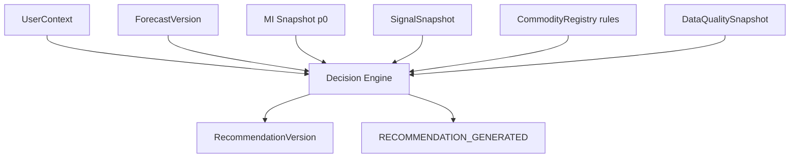
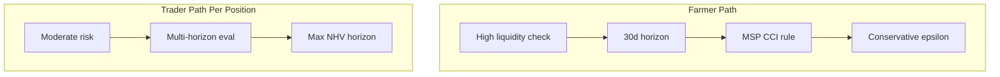
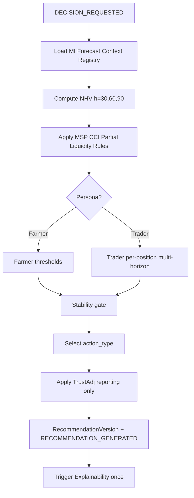

# TDS-008 — Decision Engine

**Wave:** 2  
**Status:** Draft — deterministic recommendation engine (no code)  
**Sources:** TDS-001–007, `docs/founder/*`, founder clarifications  
**Frozen:** No LLM in decision path (TC-001, FD-006)

**Transform:** Forecast + User Context + Commodity Rules → **SELL | HOLD | PARTIAL SELL | PARTIAL HOLD**

---

## 1. Purpose

Specify the **deterministic Decision Engine** that produces net-of-carry recommendations with named rules, full traceability, stability gating, backtest simulation, and historical replay—aligned to farmer and **per-position** trader personas (founder clarification).

**Requirements:** REQ-040–REQ-047, REQ-064, REQ-100–REQ-103, REQ-131  
**Founder decisions:** FD-002, FD-008, FD-015, FD-016, FD-018, FD-028

---

## 2. Inputs, Outputs, Dependencies

### 2.1 Inputs

| Input | Source | Required |
|-------|--------|----------|
| `ForecastVersion` | Forecast Service / MI snapshot | Yes |
| `current_price` \(p_0\) | MI snapshot (basis-adjusted spot) | Yes |
| `UserContext` | User Context Service | Yes |
| `SignalSnapshot` | MI / PostgreSQL | Yes (traceability) |
| `Policy` signal | SignalSnapshot (CCI, MSP) | Yes for MSP/CCI rule |
| `CommodityRegistry` | Active version | Yes |
| `DataQualitySnapshot` | Optional | Confidence/trust adjustment |
| Prior session (stability) | DecisionSession lookup | If returning position key |

### 2.2 Outputs

| Output | Description |
|--------|-------------|
| `action_type` | SELL, HOLD, PARTIAL_SELL, PARTIAL_HOLD |
| `net_value_after_carry` | Scalar net economic advantage vs immediate sell baseline |
| `partial_quantity_pct` | Default **50%** for partial actions (founder clarification) |
| `net_hold_value_components` | Decomposed costs/gains |
| `rules_applied[]` | Auditable rule IDs |
| `decision_trace` | JSON audit trail |
| `RecommendationVersion` | Persisted immutable row |

### 2.3 Dependencies

---

## 3. Net Hold Value Formula

### 3.1 Core Equation (REQ-045, FD-018)

For hold horizon \(h\) days (default \(h = 30\) for primary decision; evaluate 60/90 for tie-breaks):

\[
NHV(h) = \underbrace{(\hat{p}_h - p_0) \cdot q}_{\text{Expected Gain}} - Storage(h) - Financing(h) - Liquidity(h) - QualityLoss(h) - RiskAdj(h) - TrustAdj(h)
\]

Where:
- \(\hat{p}_h\) = point forecast from ForecastVersion at horizon \(h\)
- \(p_0\) = current spot price
- \(q\) = quantity from UserContext

**Decision compares** \(NHV(h)\) against **immediate sell baseline** \(V_{sell} = 0\) (normalized net advantage) and against partial strategies.

### 3.2 Expected Gain

\[
ExpectedGain(h) = (\hat{p}_h - p_0) \cdot q_{eff}
\]

| Parameter | Definition |
|-----------|------------|
| \(\hat{p}_h\) | ForecastVersion.`horizon_h.point` |
| \(p_0\) | MI snapshot spot |
| \(q_{eff}\) | Full \(q\) for Sell/Hold; \(q \cdot \theta\) for partial, \(\theta\) = `partial_quantity_pct` |

**Direction from forecast:** \(dir_h\) used for conservative defaults when \(conf_h\) low.

### 3.3 Storage Cost

\[
Storage(h) = q \cdot s_{unit} \cdot h / 30
\]

| Parameter | Source |
|-----------|--------|
| \(s_{unit}\) | CommodityRegistry `storage_characteristics.cost_per_quintal_per_month` |
| Storage access | If `storage_access=false`, apply **penalty** \(s_{unit} \times \infty\) → forces SELL or PARTIAL_SELL (liquidity) |

### 3.4 Financing Cost

\[
Financing(h) = q \cdot p_0 \cdot r_{cap} \cdot h / 365
\]

| Parameter | Source |
|-----------|--------|
| \(r_{cap}\) | UserContext.`financing_profile.cost_of_capital_pct` annualized |

Trader persona may use higher \(r_{cap}\) reflecting working capital (REQ-022).

### 3.5 Liquidity Cost

\[
Liquidity(h) = \lambda_{liq} \cdot p_0 \cdot q
\]

| `liquidity_need` | \(\lambda_{liq}\) (PROPOSED) |
|----------------|------------------------------|
| low | 0 |
| medium | 0.005 |
| high | 0.015 |
| critical | 0.03 + partial-sell bias |

**Purpose:** Model economic pain of delaying cash (FD-028, REQ-131). High/critical increases push toward SELL or PARTIAL_SELL.

### 3.6 Quality Loss

\[
QualityLoss(h) = q \cdot \delta_{quality} \cdot h / 30
\]

| Parameter | Source |
|-----------|--------|
| \(\delta_{quality}\) | Registry quality degradation rate per month |

### 3.7 Risk Adjustment

\[
RiskAdj(h) = \gamma_{risk} \cdot |ExpectedGain(h)|
\]

| `risk_profile` | \(\gamma_{risk}\) (PROPOSED) |
|----------------|------------------------------|
| conservative | 0.25 |
| moderate | 0.15 |
| aggressive | 0.08 |

Reduces effective NHV for risk-averse users (farmer default conservative per FD-029).

### 3.8 Trust Adjustment

\[
TrustAdj(h) = \tau \cdot p_0 \cdot q
\]

| Component | \(\tau\) source |
|-----------|----------------|
| Forecast confidence | \(\tau = (1 - conf_h) \cdot 0.01\) |
| Data quality | \(\tau += (1 - overall\_quality\_score) \cdot 0.01\) from DataQualitySnapshot |
| Calibration drift flag | +0.005 if decision drift detected (TDS-011) |

**Purpose:** Conservative shift when trust components weak (REQ-084, FD-029)—never overrides named rules.

---

## 4. Action Selection Logic

### 4.1 Net Advantage vs Sell

\[
\Delta_{hold}(h) = NHV(h) - V_{sell} = NHV(h)
\]

Select primary horizon \(h^* = 30\) unless registry specifies otherwise.

### 4.2 Decision Thresholds (PROPOSED — calibrate in backtest)

| Condition | `action_type` |
|-----------|---------------|
| \(\Delta_{hold}(h^*) < -\epsilon\) AND liquidity critical | **SELL** |
| \(\Delta_{hold}(h^*) < -\epsilon\) AND liquidity high | **PARTIAL_SELL** at 50% |
| \(\Delta_{hold}(h^*) \geq \epsilon\) AND storage OK | **HOLD** |
| \(\Delta_{hold}(h^*) \geq \epsilon\) AND liquidity medium | **PARTIAL_HOLD** (hold 50%, sell 50%) |
| \(|\Delta_{hold}| \leq \epsilon\) | **PARTIAL_SELL** 50% (conservative default FD-029) |

\(\epsilon\) = `decision_rules.neutral_band` in CommodityRegistry (PROPOSED: 0.5% of \(p_0 \cdot q\)).

### 4.3 Net Value After Carry (Reported)

\[
net\_value\_after\_carry = \max(\Delta_{hold}(h^*), \Delta_{partial}(h^*), 0) \text{ for hold actions}
\]

For SELL, report realized advantage vs hypothetical hold (may be negative if hold would have won—report transparently in trace).

---

## 5. Named Rules

### 5.1 MSP/CCI Floor Rule (FD-008, REQ-046)

**Trigger — Near MSP (founder-approved):**

\[
\text{near\_msp} \iff \left| \frac{p_0 - MSP}{MSP} \right| \leq 0.03
\]

**Trigger — CCI active:**

\[
\text{cci\_active} = \text{PolicySignal.cci\_procurement\_active} = true
\]

**If** `near_msp AND cci_active`:

1. Apply **downside cap** on ExpectedGain: floor at 0 for negative price scenarios below MSP
2. Add `rules_applied: MSP_CCI_FLOOR_v1`
3. Shift hold calculus: \(\Delta_{hold}\) receives **+bonus** \(= \beta_{msp} \cdot p_0 \cdot q\) where \(\beta_{msp}\) = 0.01 (PROPOSED)
4. Reduce \(\gamma_{risk}\) by 50% for this session (policy floor trust)

**Rule location:** Decision layer only (REQ-047, NFR-AUD-003)—not inside Forecast model.

### 5.2 Partial Sell Rule (Founder clarification)

When `action_type` ∈ {PARTIAL_SELL, PARTIAL_HOLD}:

\[
\theta = \text{default\_partial\_sell\_pct} = 0.50
\]

Unless user override (Wave 3 UX).

`rules_applied: PARTIAL_DEFAULT_50_v1`

### 5.3 High Liquidity Need Logic (FD-028)

| `liquidity_need` | Rule |
|------------------|------|
| critical | Disallow pure HOLD; max action PARTIAL_SELL 50% |
| high | If \(\Delta_{hold} < 2\epsilon\), force PARTIAL_SELL |
| medium | Allow PARTIAL_HOLD |
| low | Standard thresholds |

`rules_applied: LIQUIDITY_GUARD_v1`

---

## 6. Persona Logic

### 6.1 Farmer Logic (P-001)

| Aspect | Behavior |
|--------|----------|
| Default `risk_profile` | conservative |
| Liquidity | Often high/critical → partial-sell bias |
| Storage | Variable; no storage → sell pressure |
| Horizon emphasis | \(h^* = 30\) primary |
| MSP/CCI | Frequently applicable for cotton |

**Goal:** Actionable recommendations under cash constraints (REQ-021).

### 6.2 Trader Logic (P-002) — Per-Position Only

| Aspect | Behavior |
|--------|----------|
| Scope | **One UserContext per position** — no portfolio aggregation (founder clarification) |
| `risk_profile` | moderate default |
| Financing | Higher \(r_{cap}\) typical |
| Liquidity | Usually low/medium |
| Horizon | May evaluate \(h \in \{30,60,90\}\); select max \(\Delta_{hold}(h)\) if within risk cap |
| Storage | Assumed available |

**Goal:** Risk-adjusted hold/sell per position (REQ-022 per-position).

---

## 7. Recommendation Stability

### 7.1 Material Signal Movement (PROPOSED — pending OQ-004)

For returning user with same `position_key` (hash of context + commodity):

\[
\Delta_{signal} = \max_{a \in agents} \left| \frac{mag_a^{new} - mag_a^{old}}{mag_a^{old}} \right|
\]

**Flip allowed only if** \(\Delta_{signal} \geq \tau_{material}\) OR \(|\Delta_{hold}| \geq 2\epsilon\).

| Parameter | PROPOSED value |
|-----------|----------------|
| \(\tau_{material}\) | 0.15 (15% magnitude change) |

If flip blocked: retain prior `action_type`; new RecommendationVersion with `supersedes` link and `stability_token=blocked`.

**Field test:** REQ-140, OQ-001.

### 7.2 Stability vs Daily Refresh

- MI refreshes daily; Decision for **new sessions** uses new forecast
- **Returning position** without material movement: stable call

---

## 8. Decision Traceability

Every RecommendationVersion includes `decision_trace`:

| Field | Content |
|-------|---------|
| `as_of_date` | Market anchor |
| `forecast_version_id` | |
| `snapshot_id` | |
| `registry_id` | |
| `formula_version` | |
| `p0`, `p_hat_30/60/90` | |
| `NHV_components` | All cost terms |
| `delta_hold` | |
| `rules_applied` | |
| `thresholds_epsilon` | |
| `persona_path` | farmer/trader |
| `stability_check` | pass/blocked + reason |

**NFR:** NFR-TRC-003, NFR-AUD-004

---

## 9. Decision Replay

Identical to Forecast replay (TDS-007 §8.7) plus UserContext:

1. Load pinned `forecast_version_id`, `snapshot_id`, `context_id`, `registry_id`, `formula_version`
2. Re-execute decision math
3. Compare hash to `RecommendationVersion.decision_trace_hash`

**REQ-103:** 100% match on audit sample.

---

## 10. Backtesting Logic

### 10.1 Simulation

For each historical `as_of_date` T:

| Step | Action |
|------|--------|
| 1 | Load ForecastVersion at T |
| 2 | Apply **panel** of UserContext profiles (N farmers, M traders) |
| 3 | Run Decision Engine deterministic |
| 4 | Observe realized prices at T+h |
| 5 | Compute realized net value for recommended action |
| 6 | Compare to Sell and Hold-to-curve baselines |

### 10.2 Hold-to-Futures-Curve Baseline (FD-003)

\[
V_{curve} = (p_{futures,h} - p_0) \cdot q - Carry_{curve}(h)
\]

where \(p_{futures,h}\) from Futures features at T.

### 10.3 DVA Aggregation (TDS-000)

\[
DVA = \overline{V_{KN}} - \max(\overline{V_{sell}}, \overline{V_{curve}})
\]

**Promotion:** DVA > 3% over 12 months; Positive DVA > 70% months (**approved**).

---

## 11. Decision Flow Diagram

---

## 12. Explainability Boundary

Decision Engine **never** calls LLM. Explainability Service consumes `decision_trace` + signals post-hoc (FD-007, REQ-064).

---

## 13. Assumptions

| ID | Assumption |
|----|------------|
| DE-001 | \(\epsilon\) and \(\lambda_{liq}\) PROPOSED until backtest calibration |
| DE-002 | \(h^* = 30\) default for farmers; traders may use max NHV horizon |
| DE-003 | Position key = hash(commodity, quantity band, region, persona) — Wave 3 refinement |
| DE-004 | TrustAdj cannot flip SELL↔HOLD without \(\Delta_{signal}\) rule |

---

## 14. Open Questions

| ID | Item |
|----|------|
| OQ-004 | \(\tau_{material}\) final value |
| OQ-001 | Stability field testing |
| OQ-007 | Outcome linkage for Hold/Partial success KPIs |

---

## 15. Founder Approval Status

| Item | Status |
|------|--------|
| MSP ±3% | **Approved** |
| Partial 50% | **Approved** |
| Per-position trader | **Approved** |
| DVA promotion gate | **Approved** |
| \(\epsilon\), \(\lambda_{liq}\), \(\tau_{material}\) | **PROPOSED** |

---

## 16. Traceability

| Topic | REQ | FD |
|-------|-----|-----|
| Net value | REQ-011, REQ-023, REQ-042 | FD-002 |
| Rules | REQ-046, REQ-047 | FD-008 |
| Outputs | REQ-041 | FD-016 |
| Deterministic | REQ-015, REQ-044, REQ-063 | FD-006, FD-018 |
| Backtest | REQ-100–103 | FD-003, FD-020 |
| Partial/liquidity | REQ-131 | FD-028 |

---

## 17. Cross-References

| Doc | Link |
|-----|------|
| TDS-007 | Forecast outputs \(\hat{p}_h\), \(conf_h\) |
| TDS-006 | RecommendationVersion schema |
| TDS-011 | Calibration, drift, trust |
| TDS-000 | DVA KPI |
| TDS-005 | RECOMMENDATION_GENERATED |
