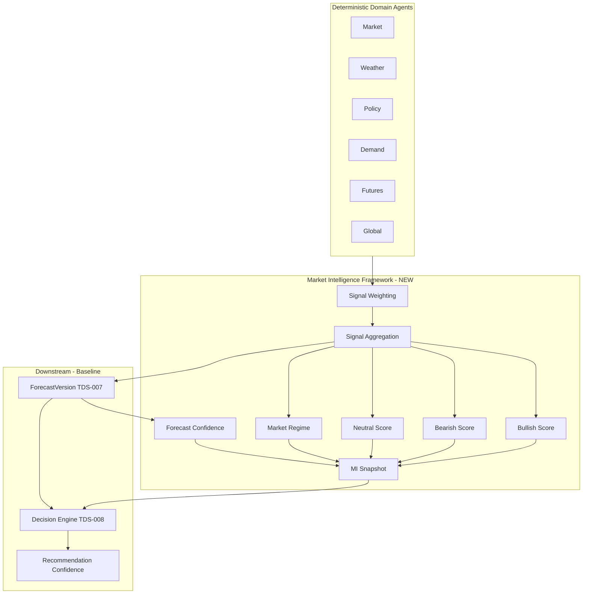
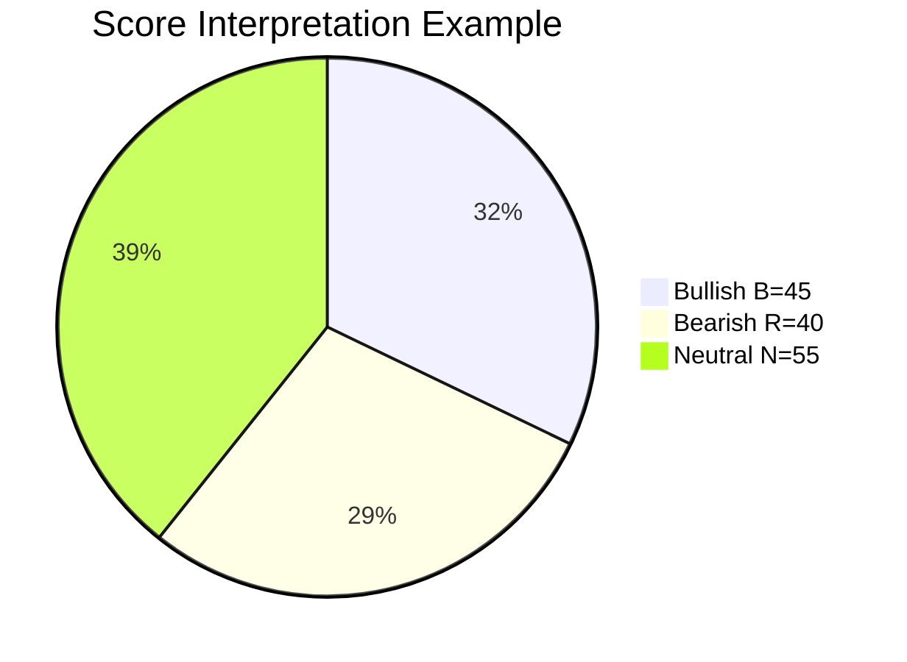
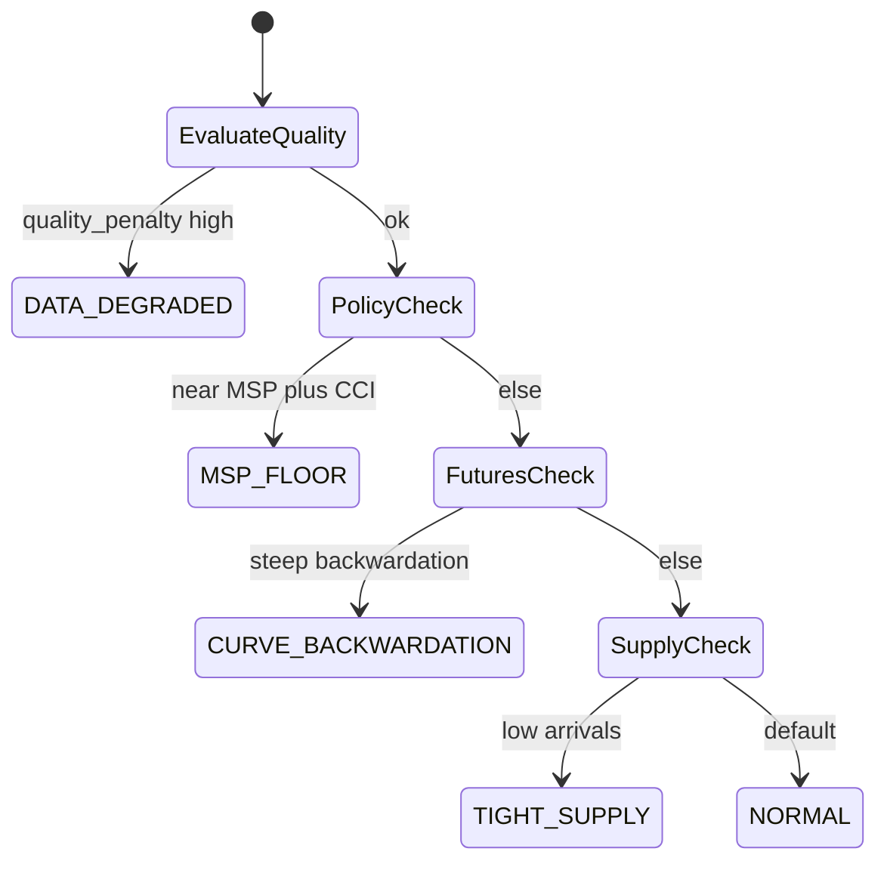
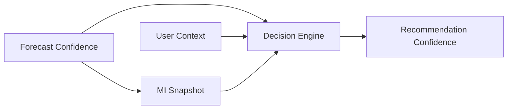
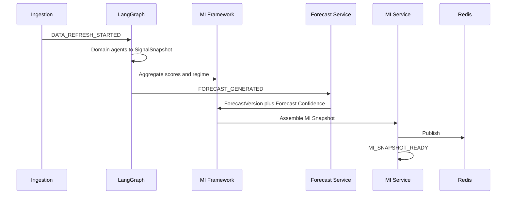
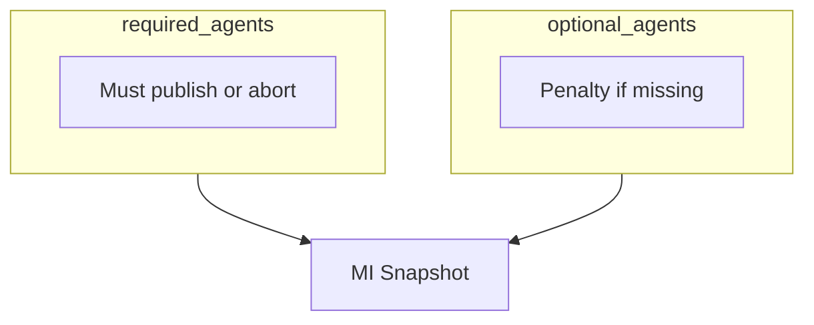

# TDS-009 — Market Intelligence Framework

**Wave:** 3 (Architecture completion)  
**Status:** Approved baseline extension — does not supersede TDS-007 pipeline  
**Baseline:** TDS-001–008, TDS-011, `docs/founder/*`  
**Architecture review deltas:** Dual confidence model; `required_agents[]` / `optional_agents[]`; participant roles; MI scoring framework

---

## 1. Guiding Principle

KrishiNetra is a **Decision Intelligence Platform**, not a forecasting platform.

| Principle | Implication |
|-----------|-------------|
| Forecasts support decisions | Forecast outputs are inputs to MI and Decision—not the primary user-facing success metric |
| DVA is primary | If a design improves RMSE but reduces DVA, **DVA wins** (FD-009, TDS-000) |
| Shared MI | Central precompute (FD-012); zero marginal cost per user (NFR-SCL-001) |
| Deterministic core | Scores and regimes are computed deterministically; LLM only narrates (FD-007) |

**Requirements:** REQ-001, REQ-002, REQ-030–REQ-037, REQ-083  
**Founder decisions:** FD-011, FD-012, FD-019, FD-022

---

## 2. Framework Position in Architecture



**Baseline preserved:** Six domain agents (TDS-004), Feature Store + Forecast Engine (TDS-007), MI Service (TDS-003).

**TDS-009 defines:** How signals become **actionable market intelligence** before and alongside forecast publication.

---

## 3. Core Constructs

### 3.1 Bullish Score

| Attribute | Definition |
|-----------|------------|
| **Purpose** | Single normalized scalar (0–100) summarizing upward price pressure for the commodity at `as_of_date` |
| **Symbol** | \(B\) |
| **Formula (conceptual)** | \( B = 100 \cdot \sum_{i \in \mathcal{A}^+} w_i \cdot \max(0, s_i) \) where \(s_i\) = signed contribution from agent \(i\), \(w_i\) = commodity-specific weight, \(\mathcal{A}^+\) = agents with bullish directional component |
| **Inputs** | StructuredSignals from SignalSnapshot; CommodityRegistry `signal_weights`; Market Regime modifier |
| **Outputs** | `bullish_score` on MI Snapshot; top factors for bullish_factors[] |
| **Why it matters** | REQ-034; farmer/trader scan without reading six agents |
| **Not** | A forecast; not LLM-generated |

### 3.2 Bearish Score

| Attribute | Definition |
|-----------|------------|
| **Purpose** | Summarize downward price pressure |
| **Symbol** | \(R\) (bearish; avoid \(B\) collision) |
| **Formula** | \( R = 100 \cdot \sum_{i \in \mathcal{A}^-} w_i \cdot \max(0, -s_i) \) |
| **Outputs** | `bearish_score`; bearish_factors[] |
| **REQ** | REQ-034 |

### 3.3 Neutral Score

| Attribute | Definition |
|-----------|------------|
| **Purpose** | Quantify offsetting or low-conviction conditions—prevents false clarity when \(B \approx R\) |
| **Symbol** | \(N\) |
| **Formula** | \( N = 100 \cdot \left(1 - \frac{|B - R|}{\max(B, R, \epsilon)}\right) \cdot \bar{c}_{agents} \) where \(\bar{c}\) = mean agent confidence |
| **Interpretation** | High \(N\) → balanced/conflicted signals; widen bands, conservative decision bias |
| **Outputs** | `neutral_score` on MI Snapshot |



*Note: Pie is illustrative; scores are not required to sum to 100.*

---

## 4. Signal Weighting Methodology

### 4.1 Commodity-Specific Weights

Stored in **CommodityRegistry** (architecture review extension):

| Registry field | Description |
|----------------|-------------|
| `signal_weights` | Map `agent_type` → \(w_i\), \(\sum w_i = 1\) over active agents |
| `required_agents[]` | Must be present or MI publish aborts (cotton: Market, Futures) |
| `optional_agents[]` | Absence applies confidence penalty, not abort |

**Cotton reference (Phase 1):**

| Agent | Weight \(w_i\) (PROPOSED) | Required |
|-------|---------------------------|----------|
| Futures | 0.25 | Yes |
| Market | 0.22 | Yes |
| Policy | 0.15 | No |
| Demand | 0.15 | No |
| Weather | 0.13 | No |
| Global | 0.10 | No |

**Traceability:** FD-022, REQ-073; replaces TDS-006 `minimum_agents` semantics with explicit required/optional arrays.

### 4.2 Signed Agent Contribution

Per agent \(i\) from StructuredSignal:

\[
s_i = \text{sign}(dir_i) \cdot mag_i \cdot conf_i
\]

where \(dir_i \in \{+1, 0, -1\}\) from bullish/bearish/neutral.

### 4.3 Regime-Conditional Weight Adjustment

\[
w_i' = w_i \cdot m_i(regime)
\]

See §5 for regime \(m_i\) modifiers.

---

## 5. Market Regime Detection

### 5.1 Regime Taxonomy (Cotton Phase 1)

| Regime ID | Detection criteria (deterministic) | Decision/MI bias |
|-----------|----------------------------------|------------------|
| `MSP_FLOOR` | spot within ±3% MSP AND cci_active | Floor rule active (FD-008) |
| `TIGHT_SUPPLY` | arrival_zscore < -1 AND B > R | Hold bias tempered by liquidity |
| `EXPORT_PUSH` | export_signal strong bullish | Bullish narrative weight |
| `CURVE_BACKWARDATION` | futures curve slope > threshold | Hold-to-curve benchmark elevated |
| `DATA_DEGRADED` | DataQualitySnapshot penalty > 0.2 | Neutral score ↑, confidence ↓ |
| `NORMAL` | default | Standard weights |

### 5.2 Regime Selection

\[
regime = \arg\max_{r \in \mathcal{R}} score_r(\text{signals}, p_0, MSP, \text{quality})
\]

First matching rule in **priority order** (CommodityRegistry `regime_priority[]`):

1. DATA_DEGRADED  
2. MSP_FLOOR  
3. CURVE_BACKWARDATION  
4. TIGHT_SUPPLY  
5. EXPORT_PUSH  
6. NORMAL  

### 5.3 Regime Diagram



---

## 6. Signal Aggregation

### 6.1 Aggregation Pipeline

| Step | Action |
|------|--------|
| 1 | Validate `required_agents[]` present in SignalSnapshot |
| 2 | Load `signal_weights` + regime modifiers |
| 3 | Compute \(s_i\) per agent |
| 4 | Compute \(B\), \(R\), \(N\) |
| 5 | Detect `market_regime` |
| 6 | Extract ranked `bullish_factors[]`, `bearish_factors[]` (top-k by \|s_i w_i'\|) |
| 7 | Attach to MI Snapshot; pass signals to Forecast Engine (TDS-007) |

### 6.2 Factor Extraction (Bullish/Bearish Factors)

Each factor entry:

| Field | Source |
|-------|--------|
| `factor_id` | agent_type + component |
| `label` | Registry `narrative_labels` map (deterministic) |
| `contribution` | \(s_i w_i'\) |
| `direction` | bullish/bearish |
| `confidence` | agent confidence |

**REQ-034, REQ-035:** Supply/demand analysis = structured narrative inputs (§10), not LLM.

---

## 7. Confidence: Forecast vs Recommendation

Architecture review requires **explicit separation**. These measure different objects.

### 7.1 Forecast Confidence

| Attribute | Detail |
|-----------|--------|
| **What it measures** | Reliability of **price outlook** at horizons 30/60/90 |
| **Scope** | Shared MI; same for all users at `as_of_date` |
| **Sources** | Model calibration (TDS-011), band width, DA history, DataQualitySnapshot |
| **Symbol** | \(conf^{forecast}_h\) per horizon \(h\) |
| **Formula (conceptual)** | \( conf^{forecast}_h = clip(\alpha_1 \cdot c^{model}_h + \alpha_2 \cdot Q + \alpha_3 \cdot (1 - N/100), 0, 1) \) |
| **Stored on** | ForecastVersion (TDS-006), denormalized on MI Snapshot |
| **Used by** | MI display, Explainability narrative, TrustAdj (TDS-008) |
| **REQ** | REQ-033 (MI context), REQ-056 |

**Not used alone** to promote product—that requires DVA (FD-009).

### 7.2 Recommendation Confidence

| Attribute | Detail |
|-----------|--------|
| **What it measures** | Reliability of **sell/hold action** for a specific UserContext |
| **Scope** | Per DecisionSession; varies by liquidity, storage, persona |
| **Sources** | \(|\Delta_{hold}|\) margin vs \(\epsilon\), Forecast Confidence at \(h^*\), rule triggers, stability state |
| **Symbol** | \(conf^{rec}\) |
| **Formula (conceptual)** | \( conf^{rec} = clip(\beta_1 \cdot conf^{forecast}_{h^*} + \beta_2 \cdot \frac{|\Delta_{hold}|}{\epsilon} + \beta_3 \cdot stability\_pass, 0, 1) \) |
| **Stored on** | RecommendationVersion (TDS-006 extension) |
| **Used by** | Decision API response, Explainability, calibration dashboards |
| **REQ** | REQ-033 (decision context), REQ-043 |

### 7.3 Comparison Table

| Dimension | Forecast Confidence | Recommendation Confidence |
|-----------|---------------------|---------------------------|
| Object | Price path | Action |
| User-specific | No | Yes |
| Computed in | Forecast/MI pipeline | Decision Engine |
| LLM influence | None | None |
| Primary metric link | Secondary (RMSE/DA) | Primary (DVA) |



---

## 8. Market Intelligence Snapshot

Canonical published artifact (Redis + PostgreSQL projection). Extends TDS-006 MI concept.

| Field group | Fields |
|-------------|--------|
| **Identity** | `mi_snapshot_id`, `commodity_id`, `as_of_date`, `registry_id`, `generated_at` |
| **Scores** | `bullish_score`, `bearish_score`, `neutral_score`, `market_regime` |
| **Prices** | `current_price`, `price_summary_by_region[]` |
| **Forecast ref** | `forecast_version_id`, `horizon_summaries[]`, **`forecast_confidence_30/60/90`** |
| **Factors** | `bullish_factors[]`, `bearish_factors[]`, `supply_demand_summary` (structured) |
| **Quality** | `data_quality_snapshot_id`, `overall_quality_score` |
| **Trace** | `snapshot_id`, `signal_weights_version` |

**Immutability:** New row per publish; never mutate in place (NFR-REP-005).

---

## 9. MI Publication Process

Aligns to TDS-005 events.



| Gate | Condition |
|------|-----------|
| Publish allowed | `required_agents[]` satisfied |
| Publish degraded | optional missing → DATA_DEGRADED regime, penalty on confidence |
| Publish blocked | required missing → no MI_SNAPSHOT_READY; alert ops |

---

## 10. Explainability Inputs (Narrative Inputs)

Deterministic **Narrative Inputs** object passed to Explainability Agent (TDS-004)—LLM may only phrase, not invent signals.

| Input block | Contents |
|-------------|----------|
| `scores` | B, R, N, regime |
| `factors` | bullish_factors[], bearish_factors[] |
| `forecast_summary` | direction per horizon, forecast_confidence |
| `supply_demand` | structured bullets from Demand/Global/Market |
| `policy_context` | MSP, CCI status if MSP_FLOOR |
| `quality_flags` | stale sources list |
| `recommendation` | action, recommendation_confidence, rules_applied (Decision only) |

**REQ-085, NFR-EXP-001–003**

---

## 11. Cotton Reference Implementation

### 11.1 Registry Excerpt (Conceptual)

```yaml
commodity_id: cotton
required_agents: [Market, Futures]
optional_agents: [Weather, Policy, Demand, Global]
signal_weights:
  Futures: 0.25
  Market: 0.22
  Policy: 0.15
  Demand: 0.15
  Weather: 0.13
  Global: 0.10
regime_priority: [DATA_DEGRADED, MSP_FLOOR, CURVE_BACKWARDATION, TIGHT_SUPPLY, EXPORT_PUSH, NORMAL]
msp_proximity_pct: 0.03
default_partial_sell_pct: 0.50
participant_roles_enabled: [Farmer, Trader, Ginner, Miller, Exporter, Aggregator]
phase_1_active_roles: [Farmer, Trader]
```

### 11.2 Phase 1 MI Outputs (User-Facing)

| Output | REQ |
|--------|-----|
| Current prices | REQ-031 |
| Outlook + 30/60/90 | REQ-032 |
| Forecast confidence | REQ-033 |
| Bullish/bearish factors | REQ-034 |
| Supply/demand | REQ-035 |
| No registration | REQ-030 |

---

## 12. Commodity Extensibility Model

### 12.1 Participant Roles (Architecture Review)

**CommodityProfile** extension—roles enabled per commodity:

| Role | Phase 1 cotton | Typical intelligence use |
|------|----------------|--------------------------|
| **Farmer** | Active | Sell/hold, liquidity |
| **Trader** | Active (per-position) | Sell/hold, financing |
| **Ginner** | Configured, inactive | Arrival/quality spread (future) |
| **Miller** | Configured, inactive | Mill demand offset (future) |
| **Exporter** | Configured, inactive | Export demand (future) |
| **Aggregator** | Configured, inactive | Mandi aggregation (future) |

Phase 1 **does not** change Decision inputs—only `Farmer` and `Trader` personas in UserContext (baseline). Registry pre-admits roles for Phase 7 commodities.

**REQ-003** long-term participants.

### 12.2 New Commodity Checklist

| Step | Action |
|------|--------|
| 1 | Add Commodity + CommodityProfile + participant_roles |
| 2 | Publish CommodityRegistry with agents, weights, regimes, rules |
| 3 | Configure ingestion sources |
| 4 | Offline DVA backtest (FD-010 structural criteria) |
| 5 | Promote per TDS-011 gate |

### 12.3 Agent Requirement Model



---

## 13. InventoryPosition (Phase 2 — Documented Only)

Per architecture review: **future entity**, not Phase 1 implementation.

| Attribute | Detail |
|-----------|--------|
| **Purpose** | Persistent inventory lot linked to UserContext and Decision sessions (REQ-121) |
| **Phase** | Phase 2 |
| **MI impact** | None Phase 1; may supply `position_id` for stability gating later |
| **Reference** | TDS-014 future scope; TDS-006 addendum in implementation |

---

## 14. Assumptions

| ID | Assumption |
|----|------------|
| MI-001 | B/R/N are deterministic functions of signals only |
| MI-002 | Cotton weights PROPOSED until DVA backtest tuning |
| MI-003 | Narrative labels are registry-driven i18n keys Phase 1 (English only) |
| MI-004 | Supply/demand summary is template-filled structured text, not LLM in MI path |

---

## 15. Open Questions

| ID | Question |
|----|----------|
| OQ-002 | Display forecast vs recommendation confidence in UI |
| OQ-004 | Material signal movement (feeds recommendation confidence) |
| — | Final cotton signal weights founder sign-off |

---

## 16. Founder Approval Required

| Item | Status |
|------|--------|
| DVA-over-RMSE principle | **Aligned** (FD-009) |
| Dual confidence model | **Architecture review — needs founder ack** |
| required/optional agents | **Architecture review — needs founder ack** |
| Six participant roles on commodity | **Architecture review — needs founder ack** |
| Cotton weight table | **PROPOSED** |

---

## 17. Traceability

| Section | REQ | FD | TDS |
|---------|-----|-----|-----|
| Scores/factors | REQ-034, REQ-035 | FD-012 | TDS-007 |
| MI snapshot | REQ-037 | FD-011 | TDS-005, TDS-006 |
| Forecast confidence | REQ-033, REQ-056 | FD-006 | TDS-007, TDS-011 |
| Recommendation confidence | REQ-033, REQ-043 | FD-015 | TDS-008 |
| Registry agents | REQ-073 | FD-022 | TDS-006 |

---

## 18. Document Control

| Version | Notes |
|---------|-------|
| 1.0 | Wave 3 MI Framework |
