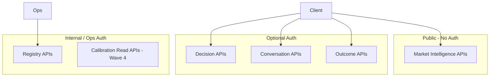
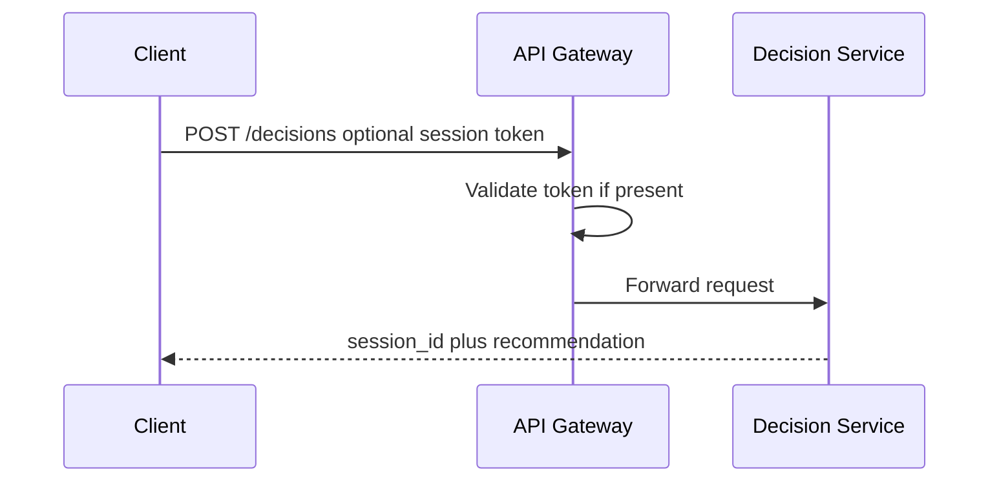

# TDS-010 — API Architecture

**Wave:** 3  
**Status:** Logical API specification only (no implementation code)  
**Baseline:** TDS-001–009, TDS-011; approved Modular Monolith + FastAPI  
**Principle:** APIs expose **decision intelligence**; forecasts are supporting fields in MI responses

---

## 1. Purpose

Define **logical REST APIs** for Phase 1 implementation: resource model, request/response contracts, auth, versioning, errors, caching, rate limits, and audit—without code or OpenAPI generation (Wave 4).

**Founder constraints:** REQ-030 (MI no registration); REQ-064 (one explainability pass); TC-001 (no LLM in decision math)

---

## 2. API Design Principles

| Principle | Source |
|-----------|--------|
| Decision-first responses | DVA platform positioning |
| `as_of_date` on every intelligence payload | NFR-TRC-001 |
| Separate `forecast_confidence` and `recommendation_confidence` | TDS-009 §7 |
| Immutable session artifacts | TDS-006 versioning |
| Public MI read without auth | FD-011 |
| Decision Mode may use optional lightweight session token | PROPOSED |

---

## 3. API Surface Overview



**Base URL (logical):** `https://api.krishinetra.in/v1`  
**Phase 1 commodity path param:** `commodity_id=cotton` only (FD-001)

---

## 4. Versioning Model

| Mechanism | Rule |
|-----------|------|
| **URL version** | `/v1/` prefix; breaking change → `/v2/` |
| **Resource versions** | `registry_version`, `forecast_version_id`, `formula_version` in response bodies |
| **Deprecation** | `Sunset` header + 6-month notice for external clients |
| **Schema evolution** | Additive fields only within major version |

---

## 5. Authentication Model

### 5.1 Tiers

| Tier | APIs | Mechanism |
|------|------|-----------|
| **Anonymous** | Market Intelligence (read) | None (REQ-030, FD-011) |
| **Session** | Decision, Conversation, Outcome | Optional `X-Session-Token` or JWT (PROPOSED)—links sessions for flywheel without mandatory accounts Phase 1 |
| **Service** | Registry admin, calibration | API key + mTLS internal (ops) |

### 5.2 Phase 1 Farmer Free Model

- No payment gates on APIs (FD-005, REQ-112)
- Rate limits by IP for anonymous MI; higher limits with session token

### 5.3 Auth Flow (Decision)



---

## 6. Market Intelligence APIs

### 6.1 `GET /v1/commodities/{commodity_id}/market-intelligence`

**Purpose:** Latest published MI Snapshot (TDS-009).  
**Auth:** None  
**Cache:** CDN/Redis — `Cache-Control: public, max-age=300` until next MI_SNAPSHOT_READY

**Query parameters:**

| Param | Required | Description |
|-------|----------|-------------|
| `as_of_date` | No | Historical MI; default latest |

**Response `200` contract:**

```json
{
  "commodity_id": "cotton",
  "as_of_date": "2026-06-01",
  "mi_snapshot_id": "uuid",
  "registry_id": "uuid",
  "generated_at": "ISO-8601",
  "current_price": { "value": 6200, "unit": "INR/quintal", "market_id": "..." },
  "scores": {
    "bullish_score": 52,
    "bearish_score": 38,
    "neutral_score": 41,
    "market_regime": "NORMAL"
  },
  "forecast": {
    "forecast_version_id": "uuid",
    "horizons": [
      {
        "days": 30,
        "point": 6350,
        "band_low": 6100,
        "band_high": 6600,
        "direction": "bullish",
        "forecast_confidence": 0.62
      }
    ]
  },
  "bullish_factors": [{ "factor_id": "...", "label": "...", "contribution": 0.12 }],
  "bearish_factors": [],
  "supply_demand_summary": { "supply": "...", "demand": "..." },
  "data_quality": { "overall_score": 0.91, "flags": [] },
  "trace": { "snapshot_id": "uuid" }
}
```

**Note:** No `recommendation_confidence` on MI endpoint—forecast confidence only (TDS-009).

**Errors:** `404` no snapshot; `503` MI not ready

**REQ:** REQ-030–035, REQ-037 | **TDS:** TDS-009, TDS-005

---

### 6.2 `GET /v1/commodities/{commodity_id}/prices`

**Purpose:** Current price summary (subset of MI for lightweight clients).  
**Auth:** None

**Response `200`:** `{ "as_of_date", "prices": [{ "market_id", "region_id", "value", "unit" }] }`

**REQ:** REQ-031

---

## 7. Decision APIs

### 7.1 `POST /v1/commodities/{commodity_id}/decisions`

**Purpose:** Run Decision Engine once; create DecisionSession + Recommendation + Explanation.  
**Auth:** Optional session token  
**Idempotency:** `Idempotency-Key` header recommended

**Request contract:**

```json
{
  "user_context": {
    "quantity_quintals": 50,
    "storage_access": "own_warehouse",
    "liquidity_need": "high",
    "financing_profile": { "cost_of_capital_pct": 0.14 },
    "risk_profile": "conservative",
    "persona_type": "farmer",
    "region_preference": "gujarat"
  },
  "position_key": "optional-hash-for-stability",
  "as_of_date": "optional-override-default-latest-mi"
}
```

**Validation rules:** REQ-040 fields required; `persona_type` ∈ {farmer, trader} Phase 1; quantity > 0

**Response `201` contract:**

```json
{
  "session_id": "uuid",
  "as_of_date": "2026-06-01",
  "recommendation": {
    "recommendation_id": "uuid",
    "action_type": "PARTIAL_SELL",
    "partial_quantity_pct": 0.5,
    "net_value_after_carry_inr": 12500,
    "recommendation_confidence": 0.58,
    "rules_applied": ["PARTIAL_DEFAULT_50_v1", "LIQUIDITY_GUARD_v1"],
    "msp_proximity_triggered": false
  },
  "forecast_confidence_at_decision_horizon": 0.62,
  "explanation": {
    "why": "...",
    "what_could_go_wrong": "...",
    "assumptions": ["..."]
  },
  "mi_snapshot_id": "uuid",
  "trace": {
    "forecast_version_id": "uuid",
    "formula_version": "1.0.0",
    "registry_id": "uuid"
  }
}
```

**Critical:** `recommendation_confidence` ≠ `forecast_confidence` (TDS-009 §7).

**Errors:** `400` validation; `409` MI stale; `422` missing required agents

**REQ:** REQ-040–047, REQ-064 | **FD:** FD-015–018 | **TDS:** TDS-008

---

### 7.2 `GET /v1/decisions/{session_id}`

**Purpose:** Retrieve immutable delivered session.  
**Auth:** Session token or public read PROPOSED (privacy review TDS-012)

**Response `200`:** Same shape as POST response

---

## 8. Conversation APIs

### 8.1 `POST /v1/decisions/{session_id}/conversation`

**Purpose:** NL Q&A over explanation only (REQ-059, TC-005).  
**Auth:** Session token recommended

**Request:**

```json
{
  "message": "Why partial sell and not full hold?"
}
```

**Response `200`:**

```json
{
  "reply": "...",
  "grounded_in": ["explanation_id", "session_id"],
  "disclaimer": "Does not change recommendation"
}
```

**Constraints:**
- Must not return altered `action_type` or net value
- Must refuse questions requiring non-published model internals

**REQ:** REQ-059 | **TDS:** TDS-004 Conversation Agent

---

## 9. Outcome APIs

### 9.1 `POST /v1/decisions/{session_id}/outcomes`

**Purpose:** Capture flywheel outcome (FD-023).  
**Auth:** Session token

**Request:**

```json
{
  "action_taken": "PARTIAL_SELL",
  "realized_net_value_inr": 11800,
  "observation_period": { "start": "2026-06-01", "end": "2026-07-01" }
}
```

**Response `201`:**

```json
{
  "outcome_id": "uuid",
  "validation_status": "pending"
}
```

**REQ:** REQ-110, REQ-111 | **TDS:** TDS-011 (OQ-007 workflow)

---

### 9.2 `GET /v1/decisions/{session_id}/outcomes`

**Purpose:** Read captured outcome status.

---

## 10. Registry APIs

### 10.1 `GET /v1/commodities`

**Purpose:** List commodities; Phase 1 returns cotton only.

**Response `200`:**

```json
{
  "commodities": [
    {
      "commodity_id": "cotton",
      "display_name": "Cotton",
      "status": "active",
      "participant_roles_enabled": ["Farmer", "Trader", "Ginner", "Miller", "Exporter", "Aggregator"],
      "phase_1_active_roles": ["Farmer", "Trader"]
    }
  ]
}
```

---

### 10.2 `GET /v1/commodities/{commodity_id}/registry/active`

**Purpose:** Active registry config (read-only public subset).

**Response `200`:**

```json
{
  "registry_id": "uuid",
  "version": "1.2.0",
  "effective_from": "ISO-8601",
  "required_agents": ["Market", "Futures"],
  "optional_agents": ["Weather", "Policy", "Demand", "Global"],
  "forecast_horizons": [30, 60, 90],
  "decision_rules_public": {
    "msp_proximity_pct": 0.03,
    "default_partial_sell_pct": 0.5
  }
}
```

**Auth:** Public read (transparency); full config ops-only

**REQ:** REQ-073 | **TDS:** TDS-009 §12

---

### 10.3 `POST /v1/internal/registry/versions` (Ops)

**Purpose:** Activate new CommodityRegistry version.  
**Auth:** Service key  
**Effect:** REGISTRY_VERSION_ACTIVATED; no retroactive mutation

---

## 11. Error Handling Strategy

### 11.1 Error Envelope

```json
{
  "error": {
    "code": "MI_NOT_READY",
    "message": "Human readable",
    "details": {},
    "trace_id": "uuid",
    "as_of_date": "2026-06-01"
  }
}
```

### 11.2 Standard Codes

| HTTP | Code | When |
|------|------|------|
| 400 | `VALIDATION_ERROR` | Invalid UserContext |
| 401 | `UNAUTHORIZED` | Invalid token |
| 404 | `NOT_FOUND` | Session/commodity |
| 409 | `STALE_MI` | MI older than threshold |
| 422 | `AGENTS_INCOMPLETE` | required_agents missing |
| 429 | `RATE_LIMITED` | See §12 |
| 503 | `SERVICE_UNAVAILABLE` | Pipeline failed |

### 11.3 Deterministic Errors

Decision math failures return **no partial recommendation**—structured error only (NFR-IMP-001).

---

## 12. Rate Limits

| Tier | Limit (PROPOSED) | Scope |
|------|------------------|-------|
| Anonymous MI | 120 req/hour/IP | GET MI, prices |
| Session Decision | 30 decisions/day/token | POST decisions |
| Conversation | 50 messages/day/session | POST conversation |
| Outcome | 10/day/session | POST outcomes |
| Registry internal | 1000/day/service key | Ops |

**Headers:** `X-RateLimit-Limit`, `X-RateLimit-Remaining`, `Retry-After`

---

## 13. Caching Strategy

| Resource | Cache layer | TTL | Invalidation |
|----------|-------------|-----|--------------|
| MI Snapshot | Redis + API CDN | Until MI_SNAPSHOT_READY | Event-driven |
| Registry active | In-process + Redis | 5 min | REGISTRY_VERSION_ACTIVATED |
| Decision session | No cache | — | Immutable |
| Conversation | No cache | — | Per-request |

**Cache key:** `mi:{commodity_id}:{as_of_date}`

**REQ:** REQ-037, FD-012

---

## 14. Audit Requirements

Every mutating API logs:

| Field | Required |
|-------|----------|
| `trace_id` | Yes |
| `api_version` | Yes |
| `commodity_id` | Yes |
| `session_id` / `snapshot_id` | Yes |
| `as_of_date` | Yes |
| `actor` (anon/session/service) | Yes |
| `request_hash` | Yes |
| `response_recommendation_id` | Decision POST |
| `latency_ms` | Yes |

**Immutable audit store:** PostgreSQL append-only (TDS-012).

**REQ:** NFR-TRC-001–004, REQ-103

---

## 15. API ↔ Event Alignment

| API action | Event |
|------------|-------|
| POST decisions | DECISION_REQUESTED → RECOMMENDATION_GENERATED |
| (async) explain | EXPLANATION_GENERATED |
| POST outcomes | OUTCOME_CAPTURED |
| MI read | (read MI_SNAPSHOT_READY artifact) |

**TDS-005**

---

## 16. Phase 2 API Placeholders (Not Implemented)

| Endpoint | Entity |
|----------|--------|
| `POST /v1/inventory-positions` | InventoryPosition (architecture review) |
| `GET /v1/inventory-positions/{id}` | Phase 2 |

---

## 17. Assumptions

| ID | Assumption |
|----|------------|
| API-001 | FastAPI auto-generates OpenAPI from implementation Wave 4 |
| API-002 | Synchronous POST decision includes explanation inline (one pass) |
| API-003 | Hindi localization Wave 4+ |

---

## 18. Open Questions

| ID | Item |
|----|------|
| OQ-002 | Confidence display in combined response |
| OQ-009 | Legal disclaimers on Decision/Conversation responses |
| — | Public read of session_id privacy |

---

## 19. Founder Approval Required

| Item | Status |
|------|--------|
| MI without auth | **Approved** (FD-011) |
| Dual confidence in API | **Architecture review** |
| Session token model | **PROPOSED** |

---

## 20. Traceability Matrix

| API group | REQ | FD | TDS |
|-----------|-----|-----|-----|
| MI | REQ-030–037 | FD-011, FD-012 | TDS-009 |
| Decision | REQ-040–047, REQ-064 | FD-015–018 | TDS-008 |
| Conversation | REQ-059 | FD-007 | TDS-004 |
| Outcome | REQ-110–111 | FD-023 | TDS-011 |
| Registry | REQ-073 | FD-022 | TDS-009 §12 |

---

## 21. Document Control

| Version | Wave |
|---------|------|
| 1.0 | 3 |
