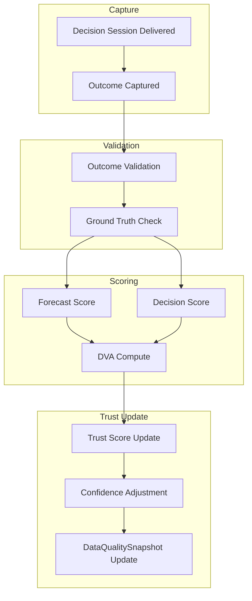
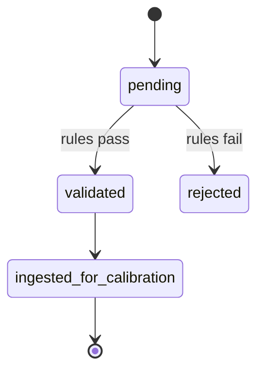
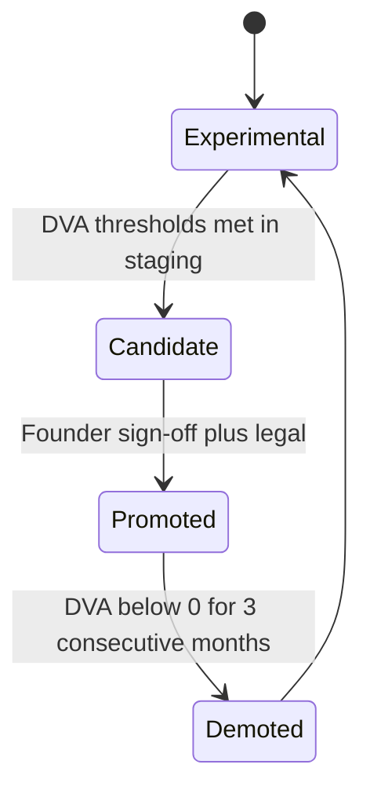
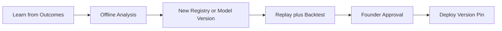

# TDS-011 — Calibration Architecture

**Wave:** 2  
**Status:** Draft — trust and learning framework (no code)  
**Sources:** TDS-000, TDS-006–008, `docs/founder/*`  
**Principle:** Platform improves through **calibration and scoring**—never by making forecast/decision math non-deterministic (FD-006, TC-001)

**Founder decisions:** FD-021, FD-023, FD-009, FD-020

---

## 1. Purpose

Design how KrishiNetra **learns and builds trust** via:

- Outcome capture and validation
- Forecast and decision calibration
- Trust scores and confidence adjustment
- DVA measurement and **recommendation promotion gate**
- Data quality and drift detection
- Calibration dashboards

Without violating: deterministic core, reproducible replay, LLM-only explainability (FD-007).

---

## 2. Calibration Pipeline Overview

**Flywheel (FD-023, REQ-110):** context → recommendation → outcome → calibration → trust → usage

---

## 3. Outcome Capture

### 3.1 Purpose

Feed proprietary dataset (REQ-111) and close the loop on whether recommendations worked (NFR-TRC-004).

### 3.2 Capture Triggers (PROPOSED — OQ-007 pending)

| Trigger | Producer | Data |
|---------|----------|------|
| User self-report | Decision Service UI (Wave 3) | `action_taken`, `realized_net_value` |
| Follow-up prompt | N days after session | Same |
| Inferred proxy | Batch job comparing mandi prices | `validation_method=inferred` |

### 3.3 Outcome Entity (TDS-006)

| Field | Role |
|-------|------|
| `session_id` | FK to DecisionSession |
| `realized_net_value` | Net after carry for period |
| `action_taken` | User actual vs recommended |
| `observation_period` | start/end |
| `validation_status` | pending → validated/rejected |

### 3.4 Event

**OUTCOME_CAPTURED** (TDS-005) → Calibration batch consumer.

---

## 4. Outcome Validation

### 4.1 Validation Rules

| Rule | Pass criteria |
|------|---------------|
| Session exists | `session_id` valid, delivered |
| Period sane | `observation_period` ≥ 7 days, ≤ 365 days |
| Value bounds | `realized_net_value` within plausible range vs \(p_0 \cdot q\) |
| Action consistency | If `action_taken` diverges from recommendation, flag not reject |
| Duplicate | One validated outcome per session |

### 4.2 Ground Truth Sources

| Source | Use |
|--------|-----|
| Agmarknet / MI prices | Inferred P&L |
| User attestation | Primary when available |
| Futures settlement | Trader positions |

**Status:** OQ-007 — workflow requires founder approval.

### 4.3 Validation States

---

## 5. Forecast Calibration

### 5.1 Objectives

| Objective | Metric |
|-----------|--------|
| Direction reliability | Directional accuracy by horizon |
| Interval reliability | Confidence band coverage (target 80% interval contains realized 80% of time) |
| Bias correction | Mean error → 0 |

### 5.2 Process

| Step | Description |
|------|-------------|
| 1 | Collect (ForecastVersion, realized price at T+h) pairs |
| 2 | Compute RMSE, MAPE, MAE, DA (TDS-000) |
| 3 | Fit calibration mapping per horizon: \(conf' = f(conf, regime)\) |
| 4 | Version calibration as `calibration_version` on ForecastVersion |
| 5 | Apply in Forecast Engine post-processor (TDS-007)—**deterministic** given version |

### 5.3 Confidence Adjustment

\[
conf_{calibrated} = clip(f(conf_{raw}, regime, calibration\_version), 0, 1)
\]

**Never** changes \(\hat{p}_h\) point forecast in Phase 1—only confidence and bands (PROPOSED).

---

## 6. Decision Calibration

### 6.1 Objectives

Align **stated recommendation quality** with realized DVA; tune PROPOSED thresholds (\(\epsilon\), \(\lambda_{liq}\)) offline only.

### 6.2 Process

| Step | Description |
|------|-------------|
| 1 | Join validated Outcomes to RecommendationVersion |
| 2 | Compute Hold Success, Partial Sell Success (TDS-000) |
| 3 | Segment by persona, liquidity, MSP/CCI regime |
| 4 | Propose registry updates to `decision_rules` (new CommodityRegistry version) |
| 5 | Re-run backtest before activating version |

**Critical:** Threshold changes ship as **new registry version**, not runtime mutation (NFR-TRC-002).

---

## 7. Trust Score

### 7.1 Composite Trust Score (0–100)

\[
Trust = w_1 C_{cal} + w_2 C_{stab} + w_3 C_{dq} + w_4 C_{trans} + w_5 C_{out}
\]

| Component | Symbol | Source (REQ-084) |
|-----------|--------|------------------|
| Calibration | \(C_{cal}\) | Forecast + decision calibration errors |
| Stability | \(C_{stab}\) | Recommendation stability KPI |
| Data quality | \(C_{dq}\) | DataQualitySnapshot |
| Transparency | \(C_{trans}\) | Explainability completeness rate |
| Outcome tracking | \(C_{out}\) | Outcome capture % |

**PROPOSED weights:** \(w_1=0.25, w_2=0.20, w_3=0.25, w_4=0.15, w_5=0.15\)

### 7.2 Trust Score Uses

| Consumer | Use |
|----------|-----|
| Explainability | Narrative framing ("moderate confidence") — OQ-002 display TBD |
| Decision Engine | TrustAdj term (TDS-008)—bounded |
| Dashboards | Ops and founder review |
| Promotion | Not sole gate; DVA primary |

**Constraint:** Trust score **must not** override MSP/CCI or liquidity rules.

---

## 8. DVA Measurement

### 8.1 Definition (TDS-000, FD-009)

\[
DVA_{12m} = \overline{V_{KN}} - \max(\overline{V_{sell}}, \overline{V_{curve}})
\]

Net of carry; 12 calendar months; cotton universe.

### 8.2 Measurement Cadence

| Report | Frequency | Audience |
|--------|-----------|----------|
| Rolling 12m DVA | Monthly | Founder, ops |
| Monthly DVA | Monthly | Calibration dashboard |
| Per-regime DVA | Quarterly | Model team |

### 8.3 Positive DVA %

\[
PositiveDVA\% = \frac{\#\{months : DVA_m > 0\}}{12}
\]

**Promotion threshold:** > **70%** (approved).

---

## 9. Recommendation Promotion Gate

### 9.1 Approved Gate (Founder clarification)

| Criterion | Threshold | Status |
|-----------|-----------|--------|
| Backtest window | 12 months | **APPROVED** |
| Aggregate DVA | > **3%** | **APPROVED** |
| Positive DVA months | > **70%** | **APPROVED** |
| Replay audit | 100% match sample | REQ-103 |
| Legal review | Complete | **PENDING** OQ-009 |

### 9.2 Promotion State Machine

| State | User-visible behavior |
|-------|----------------------|
| Experimental | Internal/beta only |
| Candidate | Limited pilot |
| Promoted | General availability |
| Demoted | Conservative defaults; review |

### 9.3 What Promotion Does **Not** Do

- Does not change deterministic formulas without new registry version
- Does not enable LLM in decision path
- Does not skip outcome capture requirement for ongoing calibration

---

## 10. DataQualitySnapshot

### 10.1 Purpose (TDS-006)

Per-refresh record of source health driving confidence penalties and trust.

### 10.2 Attributes (Recap)

| Attribute | Use |
|-----------|-----|
| `source_health` | Per-source fresh/stale/missing |
| `overall_quality_score` | 0–1 composite |
| `agmarknet_lag_hours` | Lag metric |
| `futures_feed_ok` | Critical flag |
| `confidence_penalty_factor` | Applied in Forecast + Decision TrustAdj |

### 10.3 Composite Quality Score

\[
Q = \sum_s w_s \cdot health_s
\]

| Source | PROPOSED weight |
|--------|-----------------|
| futures | 0.35 |
| agmarknet | 0.25 |
| market arrivals | 0.15 |
| weather | 0.10 |
| policy | 0.10 |
| demand/global | 0.05 |

---

## 11. Source Health Monitoring

| Check | Frequency | Alert |
|-------|-----------|-------|
| Ingestion completeness | Daily | Missing source > 4h |
| Agmarknet lag | Daily | lag > 48h |
| Futures feed | Daily | feed down |
| Signal completeness | Per refresh | < 6 agents |
| Forecast failure | Per refresh | FORECAST failed |

**Consumer:** DataQualitySnapshot writer; ops dashboard.

---

## 12. Forecast Drift Detection

### 12.1 Definition

**Drift** = statistical shift in forecast errors or feature distributions vs training baseline.

| Signal | Detection |
|--------|-----------|
| RMSE spike | 7-day RMSE > 1.5× 90-day baseline |
| DA collapse | DA₃₀ < baseline − 10pp for 14 days |
| Feature distribution | PSI > 0.2 on key features (PROPOSED) |

### 12.2 Response

| Severity | Action |
|----------|--------|
| Warning | Increase TrustAdj; flag MI |
| Critical | Block promotion; alert; optional revert `model_version` |

**No automatic online learning** in Phase 1 without offline validation and new ForecastVersion.

---

## 13. Decision Drift Detection

### 13.1 Definition

Shift in recommendation distribution or outcome success vs baseline.

| Signal | Detection |
|--------|-----------|
| Hold rate spike | > 2σ vs 90d mean |
| Hold success drop | below 45% for 30d with n>30 |
| DVA live negative | 3 consecutive months |

### 13.2 Response

- Trigger registry review (new decision_rules version)
- Increase conservative defaults (\(\epsilon\) band)
- Demote promotion state if sustained

---

## 14. Continuous Improvement Without Violating Determinism

| Allowed | Forbidden |
|---------|-----------|
| New CommodityRegistry version with tuned thresholds | Runtime randomness in Decision |
| New calibration_version mapping confidence | LLM altering recommendation |
| New model_version after offline bake-off | Online learning updating weights live |
| DataQuality-driven TrustAdj | TrustAdj overriding safety rules |
| Outcome-driven **reports** | Outcome-driven **inline** formula changes |

---

## 15. Calibration Dashboards

### 15.1 Dashboard: Forecast Health

| Panel | Metrics |
|-------|---------|
| Accuracy | RMSE, MAPE, MAE by horizon |
| Direction | DA 30/60/90 |
| Calibration | Reliability diagram |
| Drift | PSI, RMSE spike flags |

### 15.2 Dashboard: Decision Value

| Panel | Metrics |
|-------|---------|
| DVA | 12m rolling, monthly bars |
| Baselines | vs sell, vs curve |
| Success | Hold rate, Hold success, Partial sell success |
| Promotion | Gate criteria traffic lights |

### 15.3 Dashboard: Trust & Data

| Panel | Metrics |
|-------|---------|
| Trust score | Composite + components |
| Outcomes | Capture %, validation rate |
| Sources | Health matrix |
| Stability | Flip rate, material movements |

### 15.4 Dashboard: Operations

| Panel | Metrics |
|-------|---------|
| Platform | Refresh success, forecast success, latency (TDS-000) |
| Pipeline | Event counts, failures |

**Audience:** Ops (daily), founder (weekly), model team (continuous).

---

## 16. Batch Jobs (Logical)

| Job | Schedule | Output |
|-----|----------|--------|
| `calibration_daily` | Daily post-MI | DataQualitySnapshot |
| `outcome_validation` | Daily | Validated outcomes |
| `forecast_metrics` | Weekly | Forecast KPIs |
| `dva_rolling` | Monthly | DVA report |
| `drift_detection` | Daily | Alerts |
| `promotion_review` | Monthly | Gate status report |

---

## 17. Inputs, Outputs, Dependencies

| Module | Inputs | Outputs |
|--------|--------|---------|
| Outcome capture | User/API (Wave 3), sessions | Outcome rows, OUTCOME_CAPTURED |
| Validation | Outcome, ground truth | validation_status |
| Forecast calibration | ForecastVersion, prices | calibration_version |
| Decision calibration | RecommendationVersion, outcomes | registry proposals |
| Trust update | All above | trust_score, confidence adjustments |
| Promotion gate | DVA report, legal flag | promotion_state |

**Dependencies:** PostgreSQL (TDS-006), TDS-007 pipeline, TDS-008 engine, TDS-000 KPIs.

---

## 18. Assumptions

| ID | Assumption |
|----|------------|
| CAL-001 | Calibration runs batch-only Phase 1 |
| CAL-002 | Trust weights PROPOSED until 90d live data |
| CAL-003 | Demotion policy PROPOSED (3 negative DVA months) |
| CAL-004 | Inferred outcomes used only when user report missing |

---

## 19. Open Questions

| ID | Item |
|----|------|
| OQ-007 | Outcome capture UX and validation |
| OQ-002 | Trust score display |
| OQ-009 | Legal gate on promotion |
| OQ-004 | Stability thresholds feed C_stab |

---

## 20. Founder Approval Status

| Item | Status |
|------|--------|
| DVA > 3%, 12mo, >70% months | **Approved** |
| Trust weights | **PROPOSED** |
| Demotion policy | **PROPOSED** |
| Promotion states | **PROPOSED** |
| Inferred outcomes | **PROPOSED** |

---

## 21. Traceability

| Topic | REQ | FD | NFR |
|-------|-----|-----|-----|
| Flywheel | REQ-110, REQ-111 | FD-023 | NFR-TRS-005 |
| Trust components | REQ-084 | FD-021 | NFR-TRS-001 |
| DVA primary | REQ-083, REQ-102 | FD-009 | NFR-CAL-002 |
| Promotion | REQ-102, REQ-100 | FD-020 | NFR-TRS-002 |
| Determinism | REQ-103 | FD-006 | NFR-TRC-002 |
| Data quality | REQ-133 | FD-030 | NFR-TRS-001 |

---

## 22. Cross-References

| Document | Link |
|----------|------|
| TDS-000 | KPI formulas and targets |
| TDS-006 | Outcome, DataQualitySnapshot |
| TDS-007 | Forecast calibration layer |
| TDS-008 | TrustAdj, rules |
| TDS-005 | OUTCOME_CAPTURED event |

---

## 23. Document Control

| Version | Wave |
|---------|------|
| 0.1 | 2 |

**Wave 3 out of scope:** Dashboard implementation, batch job code, API for outcomes.
