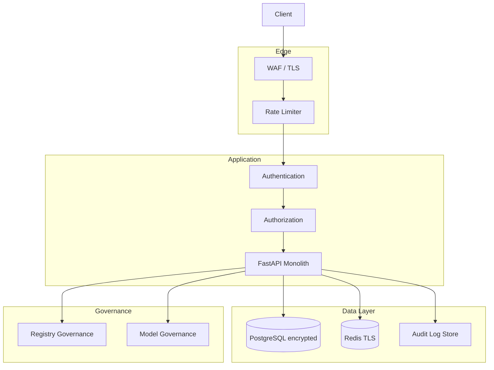
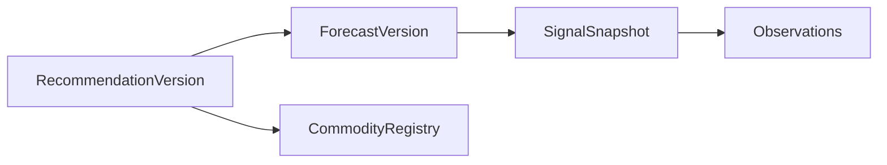

# TDS-012 — Security & Audit Architecture

**Wave:** 3  
**Status:** Logical security architecture (no implementation)  
**Baseline:** TDS-001–011, `docs/founder/*`  
**Regulatory context:** India — sell/hold guidance, future NBFC/RBI (RC-001, RC-002)

---

## 1. Purpose

Define **security, privacy, audit, governance, and compliance** controls enabling trustworthy Decision Intelligence at scale—without altering the deterministic core (FD-006).

---

## 2. Security Architecture Overview



---

## 3. Authentication

| Use case | Mechanism | Phase |
|----------|-----------|-------|
| Market Intelligence | None (FD-011) | 1 |
| Decision / Conversation / Outcome | Session token or anonymous device-bound token (PROPOSED) | 1 |
| Registry admin | Service API key + IP allowlist | 1 |
| Calibration dashboards | SSO for ops (PROPOSED) | 1 |
| Future trader accounts | JWT/OAuth2 | 2+ |

**Requirements:**
- TLS 1.2+ everywhere
- Secrets in vault (not env files in prod)
- Token rotation 90 days (service keys)

**TDS-010 §5**

---

## 4. Authorization

### 4.1 Role Model (Logical)

| Role | Permissions Phase 1 |
|------|---------------------|
| `anonymous` | Read MI, read registry public |
| `session_user` | Create decision, conversation, outcome for own session_id |
| `ops_ingest` | Trigger refresh, view pipeline health |
| `ops_registry` | Publish registry versions |
| `ops_calibration` | Read calibration reports, promotion state |
| `admin` | All ops |

### 4.2 Authorization Rules

| Resource | Rule |
|----------|------|
| `session_id` | Write outcome only if token owns session (PROPOSED) |
| Registry write | `ops_registry` only |
| Internal replay jobs | `ops_calibration` only |

**Phase 1:** No farmer/trader account RBAC—persona is request field only.

### 4.3 Participant Roles (Future)

CommodityProfile enables Ginner, Miller, Exporter, Aggregator (TDS-009)—authorization extends in Phase 2+ with role-based feature flags, not Phase 1 gates.

---

## 5. Data Privacy

| Data class | Classification | Handling |
|------------|----------------|----------|
| UserContext (quantity, financing) | **Sensitive business** | Encrypt at rest; minimize logs |
| Decision sessions | Sensitive | Retention 5 years (TDS-006) |
| Market prices | Public | No restriction |
| Outcomes | Sensitive + proprietary | Access controlled |
| Explainability text | Derived | No PII in prompts to LLM |

### 5.1 PII Handling

| Rule | Detail |
|------|--------|
| Minimize collection | No name/phone required Phase 1 MI |
| LLM boundary | Explainability receives **redacted** UserContext (persona, liquidity tier—not raw loan IDs) |
| Right to erasure | PROPOSED: delete session by token request (India DPDP alignment) |
| Data residency | India region deployment (PROPOSED—founder approval) |

**Open:** OQ-009 legal review for advice framing

---

## 6. Audit Logging

### 6.1 Audit Events (Append-Only)

| Event type | Trigger |
|------------|---------|
| `api.request` | All mutating APIs |
| `decision.computed` | RECOMMENDATION_GENERATED |
| `explanation.generated` | EXPLANATION_GENERATED |
| `outcome.captured` | OUTCOME_CAPTURED |
| `registry.activated` | New registry version |
| `forecast.published` | FORECAST_GENERATED |
| `mi.published` | MI_SNAPSHOT_READY |
| `promotion.state_change` | Calibration gate |

### 6.2 Audit Record Schema (Conceptual)

| Field | Required |
|-------|----------|
| `audit_id` | UUID |
| `occurred_at` | ISO-8601 UTC |
| `event_type` | enum |
| `trace_id` | correlates API + pipeline |
| `actor_type` | anon/session/service |
| `commodity_id` | |
| `as_of_date` | |
| `entity_refs` | session_id, recommendation_version_id, etc. |
| `payload_hash` | SHA-256 of canonical inputs |
| `outcome_hash` | SHA-256 of recommendation outputs |

**Storage:** PostgreSQL partitioned table `audit_log`; no UPDATE/DELETE (immutable).

**REQ:** NFR-TRC-001–004

---

## 7. Recommendation Traceability

Every delivered recommendation must be reconstructable:

| Artifact chain | Link |
|----------------|------|
| RecommendationVersion | → formula_version, decision_trace |
| → ForecastVersion | → feature_set_ref, model_version |
| → SignalSnapshot | → signal_ids[] |
| → Observations | → source refs |
| → CommodityRegistry | → version effective at as_of_date |

**Replay audit (REQ-103):** Monthly job compares replay hash to stored hash on 30-date sample.



**TDS-008 §9, TDS-007 §8.7**

---

## 8. Replay Requirements

| Replay type | Authority | Frequency |
|-------------|-----------|-----------|
| Forecast replay | ops_calibration | On model change |
| Decision replay | ops_calibration | On formula_version change |
| Full chain | promotion gate | Before Promoted state |

**Acceptance:** 100% hash match on approved sample (TDS-011 §9).

**Constraint:** Replay uses **same** deterministic code path as production—no debug shortcuts.

---

## 9. Model Governance

| Control | Description |
|---------|-------------|
| **Model registry** | `model_version` string pins library + artifact hash |
| **Promotion** | Only `ops_calibration` can mark model `candidate` → `production` |
| **No hot-swap** | Production model change = new ForecastVersion + backtest |
| **LLM governance** | Separate prompt version for Explainability; no impact on numbers |
| **DVA gate** | Model cannot promote without DVA thresholds (TDS-000) |

**Principle:** Model improvements that hurt DVA are rejected even if RMSE improves (FD-009).

---

## 10. Registry Governance

| Control | Description |
|---------|-------------|
| **Versioned activation** | New CommodityRegistry row; `is_active` points to one version |
| **Change approval** | Two-person ops approval for decision_rules changes (PROPOSED) |
| **Diff audit** | `registry.activated` logs full diff hash |
| **Rollback** | Reactivate prior registry version; forward-only data |

**Fields under governance:** `required_agents[]`, `optional_agents[]`, `signal_weights`, MSP rule params, partial sell default (TDS-009).

---

## 11. Data Retention

| Entity | Retention | After expiry |
|--------|-----------|--------------|
| PriceObservation / Arrival | 7 years hot | Archive cold |
| SignalSnapshot / ForecastVersion | Indefinite | — |
| DecisionSession / RecommendationVersion | 5 years | Anonymize |
| Outcome | Indefinite (proprietary) | — |
| Audit log | 7 years | Archive |
| Conversation log | 2 years | Delete |
| Redis MI cache | TTL 48h | Ephemeral |

**TDS-006**

---

## 12. Explainability Audit

| Requirement | Control |
|-------------|---------|
| LLM does not alter recommendation | Post-hoc only; audit compares recommendation_id before/after explain call |
| Grounding | Log `narrative_inputs_hash` from TDS-009 §10 |
| Prompt versioning | `prompt_version` on explanation record |
| Fallback | Structured fallback logged when LLM fails |

**Sampling:** 5% of explanations reviewed weekly for hallucination vs narrative_inputs (manual ops).

**REQ:** REQ-058, NFR-EXP-004, TC-005

---

## 13. Operational Security

| Control | Phase 1 |
|---------|---------|
| Dependency scanning | CI gate (TDS-013) |
| SAST on Python | CI gate |
| Secret scanning | CI + pre-commit |
| DB encryption at rest | Required |
| Redis AUTH + TLS | Required |
| Least-privilege DB roles | app_read, app_write, ops_admin |
| Backup RPO/RPO | PROPOSED 24h / 4h |
| Incident response runbook | PROPOSED |

---

## 14. Threat Model

| Threat | Impact | Mitigation |
|--------|--------|------------|
| **T1** Scraping MI at scale | Cost, competitive | Rate limits (TDS-010) |
| **T2** Prompt injection via Conversation | Misleading narrative | Ground only on explanation artifact; refuse policy |
| **T3** Tampering with recommendation | Trust loss | Immutable versions; audit hashes |
| **T4** Future data leakage in backtest | False promotion | Leakage checks TDS-007 §8.6 |
| **T5** Rogue registry deploy | Wrong farmer advice | Two-person approval; audit |
| **T6** PII in LLM prompts | Privacy breach | Redaction layer |
| **T7** Denial of service on Decision | Availability | Rate limits; queue (Wave 4) |
| **T8** Impersonation of session | Wrong outcome linkage | Session token binding |

```mermaid
quadrantChart
    title Threat Priority Phase 1
    x High Impact
    y High Likelihood
    T1: [0.7, 0.8]
    T3: [0.9, 0.3]
    T2: [0.6, 0.5]
    T5: [0.95, 0.2]
```

---

## 15. Compliance Considerations (India)

| Area | Consideration | Status |
|------|---------------|--------|
| **Investment advice** | Sell/hold may be construed as advice | **Legal review required** RC-001, OQ-009 |
| **DPDP Act 2023** | Consent, purpose limitation for session data | PROPOSED privacy notice on Decision |
| **IT Act / CERT-In** | Log retention 180 days for incident entities | Align audit retention |
| **NBFC/RBI** | Phase 5 financing | Out of scope Phase 1 RC-002 |
| **Consumer protection** | No guaranteed returns messaging | Disclaimers on API (TDS-010) |
| **MSP/CCI policy** | Public policy data — attribute sources | Transparency in MI |

**Required before scale:** Legal opinion on product classification and disclaimer text (**founder approval**).

---

## 16. InventoryPosition (Phase 2 Security Note)

When **InventoryPosition** is introduced (architecture review):

- New authorization: position owner only
- Links to Decision sessions for stability—extends audit chain
- Not in Phase 1 threat surface

---

## 17. Assumptions

| ID | Assumption |
|----|------------|
| SEC-001 | India-only deployment Phase 1 |
| SEC-002 | Session tokens are opaque UUIDs, not JWT Phase 1 |
| SEC-003 | No PCI data in Phase 1 |

---

## 18. Open Questions

| ID | Item |
|----|------|
| OQ-009 | Legal classification and disclaimers |
| — | DPDP consent UX for outcomes |
| — | Public GET session privacy |

---

## 19. Founder Approval Required

| Item | Status |
|------|--------|
| Anonymous MI | **Approved** |
| India data residency | **PROPOSED** |
| Legal/disclaimer package | **Pending** |
| Two-person registry approval | **PROPOSED** |

---

## 20. Traceability

| Topic | REQ | FD | NFR |
|-------|-----|-----|-----|
| Audit/replay | REQ-103 | FD-014 | NFR-TRC-* |
| Explainability audit | REQ-058 | FD-007 | NFR-EXP-* |
| Regulatory | REQ-134 | FD-031 | NFR-REG-* |
| Farmer free / privacy | REQ-112 | FD-005 | — |

---

## 21. Cross-References

| Doc | Link |
|-----|------|
| TDS-010 | API audit fields |
| TDS-006 | Retention |
| TDS-011 | Promotion governance |
| TDS-008 | decision_trace |

---

## 22. Document Control

| Version | Wave |
|---------|------|
| 1.0 | 3 |
