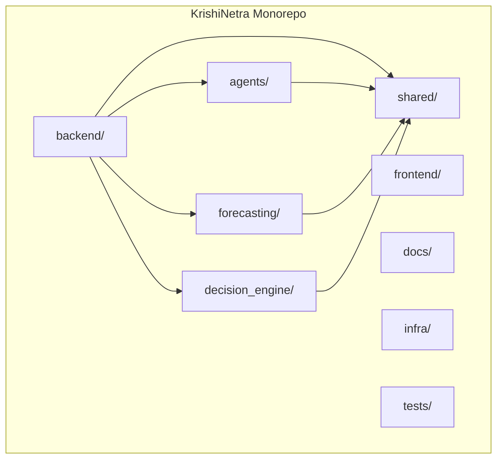
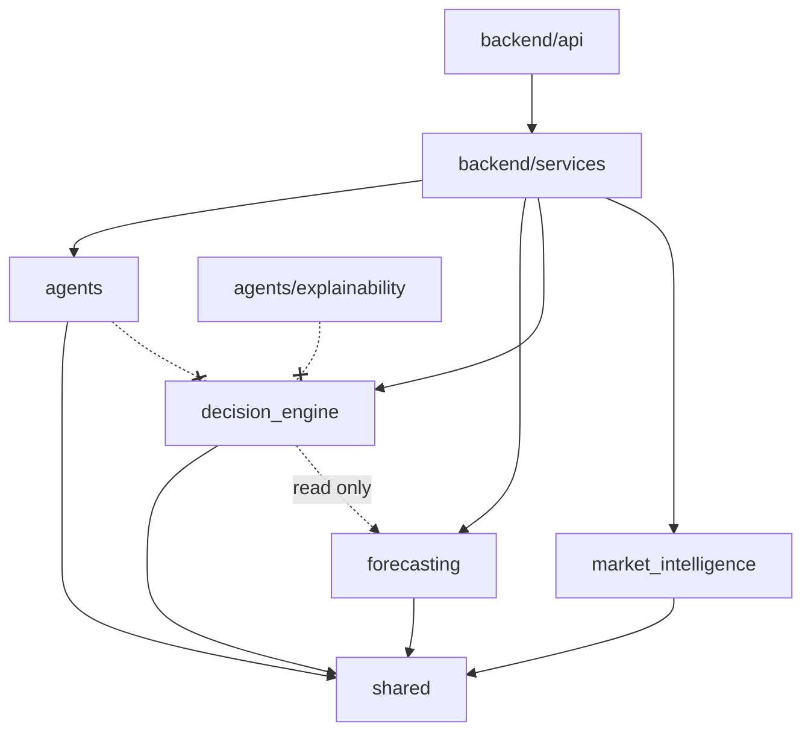
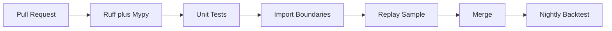

# TDS-013 — Repository Architecture

**Wave:** 3  
**Status:** Monorepo structure and engineering standards (no code)  
**Baseline:** Modular Monolith, Python/FastAPI, LangGraph (approved)  
**Purpose:** Prepare implementation team for consistent repo layout, ownership, and quality gates

---

## 1. Repository Strategy

| Decision | Choice | Rationale |
|----------|--------|-----------|
| Layout | **Monorepo** | Single deployable modular monolith; shared types and traceability |
| Primary language | Python 3.11+ | Approved backend |
| Package manager | `uv` or `poetry` (PROPOSED—team choice at Sprint 0) | Lockfiles in repo |
| Frontend | Separate package in monorepo | Phase 1 may be API-first; UI parallel track |



---

## 2. Directory Structure

```
KrishiNetra/
├── backend/                    # FastAPI application shell
│   ├── app/
│   │   ├── main.py             # ASGI entry (implementation)
│   │   ├── api/                # Route handlers per TDS-010
│   │   │   ├── v1/
│   │   │   │   ├── market_intelligence.py
│   │   │   │   ├── decisions.py
│   │   │   │   ├── conversation.py
│   │   │   │   ├── outcomes.py
│   │   │   │   └── registry.py
│   │   ├── services/           # TDS-003 logical services
│   │   ├── events/             # Event bus publishers/consumers TDS-005
│   │   ├── persistence/        # Repositories (PostgreSQL)
│   │   └── config/
│   └── pyproject.toml
│
├── agents/                     # Domain agents (deterministic)
│   ├── market/
│   ├── weather/
│   ├── policy/
│   ├── demand/
│   ├── futures/
│   ├── global/
│   ├── orchestration/          # LangGraph graphs TDS-004
│   └── explainability/         # LLM agents ONLY here + conversation/
│       └── conversation/
│
├── forecasting/                # Feature store + forecast engine TDS-007
│   ├── features/
│   ├── models/                 # Candidate runners LightGBM/XGB/Prophet/ensemble
│   ├── calibration/
│   └── backtest/
│
├── decision_engine/            # Deterministic decision TDS-008
│   ├── rules/                  # MSP/CCI, partial, liquidity
│   ├── formulas/
│   └── stability/
│
├── market_intelligence/        # MI Framework TDS-009
│   ├── scoring/                # Bullish/bearish/neutral
│   ├── regime/
│   └── snapshot/
│
├── shared/                     # Cross-cutting
│   ├── domain/                 # Entity types mirroring TDS-006
│   ├── contracts/              # API DTOs, event payloads
│   ├── signal_contract/        # Structured signal schema
│   └── utils/
│
├── frontend/                   # Web client (Phase 1 parallel)
│   ├── src/
│   └── package.json
│
├── docs/
│   ├── founder/
│   └── tds/
│
├── infra/                      # IaC placeholders — Wave 4+ per scope boundary
│   └── README.md               # Points to future Terraform/Docker (not Wave 3)
│
├── tests/
│   ├── unit/
│   ├── integration/
│   ├── replay/                 # REQ-103 hash replay tests
│   └── backtest/               # DVA gate tests
│
├── scripts/                    # Ops scripts (ingest triggers, replay CLI)
├── .github/workflows/          # CI definitions
└── README.md
```

---

## 3. Ownership Boundaries

| Path | Owning squad (PROPOSED) | May depend on |
|------|-------------------------|---------------|
| `backend/app/api/` | Platform | services, shared/contracts |
| `backend/app/services/` | Platform | all domain packages |
| `agents/*` (except explainability) | Intelligence | shared/signal_contract |
| `agents/explainability/` | Intelligence + Platform | LLM provider SDK |
| `forecasting/` | Intelligence | agents, shared |
| `decision_engine/` | Decision | forecasting (read forecast only), shared |
| `market_intelligence/` | Intelligence | agents, forecasting |
| `shared/` | Platform (governed) | — |
| `frontend/` | Product FE | API contracts only |
| `tests/replay/` | QA/Platform | all |
| `docs/` | Architecture | — |

### 3.1 Dependency Rules (Import Boundaries)



| Rule | Enforcement |
|------|-------------|
| `decision_engine` must NOT import LLM SDKs | CI import-linter |
| `agents/explainability` must NOT import `decision_engine` formulas | CI |
| `forecasting` must NOT import `decision_engine` | CI |
| Domain agents must NOT import explainability | CI |
| `shared` has no upward imports | CI |

**Baseline:** FD-006, TC-001, TC-011

---

## 4. Module ↔ Service ↔ TDS Map

| Repo module | TDS-003 Service | TDS doc |
|-------------|-----------------|---------|
| `market_intelligence/` | Market Intelligence Service | TDS-009 |
| `forecasting/` | Forecast Service | TDS-007 |
| `decision_engine/` | Decision Service | TDS-008 |
| `backend/.../user_context` | User Context Service | TDS-002 |
| `agents/explainability/` | Explainability Service | TDS-004 |
| `backend/.../registry` | Commodity Registry Service | TDS-006 |
| `forecasting/calibration/` | Calibration (batch) | TDS-011 |
| `agents/orchestration/` | LangGraph | TDS-004, TDS-005 |

---

## 5. Coding Standards

### 5.1 Python

| Standard | Rule |
|----------|------|
| Style | Ruff format + lint (replaces black+flake8) |
| Types | Type hints on all public functions; `mypy` strict on `shared/`, `decision_engine/`, `forecasting/` |
| Docstrings | Google style on public modules |
| Naming | `snake_case` functions; `PascalCase` classes; match TDS-006 entity names |
| Determinism | Explicit `random_seed` params; no unseeded numpy in decision/forecast paths |
| Logging | Structured JSON logs; `trace_id` propagation |
| Secrets | Never in code; use env + vault |

### 5.2 Domain Conventions

| Concept | Code representation |
|---------|---------------------|
| `as_of_date` | `date` type, ISO in APIs |
| Money | `Decimal` INR; never float for published recommendations |
| Confidence | `float` 0–1; validate bounds |
| Agent types | Enum matching TDS-004 |
| Action types | Enum: SELL, HOLD, PARTIAL_SELL, PARTIAL_HOLD |

### 5.3 LLM Code Isolation

- All `openai`/`anthropic` imports only under `agents/explainability/`
- CI grep gate: fail build if LLM import outside that tree

---

## 6. Testing Standards

### 6.1 Test Pyramid

| Layer | Location | Scope |
|-------|----------|-------|
| Unit | `tests/unit/` | Formulas, rules, scoring |
| Integration | `tests/integration/` | DB + Redis + pipeline |
| Replay | `tests/replay/` | Hash match REQ-103 |
| Backtest | `tests/backtest/` | DVA gate TDS-000 |

### 6.2 Required Tests (Phase 1)

| Area | Minimum coverage |
|------|------------------|
| `decision_engine/` | 90% line; 100% on rules (MSP/CCI, partial 50%) |
| `market_intelligence/scoring/` | 85% |
| `forecasting/features/` | 85% |
| Domain agents | 80% |
| API contracts | Contract tests vs TDS-010 examples |

### 6.3 Determinism Tests

| Test | Assertion |
|------|-----------|
| `test_forecast_replay_hash` | Same inputs → same ForecastVersion hash |
| `test_decision_replay_hash` | Same inputs → same RecommendationVersion hash |
| `test_no_llm_in_decision` | Import graph scan |

### 6.4 Backtest Gate Test (CI Nightly)

- Run cotton 12-month backtest on merge to `main` (PROPOSED)
- Fail if DVA regression > 0.5% vs baseline artifact

---

## 7. CI Quality Gates



| Gate | Trigger | Fail condition |
|------|---------|----------------|
| Lint + format | PR | Any error |
| Mypy strict paths | PR | Type errors |
| Unit tests | PR | Coverage below threshold |
| Import boundary scan | PR | Forbidden import |
| Replay sample (10 dates) | PR | Hash mismatch |
| Secret scan | PR | Finding |
| Security dep scan | PR | Critical CVE |
| Contract test | PR | API response drift vs TDS-010 |
| Nightly DVA backtest | main | Below promotion thresholds |

**No deploy gate in TDS-013** — infra Wave 4+

---

## 8. Configuration Management

| Config | Location |
|--------|----------|
| Commodity registry active version | PostgreSQL (not git) |
| Model artifact paths | Env + model registry table |
| Feature flags | Env per environment |
| Cotton weights | CommodityRegistry DB seed from TDS-009 reference |

---

## 9. Documentation in Repo

| Path | Content |
|------|---------|
| `docs/founder/` | Founder intent (read-only baseline) |
| `docs/tds/` | All TDS including this doc |
| `backend/README.md` | Local dev setup (Wave 4) |
| `ADR/` (optional) | Architecture decision records for implementation choices |

---

## 10. Phase 2 Placeholder: InventoryPosition

```
backend/app/persistence/inventory/   # Phase 2 — NOT created Sprint 0-4
shared/domain/inventory_position.py  # Stub interface only if needed
```

**Architecture review:** Document only; no Phase 1 code paths.

---

## 11. Assumptions

| ID | Assumption |
|----|------------|
| REPO-001 | Single deployable artifact from `backend/` |
| REPO-002 | `uv` or `poetry` chosen Sprint 0 |
| REPO-003 | Frontend optional for MVP API milestone |

---

## 12. Open Questions

| ID | Item |
|----|------|
| — | Package manager final choice |
| — | Monorepo tool (none vs nx/turborepo for frontend) |

---

## 13. Founder Approval Required

| Item | Status |
|------|--------|
| Monorepo | **Approved** (modular monolith) |
| Import boundaries | **Architecture review** |
| CI thresholds | **PROPOSED** |

---

## 14. Traceability

| Standard | TDS |
|----------|-----|
| Services layout | TDS-003 |
| Agents | TDS-004 |
| APIs | TDS-010 |
| Security CI | TDS-012 |
| KPI/backtest gates | TDS-000 |

---

## 15. Document Control

| Version | Wave |
|---------|------|
| 1.0 | 3 |
