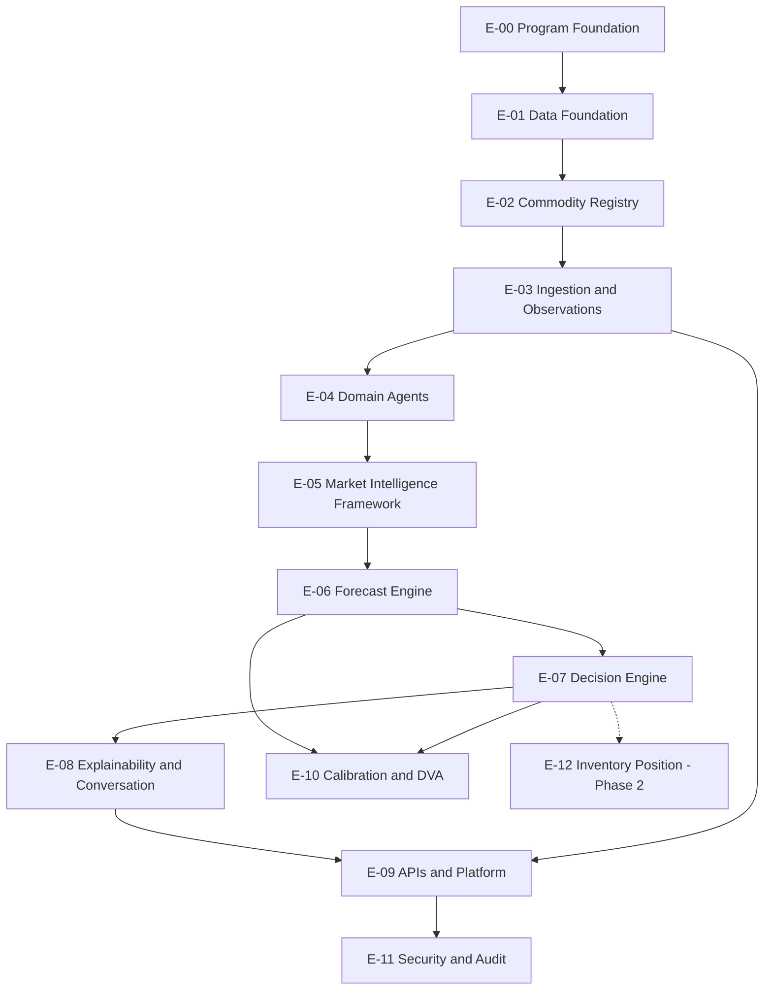
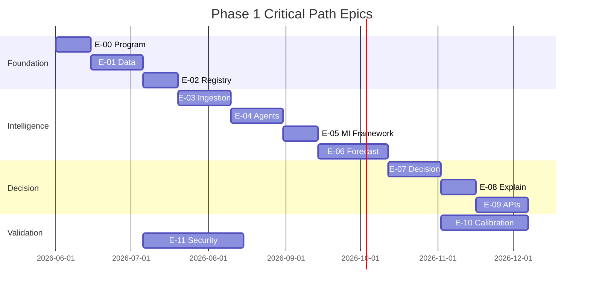

# TDS-014 — Epic Mapping & Implementation Roadmap

**Wave:** 3  
**Status:** Epic-level bridge to implementation (no user stories, no tasks)  
**Baseline:** All TDS-000–013, `docs/founder/*`  
**Principle:** Epics organized around **Decision Intelligence** delivery, not forecast science alone

---

## 1. Scope Definitions

### 1.1 MVP Scope

Minimum viable **decision intelligence** proof for cotton:

| In MVP | Out of MVP |
|--------|------------|
| Cotton MI read (no auth) | Multi-commodity |
| Daily MI refresh pipeline | Real-time ticks |
| Deterministic forecast 30/60/90 | Selected ML model production |
| Decision POST with explanation | Portfolio intelligence |
| Outcome capture (basic) | InventoryPosition |
| Internal DVA backtest report | Public promotion claim |
| Registry cotton active | Registry self-service UI |

### 1.2 Phase 1 Scope (Full)

Everything in MVP **plus:**

| Phase 1 complete |
|----------------|
| Promotion-grade 12-month DVA backtest passing gate (pending legal) |
| All six domain agents operational |
| MI Framework scores (B/R/N) + regime (TDS-009) |
| Forecast vs recommendation confidence in APIs |
| Calibration batch + dashboards (ops) |
| Replay audit passing REQ-103 |
| Farmer + Trader personas (per-position) |
| Conversation API |
| Security audit controls (TDS-012) |

### 1.3 Future Scope

| Phase | Epics (high level) |
|-------|-------------------|
| **2** | InventoryPosition, personalization, E-12 |
| **3** | Intent capture, behavioral learning |
| **4** | Warehouse integration |
| **5** | Financing (NBFC/RBI) |
| **6** | Marketplace |
| **7** | Additional commodities; Ginner/Miller/Exporter/Aggregator active roles |

---

## 2. Epic Hierarchy

---

## 3. Epic Catalog

### E-00 — Program Foundation

| Field | Value |
|-------|-------|
| **Epic ID** | E-00 |
| **Name** | Program Foundation |
| **Goal** | Monorepo, CI, environments, team conventions |
| **Features** | F-00-01 Repo scaffold; F-00-02 CI gates; F-00-03 Local dev; F-00-04 Trace_id/logging |
| **Dependencies** | None |
| **Milestone** | M0: Engineering ready |
| **TDS** | TDS-013 |
| **REQ** | REQ-120 |
| **FD** | — |

---

### E-01 — Data Foundation

| Field | Value |
|-------|-------|
| **Epic ID** | E-01 |
| **Name** | Data Foundation |
| **Goal** | PostgreSQL entities per TDS-006; migrations; retention |
| **Features** | F-01-01 Core entities; F-01-02 Observation TS; F-01-03 SignalSnapshot; F-01-04 ForecastVersion; F-01-05 DecisionSession stack; F-01-06 DataQualitySnapshot; F-01-07 Redis MI projection |
| **Dependencies** | E-00 |
| **Milestone** | M1: Data layer |
| **TDS** | TDS-006, TDS-005 |
| **REQ** | REQ-090, REQ-070 |
| **FD** | FD-023 |

**Note:** InventoryPosition → **E-12 Phase 2 only**

---

### E-02 — Commodity Registry

| Field | Value |
|-------|-------|
| **Epic ID** | E-02 |
| **Name** | Commodity Registry |
| **Goal** | Cotton registry with required/optional agents, weights, roles |
| **Features** | F-02-01 Commodity+Profile; F-02-02 Registry versioning; F-02-03 Cotton seed; F-02-04 Participant roles (6); F-02-05 Registry API |
| **Dependencies** | E-01 |
| **Milestone** | M1 |
| **TDS** | TDS-006, TDS-009 §12, TDS-010 |
| **REQ** | REQ-073, REQ-074 |
| **FD** | FD-022, FD-001 |

---

### E-03 — Ingestion & Observations

| Field | Value |
|-------|-------|
| **Epic ID** | E-03 |
| **Name** | Ingestion and Observations |
| **Goal** | Public + commercial data → observations → events |
| **Features** | F-03-01 Agmarknet/eNAM; F-03-02 IMD weather+acreage; F-03-03 Policy MSP/CCI; F-03-04 Futures feed; F-03-05 USDA/ICAC; F-03-06 Basis adjustment; F-03-07 Event publishers |
| **Dependencies** | E-02 |
| **Milestone** | M2: Data flowing |
| **TDS** | TDS-005, TDS-007 §3 |
| **REQ** | REQ-070, REQ-071, REQ-133 |
| **FD** | FD-030 |

---

### E-04 — Domain Agents

| Field | Value |
|-------|-------|
| **Epic ID** | E-04 |
| **Name** | Domain Agents (Deterministic) |
| **Goal** | Six agents + LangGraph refresh graph |
| **Features** | F-04-01 Market; F-04-02 Weather; F-04-03 Policy; F-04-04 Demand; F-04-05 Futures; F-04-06 Global; F-04-07 Signal contract; F-04-08 Orchestration graph |
| **Dependencies** | E-03 |
| **Milestone** | M2 |
| **TDS** | TDS-004, TDS-005 |
| **REQ** | REQ-050–055, REQ-060, REQ-061 |
| **FD** | FD-004, FD-013 |

---

### E-05 — Market Intelligence Framework

| Field | Value |
|-------|-------|
| **Epic ID** | E-05 |
| **Name** | Market Intelligence Framework |
| **Goal** | B/R/N scores, regime, factors, MI Snapshot |
| **Features** | F-05-01 Signal weighting; F-05-02 Aggregation; F-05-03 Regime detection; F-05-04 Factor extraction; F-05-05 MI publish; F-05-06 Narrative inputs |
| **Dependencies** | E-04 |
| **Milestone** | M3: MI live |
| **TDS** | TDS-009, TDS-003 MIS |
| **REQ** | REQ-034, REQ-035, REQ-037 |
| **FD** | FD-011, FD-012 |

---

### E-06 — Forecast Engine

| Field | Value |
|-------|-------|
| **Epic ID** | E-06 |
| **Name** | Forecast Engine |
| **Goal** | Feature store + deterministic forecast + **forecast confidence** |
| **Features** | F-06-01 Feature store; F-06-02 Candidate model runners; F-06-03 Model bake-off; F-06-04 ForecastVersion publish; F-06-05 Forecast confidence; F-06-06 Replay tests |
| **Dependencies** | E-05 |
| **Milestone** | M3 |
| **TDS** | TDS-007, TDS-000 forecast KPIs |
| **REQ** | REQ-056, REQ-076, REQ-103 |
| **FD** | FD-006, FD-019 |

---

### E-07 — Decision Engine

| Field | Value |
|-------|-------|
| **Epic ID** | E-07 |
| **Name** | Decision Engine |
| **Goal** | NHV + rules → actions + **recommendation confidence** |
| **Features** | F-07-01 Net hold formula; F-07-02 MSP/CCI rule; F-07-03 Partial 50%; F-07-04 Liquidity/persona paths; F-07-05 Stability gating; F-07-06 RecommendationVersion; F-07-07 Decision replay |
| **Dependencies** | E-06 |
| **Milestone** | M4: Decisions live |
| **TDS** | TDS-008 |
| **REQ** | REQ-040–047, REQ-131 |
| **FD** | FD-002, FD-008, FD-016, FD-018, FD-028 |

---

### E-08 — Explainability & Conversation

| Field | Value |
|-------|-------|
| **Epic ID** | E-08 |
| **Name** | Explainability and Conversation |
| **Goal** | LLM narrative only; one explain pass; conversation grounded |
| **Features** | F-08-01 Explainability agent; F-08-02 Structured fallback; F-08-03 Conversation agent; F-08-04 Explainability audit logs |
| **Dependencies** | E-07 |
| **Milestone** | M4 |
| **TDS** | TDS-004 §6, TDS-009 §10 |
| **REQ** | REQ-043, REQ-058, REQ-059, REQ-085 |
| **FD** | FD-007 |

---

### E-09 — APIs & Platform

| Field | Value |
|-------|-------|
| **Epic ID** | E-09 |
| **Name** | APIs and Platform |
| **Goal** | TDS-010 APIs; FastAPI shell; caching; rate limits |
| **Features** | F-09-01 MI APIs; F-09-02 Decision APIs; F-09-03 Conversation API; F-09-04 Outcome API; F-09-05 Registry APIs; F-09-06 Auth/rate limit; F-09-07 Frontend MVP (optional) |
| **Dependencies** | E-05, E-07, E-08 |
| **Milestone** | M4 |
| **TDS** | TDS-010, TDS-001 |
| **REQ** | REQ-030, REQ-064 |
| **FD** | FD-011, FD-015 |

---

### E-10 — Calibration & DVA

| Field | Value |
|-------|-------|
| **Epic ID** | E-10 |
| **Name** | Calibration and DVA |
| **Goal** | Flywheel, promotion gate, dashboards |
| **Features** | F-10-01 Outcome validation; F-10-02 DVA backtest; F-10-03 Promotion state machine; F-10-04 Drift detection; F-10-05 Ops dashboards; F-10-06 Trust score batch |
| **Dependencies** | E-06, E-07, E-09 |
| **Milestone** | M5: Validated intelligence |
| **TDS** | TDS-011, TDS-000 |
| **REQ** | REQ-100–102, REQ-110, REQ-111 |
| **FD** | FD-003, FD-009, FD-020, FD-023, FD-027 |

**Promotion gate:** DVA > 3%, Positive DVA > 70% months, 12mo — **approved**

---

### E-11 — Security & Audit

| Field | Value |
|-------|-------|
| **Epic ID** | E-11 |
| **Name** | Security and Audit |
| **Goal** | Audit log, replay governance, threat controls |
| **Features** | F-11-01 Audit store; F-11-02 Traceability chain; F-11-03 Registry governance; F-11-04 Model governance; F-11-05 PII redaction; F-11-06 Legal disclaimers (pending) |
| **Dependencies** | E-09 (parallel from Sprint 2) |
| **Milestone** | M5 |
| **TDS** | TDS-012 |
| **REQ** | REQ-103, REQ-134 |
| **FD** | FD-031 |

---

### E-12 — Inventory Position (Phase 2 — Future)

| Field | Value |
|-------|-------|
| **Epic ID** | E-12 |
| **Name** | Inventory Position |
| **Goal** | Persistent inventory entity linking sessions (architecture review) |
| **Features** | F-12-01 InventoryPosition entity; F-12-02 Registration API; F-12-03 Position-decision linkage |
| **Dependencies** | E-07, E-09 |
| **Milestone** | Phase 2 |
| **TDS** | TDS-006 addendum, TDS-009 §13, TDS-010 §16 |
| **REQ** | REQ-121, REQ-091 |
| **FD** | FD-024 |
| **Phase 1** | **NOT IMPLEMENTED** — document only |

---

## 4. Feature ID Index (Summary)

| Feature ID | Epic | Description |
|------------|------|-------------|
| F-00-01 | E-00 | Repo scaffold |
| F-01-01 | E-01 | Core persistence |
| F-02-03 | E-02 | Cotton registry seed |
| F-05-05 | E-05 | MI Snapshot publish |
| F-06-03 | E-06 | Model bake-off (DVA-led) |
| F-07-02 | E-07 | MSP/CCI ±3% |
| F-07-03 | E-07 | Partial sell 50% |
| F-10-02 | E-10 | 12-month DVA backtest |
| F-11-02 | E-11 | Replay audit |

*Full feature list per epic in §3.*

---

## 5. Epic Traceability Matrix

| Epic | Founder Decisions | Requirements | TDS Documents |
|------|-------------------|--------------|---------------|
| E-00 | — | REQ-120 | TDS-013 |
| E-01 | FD-023 | REQ-090, REQ-070 | TDS-006, TDS-005 |
| E-02 | FD-001, FD-022 | REQ-073, REQ-074 | TDS-006, TDS-009, TDS-010 |
| E-03 | FD-030 | REQ-070, REQ-071, REQ-133 | TDS-005, TDS-007 |
| E-04 | FD-004, FD-013 | REQ-050–061 | TDS-004 |
| E-05 | FD-011, FD-012 | REQ-034–037 | TDS-009, TDS-003 |
| E-06 | FD-006, FD-019 | REQ-056, REQ-076, REQ-103 | TDS-007, TDS-000 |
| E-07 | FD-002, FD-008, FD-016, FD-018, FD-028 | REQ-040–047 | TDS-008 |
| E-08 | FD-007 | REQ-043, REQ-058, REQ-059 | TDS-004, TDS-009 |
| E-09 | FD-011, FD-015 | REQ-030, REQ-064 | TDS-010, TDS-001 |
| E-10 | FD-003, FD-009, FD-020, FD-023 | REQ-100–102, REQ-110 | TDS-011, TDS-000 |
| E-11 | FD-031 | REQ-103, REQ-134 | TDS-012 |
| E-12 | FD-024 | REQ-121 | TDS-006, TDS-009 (future) |

---

## 6. Dependency Graph (Critical Path)

**Critical path:** E-00 → E-01 → E-02 → E-03 → E-04 → E-05 → E-06 → E-07 → E-08 → E-09  
**Parallel:** E-10 after E-07; E-11 from E-01

---

## 7. Milestones

| ID | Name | Epics complete | Exit criteria |
|----|------|----------------|---------------|
| **M0** | Engineering Ready | E-00 | CI green; repo structure |
| **M1** | Data Layer | E-01, E-02 | Cotton registry active; DB entities |
| **M2** | Data Flowing | E-03, E-04 | Daily events; six agents |
| **M3** | Intelligence Core | E-05, E-06 | MI Snapshot + Forecast published |
| **M4** | Decision Live | E-07, E-08, E-09 | End-to-end API demo |
| **M5** | Validated | E-10, E-11 | DVA gate report; replay audit; legal pending |

---

## 8. Sprint Roadmap (Epic-Level Only)

**Assumption:** 2-week sprints; team velocity established Sprint 0.

### Sprint 0 — Foundation (M0)

| Epic | Deliverable |
|------|-------------|
| E-00 | Monorepo scaffold per TDS-013; CI lint/test/import gates; PostgreSQL + Redis local |
| E-01 (start) | Migration framework; entity stubs |

**Exit:** CI pipeline runs; empty app boots.

---

### Sprint 1 — Data & Registry (M1)

| Epic | Deliverable |
|------|-------------|
| E-01 | Core tables; observation repos; SignalSnapshot |
| E-02 | Cotton CommodityRegistry v1 with required/optional agents, weights, six roles |
| E-11 (start) | Audit log table + middleware stub |

**Exit:** Registry API read; seed cotton config.

---

### Sprint 2 — Ingestion & Agents (M2)

| Epic | Deliverable |
|------|-------------|
| E-03 | Agmarknet + futures ingest; PRICE_UPDATED, FUTURES events |
| E-04 | Market + Futures agents (required path); LangGraph skeleton |
| E-11 | Audit events for ingest |

**Exit:** Partial daily refresh → signals for Market + Futures.

---

### Sprint 3 — MI Framework & Forecast Start (M2→M3)

| Epic | Deliverable |
|------|-------------|
| E-04 | Remaining four agents |
| E-05 | Bullish/bearish/neutral scores; regime; MI Snapshot |
| E-06 (start) | Feature store; candidate model offline runs |

**Exit:** MI_SNAPSHOT_READY in staging; GET MI API (E-09 partial).

---

### Sprint 4 — Decision Path & APIs (M3→M4)

| Epic | Deliverable |
|------|-------------|
| E-06 | ForecastVersion + forecast confidence; FORECAST_GENERATED |
| E-07 | Full decision engine; recommendation confidence; MSP/CCI; partial 50% |
| E-08 | Explainability + conversation |
| E-09 | Decision + conversation + outcome APIs |
| E-10 (start) | DVA backtest harness |

**Exit:** MVP demo: MI read + Decision POST with explanation.

---

### Sprint 5+ (Post Sprint 4 — Phase 1 Completion toward M5)

*Epic-level only per instructions; not detailed sprint-by-sprint beyond 4.*

| Epic | Goal |
|------|------|
| E-10 | 12-month DVA; promotion gate evaluation |
| E-11 | Replay audit; security hardening; legal disclaimers |
| E-09 | Hardening rate limits, caching, ops |

**Exit M5:** Promotion candidate or documented gap; REQ-103 satisfied.

---

## 9. MVP vs Phase 1 Epic Inclusion

| Epic | MVP | Phase 1 Full |
|------|-----|--------------|
| E-00 | ✓ | ✓ |
| E-01 | ✓ (subset) | ✓ |
| E-02 | ✓ | ✓ |
| E-03 | ✓ (futures+agmarknet) | ✓ (all sources) |
| E-04 | ✓ (required agents) | ✓ (all six) |
| E-05 | ✓ (basic scores) | ✓ (full regime) |
| E-06 | ✓ (one candidate model) | ✓ (bake-off winner) |
| E-07 | ✓ | ✓ |
| E-08 | ✓ explain only | ✓ + conversation |
| E-09 | ✓ core APIs | ✓ full |
| E-10 | partial backtest | ✓ promotion gate |
| E-11 | audit basic | ✓ full |
| E-12 | — | — (Phase 2) |

---

## 10. Architecture Review Deltas in Epics

| Review finding | Epic/feature |
|----------------|--------------|
| InventoryPosition Phase 2 | E-12 (not Sprint 0–4) |
| Forecast vs recommendation confidence | F-06-05, F-07-06, F-09 APIs |
| Six participant roles on commodity | F-02-04 |
| required_agents / optional_agents | F-02-02, F-05-01 |
| MI Framework | E-05 (new epic) |
| DVA over RMSE | F-06-03 bake-off criterion; F-10-02 |

---

## 11. Story Groupings (Epic → Themes — No Stories)

| Theme | Epics |
|-------|-------|
| **Platform** | E-00, E-01, E-09, E-11 |
| **Configuration** | E-02 |
| **Data pipeline** | E-03, E-04 |
| **Shared intelligence** | E-05, E-06 |
| **Personalized decision** | E-07, E-08 |
| **Validation & trust** | E-10 |
| **Future inventory** | E-12 |

---

## 12. Assumptions

| ID | Assumption |
|----|------------|
| EP-001 | Sprint 0–4 ≈ 10 weeks to MVP |
| EP-002 | Model bake-off runs parallel late Sprint 3–4 |
| EP-003 | Legal clearance not on critical path for internal M5 |

---

## 13. Open Questions

| ID | Impact on epics |
|----|-----------------|
| OQ-004 | F-07-05 stability |
| OQ-007 | F-10-01 outcomes |
| OQ-009 | F-11-06 legal |
| OQ-002 | F-09 UI confidence display |

---

## 14. Founder Approval Required

| Item | Status |
|------|--------|
| Epic structure | **Architecture review** |
| Sprint 0–4 plan | **PROPOSED** |
| E-12 deferred Phase 2 | **Architecture review** |
| DVA-led model selection | **Aligned FD-009** |

---

## 15. Document Control

| Version | Wave |
|---------|------|
| 1.0 | 3 |

**Explicitly not in scope:** User stories, tasks, story points, code.
